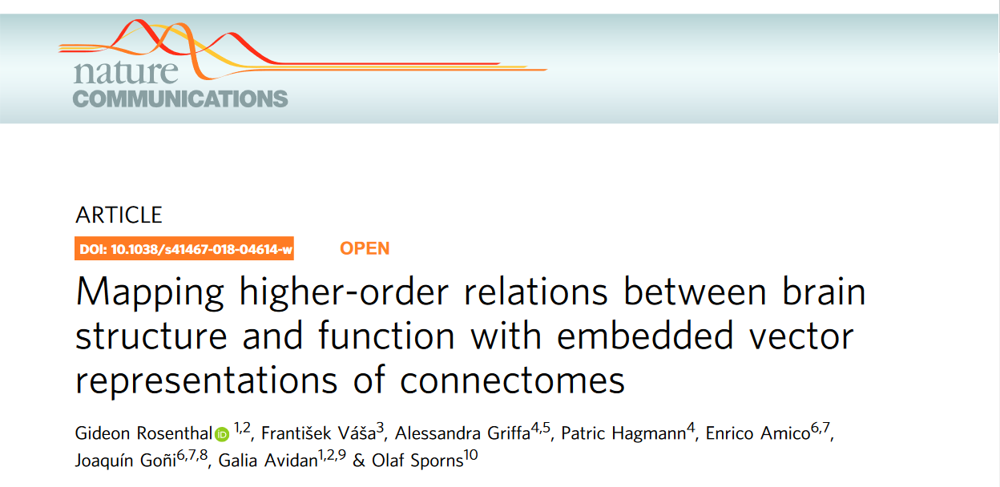
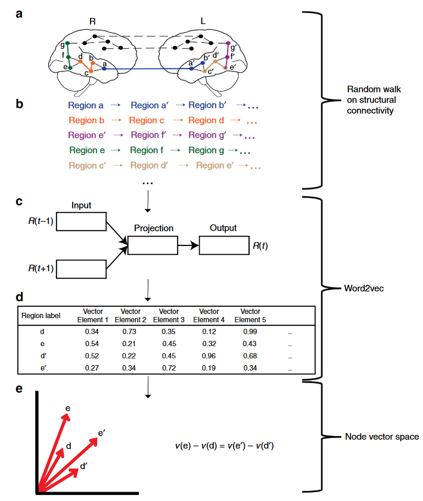
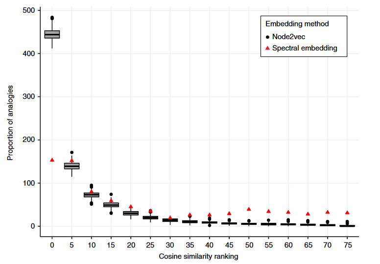
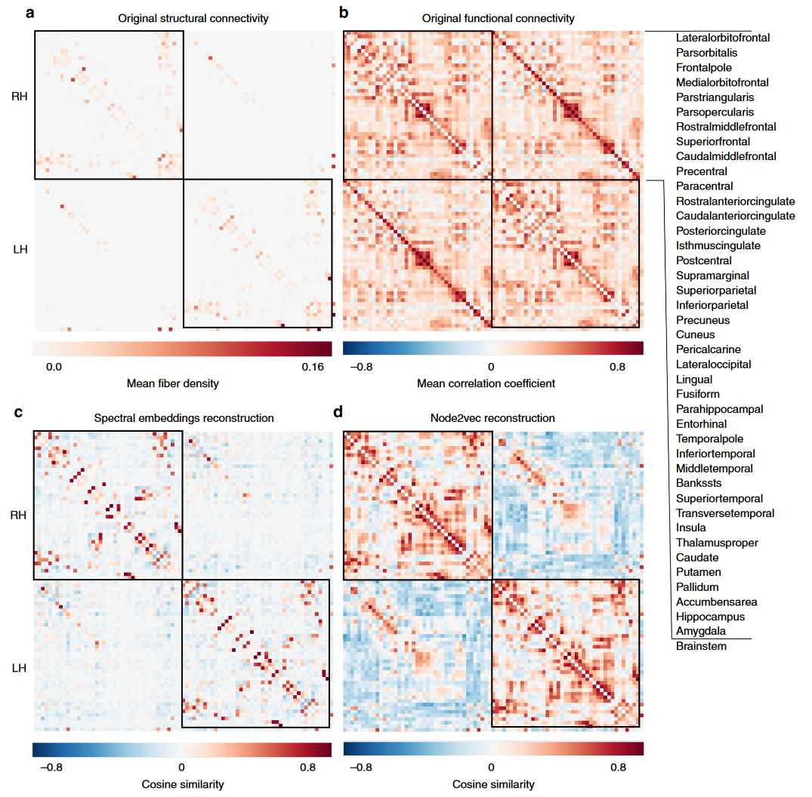
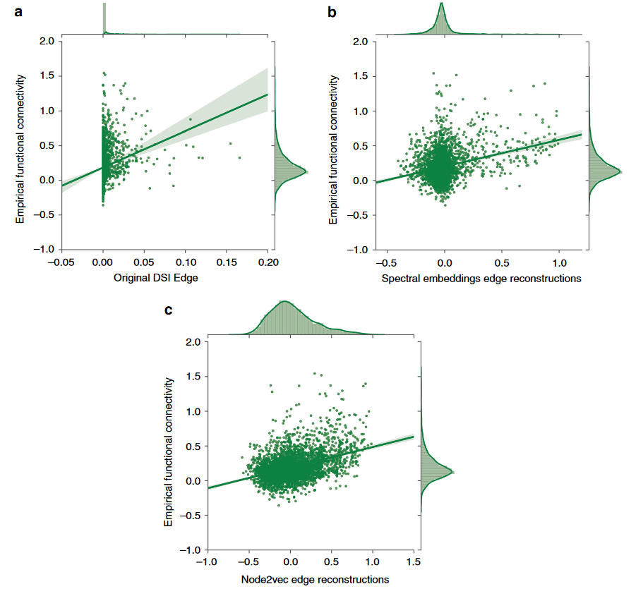
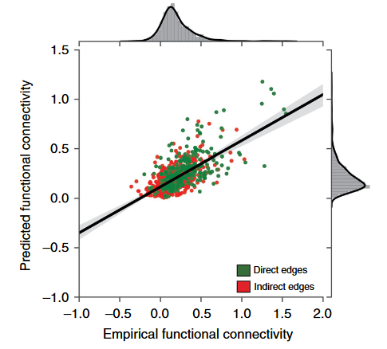

[toc]

## 文献信息

<!--  -->
- **标题 :** [Mapping higher-order relations between brain structure and function with embedded vector representations of connectomes](https://www.nature.com/articles/s41467-018-04614-w)
- **期刊 :** nature communications
- **作者 :** Gideon Rosenthal et.al
- **DOI :** 10.1038/s41467-018-04614-w
- **类型：** 基于假设的尝试性数据研究

## 目的

尽管在连接组映射方面取得了进展，但由此产生的二元关系集合本身并不能完全表示和量化网络节点之间的高阶关系。节点用邻接矩阵的矢量表示，这种二元描述不容易实现可视化、分类、缺失边和节点的预测，以及不容易理解不同网络间的关系。

**文章思路是引入自然语言处理领域成熟的嵌入式表示，具体是node2vec,目的是在低维连续向量空间捕获大脑区域之间的结构网络级关系，以便推断它们的功能角色和关系。**

> 规律可以用线性运算，比如，向量计算 vec("King") - vec("Man") + vec("Woman") 的结果最接近 vec("Queen")

**构建了功能和结构连通性的深度学习预测模型，以人脸处理系统作为应用领域来模拟网络范围内的损伤效应，认为 CE（connectome embeddings）为揭示连接体结构与功能之间的关系提供了一种新的方法。**

## 方法

### word2vec

主要包括两个模型， `skip-gram` 和 CBOW（continuous bag of words）。给定单词 $w$ 和上下文 $c$ ，目标就是估计参数 $\theta$ 来最大化 `skip-gram` 模型的条件概率 $p(c|w,\theta)$ 或 CBOW 的 $p(w|c.\theta)$

在网络上，类比到上下文是在网络中随机游走产生的节点流，最新的是node2vec，已被证明在一系列后续监督学习节点分类和链路预测任务中比无监督谱学习具有更高的能力。

用 `Gensim`  python 包在结构连接矩阵上运行 CBOW node2vec算法500次，每次迭代800次20步的随机游走，表示节点的嵌入向量长度为30，确定节点上下文的窗口大小为3，游走的概率根据连接组边的权重加权。

<!--  -->

### 具体测试方法和结果
**大脑半球间相似性测试：** 双侧同源脑区之间的对称半球间相互关联，是人脑的基本组织特征之一。思路是这样的，研究假设一个半球的每一对区域之间的关系应该与另一个半球的成对关系类似，vec(“Left Amygdala”)—vec(“Left Fusiform Gyrus”) + vec(“Right Fusiform Gyrus”) 应该产生与右杏仁核向量距离最小的向量，这里用的余弦相似度距离，对所有节点向量嵌入计算并升序排序定rank。如果确实如上所述，那么类比的rank差为0。

<!-- 
>半球间类比测试评估了两种节点嵌入算法的能力，嵌入表示在该测试中优于谱方法 -->

**节点表示的相似性：**

为了进一步探索所学习的CE向量关系包含的有意义神经生物学信息，并了解每对节点之间的成对关系的性质与功能同伦（functional homotopy）的关系，研究表征了它们各自的 CE 向量表示之间的相似性，具体是计算每对连接组嵌入向量之间的余弦相似度。

研究先做了原始结构矩阵与两类方法得到嵌入矩阵之间的 `Spearman's Rho`，在两个数据集上得到原始结构矩阵与谱嵌入弱相关，与Node2vec强相关。

<!-- 
> 结构连接矩阵和节点嵌入的余弦相似性 -->
> 上图共83个区域，分为左右半球加上脑干
> - a 表示原始的结构连接矩阵的平均纤维密度
> - b 表示计算平均相关系数得到的功能连接
> - c 谱嵌入节点向量之间的余弦相似性
> - d Node2vec 节点向量之间的余弦相似性

**与静息态功能连接的关系：**
依赖于统计的脑区间时序相关性被称为功能连接，以前的研究表明长时间静息态下记录的功能连接与潜在的结构连接密切相关。研究者假设CE重构矩阵包含的高阶拓扑连接信息更大程度上与静息态功能连接相关，因为可能捕捉到很大比例的非直接连接影响。

<!-- 
>静息状态功能连接和结构连接之间的相关关系 -->

上图是Fisher Z变换后的静息态功能连接分别和原始DSI结构连接矩阵（$r_s = 0.311,p<10^{-6}$）,谱嵌入（$r_s=0.13,p<10^{-6}$）,Node2vec($r_s=0.328,p<10^{-6}$)

**FFA损伤后功能连接的预测。：**

<!--  -->

由于CE对功能连接的高预测能力(rs = 0.6, p<10−6)，一个潜在的应用就是桥接结构矩阵和功能矩阵，预测基于结构连接组变化导致功能连接性的变化。

操纵（如损伤或选择性增强特定节点或边）之后，这里是FFA（right fusiform face area），通过将其与其他所有节点的连接设置为零来执行病变，用10000次迭代的置换测试计算损伤前和损伤后模拟的功能连接性之间的差异。

作者提到他们之前的研究表明参与者看到完整面孔时，右FFA之类的关键区域充当网络的中心，可以通过倒置面孔的方式破坏这个功能连接网络，破坏时额外的区域参与进来（右LOC、右IPS和右颞下皮质）。先天性面孔处理能力受损的个体感受到完整面孔也有类似发现。所以他们预测的目标明确了，模拟结果也相当一致。

> 绿色和紫色分别表示右侧和左侧半球节点，蓝色线表示受损伤影响显著的边，红色表示选定的节点和它统计学显著的边。
> - a 功能连接损伤后大于损伤前，在这些边中，右侧LOC和右侧IPS具有最高的度（分别增加27和9条边）
> - b 功能连接损伤前大于损伤后，右侧LOC和右侧颞下皮质具有最高的度（分别增加20和17条边）
> （看着这个右侧 inferiorparietal紧随其后）

## 结论

证明了CE表示包含高层次的拓扑信息，如半球间相似性。CE方法表现出优于先前嵌入技术的性能，与静息态功能连接性的相关性比原始连接矩阵更强。

## 创新点/优点

- 提出将CE嵌入方法引入脑成像。
- 在两个不同的数据集上进行的验证，因为数据集采集的技术差异、预处理管道等不同，展示了文章方法的普适性。

## 缺点/不足

- 我读完不了解为什么将谱嵌入重建拿来对比，不了解提取结构连接和功能连接关系是否还存在别的方法。
- 如果能对连接组嵌入不同游走次数、步长、嵌入向量维度等参数进行测试和分析就更好了，目前只知道CE嵌入表示更好，但不知道怎样训练表示最好。

## 可能的结合点

表明我在时空图预测核磁数据的实验中尝试使用结构连接组的嵌入式表示的思路是正确的，之前不熟悉图嵌入的做法，从这篇文献的方法中入手了Gensim。

## 其他参考

- [15分钟入门Gensim](https://zhuanlan.zhihu.com/p/37175253)