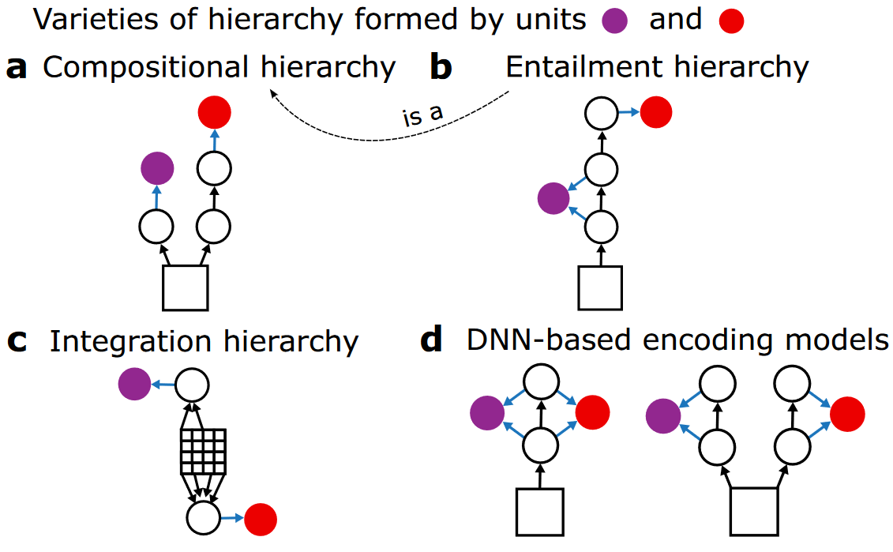
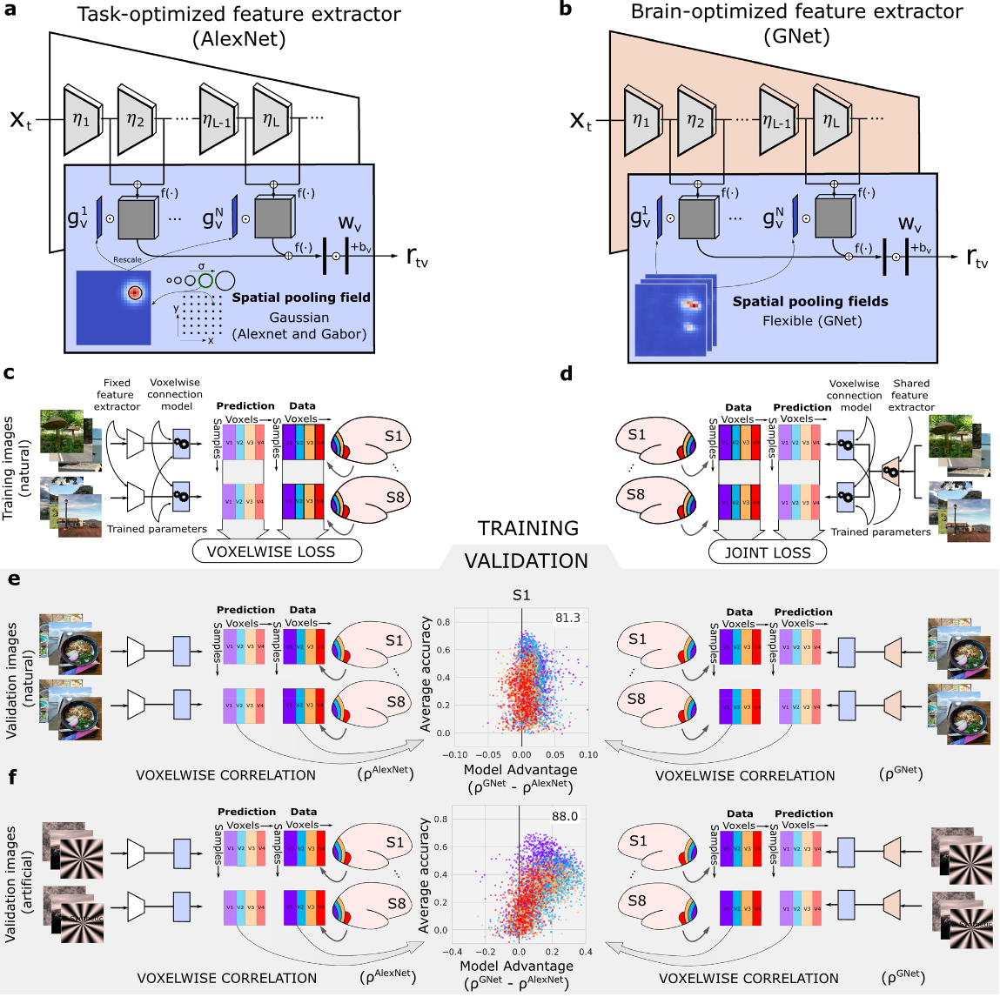
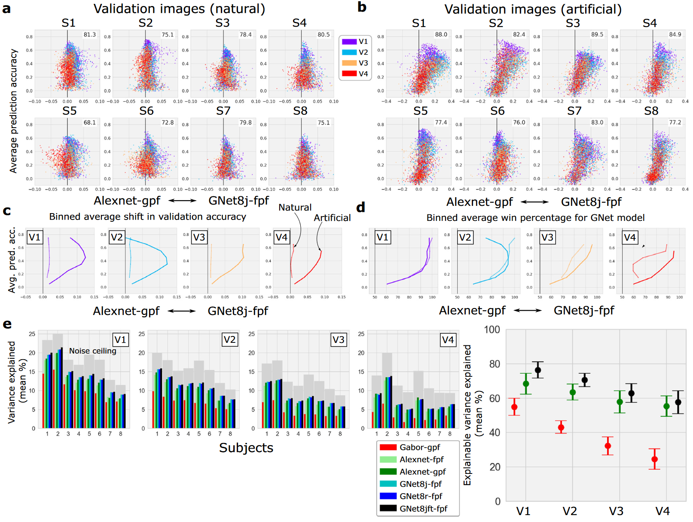
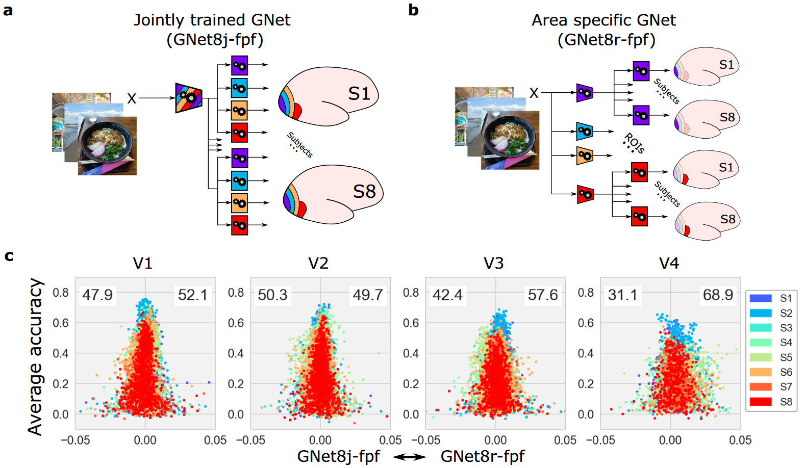
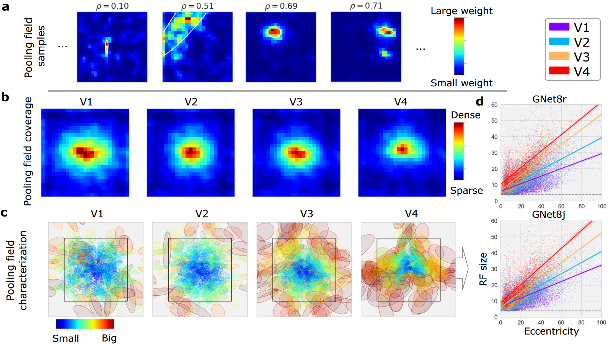
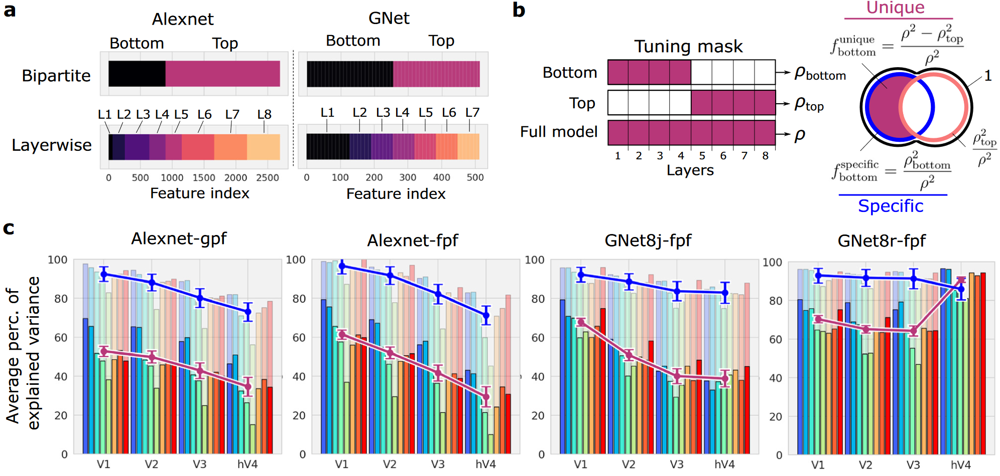
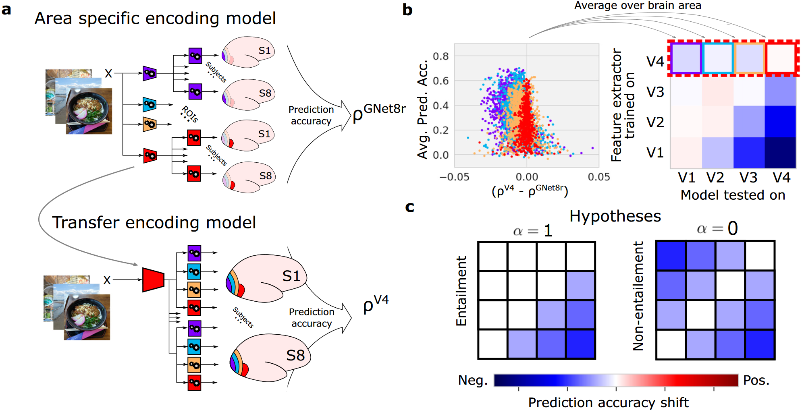
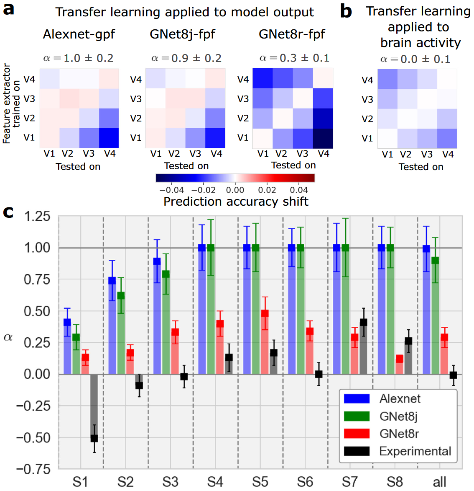
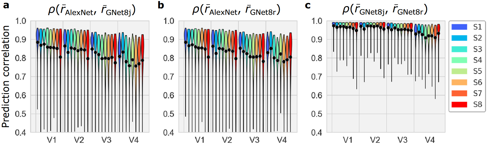

## 文献信息

- **标题 :** [Brain-optimized deep neural network models of human visual areas learn non-hierarchical representations](https://doi.org/10.1038/s41467-023-38674-4)
- **期刊 :** Nature Communications
- **作者 :** Ghislain St-Yves et.al
- **DOI :** 10.1038/s41467-023-38674-4
- **类型：** 
- **来源：** 偶然发现

## 目的

针对视觉任务优化的 DNN 的表示将层深度与灵长类大脑视觉区域的层次结构，一种解释是层次表示对于准确预测灵长类视觉系统大脑活动是必要的。为了测试该解释，文章优化了一个直接预测 `V1-V4` 脑区 `fMRI` 的单分支 DNN ，并训练了一个多分支 DNN 来独立预测每个视觉区域。

分层处理被认为是灵长类动物视觉的重要组织原则 
$\to$ 一些卷积 DNN 的架构受到了灵长类视觉系统中分层处理证据的启发 
$\to$  **假设 ：**  DNN 的预测准确性至少部分取决于它们实施视觉处理阶段的层次结构 
$\to$ **问题 ：** 非分层模型是否可能与基于分层任务优化 DNN 的模型一样准确地预测大脑活动

尽管多分支 DNN 可以学习分层表示，但单分支 DNN 也可以做到，说明准确预测 V1-V4 中的人类大脑活动不需要分层表示。

## 背景

引入并区分了三种概念上不同的层次结构，

- 组合层次 (compositional hierarchy) : 与较低级的表示相比，较高层次表示需要更多非线性处理步骤，用于解释灵长类视觉系统中表征的 ”复杂性梯度“。
- 蕴含层次 (entailment hierarchy) ： 低级表示充当高级表示的必要预处理阶段，意味着好的DNN模型必须要成功模拟低级大脑区域的层, 对该结构的支持来自初级视觉皮层的失活大大减少V2、V3、V4的激活。
- 集合层次 (integration hierarchy) ： 某些表示的感受野大小比其他表示更大，感受野大小的扩展是视觉系统中最显著的层次结构。

> 黑色箭头表示连接，正方形表示视觉输入，蓝箭头表示线性读出
> `a :` 组合层次结构中红色单元比紫色单元需要更多非线性组合
> `b :` 蕴含层次结构中激活紫色单元的所有组件都有助于激活红色单元、
> `c :` 集合层次结构中红色单元的读出连接提供比紫色单元更宽的空间窗口（表示为像素）（使用相同数量的非线性函数独立处理输入 $\to$ 不构成组合或蕴含层次）
> `d :` 单分支和多分支的DNN编码模型

纯前馈 DNN 最自然的体现了所有的这三种层次 
$\to$ **推断 ：** 如果某种特定层次结构对准确预测大脑活动很重要，那么任何基于DNN的模型都将显示相关证据

## 方法

读出层从整个网络的层中采样，为特征提取器网络中每一层提供了预测大脑的机会

构建了基于大脑活动优化的 GNet 编码模型，

基于任务优化的模型是 AlexNet ，网络参数未针对预测大脑活动优化，仅优化读出层的自由参数

> Fig 2. 任务优化和大脑优化网络的训练和验证
> `a :` 读出头由高斯空间场池化组成
> `b :` 基于大脑优化网络 (GNet : 橙梯形表示单分支架构) , 读出头用非高斯的”灵活“空间场池化
> `c :` 基于 AlexNet 的编码模型，仅针对被试大脑体素优化读出头参数（体素间独立计算loss）
> `d :` GNet 和 读出头参数针对所有体素、被试和大脑区域联合优化
> `e :` 预测准确性通过一组自然场景数据验证（预测大脑活动和测量的大脑活动相关性）, 颜色表示体素所在脑区
> `f :` 人工刺激

数据集使用 7T fMRI 的 NSD 数据集

## 结果

为了验证和比较编码模型，将预测活动与测量活动相关联来评估每个体素模式的预测准确性 $\to$ 对于每个被试（NSD数据中的），针对 V1-V4 中 68% 的体素，脑活动优化的 GNet 编码模型比 AlexNet 编码模型更准确地预测 V1-V4 中的大脑活动。

> Fig 3. 任务优化和大脑优化DNN的交叉验证预测精度的比较
> `a-b :` 展示了所有被试
> `c-d :` 平均预测精度（y）和模型预测精度（x）的平均差异，细线是自然图像，粗线是人工刺激。基于 GNet 的编码模型比基于 AlexNet 的编码模型在更多平均预测精度（y）解释了更多体素信号方差（x）。
> `e :` 

> Fig 4. 

