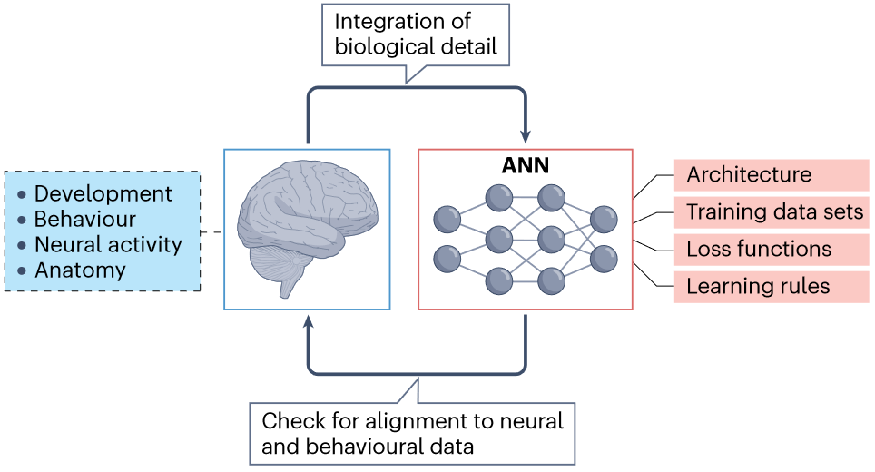
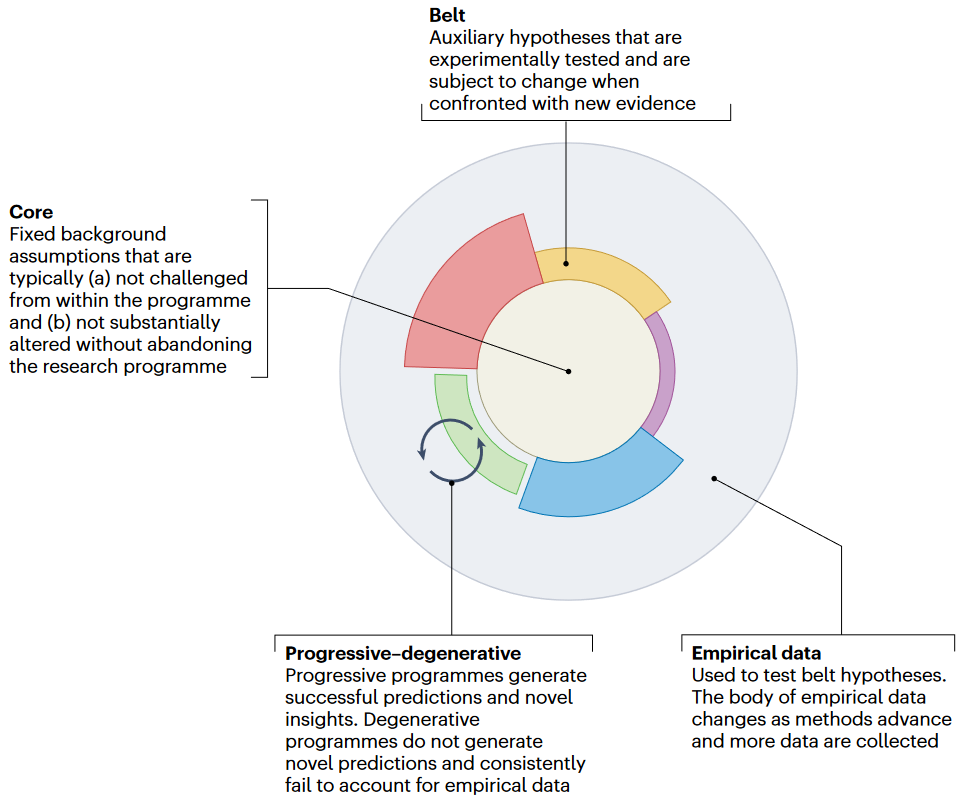
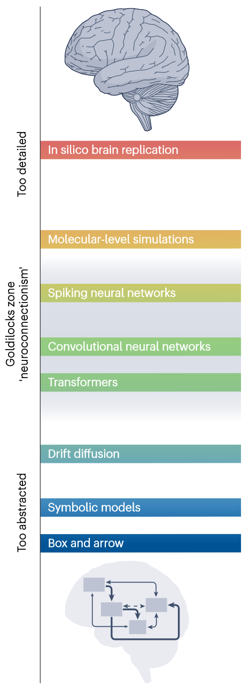
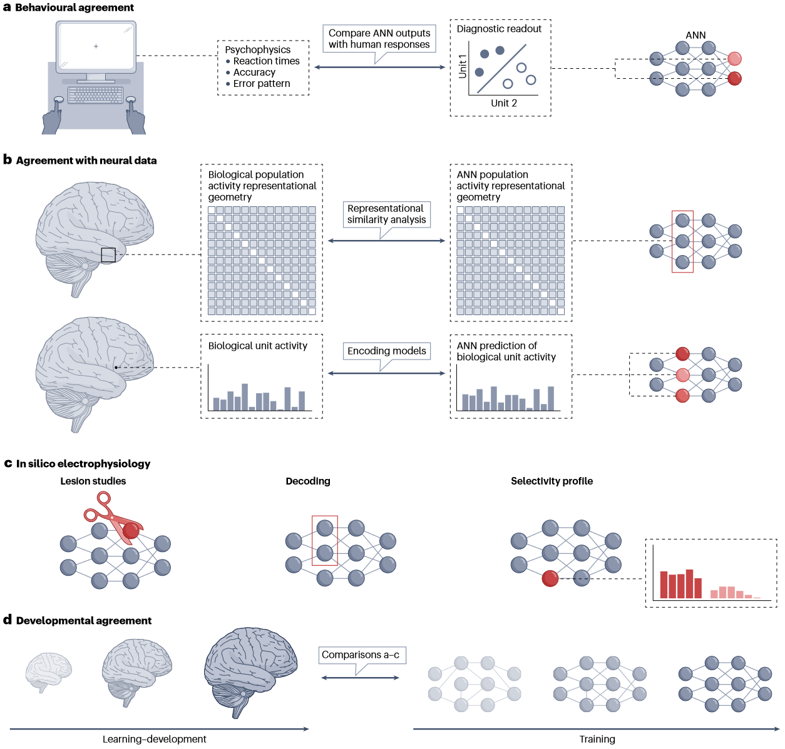
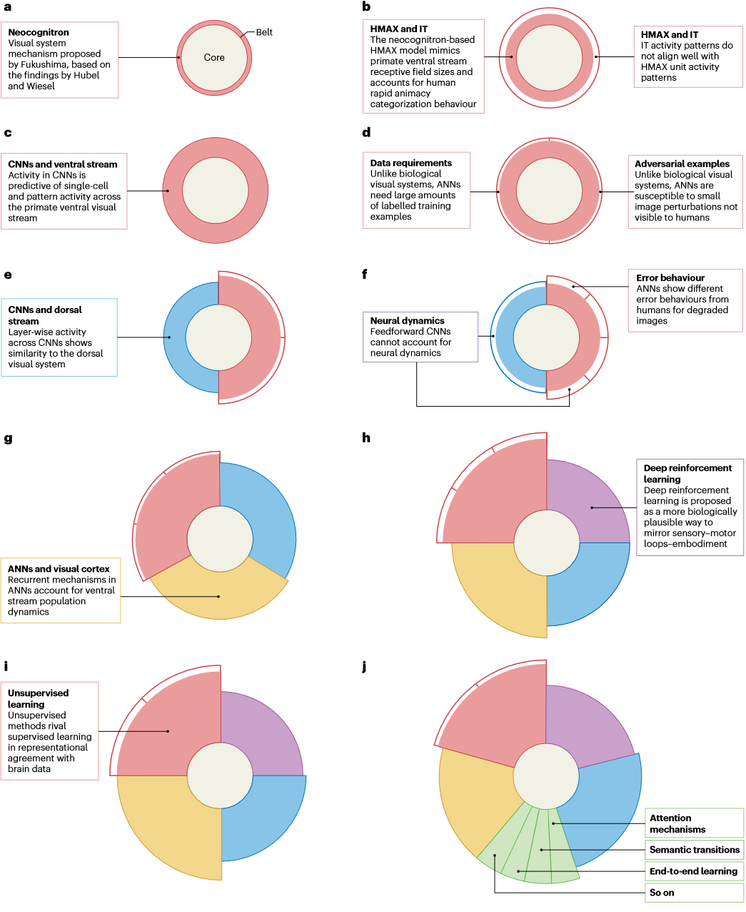

## 文献信息

- **标题 :** [The neuroconnectionist research programme](https://doi.org/10.1038/s41583-023-00705-w)
- **期刊 :** Nature Reviews Neuroscience
- **作者 :** Adrien Doerig et.al
- **DOI :** 10.1038/s41583-023-00705-w
- **类型：** 综述
- **来源：** 主动发现

## 目的

- 从科学哲学（拉卡托斯 Lakatos）那汲取灵感 $\to$ 科学研究计划的核心通常不能直接证伪，应该评估其产生新颖见解的能力 

$\to$  **进路 ：** 将以ANN为中心的神经连接主义作为一种计算语言来表达关于大脑计算的可证伪理论 $\to$  该综述描述了神经连接主义计划的核心、基本的计算框架和工具 $\to$ 为的是检验特定的神经科学假设和获得新的理解

## 背景

文章认为计算模型可以尝试回答认知神经科学的一些核心问题：

- 如何将感觉输入与整个大脑区域的神经数据在单细胞水平和群体水平联系起来？ $\to$ _map/绑定_
- 神经过程如何与行为联系起来？
- 神经表征如何时空变化？ （尺度从快速突触适应、循环动力学到任务的中期学习到更长的发展发育）
- 过去的经验如何在大脑中编码，哪些类型的特征选择性可以实现任务通用的鲁棒性？ $\to$ _知识表征_

> 神经连接主义研究周期 ：
>  整合来自多个尺度神经、行为数据的生物细节可以为创建具有不同组件的ANN模型提供信息 $\to$ 测试模型是否和神经/行为数据一致 $\to$ **循环**

`神经连接主义 | Neuroconnectionism` 相比早先的经典联结主义模型，更多关注多层次的理解大脑功能，不在仅限于较小的网络去解释高级认知功能，同时也会去寻求从模型单元到大脑的明确映射。

神经连接主义已经成功用在各种神经科学主题上，如：

- 视觉
  - 🍹 Recurrence is required to capture the representational dynamics of the human visual system.
  - ... 视觉几个引文相对较老
- 听力
  - [A Task-Optimized Neural Network Replicates Human Auditory Behavior, Predicts Brain Responses, and Reveals a Cortical Processing Hierarchy](https://doi.org/10.1016/j.neuron.2018.03.044) _Neuron 2018_
    优化以识别语音和音乐的深度神经网络复制了人类的听觉行为并预测了皮质功能磁共振成像反应，不同的网络层可以最好地预测主要和非主要体素，揭示人类听觉皮层的层次结构。 
  - [Deep neural network models reveal interplay of peripheral coding and stimulus statistics in pitch perception](https://www.nature.com/articles/s41467-021-27366-6) _nc 2021_
    表现最佳的网络复制了人类音调判断的许多特征。只有当耳蜗具有很高的时间忠诚度，并且对自然声音进行优化时，才出现类似人类的行为。
- 语义
- 语言
- 阅读
  - [Emergence of a compositional neural code forwritten words: Recycling of a convolutional neuralnetwork for reading](https://www.pnas.org/doi/epdf/10.1073/pnas.2104779118) _PNAS 2021_
- 决策
- 注意力
  - [How biological attention mechanisms improve task performance in a large-scale visual system model](https://elifesciences.org/articles/38105#content) _elife 2018_
    **特征相似性增益模型（FSGM）** 提出注意提高视觉任务上的性能是因为注意力增加了对特定目标特征敏感的神经元的活性 $\to$ 该因果关系很难进行生物学研究 $\to$ 用VGG-16和反向传播的梯度值来探索这个问题 $\to$ 形式化定义该增益以便将指标用在CNN中 —— （特征图在某类图像中的平均激活 - 总平均激活 ）/ 所有图像激活标准差 $\to$ 用空间注意力将特征增益作用在特征图的对应部分

- 记忆
  - [A diverse range of factors affect the nature of neural representations underlying short-term memory](https://www.nature.com/articles/s41593-018-0314-y) _Nat Neuro 2019_
- 游戏
  - [Using deep reinforcement learning to reveal how the brain encodes abstract state-space representations in high-dimensional environments](https://doi.org/10.1016/j.neuron.2020.11.021) _Neuron 2021_
    扫描玩雅达利游戏的人类，并利用DQN作为人类如何映射高维感官输入到动作的模型。算法中间层的表示用于预测整个感觉运动通路的行为和神经活动。
- 运动控制
- 大脑区域的形成和编码原理 : 
  - 🍹 鲍平磊的 A map of object space in primate inferotemporal cortex. _Nature 2020_
  - 🍹 [A connectivity-constrained computational account of topographic organization in primate high-level visual cortex](https://doi.org/10.1073/pnas.2112566119) _PNAS 2022_ 
     提出 **交互式地形网络(ITN)** 用于建模高级视觉皮质组织的计算框架，证明了灵长类动物颞下皮皮层中域的地形聚类可能是由于视觉识别的需求在生物学约束下对接线成本和神经元连接的调节产生的。 
     ITN（学习IT拓扑的层是三层分成兴奋抑制神经元结构的层（共6片单元））的三个约束：空间连通性成本迫使连接更局部（类似正则）、兴奋性抑制性影响分离、区域间连接均由兴奋性神经元发出。
  - Topographic deep artificial neural networks reproduce the hallmarks of the primate inferior temporal cortex face processing network. _arxiv 2020 很接近上面那篇_
  - 🍹 [Brain-like functional specialization emerges spontaneously in deep neural networks](https://www.science.org/doi/10.1126/sciadv.abl8913) _无需介绍_
  - [End-to-end topographic networks as models of cortical map formation and human visual behaviour: moving beyond convolutions](https://arxiv.org/abs/2308.09431) _arxiv 2023_ (他们研究组的)
  - 🍹 [Unsupervised deep learning identifies semantic disentanglement in single inferotemporal face patch neurons](https://www.nature.com/articles/s41467-021-26751-5) _nc 2021_
    $\beta$ -VAE | 人脸 | 猴颞叶 那篇 

> 🍹 表示已经通过某种形式或多或少品鉴过了

### Lakatosian research programmes

> 概念示意图

科学通常是在研究方案中进行的，方案共享相同的 ”core“ 背景假设。”core“ 通常不会受到方案内部的挑战，在不放弃方案的情况下不会发生实质性改变，被一些经过实验测试的可变辅助假设带”belt“包着，经验数据”Empirical“用于在不改变核心的情况下测试和证伪带假设。

进化的方案会产生成功的预测和新颖的见解，不是对非常相似的想法重复证实，核心背景假设有助于研究人员在带中产生新知识和可检验的假设。而退化的方案不会产生新颖的预测并且始终无法解释经验数据。

###  ⭐ 神经连接主义 核心  ❣

一个良好的认知大脑计算模型应该：

- 1. 指定哪些计算是由大脑执行的（计算层次）
- 2. 展示这些计算如何产生可以在实验中测试的复杂行为模式（行为层次）
- 3. 展示这些计算如何产生可以在实验中测试的复杂神经动力学 （单元层次和集体动力学层次）
- 4. 展示如何在复杂自然环境中进行这些计算，而不是简化的高度特意的经验（丰富的领域知识）
- 5. 展示这些计算如何基于感官信息，而不是由人类提供的可解释标签的高级特征（感官基础）
- 6. 展示这些计算是如何从多个时间尺度的自适应过程中产生的 （处理过程中的动态和发育过程的动态）

少量可直接解释参数的简单模型不是理想的候选模型，它无法处理 iv , 没有感官基础，多层次（期望 1-3）和动态（期望 6）理解很可能需要具有分布式和迭代计算的模型，这些复杂计算只能在高度参数化的模型实现。但复杂模型也有它本身难解释难处理的问题。

哪种模型类强大到足以完成大脑建模的艰巨任务，同时仍然具有计算上的易处理性和可解释性，足以产生脑科学的真正见解，成为一个中心问题。

> 生物抽象的 Goldilocks 区示意图。传达细节与抽象之间平衡的类比。这个类比借用自天文学。

> - **Goldilocks effect 金发姑娘效应**: [The Goldilocks effect: human infants allocate attention to visual sequences that are neither too simple nor too complex.](https://pubmed.ncbi.nlm.nih.gov/22649492/) _2012 PLOS ONE 650+引用_
>   婴儿对中等复杂程度的刺激关注时间明显更长，婴儿隐性地寻求维持中等的信息吸收率，避免在过于简单或过于复杂的事件上浪费认知资源。

具有太多生物学细节的模型在以感觉为基础的、行为复杂的认知任务所需的大规模计算上难以处理，也无法提供从低级神经元到高级认知功能的连接。人工神经网络通过提供更接近生物学但足够抽象来建模行为的抽象级别来实现正确的平衡：它们可以被训练来执行高级认知任务，同时它们在计算结构和术语方面表现出生物联系。

神经连接主义的核心：

- 1. 脑科学需要复杂的、分布式的和迭代的模型来解决需求
- 2. 人工神经网络提供了一种非常适合的计算语言：足够抽象、易于计算并重现认知功能，同时仍然足够接近生物学，可以关联、实现和测试神经科学假设

### From core to belt: the neuroconnectionist toolbox

使用本节中描述的神经连接主义工具箱将神经科学假设实例化为神经连接主义语言

**模型实例化**
- 架构的研究迭代是神经连接主义的核心要素，以确定需要何种程度的细节来匹配生物数据
- 开发更自然的数据集，并在不同数据集上迭代训练模型测试需要哪些数据特征来匹配生物数据
- 不同的目标函数会影响网络的学习内容（监督、无监督、预测编码、图像生成、时间稳态、能源效率和行为奖励），从而影响网络对不同大脑区域进行建模的能力，需要迭代使用不同损失函数训练的模型，以测试有关大脑目标的不同假设。
- 如何根据学习规则将网络中单个神经元对整个网络误差的贡献归因，除了反向传播还有赫布学习、预测编码、自组织映射、前向前向学习

**模型测试**

没有单一模型测试方法是完美的，需要各种补充方法

- Behavioural agreement ： 粗略的整体任务表现往往不能在模型之间进行仲裁，存在几种更细粒度的方法，包括用诊断读出层去表征ANN一组单元所表示的信息，并将其转换为行为相关的测量值，如：
  - 反应时
  - 错误模式细节
  - 分布外示例测试
  - 重现心理物理学结果

- Neural data agreement ： RSA (太熟了具体略)... RSA回避了寻找ANN单元到单个神经元或体素的显式映射，而是专注于群体层面表征的几何。
  - RDM 可以直接与ROI神经群体RDM比较，也可以集成额外的数据拟合步骤进行优化（Feature-reweighted representational similarity analysis: a method for improving the fit between computational models, brains, and behaviour.）。直接比较的好处是不需要任何自由参数来实现 ANN-大脑映射，而线性重新加权优化的方法自身的参数灵活性会导致网络间不可见的显著差异。

- In silico electrophysiology. ：由于所有单元活动都是可及的，可以开展类似“电生理”的研究，如单元选择性、拓扑上单元类型、信号解码、调优曲线分析、单元损伤、消融等。
- Developmental agreement. ：从未经训练的模型到完全训练的模型，并且获得的学习轨迹可以与生物发育的不同阶段的一致性水平进行比较，尽管目前尚不清楚人工神经网络中学习的哪些方面更适合于进化过程中的学习，哪些方面更适合于生物体生命周期中的建模学习，但这两个方面都可以通过实验来解决。（具体可以参见下面这篇文章）
  - [Lessons from infant learning for unsupervised machine learning](https://www.nature.com/articles/s42256-022-00488-2) _2022 Nature machine intelligence_
    认为婴儿认知的发展可能是推动下一代无监督学习方法的关键 $\to$ 确定了婴儿学习质量和速度的三个关键因素：1.信息处理受到引导和约束。2. 婴儿从多样化多模式的输入中学习。3. 输入是由发育和主动学习决定的。$\to$ 评估了这些来自婴儿学习的见解在机器学习中的利用程度和具体实现与见解的相似程度 
    
**模型解释**

- Hypothesis testing via model contrasting. ：可证伪的 belt 假设是通过根据神经和行为数据构建、训练和测试 ANN 来评估的。因为随机模型也可以解释神经记录中的一些方差，所以报告单个ANN解释了多少方差并不具有洞察力。必须对比假设（实例化为经过训练的模型），了解不同模型设计选择的相对影响，以获得对该认知计算的见解。

- Normative modelling. ：典型例子是 1.通过使用任务训练的神经网络成功预测腹侧流群体反应 ；2.与其他几种没有以解缠结为目标的控制 ANN 相比，β-VAE 可以更好地对猕猴面部斑块中的神经元进行建模。通过优化模型以实现一个（或多个）预定义目标、根据神经和行为数据对其进行测试并将其与为实现其他目标而优化的模型进行对比，从而有助于回答为什么一个系统表现出它所具有的特征。

- New concepts for brain science. ：ANN 提供了一组定量概念，允许以全新的方式思考和描述大脑及其计算。神经连接主义所围绕的术语与从前在神经/认知科学中使用的术语不同。
  - [A mathematical theory of semantic development in deep neural networks](https://www.pnas.org/doi/10.1073/pnas.1820226116) _2022 PNAS_
    **问题：** 结构丰富的语义知识如何通过大脑中的神经元网络获得，组织，部署和代表？ $\to$ 尝试研究深层线性网络的非线性学习是如何动态获得复杂环境结构信息来解决 $\to$ 深度学习动力学可以自组织成一种概括人类语义发展中很多经验现象的的隐层表示
  - [Pruning recurrent neural networks replicates adolescent changes in working memory and reinforcement learning](https://www.pnas.org/doi/10.1073/pnas.2121331119) _2022 PNAS_
    **现象：** 1.青春期脑前额叶皮层突触连通性降低 ；2.青春期工作记忆和强化学习能力更好 $\to$ 尝试训练 RNN 执行工作记忆和强化学习任务，并证明当降低网络中连通性（剪枝）时，能更好地执行任务。$\to$ 所以文章认为两个现象之间是有因果关系的

-  Neural control. | Mechanistic understanding.  ： 见原文

- Formal theories of computation. ：因为大脑也高度过参数化，所以类似ANN中的数学见解对于理解复杂的神经过程非常重要。文章举了两个例子，
  - 双重下降现象 ： 当增加模型大小时，性能首先变差，然后变好。
  [Deep double descent: where bigger models and more data hurt](https://iopscience.iop.org/article/10.1088/1742-5468/ac3a74/meta) _Journal of Statistical Mechanics 2021_
  表明双重下降不仅是模型大小的函数，而且是训练时期数量的函数。定义新的复杂度度量来统一上述现象，称之为有效的模型复杂性，这个概念能识别在某些情况下增加训练样本数量实际会损害测试性能。
  - 神经正切核 ：理论分析表明网络更宽，训练更容易收敛到全局最优值。
  [Neural Tangent Kernel: Convergence and Generalization in Neural Networks](https://proceedings.neurips.cc/paper_files/paper/2018/file/5a4be1fa34e62bb8a6ec6b91d2462f5a-Paper.pdf) _NeurIPS 2018 2k5+ 没看懂_
  初始化阶段ANN等价于接近无限宽的高斯过程，所以能将之和核方法联系起来 （🤔？） $\to$ 文章证明了ANN在训练过程中的演化也可以用一个核 (Neural Tangent Kernel,NTK) 来描述，在接近无限宽时它收敛到一个显式的极限核，并在训练过程中保持不变，使得可以在函数空间而非参数空间中研究神经网络的训练。$\to$ 在最小二乘回归设置下，与NTK有关的最大核的主成分收敛速度最快。

- Explainable artificial intelligence in brain science. ： 网络可解释性方法可见其他综述
- Links to higher-level cognitive neuroscience and psychology theories. ：
可以与现有的心理学和心理物理学思想联系，且对于统一这些领域中不同的理论可能至关重要。例子如：
  - CNN 无法产生视觉拥挤效应（强烈的心理物理现象，拥挤时对目标的感知能力在杂物存在下降低），表明 CNN 缺少某些计算功能。_实质是人/模型间的区别，对分析该问题能提供一定的信息_
  [Crowding reveals fundamental differences in local vs. global processing in humans and machines](https://www.sciencedirect.com/science/article/pii/S0042698919302299) _Vision research 2020_

### The neuroconnectionist belt

讨论当前研究计划的 belt，即一组经过测试并随着新的经验数据的整合而演变的辅助假设。

神经连接主义渐进进化最明显的例子是近些年使用 ANN 进行视觉建模时方法的变化，如下图所示。随着时间推移，最初CNN的几乎每个组件都得到了更新，产生了更好地解释神经生理学和心理物理数据的新模型。

>

海马结构和相关网络的模型也发生了类似的演变，其中初始架构和损失函数随着研究计划带的演变而被取代。早期的海马模型通常是吸引子网络，后来发展到包含与预测和空间整合相关的额外架构特征和损失函数（命名为 [The Tolman-Eichenbaum Machine](https://www.cell.com/cell/pdf/S0092-8674(20)31388-X.pdf)），从而更好匹配大量的实验结果。

新的 ANN 架构（例如 Transformer）具有更复杂的注意力机制，以自我监督方式训练的 Transformer 可以有效捕获在大脑语言区域和其他大脑回路中观察到的表征，例如内侧颞叶的记忆回路。

## 其他

- 表述
传统实验方法通常在解释能力相当粗粒的对比实验条件下进行 | Traditional experimental approaches often operate at the rather coarse-grained explanatory level of contrasting experimental conditions.