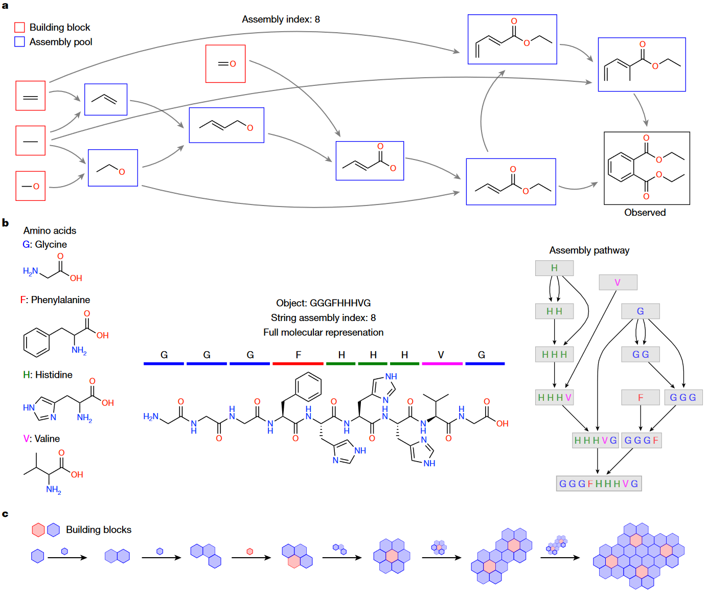
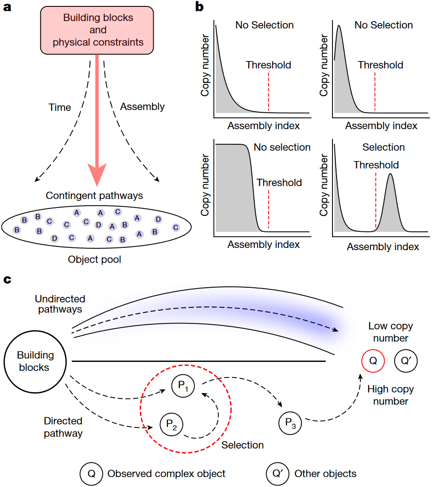
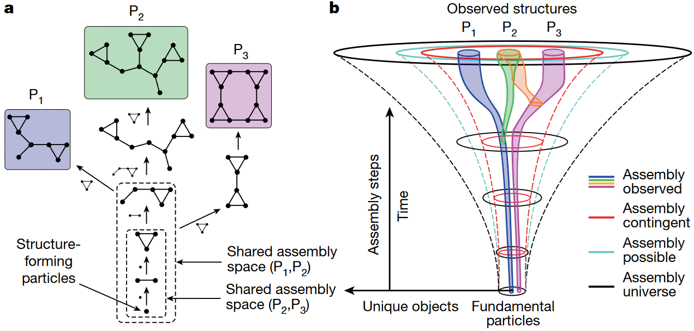
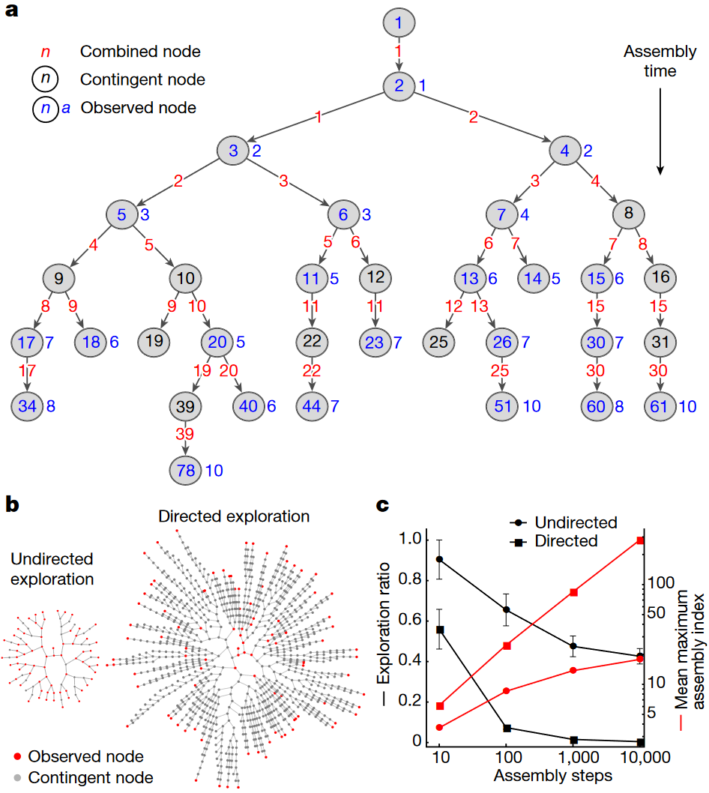
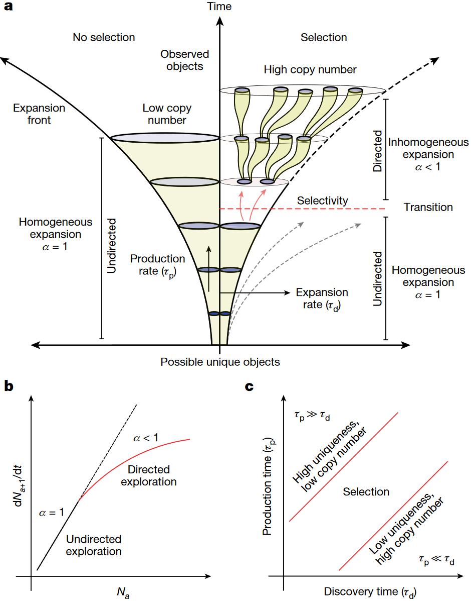

## 文献信息

- **标题 :** [Assembly theory explains and quantifies selection and evolution](https://doi.org/10.1038/s41586-023-06600-9)
- **期刊 :** Nature
- **作者 :** Abhishek Sharma et.al
- **DOI :** 10.1038/s41586-023-06600-9
- **类型：** 理论
- **来源：** 集智俱乐部

## 目的

进化论通过选择的视角解释为什么有些事物存在有些不存在，为了理解在没有蓝图的情况下物理学如何产生多样化、开放式的形式，文章想要提出一种理解和量化这种选择的新方法。

组装理论（Assembly theory）重新定义物理定律作用的 “对象” 概念，将物体概念化为由其可能的形成历史定义的实体。引入一种称为装配的度量，捕获产生给定对象集合所需的因果关系程度，目的是发展对复杂物质演化的新理解，自然地解释在构造物体时物理上可能进行的操作的选择和历史。 

##  理论介绍（背景）

进化过程可以通过许多相同或产生接近相同的多步骤对象来识别，装配索引本身没法检测进化，但拷贝数和装配索引结合可以，这样定义了一种根据不同级别选择产生的因果关系层次来衡量复杂性的新方法。

> 文章主要讨论在化学系统中的应用，作者预计装配理论可以应用于其他系统，如聚合物、细胞形态、图、图像、计算机程序、人类语言和模因等系统。

> 装配空间中的选择
> a : 表示从构建块和物理约束形成的组合对象空间
> b ：选择/不选择，观察到不同装配索引处对象的拷贝数分布
> c : 有向/无向路径构建对象的物理路径的表示，导致观察到对象拷贝数高低

在装配空间中随着深度增加发现新物体越来越困难，因为可能性的空间随指数级扩展，一旦发现装配新对象的途径，随着拷贝数的增加对象的生成变得更容易。**最难的创新是第一次制造某对象，相当于它被发现，意味着高丰度的高装配指数对象是选择发生的标志。**

每次从装配池中组合两个对象时，组合过程的特殊性就构成了选择。如果优先使用某些组合，则意味着存在一种选择特异性的操作机制。

> 装配空间
> a : 图示三个对象共享的最小构造过程称为 **联合装配空间 (joint assembly space)**
> b : 装配宇宙（AU） | 装配合理（assembly possible） | 装配 （Assembly contingent） | 观察装配（Assemble observed） | ，描述它们嵌套结构的示意图。（其中每个集合通常以指数形式大于子集）

如何考虑内存和资源限制来严格限制可构建的空间大小，同时允许构建所有可能的低级组件前构建较高组件的对象？

- AU : 没有时间方向性，没有规则，所有组装都可能，组合爆炸，对象数量以双指数增长
- AP ： 装配可能是物理上可能的对象的空间，
- AC ： 在AP中，装配队伍描述了对象可能的空间
- AO ：为了产生装配空间，观察的对象被递归地分解以生成一组基本单元，单元可用于递归地构建原始对象的组装路径，以产生观察装配（AO）

**历史偶然性** 通过假设将来只能使用建立在给定路径约束/在先前未交互过的选定对象与不同路径交互来引入，意味着装配动力学在耗尽所有较低装配对象之前会先探索较高装配对象。沿着历史偶然路径打破早期对称性是所有装配过程的基本属性，也可以简单理解为 ”探索“ ，这为AT引入了第一个时间箭头。

> 前向装配过程中的无向/定向探索
> a : 从装配池随机选择的聚合物创建30个步骤后的聚合物链，蓝色表示已实现对象; 黑色表示未实现但属于已实现对象联合装配空间的一部分；红色是装配上去的对象；蓝色节点旁边的蓝色数值是装配索引。
> b :  使用径向嵌入图进行100个装配步骤后无向/有向探索之间的比较，观察节点红色表示；偶发节点灰色表示
> c : 探索率（由观测节点数与总节点之比定义）和平均最大组装指数的平均值及标准差

**平均最大装配指数** 通过计算25次run中观察到的最长聚合物链的平均装配指数来估计的，

将有向过程和无向过程探索对比是想说明 -- 选择信号特征是较低探索率和较高复杂性（最大装配指数定义），证明了在有向探索的装配过程中存在选择性。

> 装配空间的演变
> `a :` 有选择/无选择的装配过程，选择的定义是从无向探索到有向探索的转变，用参数 $\alpha$ 表示。 （$\alpha = 1 $ : 无向/随机扩展 ；$\alpha < 1 $ : 有向扩展） $\tau_d$ 是发现的特征时间尺度，决定了扩张前沿的增长；$\tau_p$ 是生产的特征时间尺度，决定了物体拷贝数的增加速率。
> `b :`   在集合a中发现装配数a+1唯一对象与集合a中对象数量的比率， $\alpha = 1 \to \alpha <1$ 的转变代表限制新物体发现的选择性出现。
> `c :` 由 $\tau_d$ 、$\tau_p$ 时间尺度定义的相空间，选择可能出现在中间的相中。

## 优/缺

优：
- 构建一个不考虑各种具体系统中具体约束条件下，说得通的描述演化的理论模型

缺：
- 《自然》评论该文章的科研人员 Kasper P. Kepp 给出更严厉的评论，认为该文章忽略了“过去 20 年间在整合物理、化学和生物数据方面的发展”，“无论是其写作还是实际模型，似乎都存在于真空之中，没有遵守科学的对应原则”，并质疑其可验证性。
- [《自然》发表故弄玄虚的糟糕文章](https://zhuanlan.zhihu.com/p/661107313) ,一篇对该文章指名道姓批评的博客
- 没有有力证据

## 启发

暂无