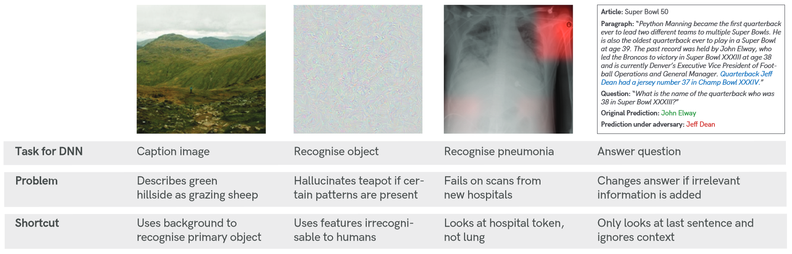
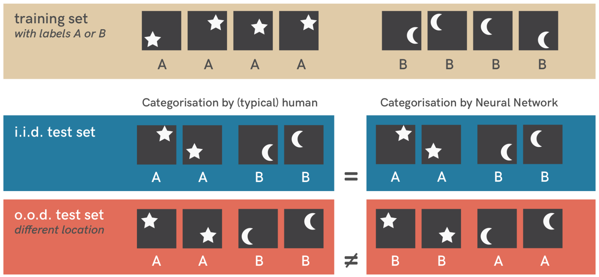
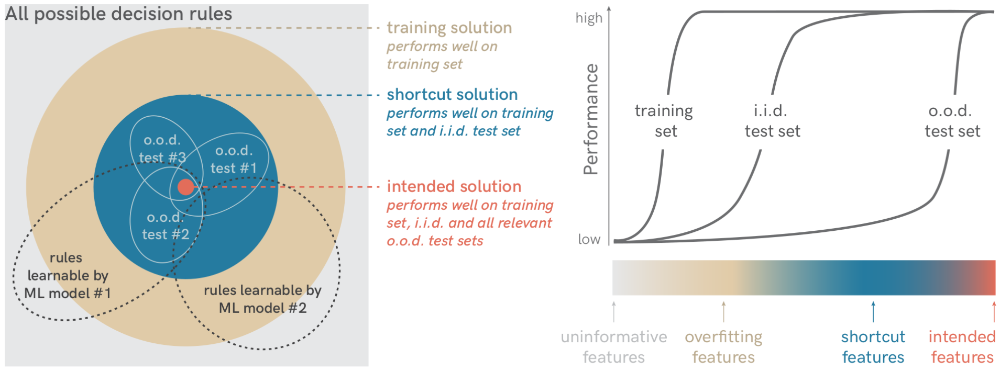
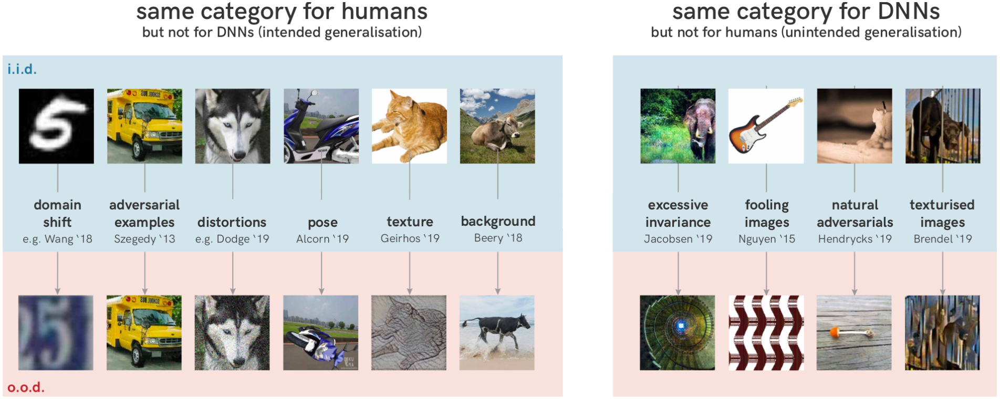

## 文献信息

- **标题 :** [Shortcut learning in deep neural networks](https://www.nature.com/articles/s42256-020-00257-z#access-options)
- **期刊 :** Nature Machine Intelligence
- **作者 :** Robert Geirhos et.al
- **DOI :** 10.1038/s42256-020-00257-z
- **类型：** 问题提炼
- **来源：** 四十周综述中被动发现

## 目的

试图提炼出有多少深度学习问题可以被视为同一根本问题的不同症状：捷径学习

> 捷径学习是在标准基准上表现良好但无法转移到更具挑战性的测试条件（例如现实场景）的决策规则。从而导致缺乏泛化性和不直观的失败，可以在许多实际应用中观察到。

## 内容

### 生物例子

- 比较心理学中的捷径学习：非计划的线索学习

> 老鼠学会了在复杂的彩色迷宫中导航，根本没有使用视觉系统，而是简单地通过迷宫墙壁上使用的彩色油漆的气味来区分颜色。一旦控制了嗅觉，卓越的辨色能力就消失了。

在给定的实验范式中的表现（例如奖励老鼠识别不同的颜色）与人们实际感兴趣的调查心理能力（例如视觉颜色辨别）之间存在着至关重要的差异。

- 教育中的捷径学习：表面学习

如死记硬背，方法依赖于狭窄的测试条件，简单的判别泛化策略可以非常成功。表现出良好的性能，但在更一般的测试设置下立即失败。

### 定义

上图表示一个简单的分类问题（区分星星和月亮），在独立同分布（蓝）上测试模型网络表现的非常好，但在控制位置（红）后网络性能降低到随机猜测。

一般来讲任何机器学习算法都会实现一个决策规则，为了明确快捷学习的定义，将之与其他决策规则区分开来，在这里引入决策规则的分类，见下图。

- 最外面是所有可能的解决方案，包含非解决方案。
- 训练解决方案，包含过拟合，指在学习到的函数可以在训练图像上产生正确的输出，但如果使用过拟合特征则在 i.i.d. （蓝）上不行。
- i.i.d. 测试解决方案，包含快捷学习。在系统上与独立同分布不同的数据集上测试模型，也称为分布外数据或 o.o.d. 数据，快捷学习有助于在 i.i.d 上表现良好，但在 o.o.d. 测试数据中失败泛化。
- 预期的解决方案，使用预期特征（图中的红色区域）的决策规则不仅适用于独立同分布，而且在 o.o.d. 上也按预期执行。但对于复杂的问题，预期的解决方案大多不可能形式化，需要机器学习从示例中估计这些解决方案，示例的选择会影响预期解决方案的估计。

**定义即：捷径学习是在 i.i.d. 上表现良好，但在 o.o.d. 上失败的决策规则。**

### 从哪儿出现的捷径？

#### 数据中的捷径特征

对于 DNN 来说，熟悉的背景对于识别来说与物体本身一样重要：在例如海滩而不是草地的牛不能被正确分类，相反完全没有任何动物的郁郁葱葱的丘陵景观可能会被 DNN 标记为“吃草的羊群”。

DNN也会发现人眼几乎看不见的更微妙的捷径特征，如某些高频模式，并且当数据集大小简单扩大几个数量级时捷径也绝不会消失。

数据本身很少能充分约束模型，并且数据不能代替做出假设 $\to$ ？

#### 特征组合

对象的定义依赖于不同来源或属性的信息，在带有大象纹理的猫的示例中，仅仅依赖于纹理属性的与形状无关的决策规则显然无法捕获人类视觉所理解的对象识别任务。

模型将某个重要属性（如纹理）等同于对象的定义，而忽略了其他重要属性。在典型的端到端判别学习中容易出现捷径学习，标准 DNN 不会对中间图像表示施加任何人类可解释的约束，可能会严重倾向于提取简单的特征，这些特征只能在所使用的特定数据集的特定设计下进行泛化。

### 3

DNN并没有缺乏 o.o.d. 概括，即使只剩下一些抽象模式，DNN也能识别吉他，高度确定地分类为“吉他”的图像集非常大，但这些图片很多在人类眼中是其他图案。对于人眼来说图像的类别不会因旋转对象或添加一点噪声等无害的分布变化而改变，但如果这些变化与 DNN 敏感的快捷特征相互作用，就会完全破坏神经网络的预测。

既不是学习失败，也不是泛化失败，而是未能在预期方向上泛化——泛化和鲁棒性可以被认为是捷径学习的反面，使用某些功能会导致对其他功能不敏感。仅当选定的特征在分布变化后仍然存在时，模型才能推广 o.o.d。

### 分析捷径学习的思路

- 区分数据集和本底能力：数据集只有在能够很好地代表人们实际感兴趣的能力时才有用

- Morgan’s Canon for machine learning : 在算法层面，常有一个默认的假设：类人性能意味着类人策略（或算法） ，但已知CNN在做图像物品分类时不像人类一样使用对象形状，更多基于纹理信息。比较心理学创造了一个术语”拟人化“来描述这种谬误，以描述对观察到的行为以人类为中心的解释和实际解释间区别。
  
  Morgan’s Canon 认为 “如果动物活动可以用心理进化和发展水平较低的过程来公平地解释，那么在任何情况下都不能用高级心理过程来解释它”，推论到机器学习则是“永远不要将那些可以通过捷径学习充分解释的能力归因于高级能力"。

- 在baseline 上用 o.o.d. 进行泛化测试，虽然分布偏移（独立同分布数据和 o.o.d. 数据之间）具有明确的数学定义，但在实践中很难检测到。文章列举了一些 o.o.d. 测试的 benchmarks

  - 对抗性攻击可以被视为对特定模型的最坏情况 o.o.d 的测试，如果成功的对抗性攻击可以在不改变语义内容的情况下改变模型预测，则表明可能正在发生类似于捷径学习的事情。
  - **ARCT with removed shortcuts** 是一个语言论证理解数据集，遵循从数据本身中删除已知快捷机会的想法，以创建更难的测试用例。
  - **Cue conflict stimuli** 例如具有冲突纹理和形状信息的图像，使特征/提示相互对抗。这种方法可以很容易地与人类的反应进行比较。
  - **ImageNet-A** 自然图像的集合，一些最先进的模型始终对这些图像进行错误的分类。
  - **ImageNet-C** 将 15 种不同的图像损坏应用于标准测试图像
  - **ObjectNet** 将科学控制的理念引入o.o.d.基准测试，可以消除背景、旋转和视角的影响
  - **PACS** 在与训练数据不同的领域（例如卡通图像）进行测试来获得每个设计的数据
  - **Shift-MNIST / biased CelebA / unfair dSprites** 是受控的玩具数据集，它们在训练数据中引入相关性（例如类别预测像素或图像质量），并记录干净测试数据的准确性下降，作为找出给定架构和损失函数走捷径的可能性的一种方式

文章还列出了四个决定模型和数据集归纳偏差的组成成分，

- **结构：** 比如卷积使得模型更难使用位置先验，但大多数情况很难理解DNN中的隐式先验，甚至像ReLU这种标准元素也可能导致意外影响，如无根据的置信度。
- **经验：** 训练数据，不赘述
- **目标：** 损失函数，最常用的分类损失函数是交叉熵，一旦发现简单的预测变量，DNN 就会停止学习；修改可以迫使神经网络使用所有可用的信息，使用有关训练数据的附加信息的正则化已用于将预期特征与快捷特征分开。
- **优化：** 随机梯度下降及其变体使 DNN 偏向于学习简单函数，学习率影响网络关注的模式：大的学习率导致学习跨示例共享的简单模式，而小学习率则促进复杂的模式学习和记忆。

## 启发/借鉴

最主要收获是这个图所代表的内容，明确了捷径学习的定义。迫使我反思在我的研究中对现象的归因是否受到捷径学习的影响。虽然模型可以出现人类相同的行为，但在归因过程中发现的原因的解释能力是否会受到（我们当前不清楚的）模型决策策略的削减，在我们研究中该问题是否可以被悬置？

