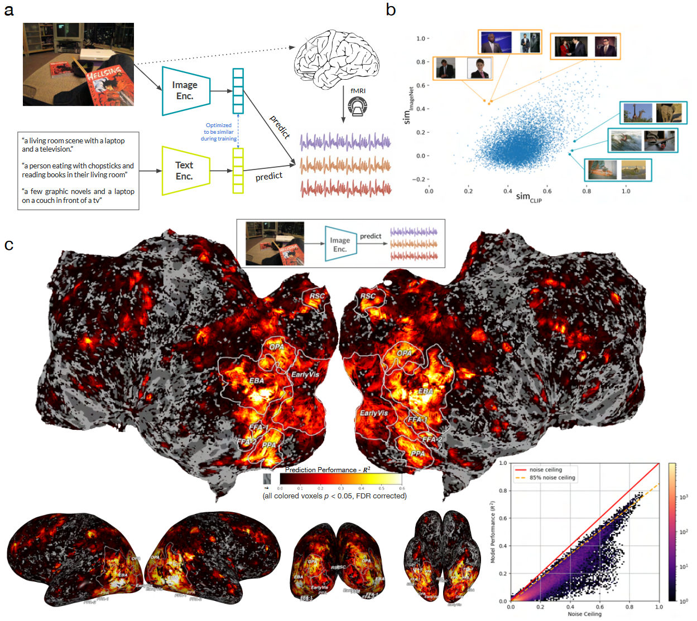

## 文献信息

- **标题 :** [Better models of human high-level visual cortex emerge from natural language supervision with a large and diverse dataset](https://www.nature.com/articles/s42256-023-00753-y)
- **期刊 :** Nature Machine Intelligence
- **作者 :** Aria Y. Wang et.al
- **DOI :** 
- **类型：** 
- **来源：** 智源复杂系统文献推送

## 目的  

图像语言的联合训练、增加数据集大小和数据多样性促进了神经网络的进步，文章想探讨这些因素能不能作用在预测人脑视觉反应问题上。

$\to$ 通过 CLIP 预训练构建体素编码模型，以预测大脑对现实图像的反应，使用CLIP的ResNet50解释了测试数据中单体素 79% 的方差，与仅使用图像/标签对（ImageNet）或文本（BERT）训练的模型相比显著增加。

## 背景

## 方法

## 结果

