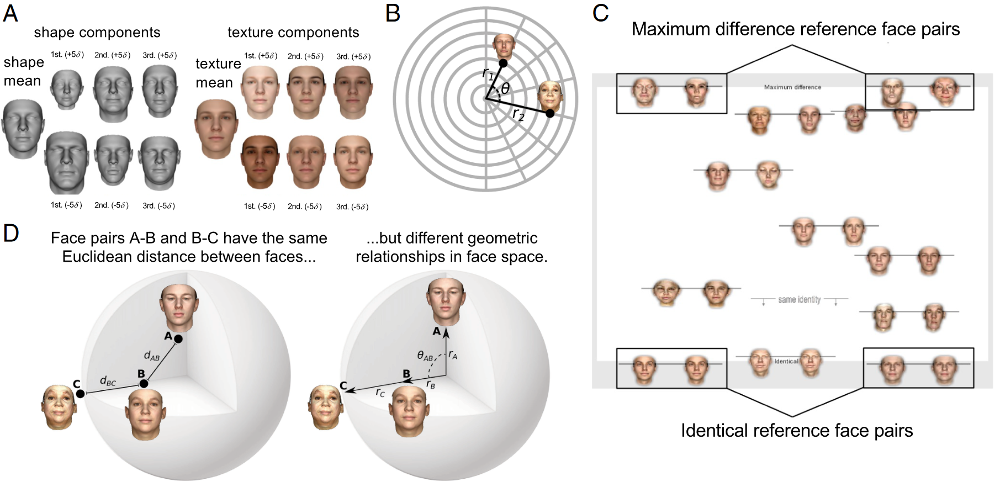
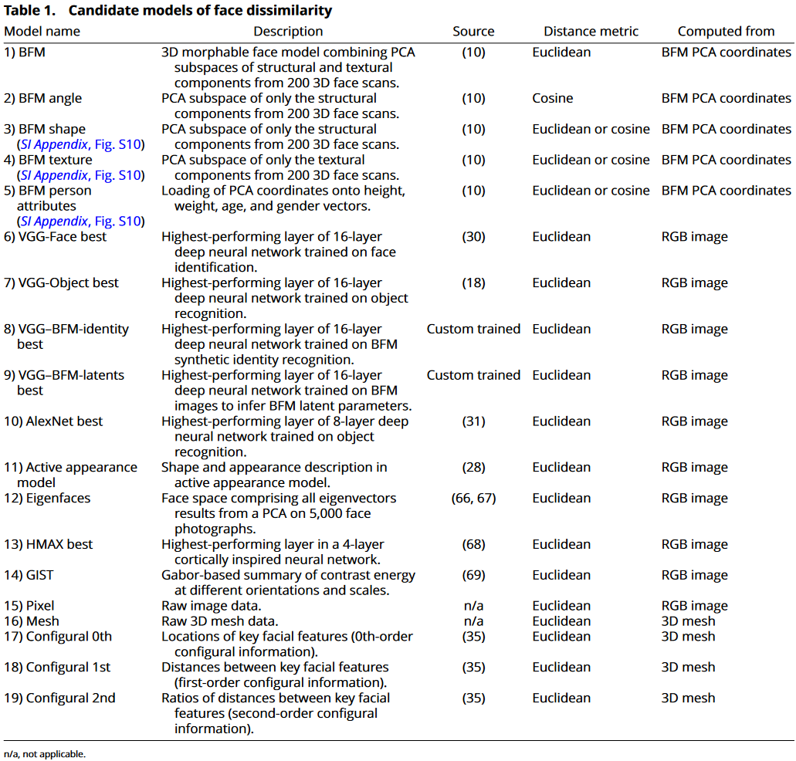
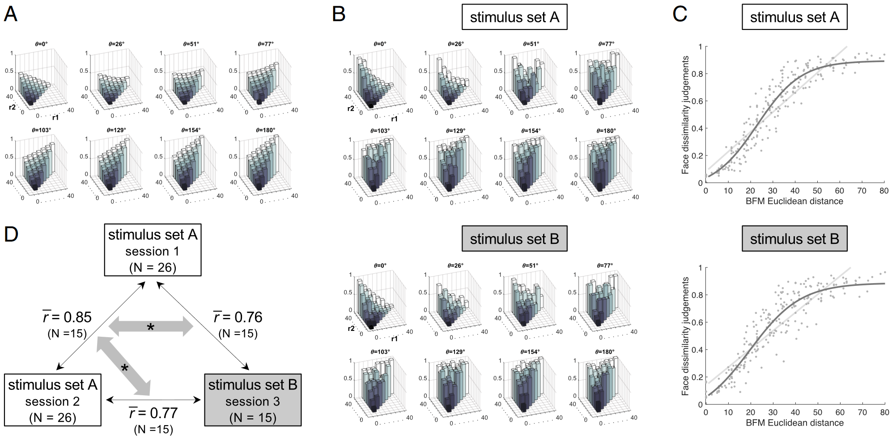
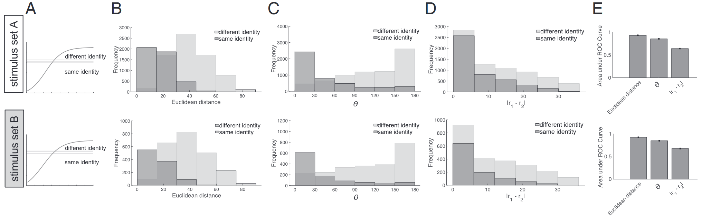
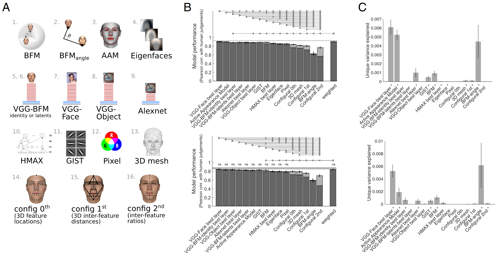

## 文献信息

- **标题 :** [Face dissimilarity judgments are predicted by representational distance in morphable and image-computable models](https://doi.org/10.1073/pnas.2115047119)
- **期刊 :** PNAS
- **作者 :** Kamila M. Jozwik et.al
- **DOI :** 10.1073/pnas.2115047119
- **类型：** RESEARCH ARTICLE
- **来源：** 偶然发现

## 目的

缺乏一种定量的方法来预测两张面孔的相似程度以及看起来是否是同一个人，基于主成分的三维可变形模型，能捕捉人脸在物理形状和纹理维度上的分布，文章想讨论这个问题：这些维度张成的面孔空间是否能很好的捕捉人类感知到的面孔间的相似关系？ $\to$ 希望通过将人类感知面部空间与不同的候选模型面部空间进行比较来更好地理解人类感知面部空间。

## 方法

基于主成分的三维可变形模型（具体是Basel face model | BFM，基于 200 个成年人脸的 3D 扫描的主成分分析）生成并渲染人脸，沿着面孔空间中的一些轴变化，要求被试判断这些脸之间的差异。

> 面部空间是一个抽象空间，维度跨越面部面貌特征可能变化的方式，原点通常被定义为平均脸，或者说对于单个观察者经验的所有面部样本的中心。

主要是描述了形状和纹理，见下图A，文章将BFM用于刺激生成和候选模型。好处是可以系统控制面部的相似性，但BFM内距离基于扫描面部样本内的方差为单位。

> A: 表示在BFM中每个子空间内的前三个主成分，$\sigma$ 表示在给定PC方向远离平均面移动几个 $\sigma$ 
> B: 将刺激地应为BFM中的向量对，具有两个径向长度和夹角，从八个夹角和八个半径中采样了所有不重复的组合，共计232对面孔
> C：行为学实验任务示例，被试根据面孔对的相对差异沿着屏幕垂直轴定位，上下两个是作为参考的最大差异/最小差异对，存在一个“相同身份”线，低于该线的对描述相同身份。
> D：如果只考虑欧几里得距离，面孔对AB和BC完全相同，但应该按它们相对空间中心的几何关系（右）来考虑

文章共计考虑了16个模型，具体看下表：
- 低中级图像描述：像素、GIST、2D特征脸模型、2D可变形主动外观模型、捕获面部形状的3D网格模型、散装BFM和完整BFM
- 六个框架与训练目标（身份识别、面孔检测、对象分类）不同的深度网络：HMAX、Alexnet、VGG-Object,VGG-Face,

被试有26位，根据任务进行的相异性判断高度可靠，下这个判断依据（结果中图D）的是被试间 0.8 的平均相关性，session 间同被试 0.85 的平均相关性。6 个月后，对相同参与者的子集 (n = 15) 重复了采样方法相同的刺激集B，平均相关性 0.79。

## 结果

- 通过 BFM 人脸空间中的距离可以很好地预测人脸相异性判断

为了量化BFM近似行为学结果的程度，文章测试了哪些函数最能拟合。发现线性函数（0.82）并不按照预想的能最好描述，最佳拟合函数是 sigmoidal 函数，拟合优度0.86 。

观察者统计面部空间中占据中等距离点的面部间差异是最敏感的，（相比线性函数）代价是难区分非常近或非常远的面部之间不同的差异，后者可能源于BFM中距离最远的那些脸看着奇怪。

> 将人脸相异性判断作为BFM模型中距离的函数
> A：刺激集中每对面孔的BFM距离，特定角度并按两个向量的长度排列，柱高表示归一化的欧几里得距离
> B：柱高变为表示人类被试给出的差异性评分，在参与者和trial之间平均，上下分成AB两个刺激集
> C：人类相异性评分对BFM距离之间的函数
> D：session 1 和 2 （使用刺激集A和相同被试）和 3 （刺激集B）之间面部差异判断的可重复性。

- 通过 BFM 人脸空间中的距离可以很好地预测人脸身份判断

被试被额外要求进行同身份判断，BFM 欧几里得距离预测身份判断的能力略好于面部空间的角度和径向长度

> A:判断属于相同/不同身份的阈值
> B：人脸被判断为相同身份（深灰）/不同身份（浅灰）频率的直方图，x轴是BFM欧几里得距离
> C：x轴是BFM角度
> D：x轴是BFM向量长度差的绝对值
> E：三个指标在区分身份上的表现，标准是ROC

- BFM 面孔空间中的相异性判断近似各向同性

即一对面孔向量绕原点沿任意方向旋转时感知的差异保持恒定，这一点是靠刺激集B确定的。

- 不同任务训练的DNN可以很好预测感知到的面部差异

> 比较不同模型预测面孔差异判断的能力
> A: 模型示意图
> B：上下分别是刺激集A、B，条形图表示的是每个模型中预测的人类判断面孔差异与面孔对距离之间的皮尔逊相关性，深色指原始性能，较亮区域显示如果通过上边的S形函数变换额外获得的性能。灰色横条表示噪声上限，上边的三角形表示彼此之间差异显著。
> C：使用分层GLM计算的面部差异判断的模型单独方差

## 创新点

- 沿着面部空间理论，给出了一个定量衡量面部空间表示差异的方式，并得到面部空间距离和实际被试感知差异的函数关系

## 不足

- 没有讨论为什么存在这样的噪声上限、以及什么因素影响该上限。
- 感知因素还会受到光照等因素的影响，没有涉及。

## 启发

对我来说挺怪的检验思路