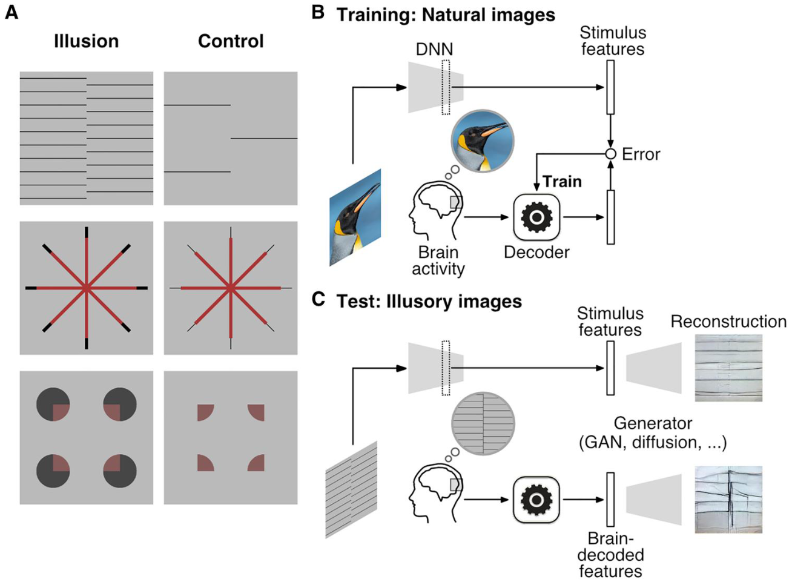
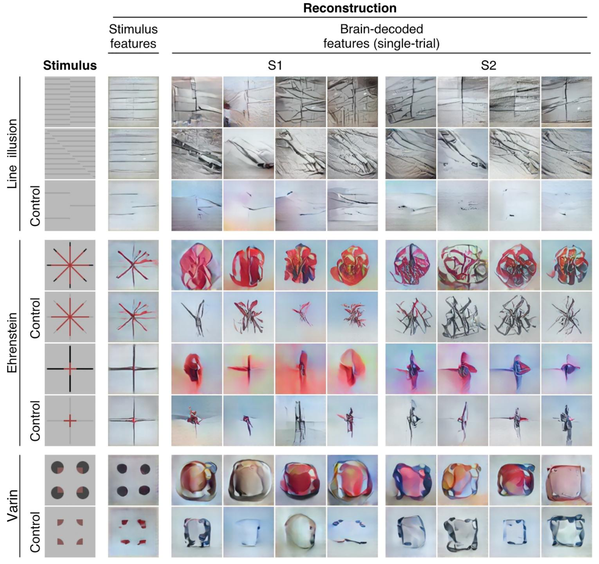
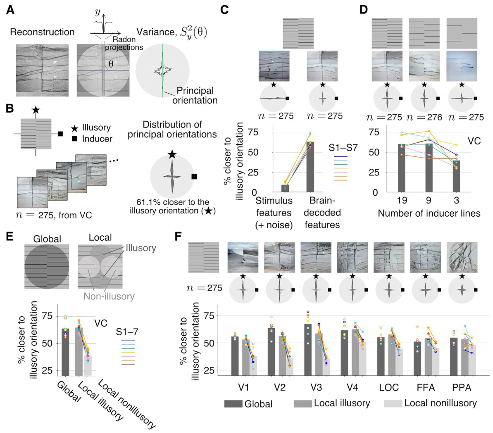
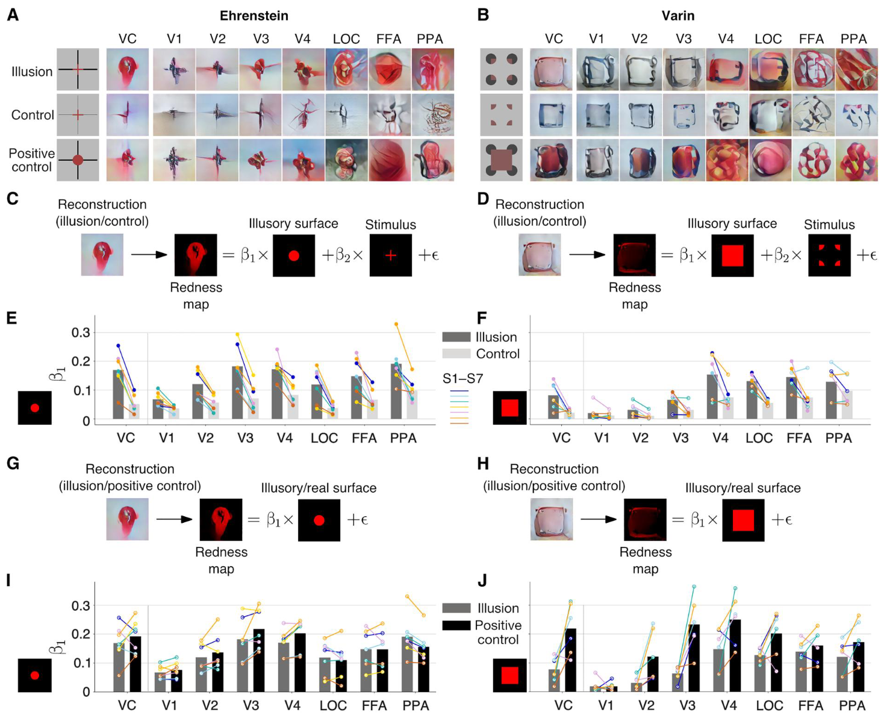

## 文献信息

- **标题 :** [Reconstructing visual illusory experiences from human brain activity](https://www.science.org/doi/10.1126/sciadv.adj3906)
- **期刊 :** SCIENCE ADVANCES
- **作者 :** Fan L. Cheng et.al
- **DOI :** 10.1126/sciadv.adj3906
- **类型：** RESEARCH ARTICLE
- **来源：** AGI&意识科学每周速递 | 2023年11月第三期

## 目的

错觉已被用来理解大脑如何创建世界的内部表征，但视觉皮层区域的群体活动如何转化为幻觉体验的方式是空白的 $\to$ 文章想利用神经解码（DNN，准确说是生成模型）测试视错觉感知（具体是感知到不存在的边界、虹色扩散现象），希望研究框架提供一种具象化主观体验的范式，去揭示大脑对世界的内部表征。

## 背景

在视觉皮层的单个神经元水平上，一些神经元对真实和虚幻的属性表现出相似的反应，表明存在共同的神经生物学处理机制。更广范围下，某些视觉区域的差异性大脑活动与幻觉的感知相关，并且可以根据幻觉体验的差异对大脑活动模式进行分类。

## 方法

假设幻觉刺激会产生与反映视觉处理特定阶段幻觉的重建幻觉刺激引起类似的大脑活动。

illusory lines 和 neon color spreading 分别代表线条和颜色幻觉，具体可见下图A。错觉线由位移光栅产生，共计用了六种。霓虹色扩散指人类感觉颜色扩散到实际刺激区域之外，产生半透明颜色的感知，文章使用了两个版本的设置，可见A的中下两个。

DNN 特征解码器训练自观看 3200 张自然图像的fMRI扫描，图B中提取自然图像特征的前馈卷积预训练自ImageNet（模型是CaffeNet），在C图测试中，幻觉图像和对照交错呈现（每个测试图像以 0.625 Hz 的频率闪烁 8 秒，并在 20 次试验中重复），前馈卷积提取的特征和fMRI解码的特征都送到预训练生成模型进行重建。

## 结果

### Main

**研究首先确认重建pipeline不会凭空产生与幻觉一致的线条或颜色**，下图 Stimulus features 表示从DNN模型提取特征重建的图像，表明即使存在噪声，只使用原刺激提取特征重建不会表现出幻觉成分。 $\to$ 推断说使用的重建模型本身是按照真实感知的编码规则来重建的

- Brain-decoded features 是从大脑活动解码重建的结果，重建包含幻觉成分，重建图像的幻觉线往往比实际刺激更突出，在对照组没有观察到明显的幻觉成分。
- 而在霓虹色彩扩散 Ehrenstein 设置中，相比使用线宽控制抑制错觉感知的对照组，错视图幻觉成分表现出更大的色彩范围。 
- Varin 配置对照图像旨在抑制颜色扩散，但不抑制轮廓或形状分量，幻觉和对照条件的重建显示出类似轮廓的强度分布，但色彩扩散在虚幻配置中更为明显。

### 对跨多个大脑区域的幻觉线进行定量分析

用Radon变换检测了每个单次实验重建中最明显的线的方向，计算线在每个方向穿过图像中心的Radon投影，如下图A所示将具有最大方差的方向定义为重建的主要方向。B中展示了大脑重建图像中具有幻觉线和实际线的双峰分布。

为匹配每个被试（S1-S7）的特征，对DNN提取特征添加了噪声。在下图C中可见刺激特征主方向分布在实际线周围，与大脑解码特征中的双峰分布不同。 $\to$ 进一步验证重建的幻觉线源自大脑活动，而不是分析框架本身

D中体现的实际诱导线减少后，幻觉感知削弱的现象和先前的研究吻合。E中尝试局部分析，除了全局还有预计会看到幻觉线的区域和预计仅出现诱导线的区域，预计仅出现诱导线区域的主方向向量明显降低。

F中展示使用各区域重建的示例，V1 至 V3 倾向于忠实重建幻觉线和诱导线。 V4 和更高的视觉区域较少重建出局部幻觉线，诱导线重建效果很差。$\to$ **结论：** 幻觉线的局部表征是早期视觉区域形成的

### 幻觉颜色的定量分析

- 较低的视觉区域描述的红色区域范围更准确，Ehrenstein 中对照即使颜色区域和幻觉刺激等大，重建中也基本不显示红色，阳性对照表现和幻觉刺激类似。Varin 中仅在中高区域与阳性对照相似，V1至V3几乎不存在颜色。

为了量化颜色扩散，按照C\D所示的方式对像素颜色值进行回归分析，E\F 展示了幻觉成分在不同脑区的权值。G-J表示和阳性对照的回归分析，量化”幻觉这块是红的“的内部表示和”实际上这块是红“的内部表示之间的差。

## 创新点

- 很巧妙，真的很巧妙的通过条件对比来旁敲侧击的研究幻觉，但我又觉得很难迁移到其他更复杂的问题上

## 不足

- 模型使用的技术太陈旧了，用的CaffeNet（我不理解），导致模型的解码和生成器的能力均不足，特别是GAN和Diffusion。技术陈旧这个问题在我们”ask why“的研究中并不是严重的问题，实际上无伤大雅还因为“经典”便于理解和传播，但生成模型的直观结果直接取决于模型性能。

## 启发

我的观感从一开始看到这么糙的重建图，想着重建方法不可靠但是能发sci.adv真是吃香啊，到读懂俩图明白他们的设计和结果后，认为确实是称得上摘要里 ”提供一种具象化主观体验的范式，去揭示大脑对世界的内部表征“ 。

我很喜欢，或许以后可以尝试思考这方面的设计。

## 其他

- [胡拉八扯之 Radon 变换， 断层影像重建](https://www.changhai.org/forum/collection_article_load.php?aid=1186744842)
- [Radon 变换](https://zhuanlan.zhihu.com/p/79722768)