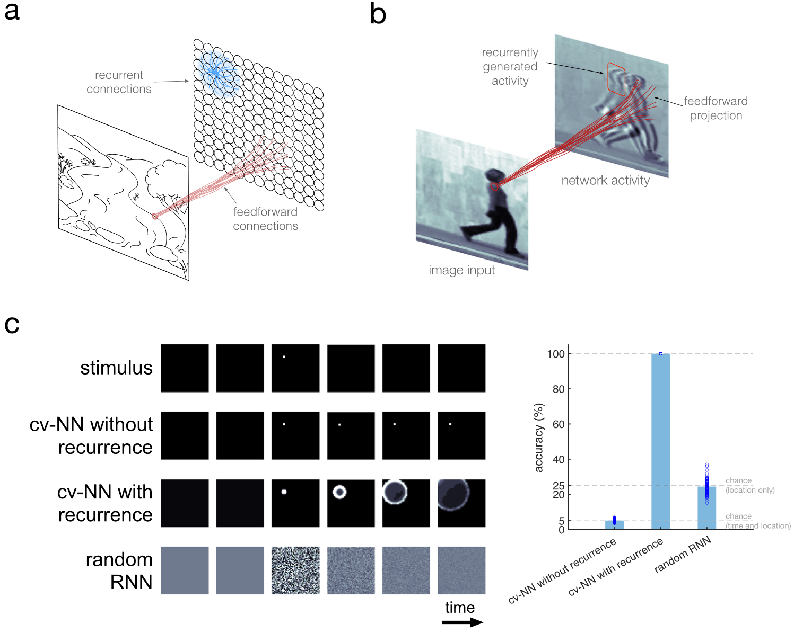
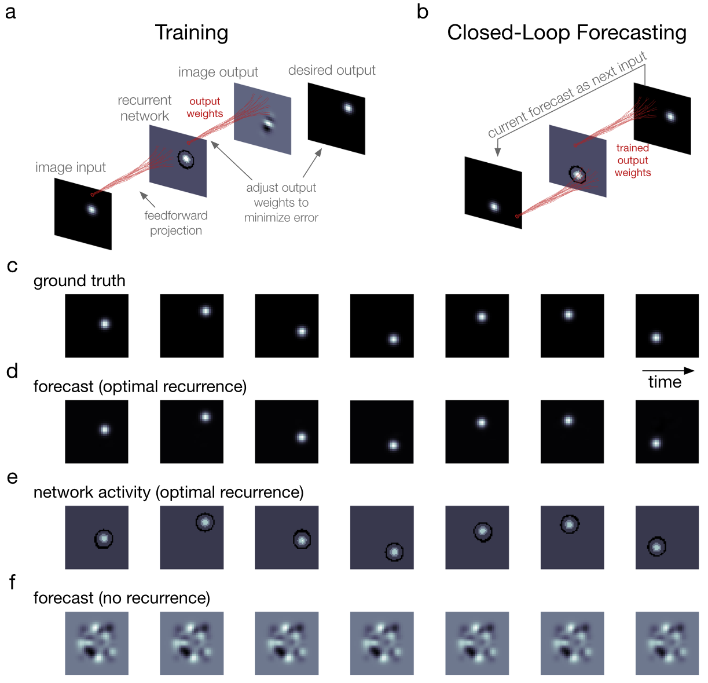
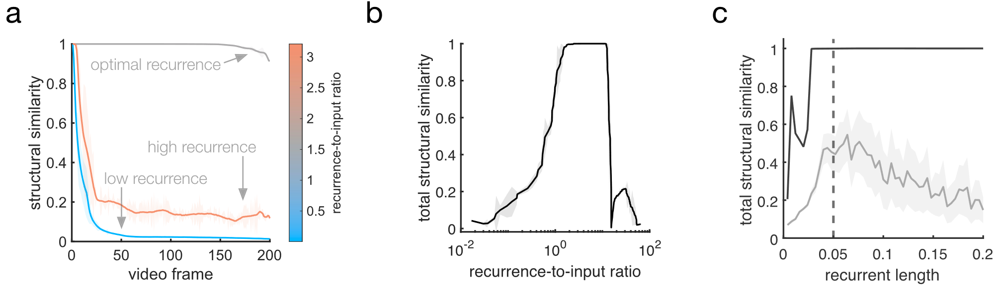
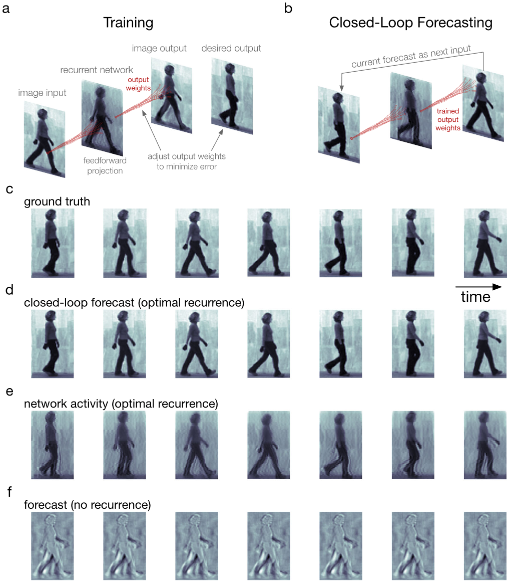
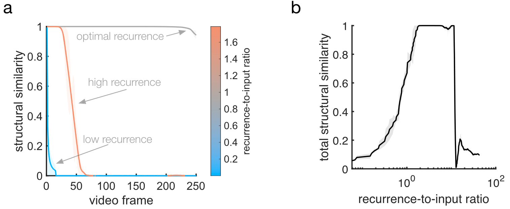
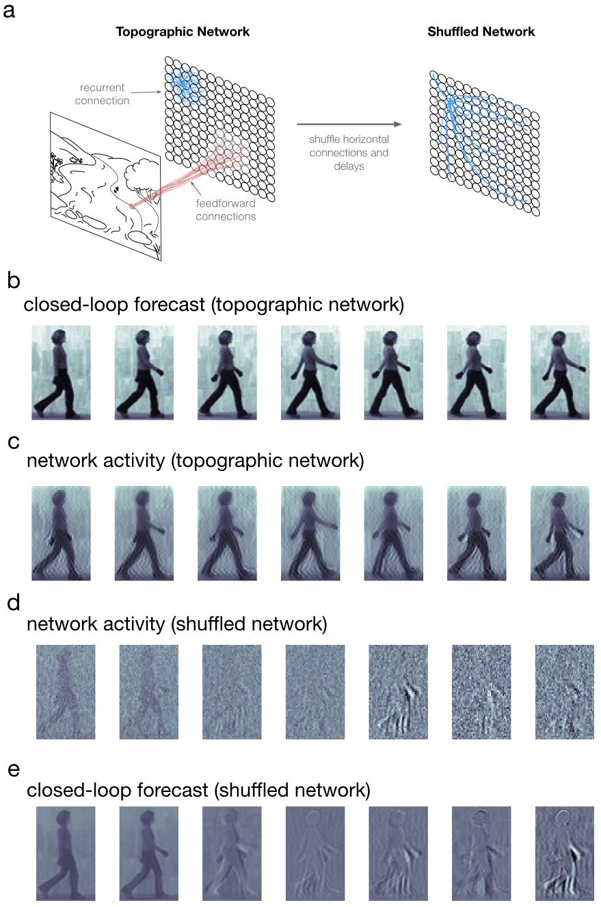
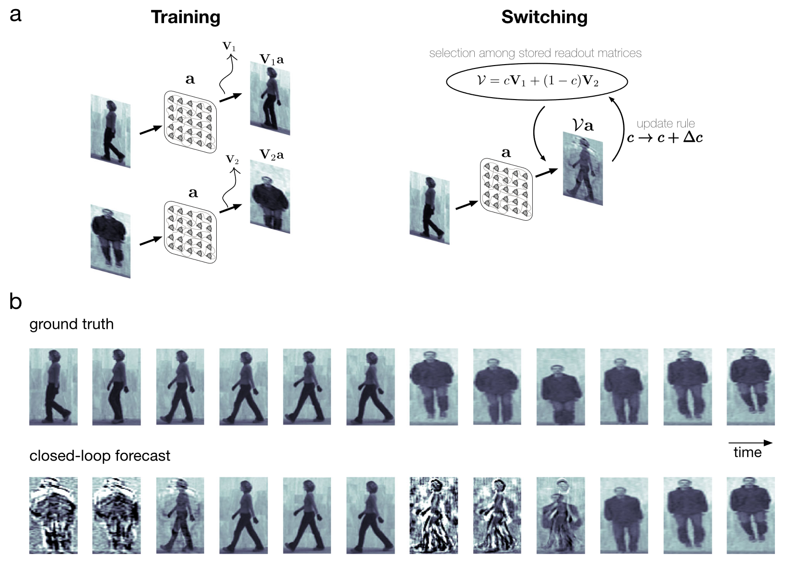

## 文献信息

- **标题 :** [Waves traveling over a map of visual space can ignite short-term predictions of sensory input](https://doi.org/10.1038/s41467-023-39076-2)
- **期刊 :** Nature Communications
- **作者 :** Gabriel B. Benigno et.al
- **DOI :** 10.1038/s41467-023-39076-2
- **类型：** RESEARCH ARTICLE
- **来源：** 集智斑图文献速递

## 目的

**已知：** 清醒动物的整个视觉皮层都有神经活动波，行波调节局部网络的兴奋性和感知灵敏度，但这种时空模式在视觉系统中计算的作用不清楚 
$\to$ **假设：** 行波赋予视觉系统预测复杂和自然输入的能力 
$\to$ **DONE** 提出一个预测视频的网络模型，训练后视频的几个输入帧会触发复杂的波形模式，仅通过网络连接就可以预测未来的一些帧，当驱动波的循环连接随机后行波和预测能力都会被消除 
$\to$ **推断：** 行波可能通过在空间map上嵌入连续的时空结构，在视觉系统中发挥重要作用

## 背景

视觉系统模型主要关注FF和FB（前向和反向），虽然强度强，视觉皮层神经元接收的突触中只有 5% 通过FF（传递来自眼睛的感觉输入），但来自皮质区域的水平连接占总输入突触数量的 80%,这里面95%都来自局部（2mm内）。上述导致的结果是，模型层中的神经元被建模为非交互的”特征检测器“，即对视觉输入中的特征具有固定的选择性。

最近对大规模记录的分析表明，水平连接深刻的塑造了皮层的时空动态。由水平连接驱动的行波一开始在麻醉动物的视觉皮层中观察到，最近发现在清醒、行为正常状态下的灵长类动物中平稳的穿过整个皮层，这些行波传播时稀疏的调节发放活动，改变了兴奋/抑制平衡。 $\to$ **推断：** 皮质神经元可以通过水平连接生成的行波在视网膜map上广泛地共享视觉场景的信息。

## 方法

为了研究行波可以完成哪些计算， 做了一个复值神经网络（complex-valued NN 缩写 cv-NN），每个节点的活动由一个复数表示，网络状态由复数向量描述，cv-NN 已被证明在许多监督学习中表现近似或更好，也能有效解释生物神经动力学。

文章修改了标准的FF架构，引入水平循环连接。但当前将水平的循环连接并到卷积网络中的方法严重限制了循环活动的时间窗口，以及会增大训练难度。文章引入了一种数学方法来理解复值模型中的循环动态。

## 结果

#### 行波可以在空间图上同时编码刺激位置和发生时间

用了一个简单的示例表明神经活动的行波在有序的视网膜拓扑图上传播时，即使刺激不再存在，也可以同时编码刺激位置和起始时间。

> **Fig.1** 拓扑循环网络模型通过对内部波编码视频的时空信息。
> a. 蓝色表示局部循环连接，红色表示前馈连接
> b. 网络动态示意
> c. 组成拆分后对原刺激响应行为的对比，右侧图是网络状态给一个线性分类器预测时间和刺激位置，无重复网络无法超过机会水平预测，随机RNN能预测时间但不能预测位置。

#### 行波有助于预测输入

cv-NN 可以可靠且高效地训练来预测电影输入中的下一帧。这里的预测可以反馈回去作为输入，允许网络递归式的生成预测自己的内部权重，过程中不再接受外部输入，仅根据内部结构生成未来预测，被称为“闭环预测（CLF）”。之前开发的CLF可以在10帧数量级精确执行，预测帧会越来越模糊，但该工作中在单个电影上训练的cv-NN可以达到25-100帧的敏锐预测 $\to$  cv-NN 是用于整个视觉场景闭环预测的有效模型，仅使用几千个循环连接的节点即可为每帧几千像素的电影生成准确的预测

> **Fig.2** 网络可以预测简单视频输入未来的许多帧
> a-b. 读出层权重训练自当前网络状态和要预测的下一帧，一旦读出层训练结束，就进行闭环预测。为测试从训练数据学习时空过程的效果，在该步骤去掉了 ground truth 输入。
> c-f. 依次是真实数据输入、最佳性能递归网络生成的闭环预测、最佳预测网络的活动情况（显示了激活相位的余弦值）、无循环的闭环预测。

该系统闭环预测能力取决于两个关键因素：
- 水平循环强度和前馈输入强度的比率
- 循环的空间范围

采用结构相似性指数（SSIM）测量闭环预测性能，SSIM阈值由原始版本与噪声损坏版本之间比较确定的。

> **Fig.3** 图二任务的预测性能取决于循环连接的属性
> a. 预测帧和实际数据之间的SSIM和视频帧之间的函数，曲线被移动平均滤波器平滑过
> b. 总体SSUN与循环输入比率的函数，当循环强度与输入强度大致平衡时，性能最佳。
> c. 总体SSUN与循环长度的函数，循环长度指高斯连接核一个标准差跨越的网络边长。

Weizmann 人类动作数据集中的视频作为输入，训练了线性读出权重后，测试输入前半部分闭环预测后半部分的能力

也进行了和移动凹凸示例一致的测试，结果也一致。

接下来作者研究了连接拓扑和距离相关的时间延迟的作用，在网络的所有其他架构特征保持不变的情况下，不产生 nTW 的随机连接的 cv-NN 无法使用之前成功的相同过程进行训练来执行 CLF。此外将传导速度降低一半然后重新训练也会导致性能大幅下降（从 0.99 到 0.08）。

这些结果可以总结为，cv-NN 中水平循环连接生成的复杂时空模式能够实现复杂自然电影输入的下一帧预测和闭环预测任务。

#### nTW网络模型能够预测多部电影而无需重新训练

cv-NN 的输出权重在各个电影上进行训练并存储在矩阵中，当执行闭环预测时，这个扩展的网络模型可以从之前学习的集合中接收新的输入，然后在几帧内快速切换到闭环预测新的电影输入，而无需对各个输出矩阵中的权重进行重新训练。

$\to$ 可以推广到具有多个不断变化的输入流的视觉条件

## 优点

- 验证了假设 **行波赋予视觉系统预测复杂和自然输入的能力**

## 缺点

- 实验采用的训练测试数据集太简单，像MNIST之类的玩具例子

## 启发

做神经联结主义的工作，应该广泛关注神经科学领域里新发现的现象，比如在此之前我并不知道视觉皮层会有水平行波，这个水平行波又和海马节律有什么关系？