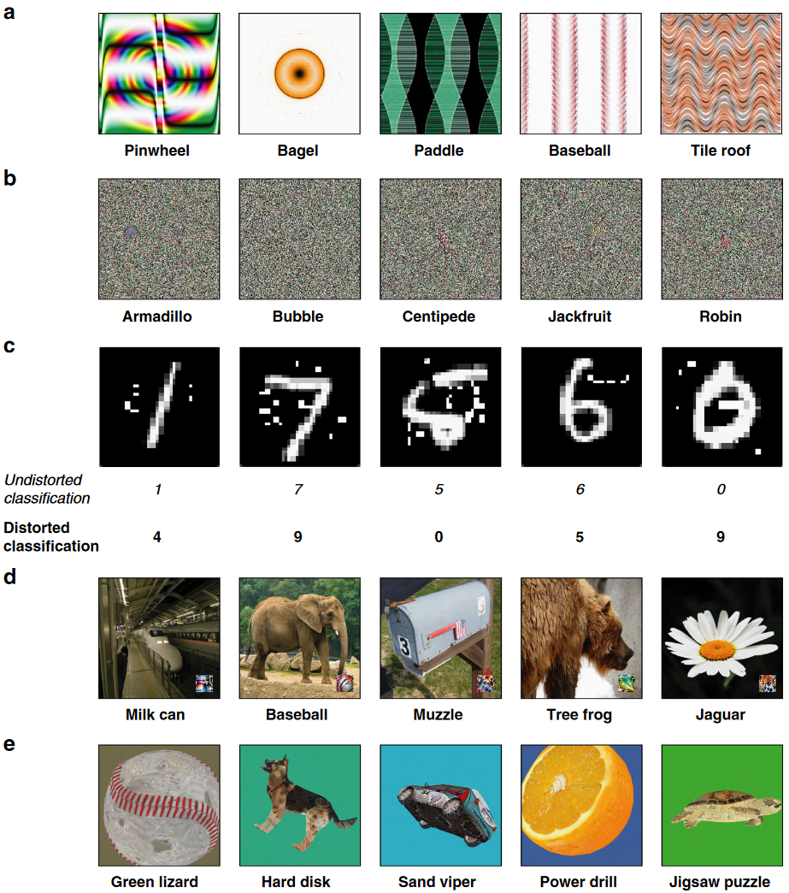
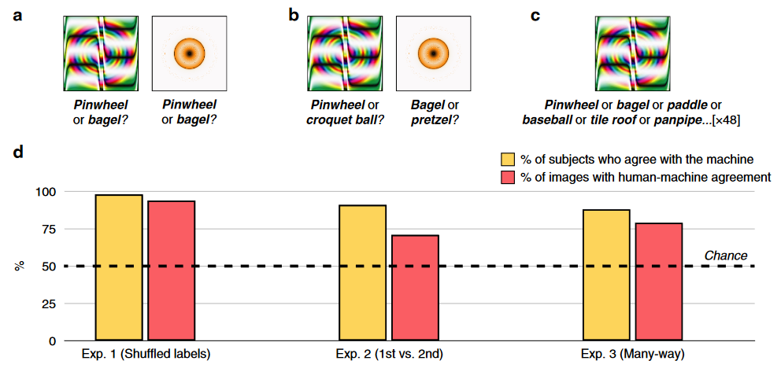
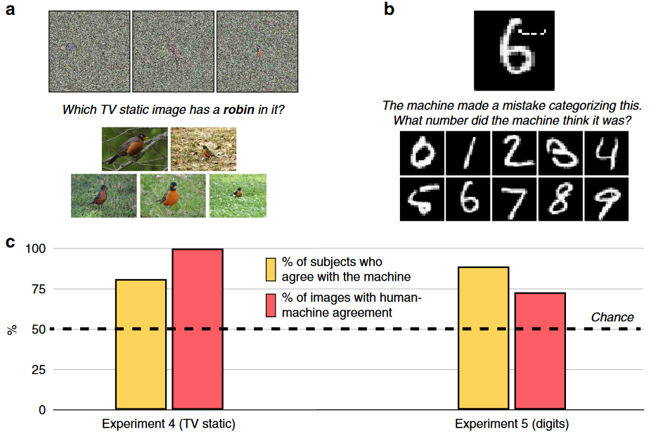
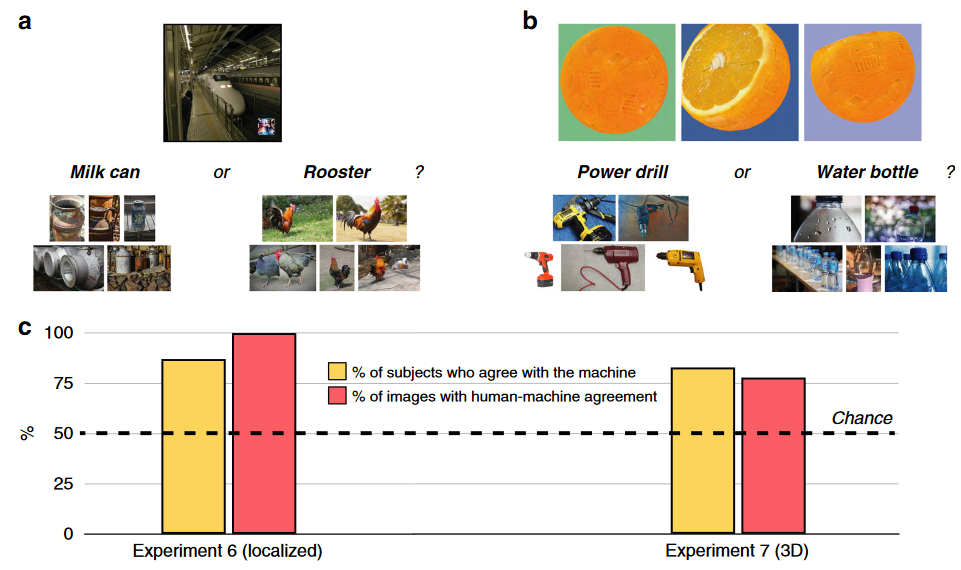

## 文献信息

- **标题 :** [Humans can decipher adversarial images](https://doi.org/10.1038/s41467-019-08931-6)
- **期刊 :** Nature Communications
- **作者 :** Zhenglong Zhou & Chaz Firestone
- **DOI :** 10.1038/s41467-019-08931-6
- **类型：** RESEARCH ARTICLE
- **来源：** 偶然发现

## 目的

CNN 会被对抗性样本愚弄，但在这些对抗性样本上人类和机器的判断是否存在根本差异？ 
$\to$ 对抗性样本有趣的一个原因是**直觉假设**：人类不会像机器那样对图像进行分类，尽管经常断言对抗性图像人眼完全无法识别，但很少有工作做行为学测试验证该假设
$\to$ 文章在针对 5 个多样化的对抗性图像集的 8 项实验中, 证明了人类和机器对对抗性图像的分类是紧密相关的。

## 背景

对抗性图像有两类可以粗略的称为 “fooling” 和 “perturbed” ，愚弄图像是无意义的模式被AI分类为熟悉的对象，扰动图像是通常可以准确且直接分类的图像仅被轻微扰动就错分。

> 对抗性图像示例
> a. 间接编码的 “fooling” 图像
> b. 直接编码的 “fooling” 图像
> c. 受干扰的对抗性图像
> d. 噪声局限在右下角，LaVAN 攻击
> e. 鲁棒对抗图像，多个视点错分类的3D渲染对象

引入了一个 “machine-theory-of-mind” 任务，询问被试是否可以推断出机器视觉系统给给定图像的分类，即：人类可以通过预测机器的首选标签来破译此类图像吗？

## 方法 & 结果

在每次试验中，受试者 (N = 200) 都会看到一张生成的对抗样本，显示在CNN生成的标签和从其他样本随机抽取的标签上方，被试选他们认为是机器给该图像生成的标签。

- 1. 这两张样本的标签和在一起做为选项，从上图B中结果可知，人类观察者强烈偏好机器选择的标签。98% 的观察者以高于偶然的概率选择了机器的标签，普遍同意机器的选择，94% 的图像显示出较高概率的人机一致。
$\to$ 初步表明人类被试能广泛的区分出CNN将对抗样本分类到特定类别物体所依据的特征

- 2. 考虑到该能力可能是更浅薄的共性导致，对比了排第二的选择，让被试在1st和2nd进行选择（比如图中的黄色圆斑的俩label是百吉饼和椒盐卷饼），人机一致性低于实验 1，但人类也可以将1st和2nd分开。
$\to$ CNN的第二选择对被试也具有一定直观性

- 3. 扩展到这48个标签之间的对比，88% 的受试者以高于机会水平选择了机器中rank更高的标签，79% 的图像显示出人机一致性
$\to$ 即使是繁重的任务，人类也表现出与机器的总体一致性

  - 如果人类被试任务只是直接对被要求预测的图像进行分类，还会和CNN的分类一致吗？ 被试看到一张图片并从48个label里选一个，90% 的受试者以高于机会水平的方式同意机器，81% 的图像显示出高于于机会水平的人机一致性。

- 4. Television-static 图像，上述实验的图像至少有离散可区分的特征，这里探讨的是那些被认为“人眼完全无法识别”。如上图 a 所示，会在八张图片（这里显示三张）下方给出要选择的类别及对应的五张示例，被试要选择与标签最匹配的 Television-static 图像。

    81% 的观察者以高于概率的比例同意机器，并且 100% 的图像显示出高于概率的人机一致性；对于 75% 的图像，受试者最常选择的标签也是机器置信度最高的选择，如果将人类群体判断视为计算 softmax 的投票，那么类似的人类也会对对抗性样本产生”高置信度“的错误判断。

仅扰动一小部分像素将原本分类为“4”的图像变为分类为“7”，在引入失真后人类被试仍坚持原本的分类，生成此类图像的原始研究给出的结论是：“人类无法感知制作对抗样本时引入的扰动”。如果这里的实验不允许给被试一个最初印象，那被试会对干扰样本选哪个数字？

- 5. 扰动数字收集自导致 LeNet 改变原始分类的100个对抗性扭曲数字，在上图b中问被试认为机器将这个图像感知成了哪个数字。89% 的受试者以高于概率的概率识别出机器的分类，73% 的图像显示出高于概率的人机一致性。
$\to$ 尽管人类很容易认出图像的原本身份，但人类也可以预见机器的错误分类。

- 6. 用局部对抗攻击生成的图像测试被试（22 个导致 CNN 错误分类的此类图像），实验要求迫选（见上图a）。在这种高级对抗性攻击。 87% 的受试者以高于概率的概率识别出机器的分类，并且 100% 的图像显示出高于概率的人机一致性
$\to$ 即使是很复杂的对抗性攻击也会被人类破译

- 7. 如上图b，如仅因为表面上某些模糊的纹理元素，橙子的3D模型被机器识别为电钻、黄瓜甚至导弹。每次实验中被试看到对抗对象的三个不同视角的渲染图像。83% 的受试者以高于概率的概率识别出机器的分类，78% 的图像显示出高于概率的人机一致性。

可能部分在于对抗性示例确实与它们被误认为的图像共享核心视觉特征

## 优点/创新

- 探讨了之前一直默认为真的**直觉假设**

## 不足

- 著名的熊猫到长臂猿，这样的分散微扰像素的方式没做出来上面这么显著的结果，作者没在正文放结果，将原因解释为：
  - 这种例子最不稳健，体现在经过小幅旋转或重缩放效应就会消失
  - 对人类不可见可能和物体分类等高级过程无关，是人类视觉敏锐度、分辨率和对比敏感度等低级生理限制导致
- 没有更深入的分析产生该结果的原因

## 启发

暂无