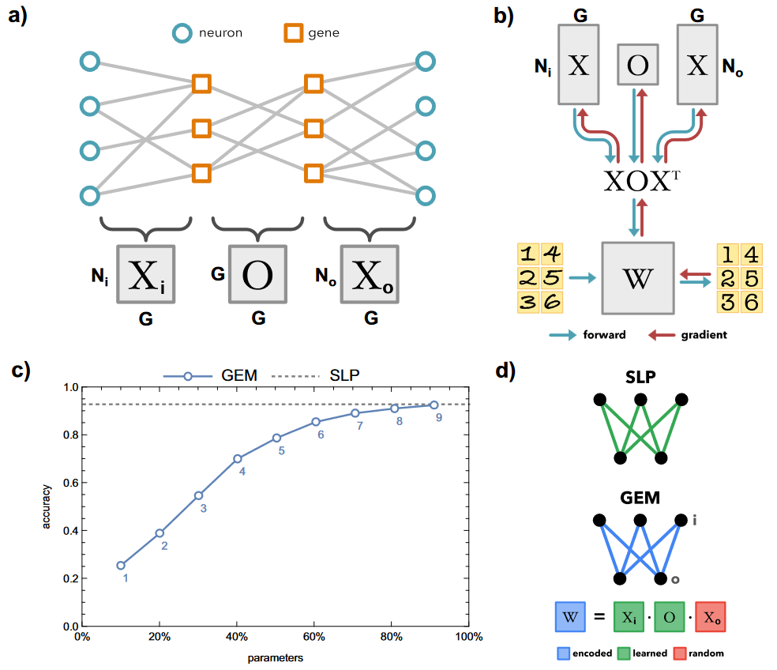
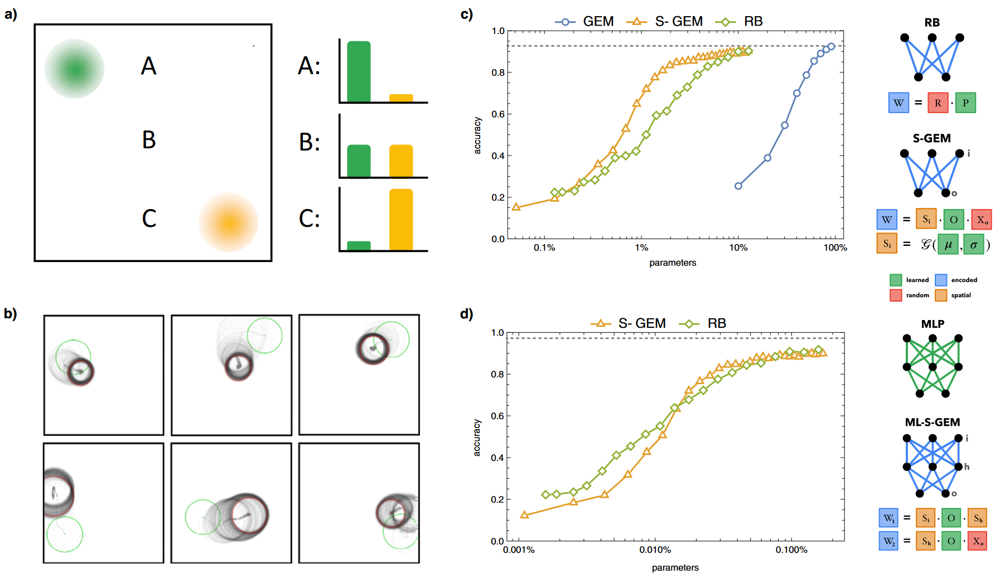
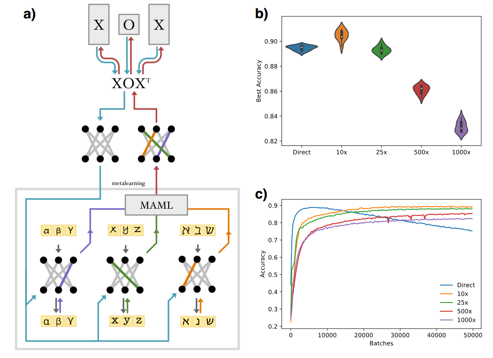

## 文献信息

- **标题 :** [Complex computation from developmental priors](https://doi.org/10.1038/s41467-023-37980-1)
- **期刊 :** Nature Communications
- **作者 :** Dániel L. Barabási et.al.
- **DOI :** 10.1038/s41467-023-37980-1
- **类型：** 综述
- **来源：** 集智

## 目的

机器学习模型长期忽略先天性，生存的强大压力会导致大脑产生复杂的行为编码

## 背景

## 方法

> Fig 1. 遗传神经进化模型
> a) 遗传连接组模型的可视化，矩阵 $X_i$ 和 $X_o$ 表示输入和输出神经元的基因表达，$O$ 表示神经元选择对应伙伴背后的遗传交互作用。 
> b) 在GEM架构中，权重根据预测和已知值的距离进行更新，架构是根据 XOX 定义的一小组接线规则生成的（向下的蓝箭头），更新会计算梯度来更新 XOX ，并在下一个训练步骤重新生成W。
> c) GEM 在 MNIST 任务上的平均性能，SLP指单层感知器
> d) 可视化表示，不学习 $X_o$ , 因为增加了参数且没提高任务性能

> a) 在给定空间GEM中，单元id由神经元与二维基因表达高斯分布的距离决定，如对于A神经元就具有高绿色基因表达，低黄色基因表达。
> b) 随着训练进行，基因表达分布的位置和离散度从开始（绿色）到结束（红色）
> c) 

## 结果

## 优点/创新

## 不足

## 启发
