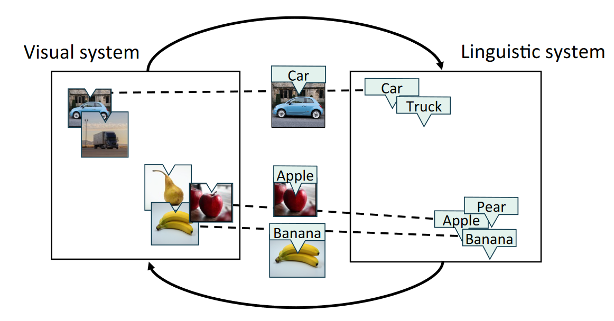
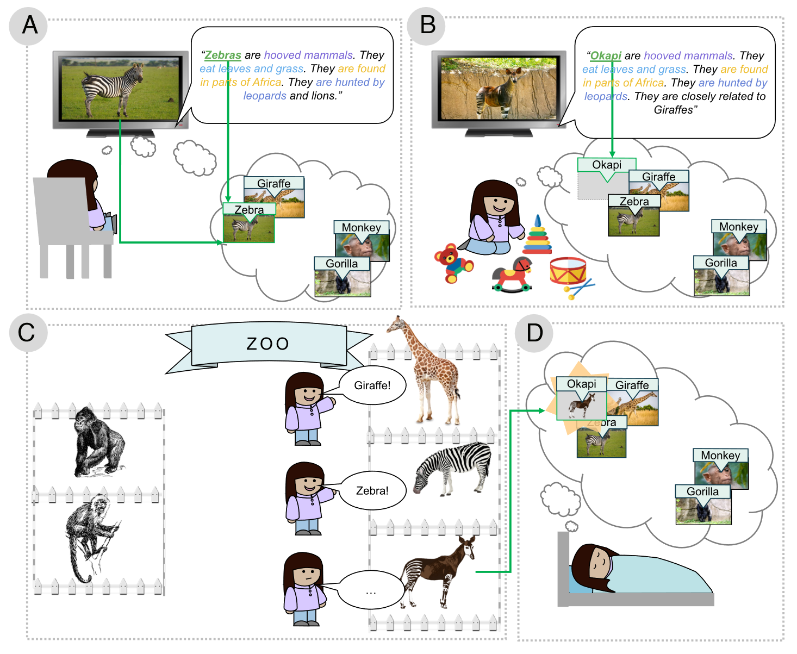
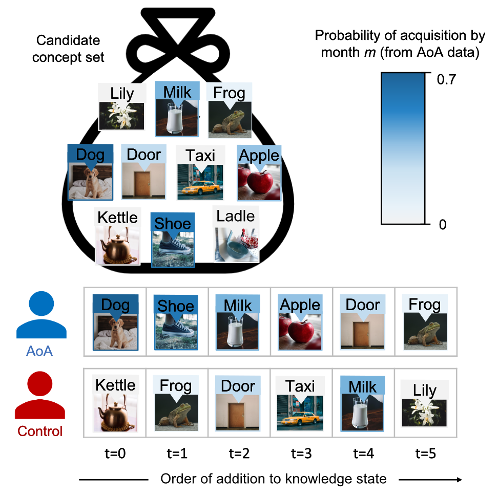
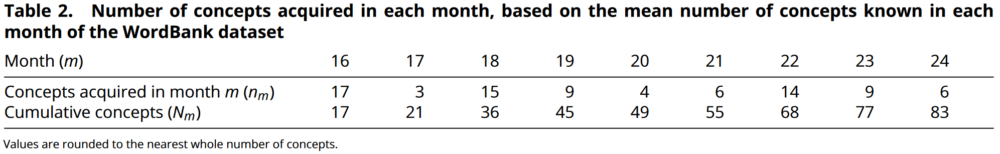
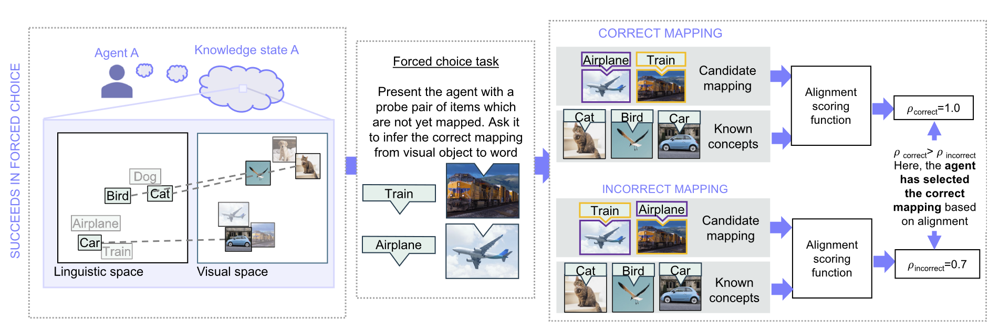
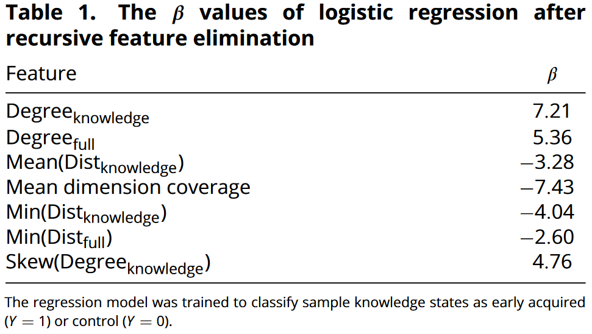
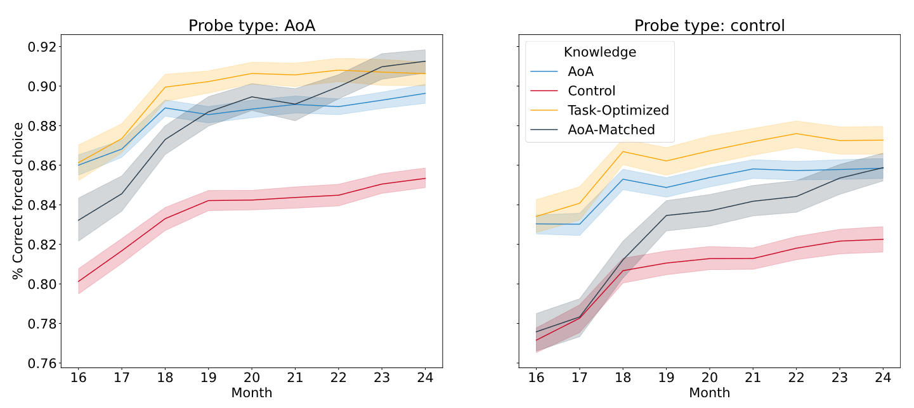

## 文献信息

- **标题 :** [Signatures of cross-modal alignment in children’s early concepts](https://doi.org/10.1073/pnas.2309688120)
- **期刊 :** PNAS
- **作者 :** Kaarina Aho et.al
- **DOI :** 10.1073/pnas.2309688120
- **类型：** 
- **来源：** 主动发现

## 目的

**假设：** 学习也可以通过系统对齐来进行，可以推断整个系统（例如视觉和语言系统）之间的映射。 $\to$ 由于跨系统的镜像相似性关系，视觉和语言系统可以在稍后的某个时间在没有任何输入的情况下进行对齐。
$\to$ **落点：** 考虑儿童的早期概念是否支持系统对齐 
$\to$ **结果：** 儿童的早期概念接近于推断新概念的最佳状态，使智能体能够在没有监督的情况下正确推断出 85% 以上的视觉-单词映射。

## 背景

学习几乎总是基于事件的，假设学习所需的所有信息都发生在狭窄的时间窗口内，那么儿童的监护者指着一只狗说“狗”是监督学习，儿童无意间听到两个成年人对话可能发生弱监督或半监督事件。但很多证据（文中第二段）支持儿童具有推断没有直接观察到的概念之间关系的能力，文章认为人类也会使用于基于事件的学习不同的学习模式，可以利用单个事件之外的信息来对齐系统（如发现视觉和语言系统之间的映射），将之称为系统对齐。

》 定义
- **系统:**  表征空间中对象之间的相似关系
- **系统对齐:** 利用对象跨多个系统的对应表示的相似关系来执行跨系统映射。
  与之前的多模态学习之间的一个关键区别是系统对齐可以是异步的，并且可以稍后在没有任何输入的情况下进行对齐。
  系统对齐背后的认知逻辑是，共享相似视觉上下文的对象（如汽车和卡车）也往往共享相似的语言上下文。
- **概念:** 跨系统的正确映射
- **知识（knowledge state）:** 已知概念的集合
 

> 通过系统对齐推断视觉-文字映射，系统之间的虚线代表已知的视觉-单词映射。

对齐的异步性质可能有助于解释标签如何指涉映射学习，在自然环境中安装在儿童头上的摄像获得的记录表明，视觉对象和对应标签同时体验很少见，经常语言标签指向不在场的对象，或是视觉对象给过命名。

一些概念的先验知识可以引导系统对齐，已知概念的集合越大，就越容易推断出新知识，系统对齐可能有助于解释为什么儿童在掌握大约 50 个单词后词汇量会迅速扩大。

在关键问题的递进上：
- [x] 1. 首先要问的是自然环境中存在的信息是否可以支持跨模式学习的系统调整？ $\to$ **早期证据** 语言和视觉系统捕获的信息存在冗余 $+$ （Roads and Love）证明当源自环境的系统对齐时，镜像相似性结构（他们称之为对齐分数）高于其他（不正确的）系统之间的映射
- [x] 2. 人类在学习时是否参与系统调整？ $\to$ 成年人在没有提示的情况下确实会在学习任务中调整系统，任务本来可以通过基于事件的监督学习解决，表明可对齐系统是更容易学习的系统（？）
- [ ] 3. 本文想解决，儿童可以使用系统对齐来学习单词的含义吗？

> 系统对齐如何支持儿童通过日常经历异步学习的示意图。
> A： 通过监督学习，斑马同时进入视觉和语言的系统中，拥有正确映射所以添加到知识状态中
> B： 她背对电视玩玩具，但仍可以听到“Okapi”，和斑马的描述非常相似，这导致“Okapi”在语言空间上的定位与“斑马”接近
> C： 参观了动物园。根据以前的经验她可以给长颈鹿和斑马贴上标签，在附近的围栏里看到一种未知的动物，它与长颈鹿和斑马在视觉上很相似
> D： 在某个异步的时刻，她可能推断出动物园里的未知动物是“Okapi”，这个可以通过系统对齐来实现

文章测试了如下假设：儿童的早期概念系统特别适合通过系统对齐来促进学习

## 结果

- 基于儿童 Age-of-Acquistion（AoA 条件）构建知识状态的智能体在使用系统对齐来推断视觉和语言系统之间的映射方面比对照智能体表现得更好。

> （Age-of-Acquistion）AoA 知识状态模拟过程示例，蓝色表示概念在m月时儿童的习得概率。
> 将六个概念添加到每个智能体的知识状态中，AoA智能体从人类儿童获取概念的数据中按顺序添加到知识状态中，而对照智能体从所有概念中随机抽取。

年龄 $m\in$ 16-24个月，$n_m$ 是该月从 Age-of-Acquistion 数据中获取预期概念的数量。每个月都会通过强制选择范式进行系统对齐来学习新概念的能力评估智能体，任务是为新单词或视觉对象推断正确的对应对象。

> 用于评估智能体的强制选择任务的示意图
> 左侧显示评估之前系统的知识状态，灰色文字/图像表示经历过，但没有跨系统映射。
> 中间显示的是一个强制选择任务的示例，智能体被要求推断两个视觉对象哪个是“飞机”，哪个是“火车”
> 右侧显示智能体如何尝试推理，智能体使用对齐评分函数获得测试对象每个候选对象的对齐评分，选择最高对齐评分的决策。

结果如下图所示，蓝色（AoA）/ 红色（对照）, 仅使用少数的已知概念。
- 1. 两个智能体在强制选择任务中的推理准确率就超过80% $\to$ 推测孩子应该像智能体一样可以使用新对象和已知概念的相似关系来对齐系统（例如视觉和文字）来正确标记对象。
- 2. AoA 比对照更有效 $\to$ 尝试量化分析哪些特征区分了AoA知识状态和对照，特征结构是根据知识空间嵌入的概念间相似关系和近邻图导出的，仅当概念间距离低于所有距离前10%时才保留这个边。用递归特征消除来识别在划分早期获得的知识集时最具诊断性(区分AoA和对照)的特征，见下表。
    > ii.
    

    回归分析表明AoA中概念的邻域很密集，而密集邻域特征更适合做系统对齐。短程概念间的关系稳定性可以解释为什么儿童在早期生活中会获得许多邻居语义的概念。

- 3. 如果认为智能体确实是使用这些结构特征进行对齐，即具有这些结构特征的概念能更好的进行系统对齐，那么反过来推断，嵌入空间的属性会影响哪些概念更容易通过系统对齐获得 $\to$ 用两个智能体优化了上面确定的结构特征的一组目标值（x）和一组特征权重（w），能得到每个候选概念与目标特征值的加权距离，这个分布能描述知识库每个候选概念被选择的概率，会在训练结束后冻结，然后在计算出的生成分布中采样生成概念获取轨迹。
    
    AoA-Matched 智能体（训练以生成模仿儿童早期概念的知识状态，使生成的分布和从 AoA 获取概念的概率最相似）和任务优化智能体（最大限度地提高强制选择任务的性能），所以它们间的差别只在于损失函数。
    
    - 采样轨迹表明，解决方案的空间大于根据AoA智能体建模观察到的空间，不完全依赖AoA,但任务优化智能体选择AoA概念的频率显著高于对照（随机），选择 AoA 概念的比例随着学习的进行而下降。
    - 两类智能体在选择概念时具有不同的优先级，任务优化智能体优先学习在整个系统中有许多近邻的概念，AoA-matched 智能体优先获取与现有知识状态中其他概念平均距离较低且有很多近邻的概念。AoA 匹配智能体在类别间的分布与 AoA 智能体相似，而任务优化智能体倾向于关注较少的语义类别。

## 方法

不做，暂略

## 优缺

该方向的文章看的少，暂时总结不出来，我觉得文章实验设计和切入的角度很巧妙，文章写作的清晰易懂。

## 启发/借鉴

- 主要是知识上的，了解了除基于事件的学习还存在系统对齐，而系统对齐因为其异步特性本质上与多模态不相同