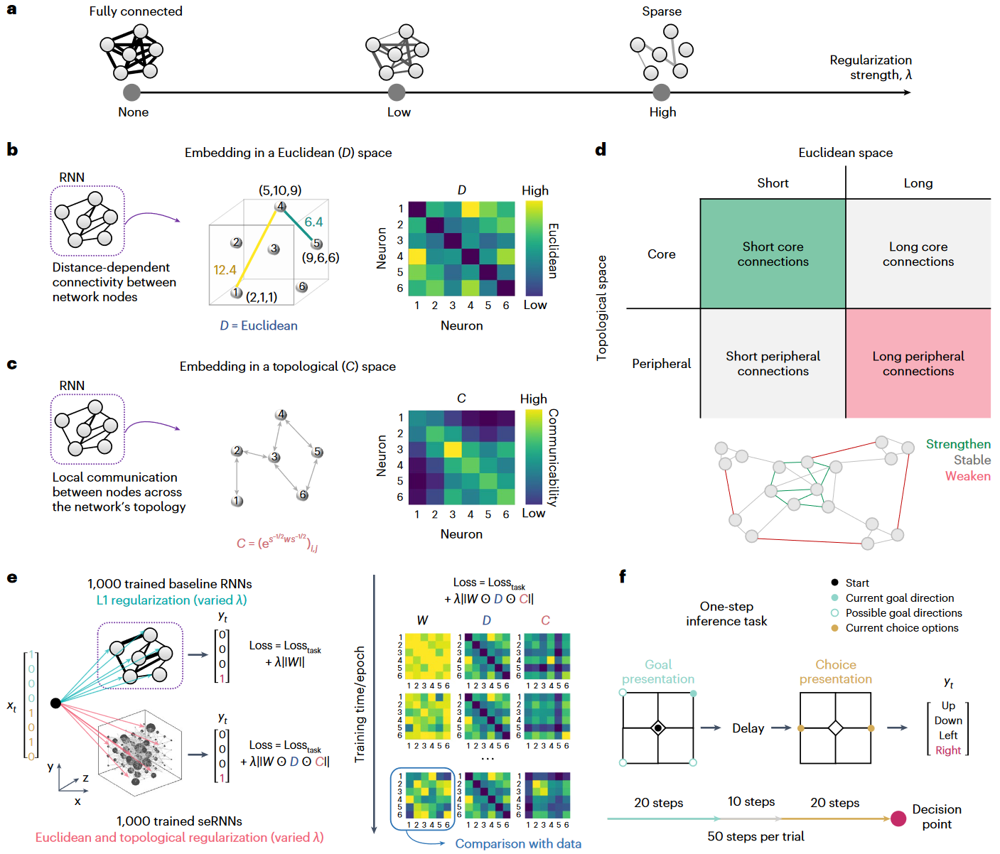
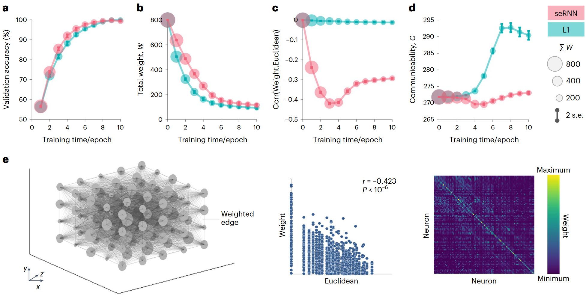
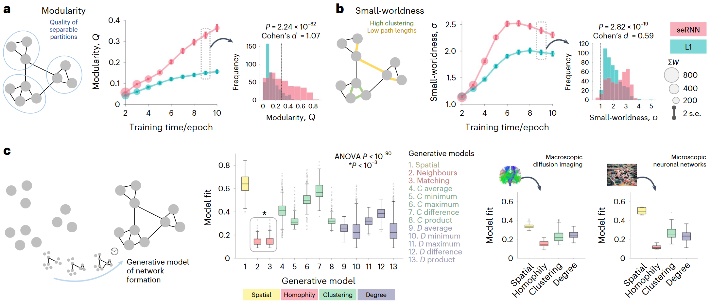
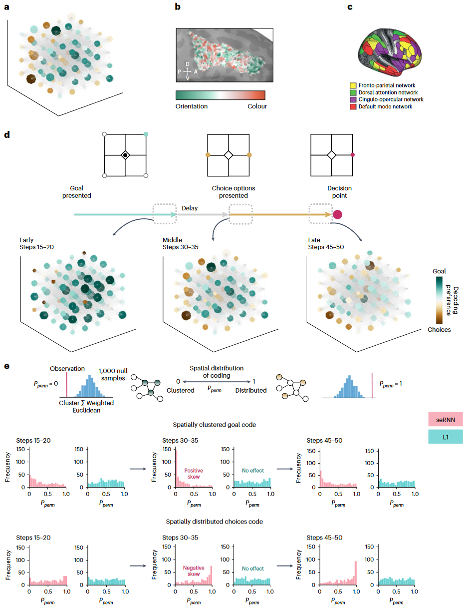
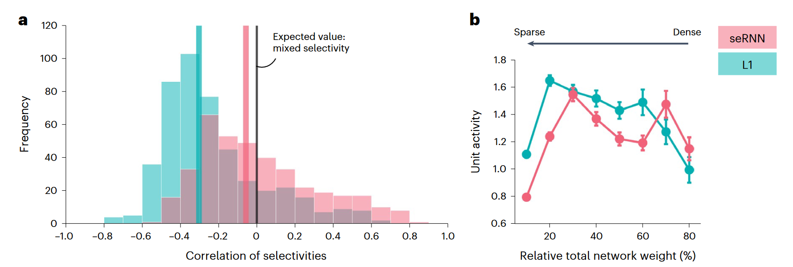
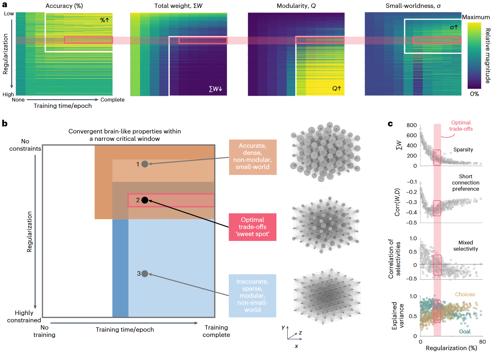

## 文献信息

- **标题 :** [Spatially embedded recurrent neural networks reveal widespread links between structural and functional neuroscience findings](https://doi.org/10.1038/s42256-023-00748-9)
- **期刊 :** nature machine intellige
- **作者 :** Jascha Achterberg et.al.
- **DOI :** 10.1038/s42256-023-00748-9
- **类型：** 神经连接主义文章
- **来源：** 主动发现 | 集智 | 神经连接主义文章

## 目的

**假设：** 大脑网络受物理空间、维持网络代谢成本、同时实现所需信息处理的约束 
$\to$ 为了观察这些过程的效果，引入了空间嵌入递归神经网络（seRNN）

## 背景

所有大脑网络都必须克服代谢成本，以在物理空间中生长和维持网络，同时优化该网络以进行信息处理。这种权衡塑造了跨物种的所有大脑，意味着可能许多大脑趋向于类似的组织解决方案。

大脑组织和网络功能的最基本特征——例如稀疏和小世界结构、功能模块化和特征神经元调整曲线——可能是由于这个基本的优化问题而出现的。

## 方法

> 任务结构和seRNN
> `a：`训练期间使用正则化以促进更小的网络权重，形成更稀疏的连接组
> `b：`在 5x5x4 的网格上分配单元位置，将RNN嵌入到欧几里得空间中，这展示了六个节点的示意图
> `c：`RNN嵌入到拓扑空间，引导修剪过程、加权实现高效的网络内通信
> `d: `网络会被激励去加强拓扑核心结构的短链接，并消弱外围的长连接
> `e：`训练了 1000 个L1正则化RNN作为基线，从八个单元的完全连接层接受任务输入，并输出为4个单元的值。下面红色1000 seRNN 将权重矩阵 W 乘以欧几里得距离 D 和加权通信 C，将其和 baseline 比较。 
> `f：`单步推理任务示例，先是20步周期训练，10步的延迟（需要记住）后提够二个选项让在20步内选择更接近目标的

seRNN 在三维欧几里德空间中学习基本的任务相关推理，其中组成神经元的通信受到稀疏连接组的限制。

任务要求网络开发循环网络的两种基本认知功能：记住任务信息（“目标”）并将其与新传入的信息（“选择”）集成，在共计2000个模型中选取准确率大于 90 的模型，seRNN 390个，L1 479个。

## 结果

- **有效性验证**

> seRNN 训练的有效性
> `a：`两类网络训练的验证准确性，表明在一步推理上实现相同的性能。 对于这一行图浅红色是seRNN，碧绿色是L1RNN，误差线对应两个标准差。
> `b: `两组网络都表现出消弱循环层权重的总体趋势
> `c：`由于独特的正则化,seRNN 训练过程中欧几里得距离和权重具有负相关性
> `d:` seRNN成功影响了网络的拓扑，具有更低的加权可通信值
> `e:` 在 3D 空间中训练的 seRNN 网络的示例（取自第九个epoch，后续可视化均是该示例），节点大小表示节点强度，中间的图展示的是连接权重和欧式距离的负相关关系，右侧是权重矩阵。

- **模块化、小世界化**

模块化表示模块内密集的连接，但模块间连接弱且稀疏；小世界表示所有节点对之间的平均路径长度较短，具有很高的局部聚类。

> seRNN 显示类似大脑的拓扑结构
> `a:`  L1 和 seRNN 网络在历次训练中网络的模块化程度不断增加，seRNN 的模块化程度更高。右侧选取的9epoch模型的模块化分布，统计差异很大。
> `b:`  seRNN中的小世界性比L1更强
> `c:`  对于一系列生成网络模型，拟合seRNN的最佳性能，模型拟合越低表示拟合的越好，拟合网络的一些图论指标与已发表的青少年全脑扩散 MRI 结构连接和单细胞分辨率的高密度功能神经元网络的数据一致。

发现同质布线规则（神经元优先与连接配置文件自相似的其他神经元形成连接）相对于所有其他布线规则，在近似 seRNN 拓扑方面表现最佳

- **功能相关的单元在 seRNN 中进行空间组织**

在大脑网络中，对刺激的响应相似的神经元往往会在空间上分组。为测试 seRNN 是否概括了功能共定位，文章解码了每次试验过程中目标位置或选择选项可以解释多少单位活动的方差

通过对每个单元的目标与选择的相对偏好，测试了对刺激的敏感性是否集中在网络的某些部分。文章使用空间排列测试来测试高度选择性神经元之间的欧几里德距离是否显着小于或大于偶然预期，小的值强调功能相似的神经元往往在空间中显着聚集。

> 功能聚类和空间编码分布
> `a: `节点颜色与神经元解码偏好有关，绿色表示对目标信息的偏好（记住），选择用棕色表示
> `b:` 人类前额皮质中优先调整方向或颜色的体素的空间聚类
> `c：` 展示功能网络
> `d:` 实验中不同steps时单元的解码偏好
> `e: `空间排列测试的示意图。分别计算具有记忆、选择偏好的单元之间（两类内）的欧几里得距离总和，并按照偏好大小进行加权，对于每个加权距离统计量分别计算实际预期距离的零分布（通过随机抽取1000个与两类单元数量相同的样本来计算的），$P_{perm}$ 与统计量在零分布上的位置相关，每个网络都会有一个 $P_{perm}$ 值，向零的偏斜表明网络代码比零分布更加聚集，而向 1 的偏斜则突出了更加分布式。

🌟 目标信息记忆表现为聚集的，而选择信息被证明是分布式的。

- **节能**

> 混合选择性和能量效率
> `a: ` 目标（记住）解释方差与选择解释方差之间的相关性，seRNN的分布比L1更集中在预期值 0 范围
> `b: ` seRNN 网络在单元激活上花费的能量比 L1 网络少，计算的信息整合期间（选择开始后）网络循环层中每个单元的平均激活。

L1 更多反相关，而 seRNN 具有更多混合选择性，在选择时维持混合选择性代码可能有助于下游集成单元更轻松地解码信息，而传达正确选择所需的单元激活更少。

- **约束导致类脑结构和功能相关联**

思路：这些特征不是在seRNN中并行出现的，想研究seRNN中大脑特征的共现。

测试了所有 seRNN 特征是否共同出现在由训练参数的独特组合定义的训练网络的相似子集中，结果见下图。

> seRNN 参数空间收敛于类脑拓扑和功能
> a： 白色边框表示在参数空间中符合要求的范围，分别是准确性、稀疏连接、模块化网络、小世界性，粉红色边框表示可以同时找到这些的参数空间。
> b: 粉色框中生成了准确的、稀疏的、模块化的小世界网络，称其为最佳权衡。网络1、2、3分别代表整个空间的示例网络。
> c: 粉红色窗口中，网络是稀疏的（顶部），更喜欢短连接（中间顶部），具有以零为中心的变量选择性的相关性，与混合选择性一致（中间底部），并且对于目标和目标都具有等效的解释方差选择（下）

结果表明，存在一个关键参数窗口，其中大脑结构特征和功能特征在 seRNN 中共同出现。

## 优点/创新

- 优秀的神经连接主义文章，提供了独特的优化视角
- seRNN 揭示了常见的结构和功能紧密地交织在一起，并且可以归因于基本的生物优化过程。 seRNN 将生物物理约束纳入一个完全人工的系统中，可以作为结构和功能研究社区之间的桥梁，推动神经科学的理解向前发展。

## 不足

- 神经元群体规模太小，并且非常像能更新连接权重的储备池计算，模型上没啥亮点，但是足够说明问题。

## 启发

- 简化的示例设计，值得我学习。
- 参数空间搜索，并用多个约束提取共现模型的思路很好。
- 两阶段的任务，验证我的假设时可能有借鉴之处。
