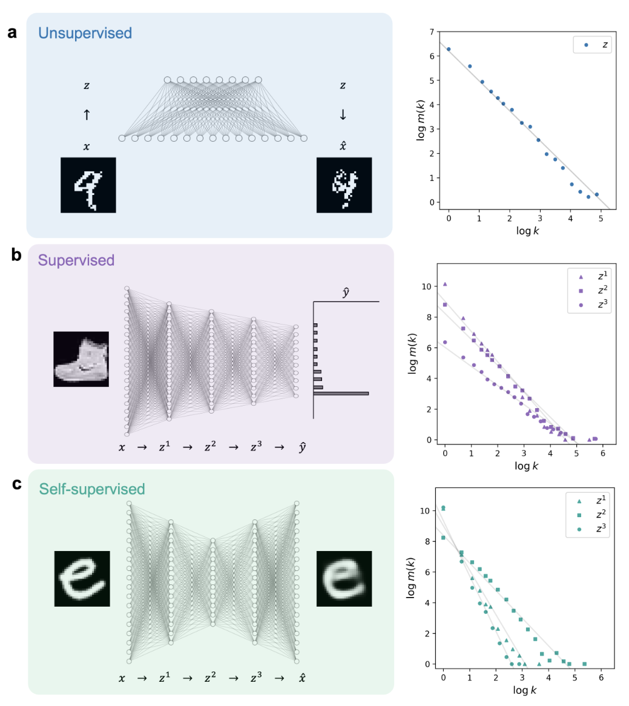
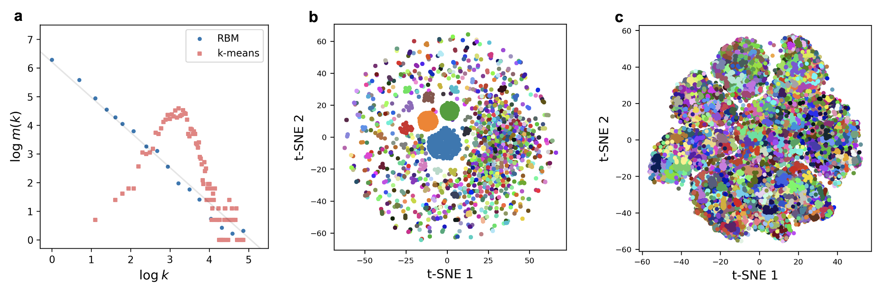
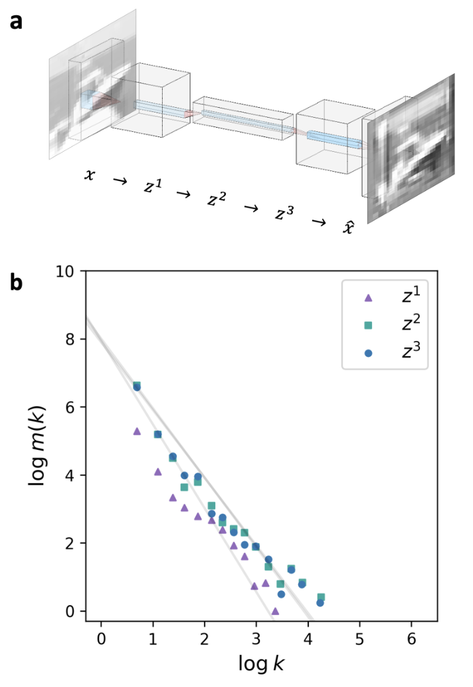
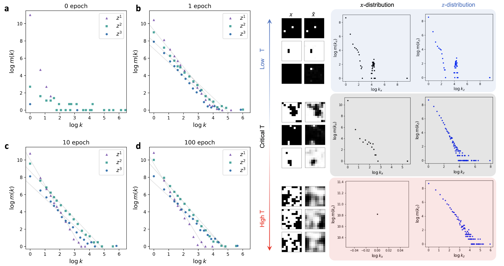
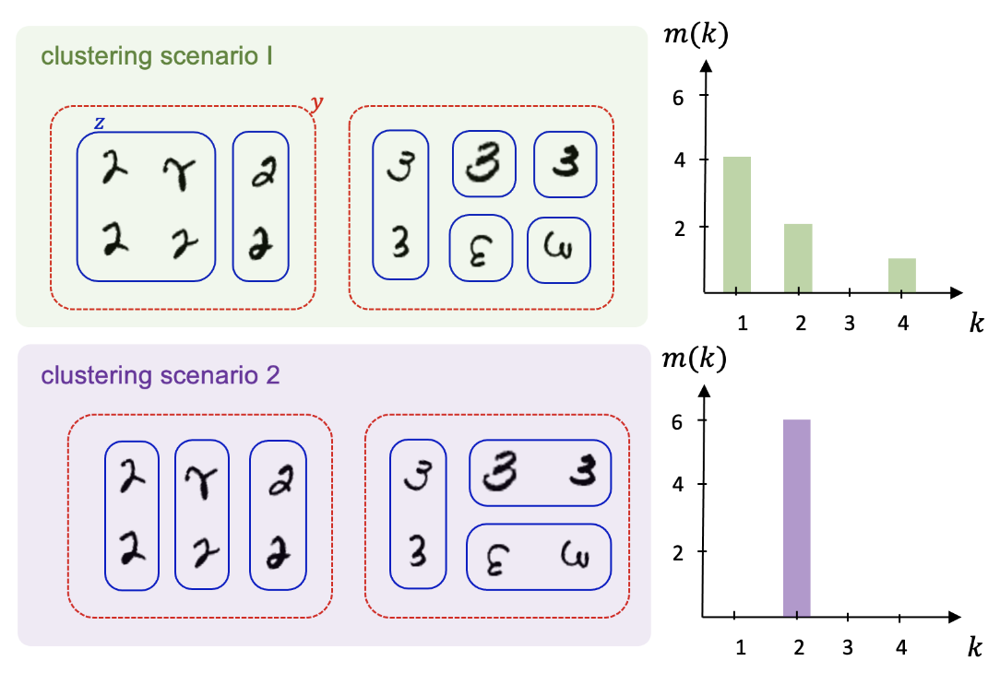

## 文献信息

- **标题 :** [Scale-invariant representation of machine learning](https://journals.aps.org/pre/abstract/10.1103/PhysRevE.105.044306)
- **期刊 :** Phys. Rev. E
- **时间 :**  2022
- **作者 :** Sungyeop Lee and Junghyo Jo
- **DOI :** 10.1103/PhysRevE.105.044306
- **类型：** 
- **来源：** 引文发现

## 目的

**问题：** 理解神经网络模型有效特征蒸馏背后的机制

观察到在监督和无监督学习模型中，内部代码或标签的频率都遵循幂律，这种尺度不变的分布意味着机器学习很大程度压缩了频繁的典型数据，同时将许多非典型数据区分为异常值。这项研究推导了这些幂律在机器学习中自然产生的过程，根据信息论，尺度不变表示对应于给定学习精度下给可能表示中不确定性最大的数据分组。

## 背景

信息瓶颈理论将机器学习解释为通信理论所描述的信息压缩和传输，··· （自编码器那一套表述），内部表示 z 有时反应特征本身（图像识别中检测到的边缘），有时 z 可以被认为是一个虚拟编码，其频率仅在没有提供x先验知识的情况下才重要，最近的一项工作观察到 RBM 中的 z 频率遵循幂律。

如果使用虚拟编码 z 作为 x 演生的标签，z 的频率可以解释为由 z 标记的 x 的簇的大小，那么幂律意味着簇大小分布是尺度不变的。Song 等人的研究得出幂律聚类是RBM 中 z 在特定压缩水平下熵最大化的分布，本文扩展这一思想，簇大小幂律分布不仅在无监督学习（RBM）中自然出现，而且在监督学习中也自然出现。

## 方法&结果

### 有没有幂律

首先重现RBM中 z（随机离散变量） 频率遵循幂律，观察到监督学习/自监督学习也存在尺度不变的内部表示，见下图。（程序完整公开在 [Github](https://github.com/Sungyeop/Powerlaw_ML)）

> 右侧显示模型内部表示的简并性 m(k) 和频率之间对应的双对数图。

- 多层感知器里内部表示具有连续值，二值化到有限粗粒度计算内部表示的频率，幂律的存在对二值化阈值不敏感，并且幂律指数不依赖于学习的初始化。此外如果神经网络具有缩小的压缩结构，结论对于改变神经网络的架构深度和宽度是稳健的。
- 如果采用sigmoid函数，自编码器中的z可以解释为RBM中z的期望

计算特定z的频率 $k_z$, 允许将x的不同图像映射到相同的z

$$m(k) = \sum_z \delta(k-k_z)$$

> a: 经过RBM的内部表示z和k均值聚类后的数据簇分布大小分布
> b：t-SNE 可视化 z
> c: 对于不同的 k 均值簇，x 的 t-SNE 图具有不同的颜色。

RBM 的尺度不变分布可能会在将数据分类为频繁典型数据的大簇和作为异常值的许多非典型数据的小簇时产生功能优势。

:) CNN 的幂律有，但不如这三个显著

### 假设检验

考虑这些幂律是否源于学习过程，或者仅仅源于数据分布

> 左侧：学习过程中内部表示的频率分布。
> - 幂律鲁棒的出现显然需要一个学习过程，这排除了幂律可能由内部表示的随机二值化的人为因素产生的可能性。
> 
> 右侧：二维伊辛模型合成的无结构模式，输出x对应重构的模式，在三个温度下各生成50000个平衡样本。由于低温会产生简单的图案，因此低温样本中不可避免地会包含许多相同的 x 样本。将不同 Ising 模式输入到包含单个隐藏层的浅层自编码器进行自监督学习，最右侧是z的频数分布。
> - 幂律应取决于原始数据分布， （如当数据包括相同的样本时，相应的内部表示的分布受相同样本的频率的影响很小）需要丰富的表示。

## 推导

**假设：** 幂律对应于满足给定学习精度的可能分布中的熵最大化分布

> 机器学习集群大小的分布，上下是两个簇
> 红色虚线表示输出的分组，蓝色实线是压缩编码z表示，两种场景具有相同的学习精度，这里考虑哪个簇更有可能发生。簇之间的区别就是压缩表示z编码的输入数量

数学公式推导略，见原文。

## 优点

- 额外探索了其他基础模型/学习策略是否会产生幂律内部表示
- 提出假设，并做了公式推导

## 缺点

## 启发

- 在简单示例上实现了师兄想看的神经网络中的幂律，并且均是非动力学模型，提供了代码可以跟进。
- 频数呈幂律的内部表示必须经过学习过程    
- 程序实现是将经过激活函数的中间表示按照一个阈值（比如softmax是0.5）二值化，`np.unique` 对独特模式进行计数，并将计数的分布计数获得频数分布。