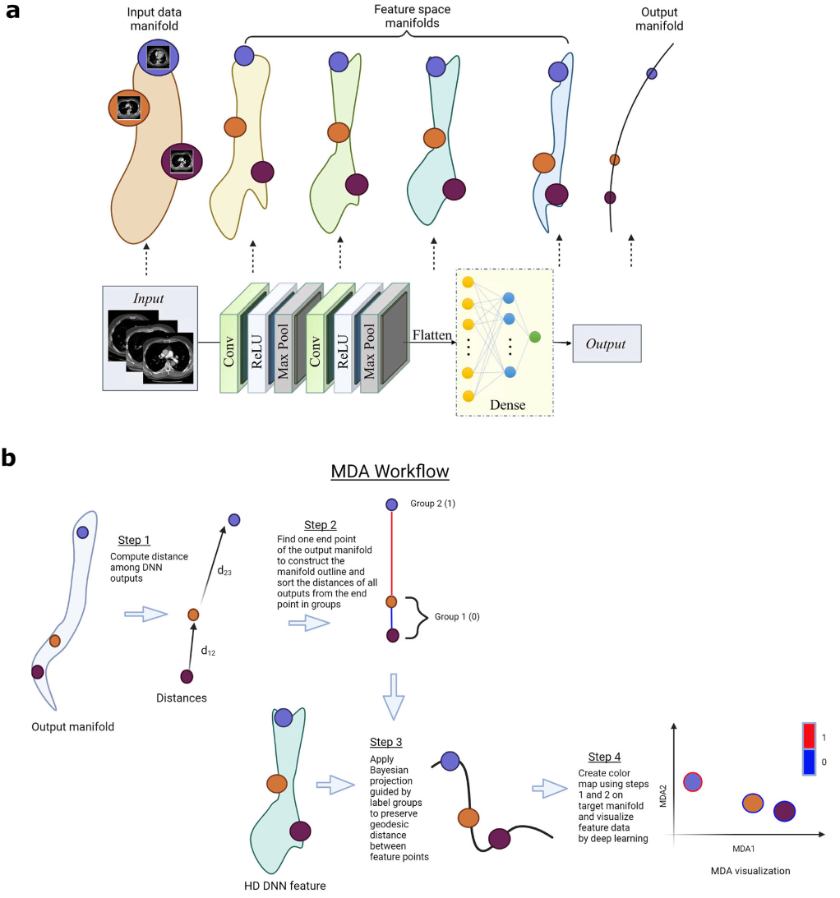
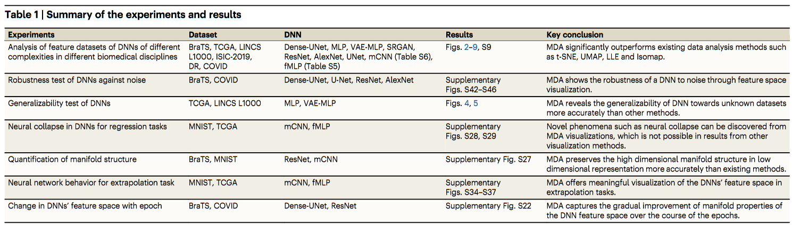
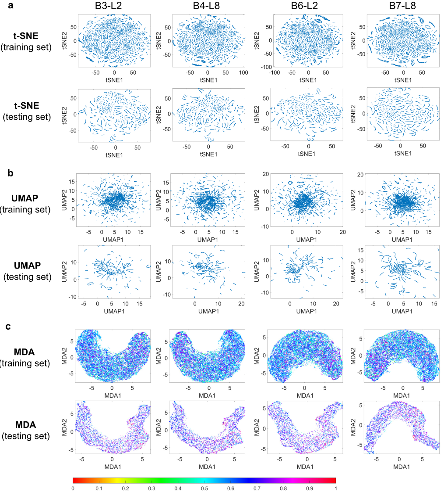
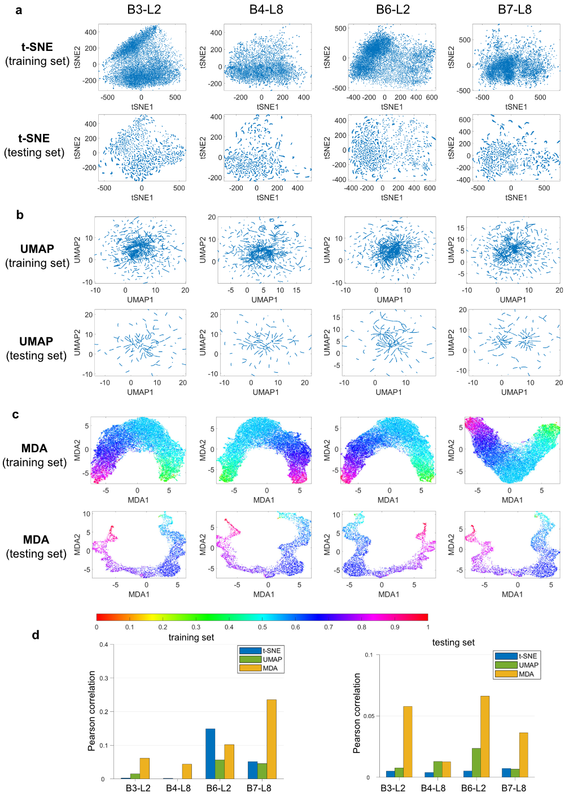
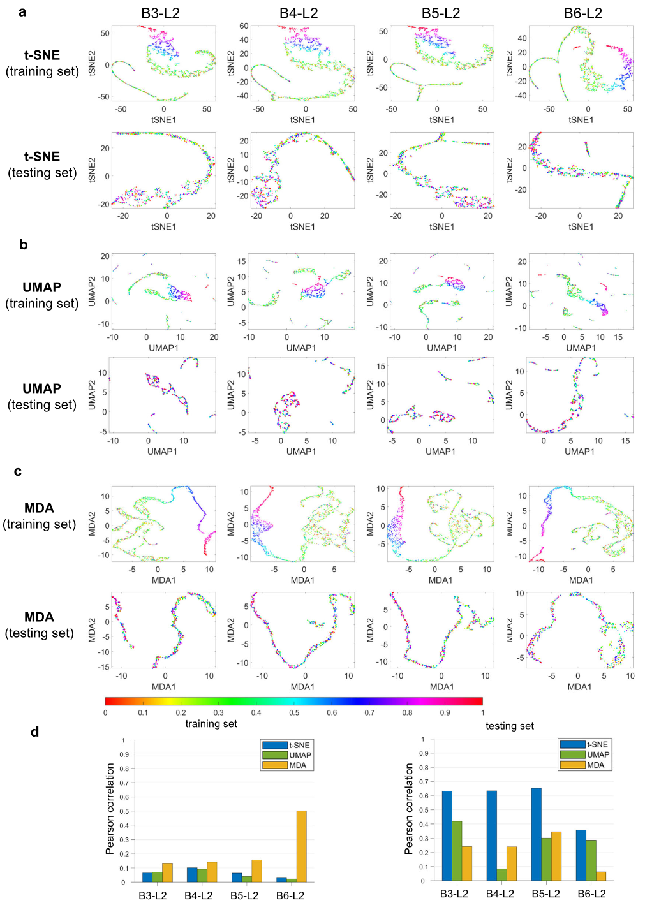
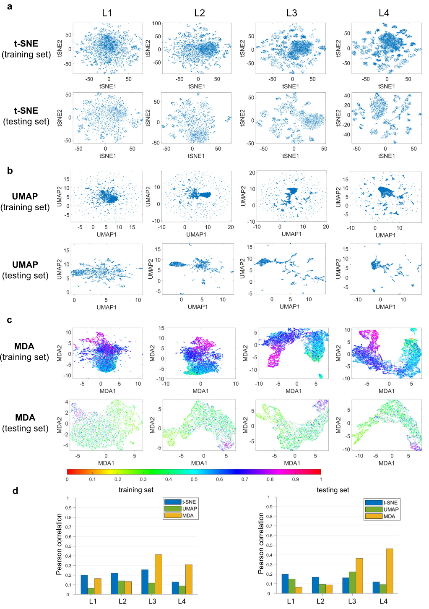
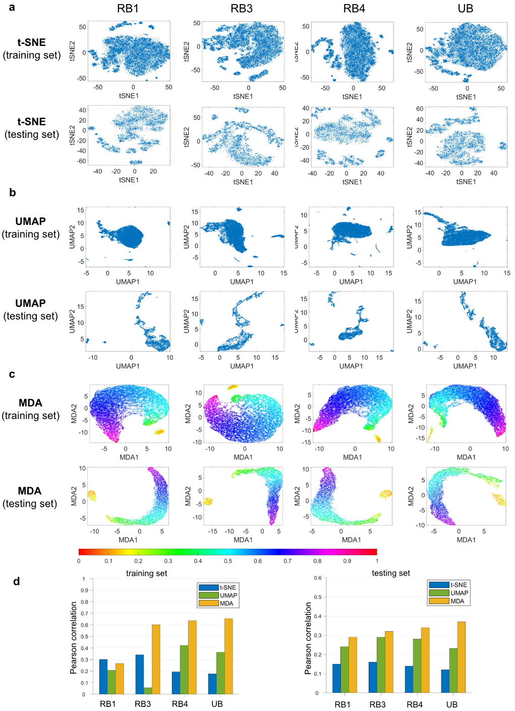
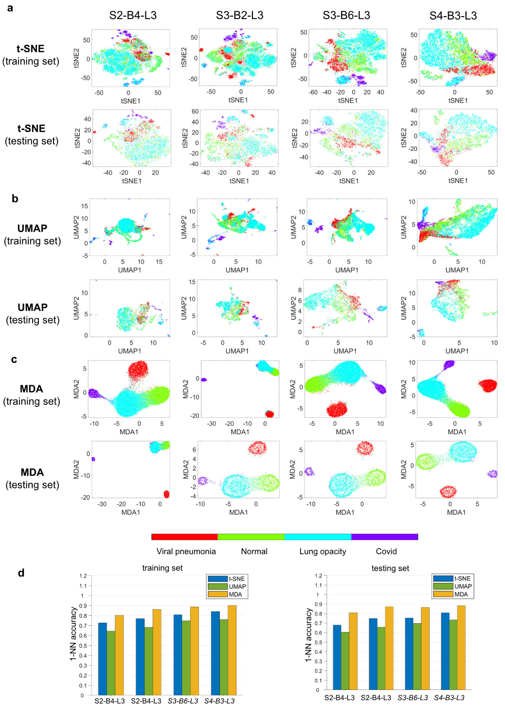
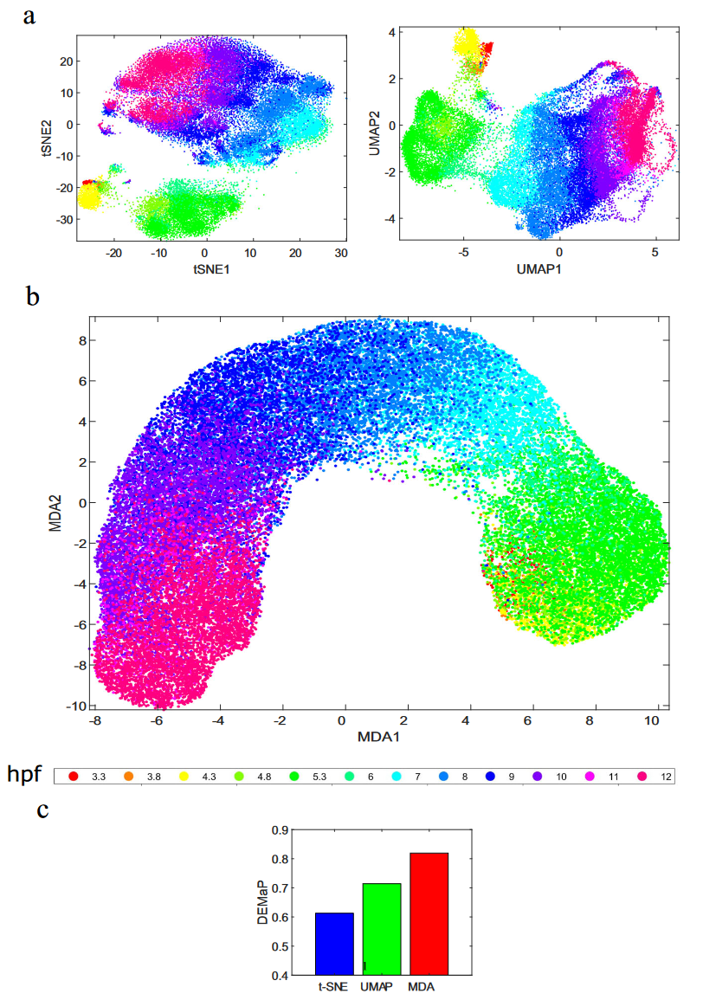
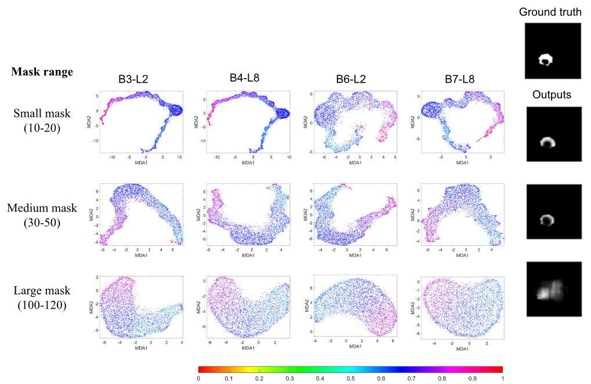

## 文献信息

- **标题 :** [Revealing hidden patterns in deep neural network feature space continuum via manifold learning](https://doi.org/10.1038/s41467-023-43958-w)
- **期刊 :** Nature Communications
- **时间 :**  2023
- **作者 :** Md Tauhidul Islam et.al.
- **DOI :** 10.1038/s41467-023-43958-w
- **类型：** 
- **来源：** 智源复杂系统专栏推送

## 目的

**问题：** 大部分深度学习应用都是面向回归任务的，回归问题中的特征在高维空间中形成连续体，但这些模型特征空间表示含物理意义的可视化尚未实现。
$\to$ **GAP：** 无论有监督/无监督，传统的降维或可视化技术均不适用于可视化回归DNN的特征空间数据，因为它们仅针对分类问题设计，这种情况下的嵌入仅需要一维离散标签和点之间的成对距离。
$\to$ 开发一个MDA框架用于DNN特征可视化

## 背景

训练过程中，DNN 学习将输入流形转换为类似于标签/目标流形的输出流形的函数，使深度学习成为流形映射问题。

- 为了实现有意义的特征嵌入，流形表明上的点之间的空间距离在将它们投影到低维度时保留。
- 由于DNN特征流形表面的复杂性，应使用测地距离来关联HD数据点，而不是成对距离。

做 MDA 的动机是在多层神经网络中，每层的权重和偏差创建一个子流形。随着网络变深，流形空间越来越类似于输出流形。而网络训练充分时输出流形会模仿目标流形。所以可视化与目标和输出流形相关的中间层的特征揭示了网络潜在特征的质量。

## 方法

> 流形学习实现DNN特征空间的可视化示例
> MDA方法计算的流程
> - 1. 计算DNN估计的标签之间的距离
> - 2. 构建标签的流形轮廓（提供根据距离对其分组的基础）
> - 3. 使用贝叶斯方法将HD特征点嵌入特定的DNN层，并受到排序标签的约束
> - 4. 采用深度学习将投影特征转化为低维进行可视化和分析

## 结果

下面是一些示例，用来表现MDA在可视化DNN特征方面的独特能力

### 分割任务

Dense-UNet 分割网络的特征空间，输入的是脑MRI图像，输出的是具有肿瘤分割的二值图像，

> 在训练之前对分割任务的 Dense-UNet 特征进行可视化，B3-L2表示第三个密集块的第二层，B4-L8表示第四个密集块的第八层，后面同理。颜色表示归一化流形距离（

> 训练之后的可视化结果，其他属性同上图
> d ： 显示测试和训练数据的HD中特征数据点之间的测地距离与不同方法低维表示的皮尔逊相关性。

对于训练和测试数据集，传统的 t-SNE 和 UMAP 显示了聚集的数据点，并且没有揭示有关各层特征的有用信息。 Isomap 和 LLE 在网络训练前后也无法显示任何有意义的可视化。

### 生存预测

用癌症基因组图谱（TCGA）数据库研究基于DNN的生存预测模型，数据集包含来自 10,060 名患有 33 种癌症的患者的大量 RNA 表达水平，每个数据点都是由 20,531 个不同表达的基因组成的患者，训练模型用于预测生存天数。

> 训练网络后生存预测任务的 MLP 特征
> d ： 显示测试和训练数据的HD中特征数据点之间的测地距离与不同方法低维表示的皮尔逊相关性。 注意 t-SNE 可视化中存在虚假簇

在测试数据集的情况下，MDA相关值急剧下降，意味着训练模型对测试数据集的通用性很差。
事实上也差，生存预测 DNN 在测试中预测和测试标签之间的相关值仅为 0.3526（低于训练0.9312）。**所以DNN对未见数据的泛化能力也能反映在MDA可视化中**。

### 基因表达预测

预测在受到 L1000 数据库小分子干扰的人类细胞系中观察到的基因表达变化，

MDA 特征可视化在训练前没有显示系统模式。训练后MDA 显示中的特征显示训练和测试数据集颜色的连续变化。

### 超分辨任务

用于皮肤镜图像超分辨率的生成对抗网络（SRGAN）

### 分类任务

为了证明 MDA 还可以在分类任务中显示深度学习特征空间的可视化，用的ResNet50，数据集是公开的COVID-19，训练后网络准确率达到90%以上。

### 无监督

> 斑马鱼胚胎发生的 scRNA-seq 数据中连续流形的无监督 MDA 可视化。

----

已经出现各种度量来帮助量化流形结构，MDA 能很好的保留下面的三项指标：
- 内在维度：衡量充分表示数据所需的最小参数数量
- 曲率：通过高斯曲率、平均曲率、截面曲率等多方式探索流形结构的度量，突出显示“折叠”/“弯曲”
- 测地距离：流形上两个点最短路径

## 优点/创新

-  MDA 通过使用 DNN 输出的估计流形布局，在降维过程中利用 HD 标签上的信息（也可以无监督），能够可视化提取的特征并评估特征的质量。
-  MDA 在数据嵌入之前找到特征的底层流形，与 PCA、ICA、FEM、t-SNE、UMAP 和 MDS 等常用数据探索方法有本质区别。

## 缺点/不足

- 查找输入数据的特定部分对 DNN 特征空间的影响，这一应用还比较糙。

## 启发/借鉴

可以拿来观察DNN内部表征，流形结构保持的很好，效果比UMAP要好，可惜当初做毕设时没有这篇文章。

作者认为MDA可用于：
- 查找输入数据的特定部分对 DNN 特征空间的影响: 如果输入的一部分被屏蔽或改变，MDA能够在特征域中显示动作的效果。
  
  > 具有不同粗粒度的mask，输入图像（240*240）由 10*10到20*20的方块遮盖（第一行）、30-50像素方块遮盖（第二行）到第三行由更大方块遮盖。训练后特征的 MDA 可视化结果，使用小掩模范围训练的分割模型的 MDA 可视化会产生结构化的颜色分布和紧凑的形状。当将掩模尺寸增加到 30-50 和 100-120 时，可视化特征形状变得不太紧凑，并且颜色分布变得更加嘈杂。这些观察结果表明，随着掩模尺寸的增加，Dense-UNet 准确分割图像的能力会下降。
- 测试DNN鲁棒性: 在模型训练和测试期间将一些随机高斯噪声添加到数据中之后。可以类似地执行更复杂的噪声添加或输入修改来对现实中的对抗性攻击进行建模，以测试深层网络的鲁棒性。

