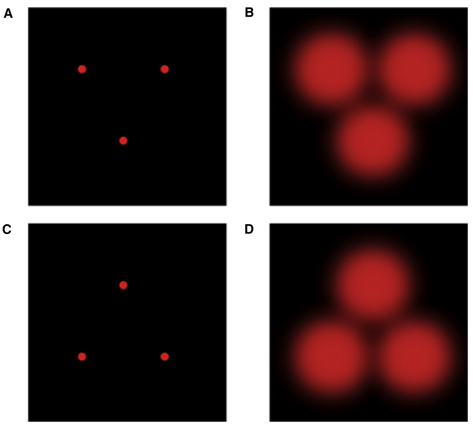
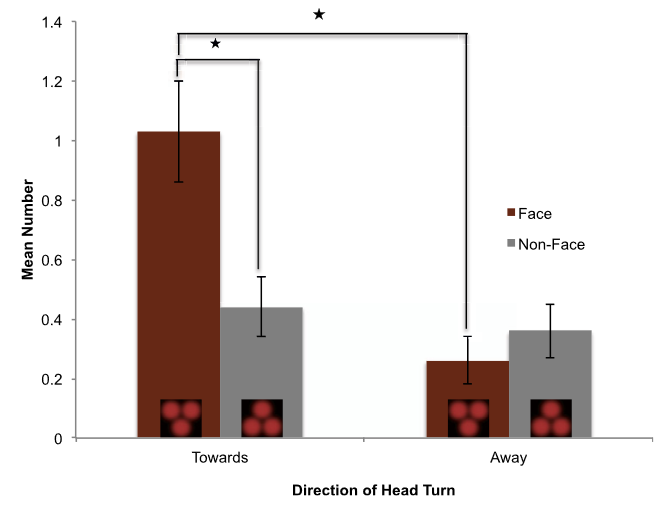

## 文献信息

- **标题 :** [The Human Fetus Preferentially Engages with Face-like Visual Stimuli](http://dx.doi.org/10.1016/j.cub.2017.05.044)
- **期刊 :** Current Biology
- **作者 :** Vincent M. Reid et.al.
- **DOI :** 10.1016/j.cub.2017.05.044
- **类型：** 
- **来源：** 偶然发现

## 目的

**背景：** 妊娠晚期人类胎儿具有处理感知信息的能力，随着4D超声技术的进步，子宫内条件的建模表明子宫内亮度比之前想象的要高很多 
$\to$ **假设：** 传输感知内容的光可以通过子宫壁投射并被胎儿感知， 但目前尚不清楚通过这种方式让胎儿当被试的可行性 
$\to$ 由于知道婴儿出生时就会有偏好头重脚轻、类似面部的刺激，所以文章尝试检测胎儿头部转向正立和倒立面孔样刺激的行为
 

## 方法

用4D超声评估了39名胎儿对刺激的行为反应，要求参与者在研究期间不要说话且尽可能静止（优化图像质量），最初的2D扫描会得到胎儿出现刺激之前头部的精确位置，刺激均呈现在胎儿面部一侧，以便刺激呈现在胎儿视网膜视觉区域，然后以水平方向远离胎儿中央视觉穿过孕妇腹部，持续约5s,平均每秒1cm。

> A-C 表示和母体组织接触前的刺激
> B-D 表示计算后预期的投影尺寸，用散射各向异性简单方程以及矫正的脂肪组织、30mm 组织相互作用的结果

## 结果

使用4D扫描评估响应刺激而做出头部转动的次数，直立方向（平均 [M] = 1.03，SD = 1.09）上的头部转动次数多于在倒立方向（M = 0.44，SD = 0.60），倒立刺激的相反方向的头部转动略多。 这一发现排除了出生后快速学习导致，机制可能是天生的，或者可能是由于产前视觉体验期间在子宫中暴露于图案光而引发的知觉偏差。

发现妊娠晚期的人类胎儿倾向于在三点面孔样刺激和对应倒置刺激间观看面孔样刺激，表明这种倾向不需要产后经验，并表明通过母体组织将视觉刺激传递给胎儿在技术上是可行的。

## 创新点

- 研究表明直立面孔样刺激的偏好不需要产后经历
- 描述了向胎儿传递特定视觉刺激的新方法，为产前视觉感知能力的评估提供了一条重要的新途径。

## 不足

- 图画的太丑了

## 启发

- 第一次知道胎儿能对视觉刺激做出响应