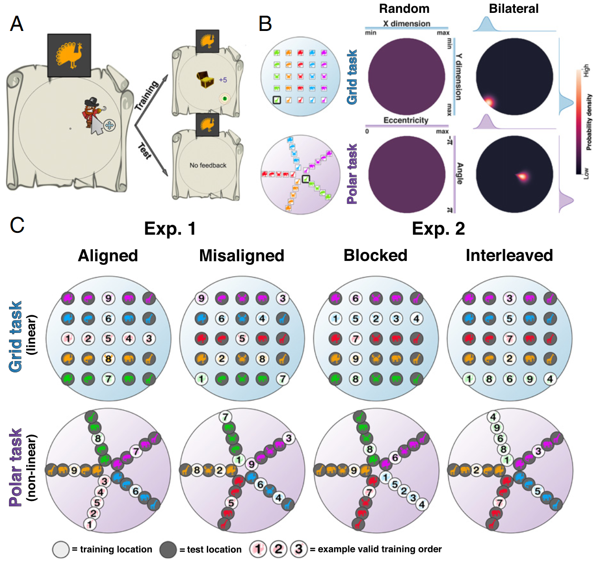
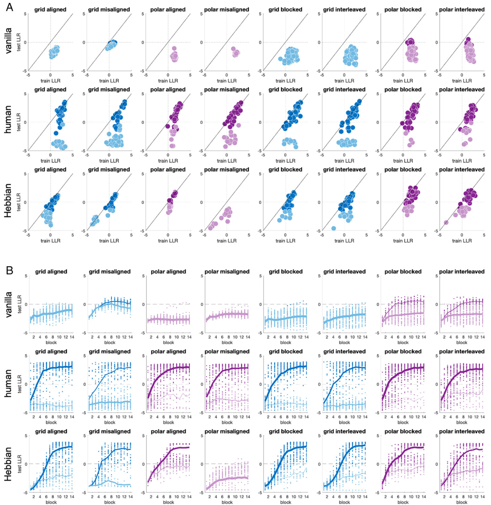
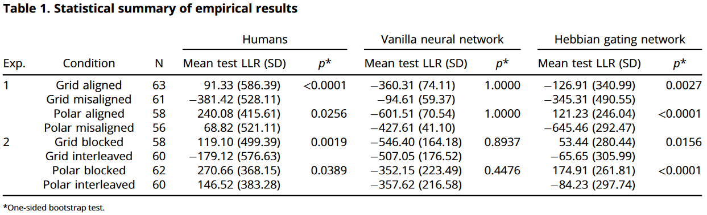
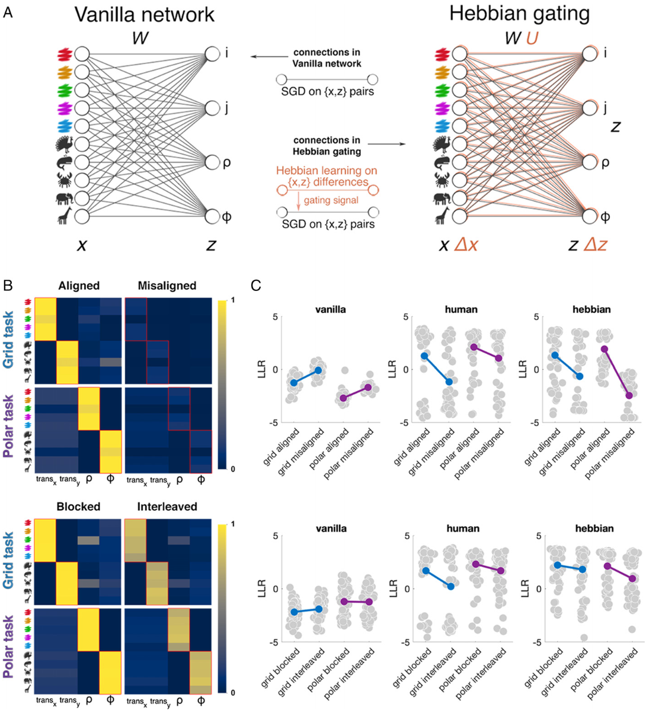
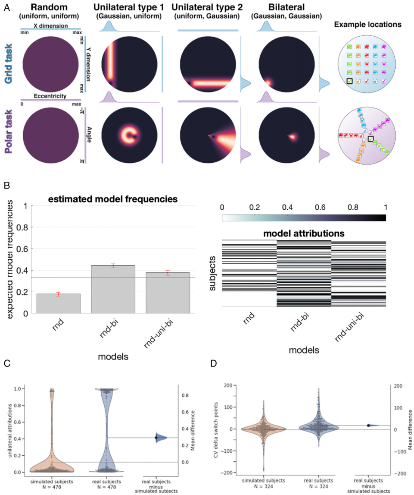
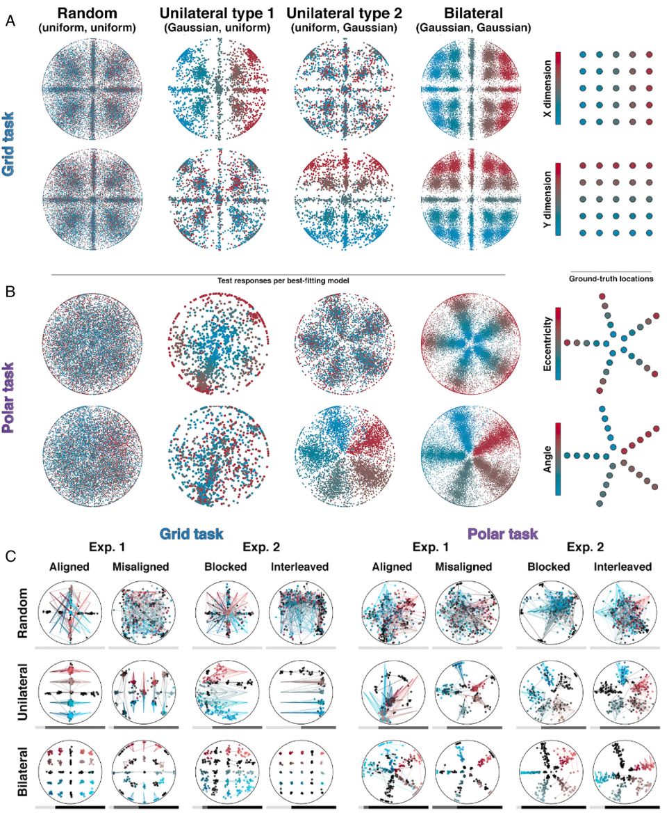

## 文献信息

- **标题 :** [Curriculum learning for human compositional generalization](https://doi.org/10.1073/pnas.2205582119)
- **期刊 :** PNAS
- **作者 :** Christopher Summerfield et.al.
- **DOI :** 10.1073/pnas.2205582119
- **类型：** 
- **来源：** 偶然发现

## 目的

**问题：** 重新利用过去的知识来进行概括，这怎么做到的仍然是认知科学中未解的问题，

$\to$ 泛化指在新的环境中重新利用知识的能力，文章用一种范式（要求被试学习并概括从符号线索到空间位置的映射函数）来检测泛化的能力，将迁移学习问题形式化为重构现有函数以解决未见过的问题。

## 背景

虽然事先接触具有共同结构的测试项目有时候会提高表现，但很多的认知研究中，知识迁移很难与研究人员提示或隐含指示所包含的更一般的解释区分开。人类处理新事物的能力似乎取决于迁移距离，当新旧问题共享物理特征时（近迁移），泛化通常会成功，但问题共享共同结构但表面上不同时（远迁移），泛化经常失败。

同样远迁移仍然是AI研究中很难捉摸的目标，一个老观点“思想和行动从根本上是组合的”有希望解决，即假设世界是结构化的，新任务通常可以组合旧任务来解决，因此具有归纳偏差的系统可以在新的环境中成功地从现有构建块中明确地组合新知识和技能。

## 方法

被试学会根据提示将海盗人物拖到目标屏幕位置，提示有五种颜色和形状，共计25个线索。参与者需要连续进行14个block，每个block先接受9个线索的监督训练（指能看到分值反馈，根据临近程度奖励），然后剩余16个线索不带反馈。

>B: 用于测量泛化的模型，在随机模型下任何响应位置都是等概率（由均匀分布建模），Bilateral 模型概率密度是以单个真实位置为中心的高斯分布。
>C：数字显示的监督线索的时间顺序，左Exp1.（被试n=304）中 Aligned 训练在其中一个维度采样时另一维度不变，Misaligned 两个维度同时变化；右Exp2.中都是Aligned，Blocked同一维度的变化是挨着的，但Interleaved采样是随机的。

作者预测如果被试一次只需要关注一个维度，在训练期间将map分解成两个函数，那就更容易在测试期间重新组合以实现迁移。

分析的度量是对数似然比（LLR）,LLR $>0$ 表示存在泛化：

$$LLR = log \frac{p(bilateral | responses)}{p(random | responses)}$$

## 结果

排除了不能在两个映射中所有 trial 训练LLR $>0$ 的被试，余 235。

> 数据来自实验1和实验2，由上到下是普通神经网络、人类、Hebbian门控网络的表现
> A:  蓝色表示网格、紫色是极坐标映射，颜色较深的表示该网络/参与者被定义为泛化者
> B： 学习动态，每个条件的测试LLR作为block的函数，深色线和浅色线分别表示泛化者和非泛化者的平均值

泛化者定义为被试/模型在实验后半部分（block 8-14）中测试的平均 LLR $>0$，上图可见人类比神经网络具有更好的泛化能力

- 大部分参与者可以在网格任务和极坐标任务中进行泛化，但无需额外假设的神经网络则不能
- 人类泛化受益于轴对齐和block训练，推测是因为这些操作允许参与者一次专注于一个维度

文章下一个目标是确定可以对神经网络模型施加的最小约束，使其显示出与人类相同的泛化模式。

> 赫布门控模型
> A：Hebbian 模型由一组普通ANN+一组赫布权重增强组成，这些赫布权重充当门控信号。
> B：每种条件下收敛时的赫布权重，显示超过阈值的概率，红框表示真实映射
> C：每种条件下block测试块的平均LLR

Hebbian 门控网络能够概括并重建人类在网格和极地条件下成功表现的模式，除了polar misalignment条件外定性地再现了人类学习者观察到的效果

作者提出：人类（和赫布网络）学会将映射问题分解为两个子问题，一个子问题对应线索的每个维度，参与者的泛化可能表现出异步轨迹。所以研究又探讨了随机、单侧、和双侧概括策略在测试上的结果，见下图A，单侧策略响应的概率密度和其中一个维度（一排等）相同。虽然整体上是双侧模型对数据的解释最好，但也有38%的被试对单侧模型表现出最高的后验概率（18%最适合纯随机）。

> A： 单侧误差和建模设置
> B： 三个模型最适合的被试数量，右侧图是模型归因（每个被试每个模型的后验概率）
> C：每个人类参与者（蓝色小提琴图，右）和遵循 rnd-bi 策略的模拟参与者（橙色小提琴图）的单边阶段的边际后验概率。

绘制了实验中所有 478 名参与者做出的 107,072 个响应的数据，按模型归因排序，显示了网格和极坐标映射中单边和双边响应的模式

> A：每个模型下的单独决策响应，根据实际样本水平平移着色
> B：类似，但着色根据偏心率和角度
> C：各个参与者对不同条件的响应示例，维度1从红到蓝，维度2由深到浅

**总结：**

- 被试可以通过线性组合先前学习的映射函数来解决任务，人类的概括受益于轴对齐和时间相关的训练，即认为泛化涉及（通过组合）外推，而不仅仅是插值。
- 文章描述了一个基于赫布门控过程的神经网络模型，该模型可以捕获人类泛化如何从不同的训练中收益。、
- 发现虽然人类泛化存在异质性，但总的来说72% 的参与者在实验后半段的测试块上表现出了高于机会的表现，与仅 11% 的普通神经网络有很大区别。

## 创新点

- 为了成功概括多映射的组合，人类必须具有归纳偏差来推断哪对效应器适合每项任务，这是普通神经网络所缺乏的偏差
- 学习和泛化需要因式分解和解耦的想法是当前机器学习中的一个流行主题，文章为这个观点提供了证据

## 不足

- 文章没有很清晰的表述为什么要做某个实验，和做出的假设

## 启发

暂无