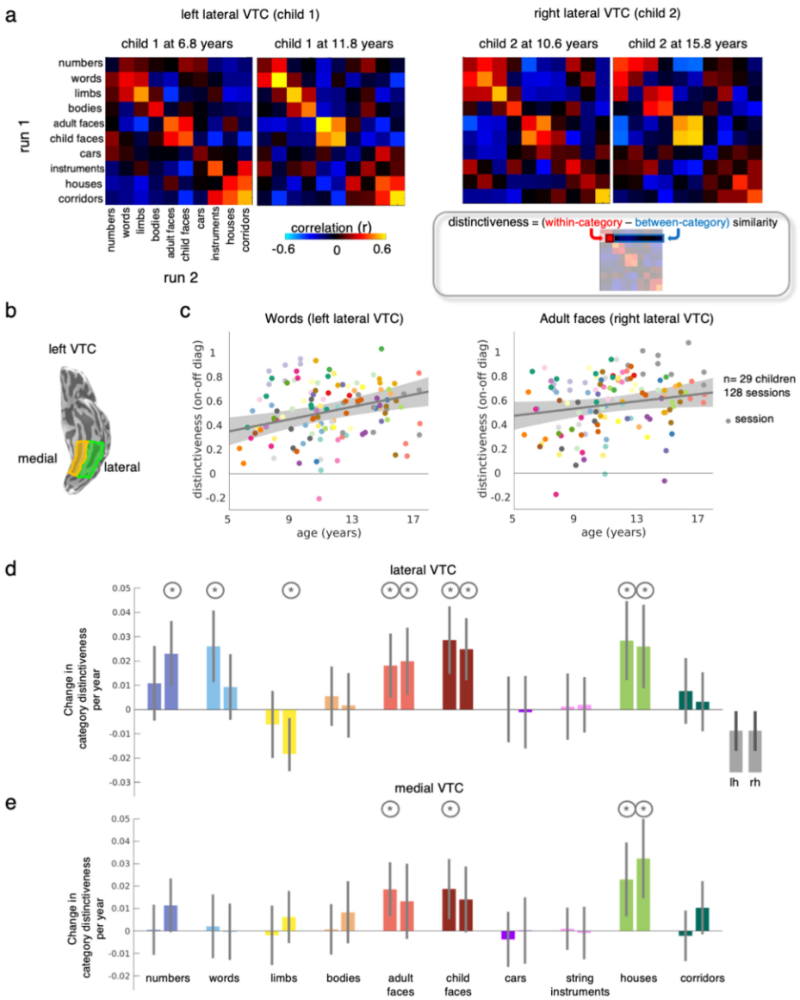
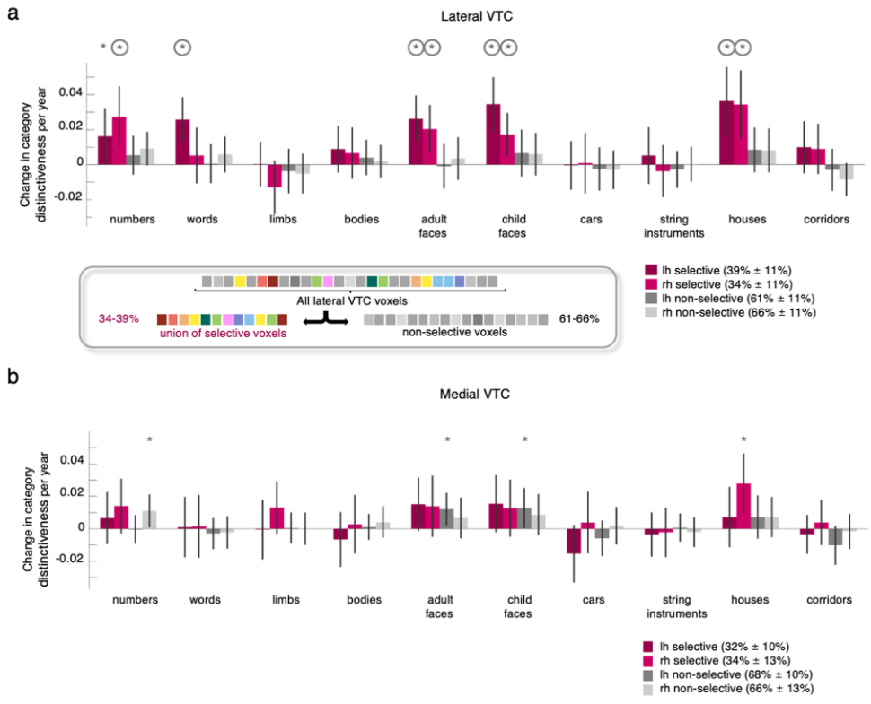
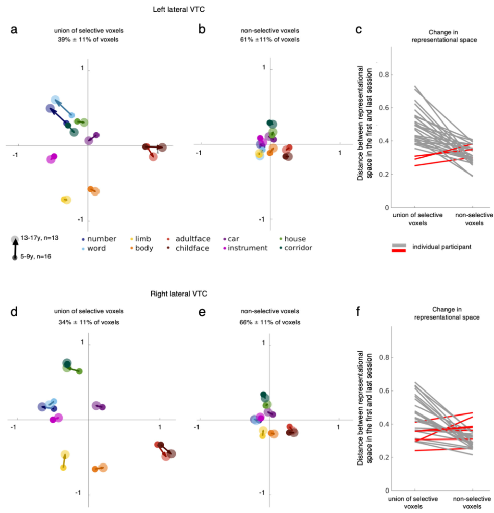
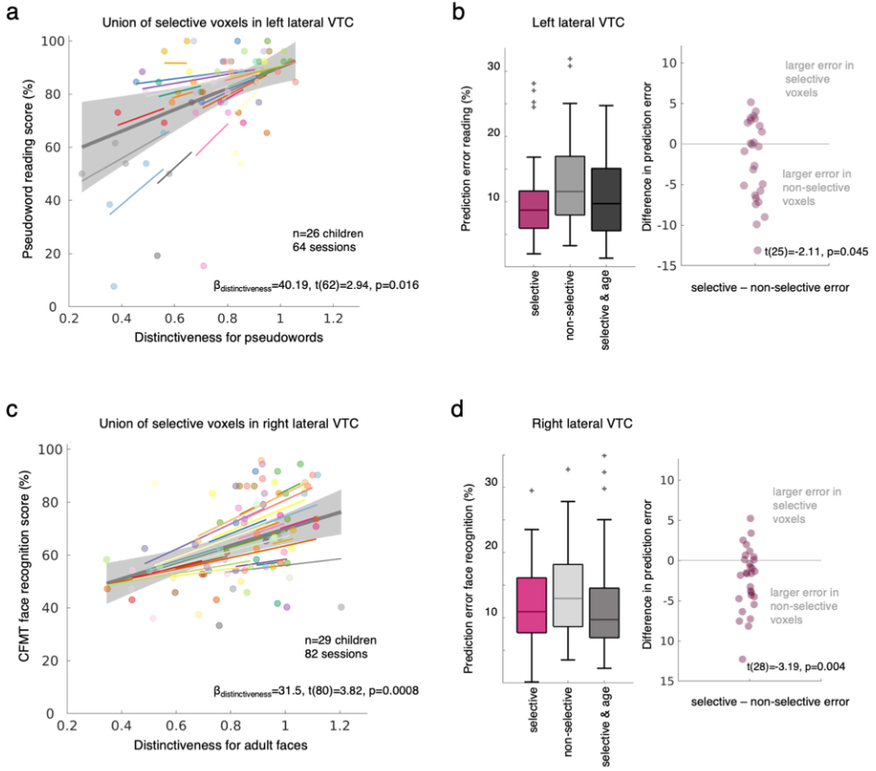

## 文献信息

- **标题 :** [Longitudinal development of category representations in ventral temporal cortex predicts word and face recognition](https://doi.org/10.1038/s41467-023-43146-w)
- **期刊 :** Nature Communications
- **作者 :** Marisa Nordt et.al.
- **DOI :** 10.1038/s41467-023-43146-w
- **类型：** 
- **来源：** 主动发现 | 集智

## 目的

**问题：** VTC 中的分布式类别表征在童年时期如何发展？
$\to$ 使用功能磁共振成像跨越数年来测量学龄儿童腹侧颞叶皮层对10个类别的分布式反应的发展情况 
$\to$ **结果：** 揭示了类别表征随着年龄增长，左半球的单词和两侧面孔的表征变得尤为清晰，并且这些体素分别预测了个体儿童的单词和面孔识别表现。 
$\to$ **结论：** 腹侧颞叶皮层的分布式表征的发展具有行为影响，并增进了我们对儿童时期皮质长期发育的理解

## 背景

由于至今为止对分布式VTC响应的研究主要局限于时间上的横断面（用有限数量的类别去对比儿童/成人两组），缺少同一儿童在时间上发展的研究，当前还不知道分布式类别表示如何发展以及这种发展是否与识别中的行为变化相关。

- 先前的研究发现，从童年（4-7岁）到青春期（13-17岁）再到成年（>18），对面孔和单词的选择性聚集区域变得更大，并且对其各自的类别更具选择性。
- 童年早期对肢体有选择性的区域到了青春期就变得对面部和文字有选择性，表明类别选择性的变化可能会影响分布式 VTC 表示的性质

实际上当前有三种假设：

## 方法

- 收集了 29 名学龄儿童 1 至 5 年间（每个儿童 4.4 ± 1.92 次）的功能磁共振成像 (fMRI) 和行为数据，总计 128 次 fMRI和 146 个行为数据集。被试观看来自 10 个类别的 1440 张图像，包含:
  - 字符（伪词、数字）
  - 面孔（成人面孔、儿童面孔）
  - 身体部位（无头身体、四肢）
  - 物体（汽车、弦乐器）
  - 地点（房屋、走廊）。

- 在核磁扫描之外测量同一儿童的面部识别和阅读能力

## 结果

类别的独特性定义为类别内相似性与类别间相似性之间的差异，范围从 -2 到 2，较高的独特性表示对某个类别的分布式响应在该类别的不同图像中高度相似，并且与对其他类别的分布式响应高度不同。

5 岁到 17 岁的 VTC 中多个类别表示的独特性有增强有减弱

>儿童腹侧颞叶皮层（VTC）类别表征随时间纵向发展
> a: 展示了两个儿童的左/右侧VTC的表征相似性矩阵
> b: 左侧（绿）/内侧（黄）VTC位置展示
> c: 年龄与这两个类别选择区独特性的关系，灰线是线性混合模型（LMM）预测。参与者按照颜色编码。
> d-e: LTC 不同区域每年的独特性变化（LMM 斜率）

**问题：** VTC 中的哪些体素推动了类别表征的发展？

> lateral VTC 选择性体素逐年发展的分布式表示
> 约 36.5% 的 lateral VTC 体素对其中一个类别具有选择性

- 面部、单词、数字和房屋的独特性增加，而四肢的独特性降低。随着儿童年龄的增长，四肢的表示会向 MDS 空间的中心移动
- 左侧 VTC 中面部和单词的独特性增加与先前的研究结果一致，表明单词和面部选择性区域随着发展而增长，并且对其首选类别的选择性越来越强

> lateral VTC 中 10 个类别的表征空间的开发，用的 MDS 嵌入，小圆圈表示 5-9岁的儿童，大圆圈表示 13-17岁。
> c\f: 表示选择性体素和非选择性体素在各个儿童表征空间的变化，y轴值是MDS嵌入类别位置之间的平均欧几里得距离

- 先前的研究表明，左半球的单词表征存在分级发展偏侧化，而右半球的面部表征存在分级发展侧化。与这一致，伪词的独特性的变化仅在左半球中显着，并且仅左半球的独特性可以预测阅读能力。

> 在个体上预测儿童阅读/面孔识别能力表现。

- 即发现选择性体素联合的独特性指标可以预测识别行为

## 优点

- 时间跨度很长，做了儿童发育的追踪，是独特的点

## 缺点/不足

- 分析方法很一般
- 没有很强的或者较鲜明的结论，结果的细节太细碎，并要靠和其他研究的证据一致来佐证自己的结果
- 图一c结果的变异性太大

## 启发

暂无，是亮点在工作量的工作。