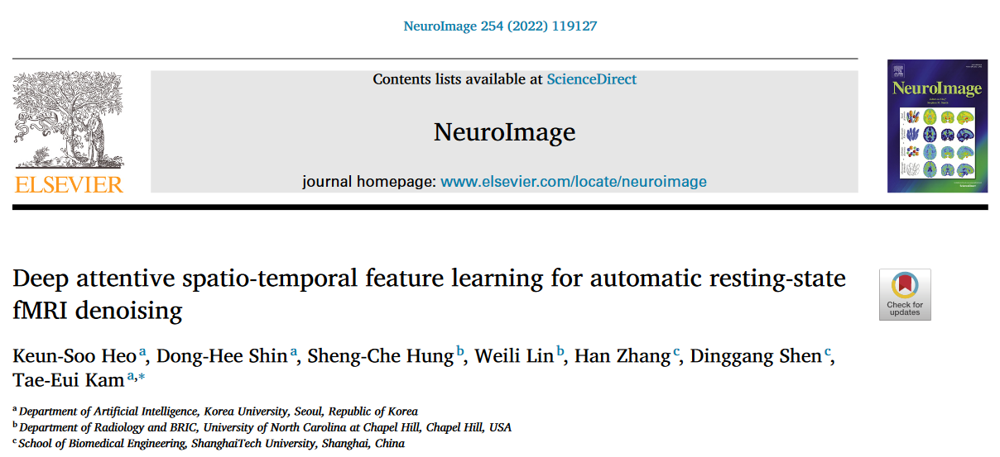
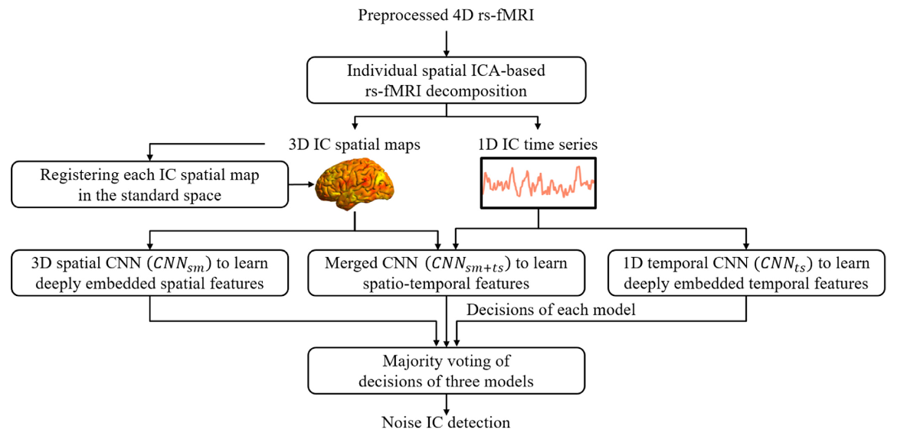
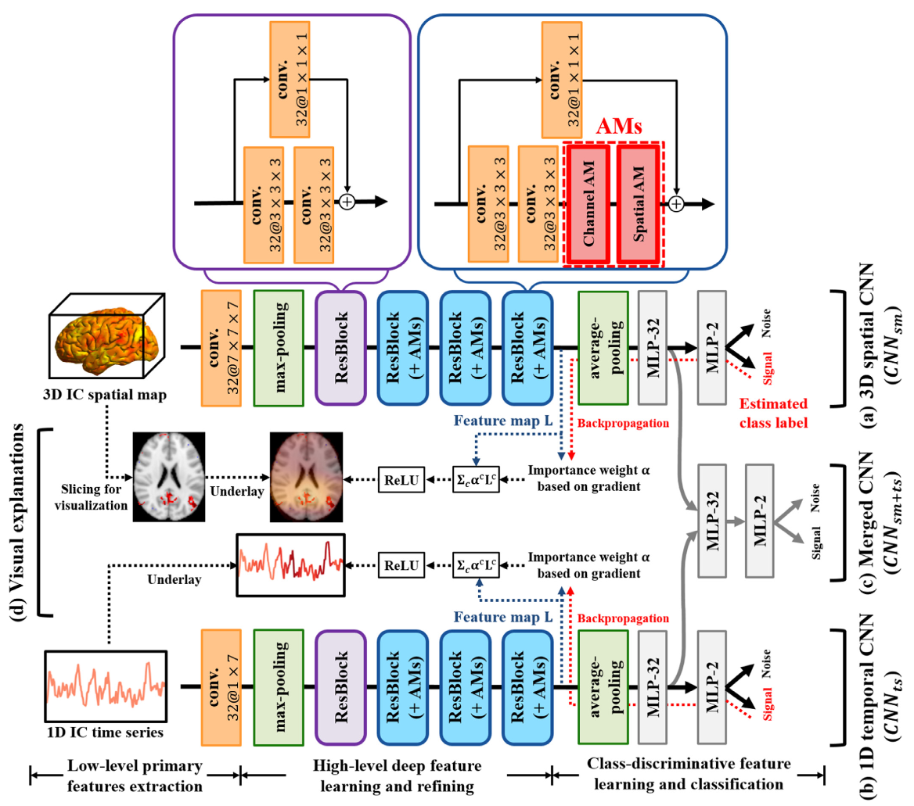
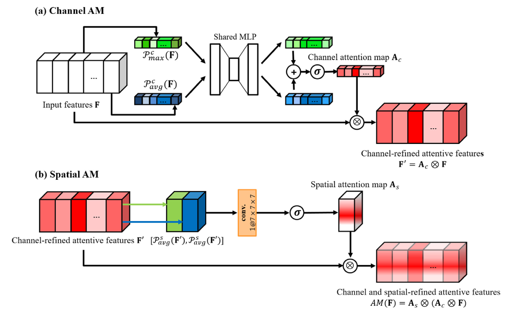
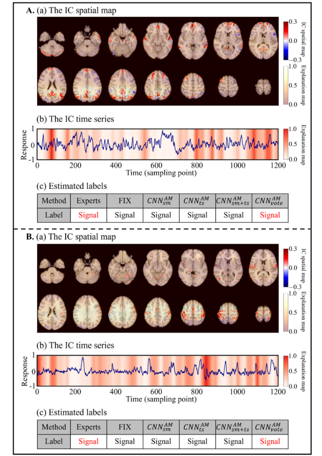
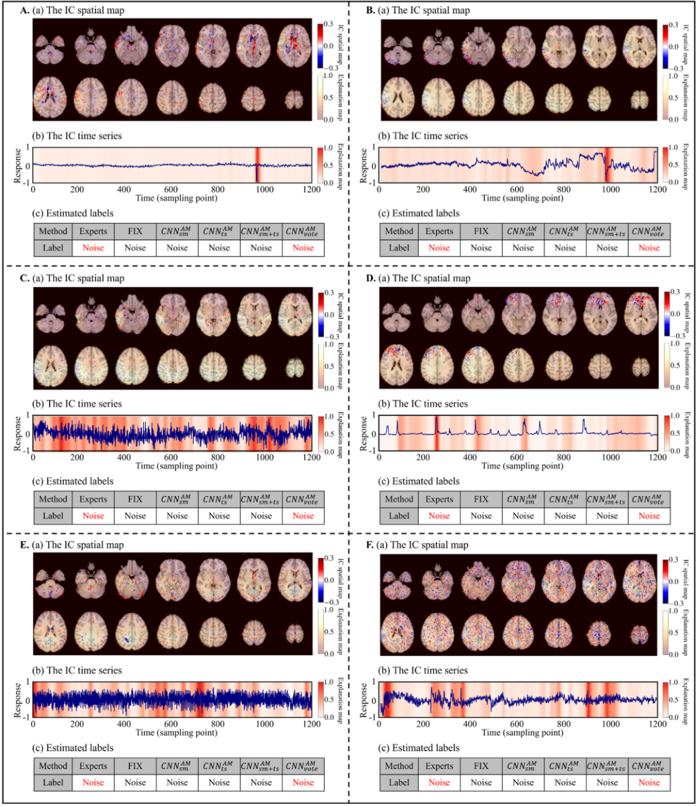

## 文献信息

<!--  -->
- **标题 :** [Deep attentive spatio-temporal feature learning for automatic resting-state fMRI denoising](https://doi.org/10.1016/j.neuroimage.2022.119127.)
- **期刊 :** NeuroImage
- **作者 :** Keun-Soo Heo a, Dong-Hee Shin ...
- **DOI :** 10.1016/j.neuroimage.2022.119127
- **类型：** 方法开发

## 目的

为了在不同数据集上快速、准确、自动化的识别噪声相关的组成，提出了一种新的端到端的专门识别噪声的框架，并在各种rs-fMR数据集上的性能出色。

## 概念解释

individual spatial ICA :  类似PCA，是一个线性变换，把数据或信号分离成统计独立的非高斯的信号源的线性组合。分解为一组IC，每一个IC都由IC空间图组成，彼此间最大程度在时间上独立（正交）。该方法不能确保能清楚的分解为信号和噪声相关分量，需要了解rs-fMRI时空特征的专家手动标记信号IC或噪声IC。
- 也常用于脑电信号处理
- 数据中信号IC和噪声IC的数量是不平衡的，一般来说，噪声IC比信号IC更多。

## 方法

<!--  -->
> 将最小预处理的 rs-fMRI数据分解为 IC spatial maps 和与其相关的时间序列，分别输入一个 3D 空间CNN（学习嵌入的的空间特征）和 1D 时间CNN（学习嵌入的时间特征），并为了融合时空特征构建了一个合并的CNN，记为 $CNN_{sm+ts}$。三者决策的多数投票确定每个IC成分是信号还是噪声，以进行稳健的噪声IC检测。

<!--  -->
> 框架的示意图，比较详细也不复杂，块的基本内容不进行描述
> - AMs ： Attention Modules，详见下图
> - 可视化使用的 Grad-CAM 方法，会生成一个较粗糙的定位图，靠流入最后卷积层的梯度信息来分配神经元的重要性权重 $\alpha^c$ ,组合 $\alpha^c$ 和特征图 $L_c$ (其中 $_c$ 是索引)产生定位图 $M$。
> - Merged 融合仅在最后 MLP 阶段做的

<!--  -->
<!-- > `a` : $P_{max}^c$ 表示通道全局最大池化，$P^c_{avg}$ 表示通道全局平均池化，中间的共享MLP是类似于 autoencode 的结构。 -->

$$AM(F) = A_s \otimes (A_c \otimes input)$$
$$A_c =  \sigma (F_{MLP}(P^c_{max}(input))) + F_{MLP}(P^c_{avg}(input))$$
$$A_s = \sigma(F_{conv}([P^s_{max}(A_c\otimes input),P^s_{acg}(A_c\otimes input)]))$$

## 结论

在BCP、HCP、WHII-MB6和 WHII-STD的fMRI数据集上，显示了提出的方法和竞争方法在准确性（ACC）、敏感性（SEN）、特异性（SPEC）和F1评分（平均值 ± 总体样本平均值的标准差）的总体性能（具体表格见论文）

- 在特异性上较为明显的性能提高（特异性指示模型能够检测噪声IC的能力）

- 多数投票策略和注意力模块 有助于提高性能
- 方法可以快速检测噪声IC，而不会降低检测性能。

- BCP和HCP数据集中包括更多的噪声IC

### 可视化部分

<!--  -->
<!-- > HCP数据集中的信号IC的示例，专家和所有提出的方法都一致认为是信号IC -->

<!--  -->
<!-- > 噪声IC（A-F）的实例，可见注意力机制用在时间波形较少的噪声IC成分上效果明显。 -->

## 创新点/优点
- 提出的方法不需要对特定类型的噪声的有任何先验知识，就可以在非常异构的数据集上使用。
- 该框架可以很方便、直接地作为其他数据集中现有管道的去噪工具。

## 缺点/不足
- 性能上，除了少数评估指标外，没有统计学上的显着差异。
  

<!-- ## 可能的结合点

作为优点是能在非常异构的数据集上性能稳定的方法，在尝试在猴脑核磁共振去噪时可以参考其方法，如多数投票和注意力机制。 -->

## 其他参考

- [独立成分分析（ICA）](https://zhuanlan.zhihu.com/p/43130318)