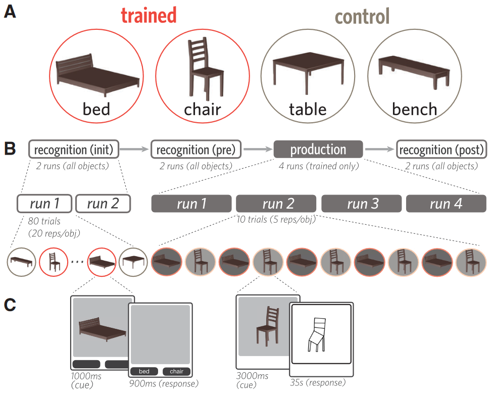
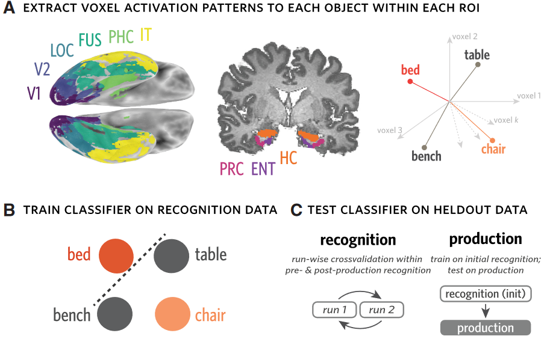
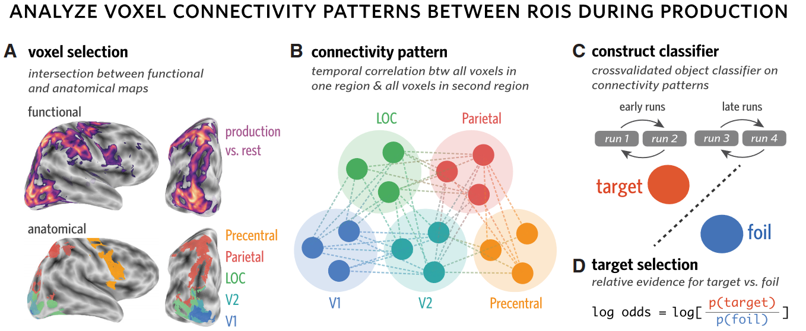
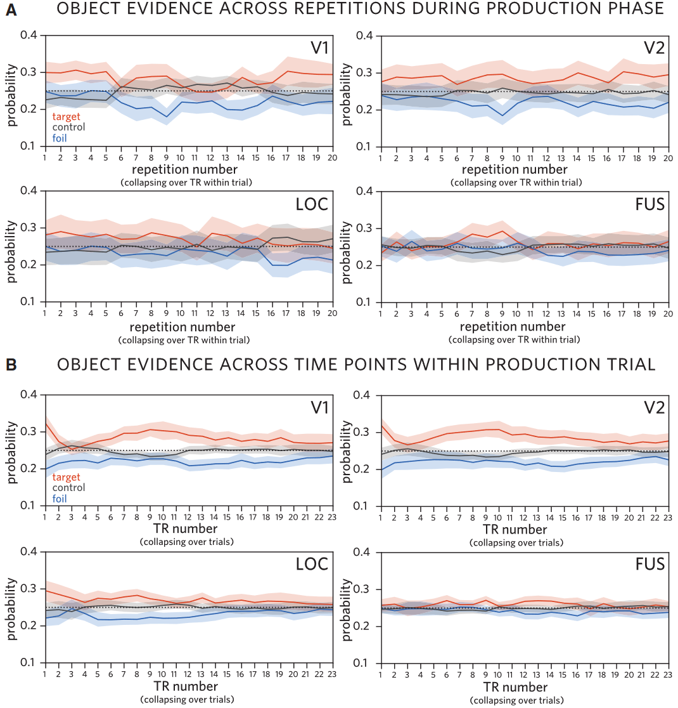
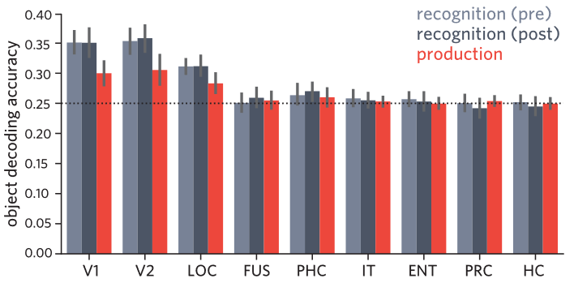

## 文献信息

- **标题 :** [Relating Visual Production and Recognition of Objects in Human Visual Cortex](https://www.jneurosci.org/content/40/8/1710)
- **期刊 :** The Journal of Neuroscience
- **作者 :** X Judith E. Fan .et.al
- **DOI :** 10.1523/JNEUROSCI.1843-19.2019
- **类型：**  核磁行为学实验
- **来源：**  医学影像处理 reading list

## 目的

人类可以通过绘画简单线条，来捕捉有关感知经验的丰富信息，支持这种行为的机制尚不清楚，目的是研究视觉皮层如何参与对象的识别以及其图形的产生。

评估了一个假设：产生和识别一个对象的回路共享神经表示，如此反复描绘对象可以增强其在大脑中的感知能力。

## 方法

33个完成采样样本，保留了31个

刺激使用家具类别的四个物体：床、长凳、椅子和桌子。Maya 3D 网格模型表示

> 被试被随机分配两个对象（经过反复查看和绘制），另外两个作为control。production阶段，3000ms的刺激之后有35s绘图时间。

> `a : ` FreeSurfer定义了每个被试的解剖ROI，为所有时间点提取激活模式，表示为k维空间中的向量。
> `b : ` 分类器是四类逻辑回归
> `c : ` 在 绘图前后 都采用了 runwise 的交叉验证

> `a : ` 在 绘图过程 中始终参与的体素
> `b ：` 为每对 ROI 计算每个trial的连通性模式，由ROI之间 $M\times N$ 个成对时间相关组成。
> `c : ` 连接模式用于构建2类逻辑回归分类器，以区分当前绘制的对象（目标）与其他受过训练的对象（Foil）
> `d : ` 定义的目标选择指标
 
## 结论

- 在根据视觉线索绘制这些对象的过程中，或不存在视觉线索的时期，依旧刺激诱发视觉皮层中对应的对象表示

- 在绘图过程中，在视觉皮层中优先考虑当前绘制的对象，而其他（虽反复绘制但不是当前的）对象被抑制
     

- 枕叶和顶叶皮层区域之间的连接模式支持在整个训练阶段对当前绘制的对象进行增强的解码

人脑以相似的格式携带某个对象的信息，而绘制该对象的实践会增强有关该对象的信息向下游区域传输的能力。

## 优点/创新点
- 研究提供了大脑视觉产生与识别功能之间关系的新视角

## 缺点/不足

> 在识别前/识别后阶段和绘图生成阶段基于不同腹侧ROI构建的分类器的准确性。
- 这张和另外一张结果图都没有进行统计，结果的说服力不强。
- 文章所论证的论点太贴合常识，缺乏新颖性。

## 可能的结合点

暂时没想到，研究想表达绘制图像时也会参考对应视觉皮层中的对象表示，可能在神经表示中都是同一个吸引子，总之感觉这研究糙了一点。