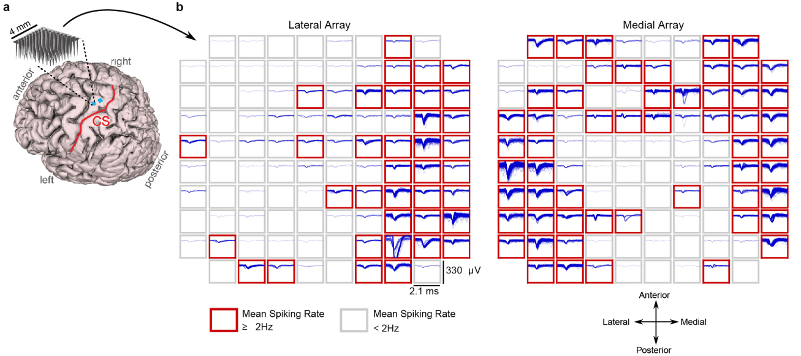
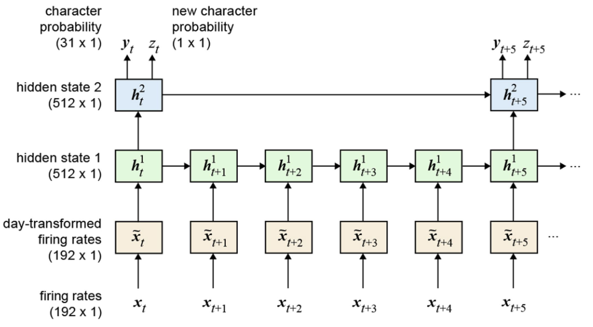
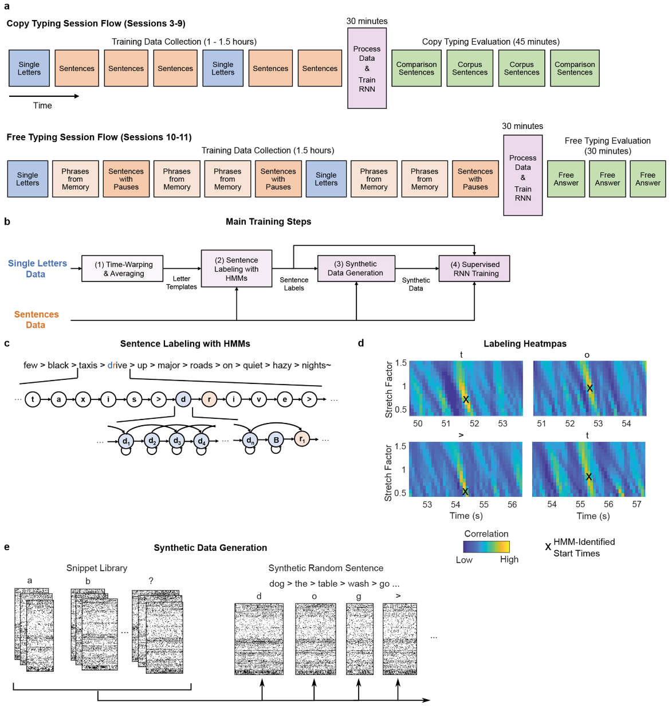
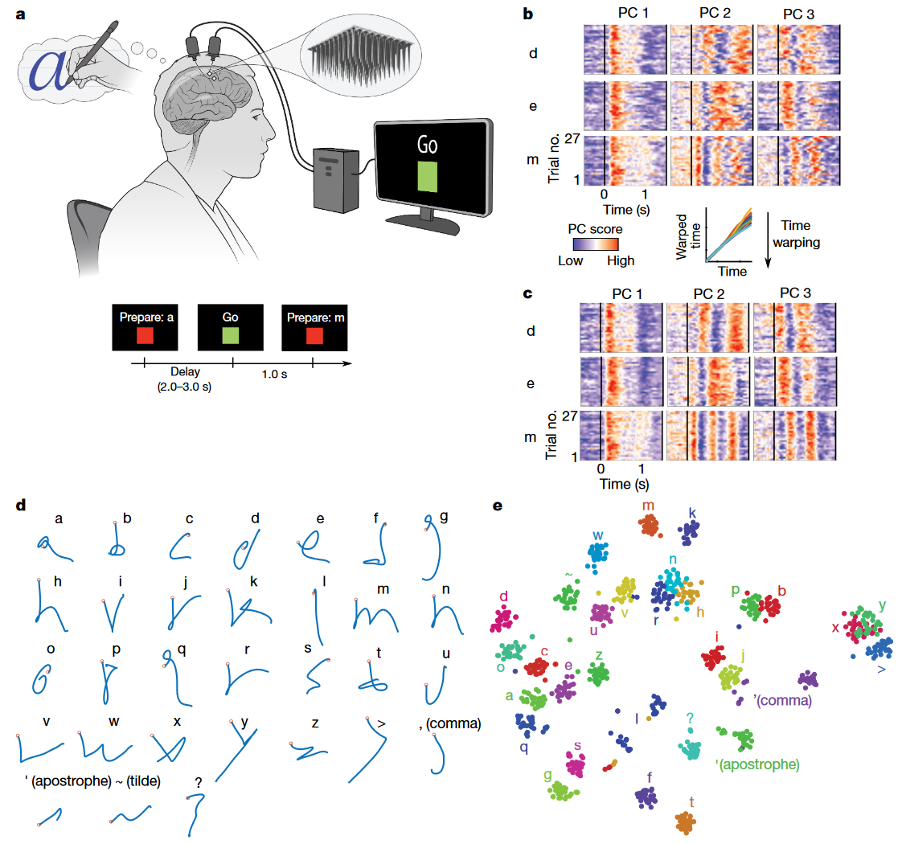
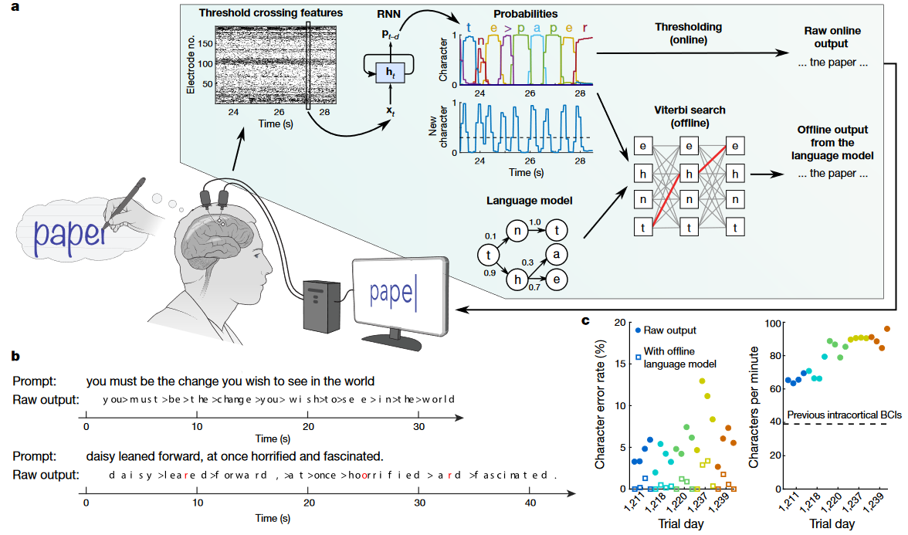
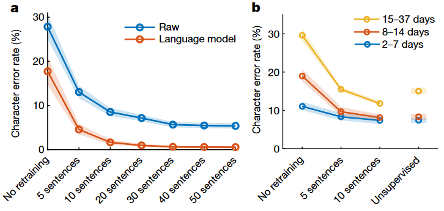
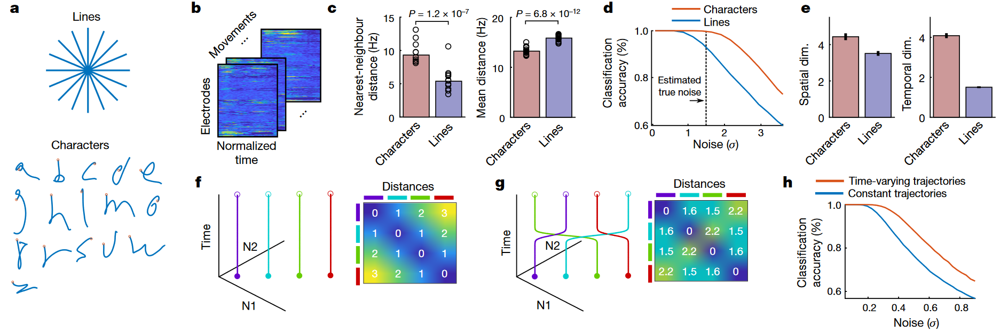

## 文献信息

- **标题 :** [High-performance brain-to-text communication via handwriting](https://www.nature.com/articles/s41586-021-03506-2)
- **期刊 :** Nature
- **作者 :** Francis R. Willett .et.al
- **DOI :** 10.1038/s41586-021-03506-2
- **类型：**  脑机接口
- **来源：**  脑机接口 reading list

## 目的

目前为止的 BCI 研究重点在恢复粗糙的运动功能（如伸手抓握或鼠标光标点击打字），而快速连续的高度灵巧动作（如手写或触摸屏打字）是个 gap。
他们开发了一种皮质内 BCI 尝试解码运动皮层中手写的神经活动并将其实时的解码成文本，用的是 RNN。

## 方法
两个微电极阵列放在中央前回手"knob"区域（运动前区），参与者一位，代号T5。

总共收集了572个句子

电极阵列在被试T5大脑的定位（蓝色方块），微电极阵列是 $10\times 10$ 的去角电极，绘制的窗口是10s（植入的1218天）。发放事件用 -4.5 的均方根阈值检测，平均发放速率大于2Hz的被认为有发放活动，红框表示。

训练了一个两层的RNN，将神经活动转换为每个字符在该时刻被写入的概率，输入是在 20ms 的窗口内平滑的神经发放序列 $x_t$ , 输出为字符概率向量 $y_t$ 和新字符概率标量 $z_t$。
- 隐层2采取100ms更新一次的方式提高速度
- 输入经过 每日特定的仿射变化 ，目的是在多天合并时让RNN考虑一些神经调节的变化（如电极阵列微动或大脑可塑性变化）。

<!-- 
> `a : ` 
> `b : ` 
> `c : `
> `d : `
> `e : ` -->

> `a : ` 实验示意
> `b : ` 主成分分析显示方差最大的三个维度
> `c : ` 使用时间对齐技术移除时间变异性，表明每个字符独有的神经活动是一致的（指同成分发放很集中）
> `d : ` 基于实验的平均神经活动解码的31个字符2D轨迹，为的是验证可行性
> `e : ` t-SNE 降维可视化每个在 “go”提示后的单个实验的神经活动，k最近邻分类器分类的准确率为94.1%

> `a : ` 字符概率可以通过简单的方式阈值化产生离散字符（上半部分实时），RNN 输出间隔是1秒，所以一次给出期间内的字符。离线版本中和大型语言模型结合，解码最可能的文本。
> `b : ` 两个实时实验的示例，错误的用红色表示
> `c : ` 展示的5天的错误率和打字速度，每天包含4个评估block（不在训练集里），block 7-10 个句子。右侧虚线是打字速度第二快的皮层内 BCI 。

## 结果
参与者的手因为脊椎损伤瘫痪，实现了打字速度 90 字符/分钟，实时准确率 94.1%，离线使用通用的自动更正后准确率达到 99%。

> `a : ` 在每天评估之前重新训练解码器，这里离线模拟了减少校准句数带来的影响。
> `b : ` 用不同时间的数据离线模拟，间隔时间不同，显示了不训练、少量校准数据和重新无监督训练的错误率。

> `a : ` 分析了对应16个手写字符（持续时间为1 s）与16个手写直线运动（持续时间为0.6 s）的神经活动模式
> `b : ` 在重复实验对准时间后平均，得到 192（电极数量）× 100（时间步长）的矩阵
> `c : ` 为每组计算神经模式之间的成对欧几里德距离，差别更大的是最近邻距离
> `d : ` 较大的最近邻距离使得字符比直线更容易分类。
> `e : ` 字符和直线的空间维度相似，字符时间维度是直线的两倍（应该指字符间时间维度的最大近邻距离）
> `f-h : ` 给出直观的，时间维度增加可以使神经轨迹更加可分的玩具例子。

## 优点/亮点
- 打字速度超过任何其他 BCI，并且和通常速度相当（参与者同年龄组平均智能手机打字速度 115 字符/min）
- 研究为 BCI 开辟了一条新途径，展示了瘫痪多年后准确解码灵巧动作是可行的

## 缺点/不足

- 很难推广，从T5数据采集都是从植入1500+天看出这项工作是好不容易才找到一个合适的实验者。
- 就打字而言，不如基于视觉诱发电位的脑电实用，特别是每过一段时间后就要校准。手写更多是代表快速灵巧的运动，为的是展示潜力和可能性。
- 还不是一个完整的，临床上可行的系统。

## 可能的结合点

- 读这篇文章更多是为了了解相关内容，不清楚未来有没有机会做。