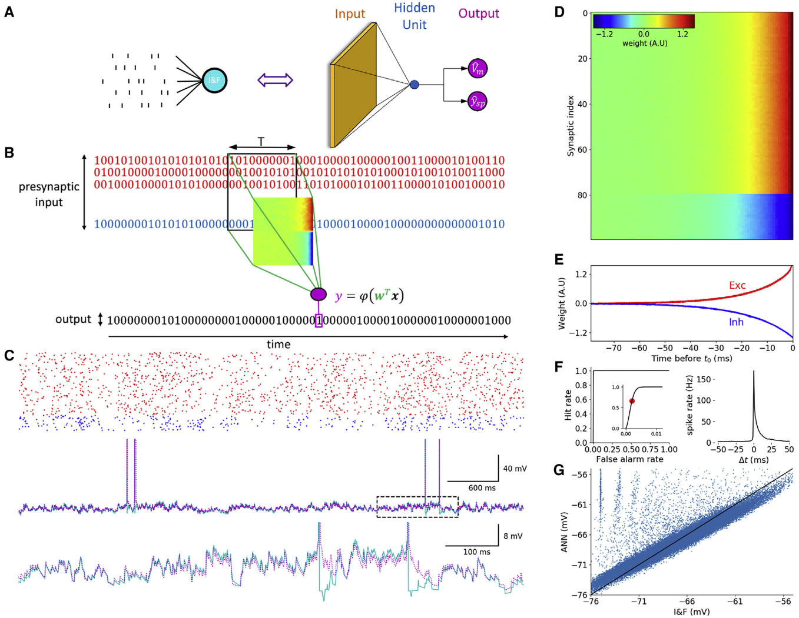
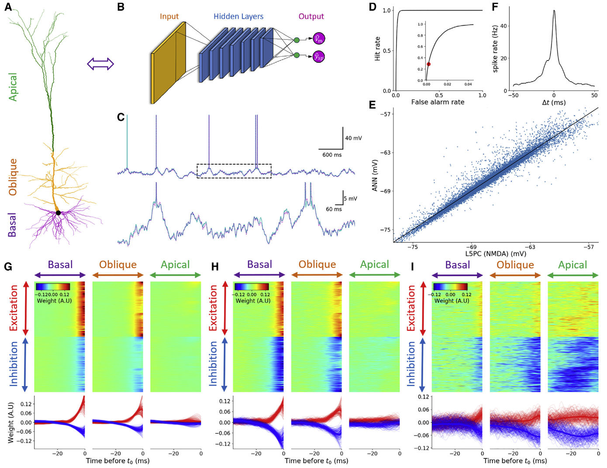
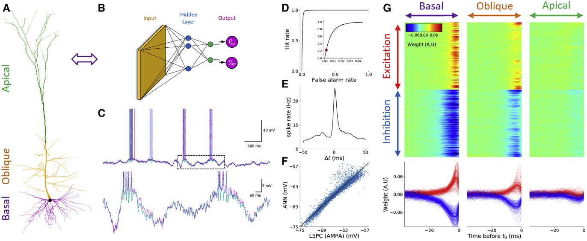
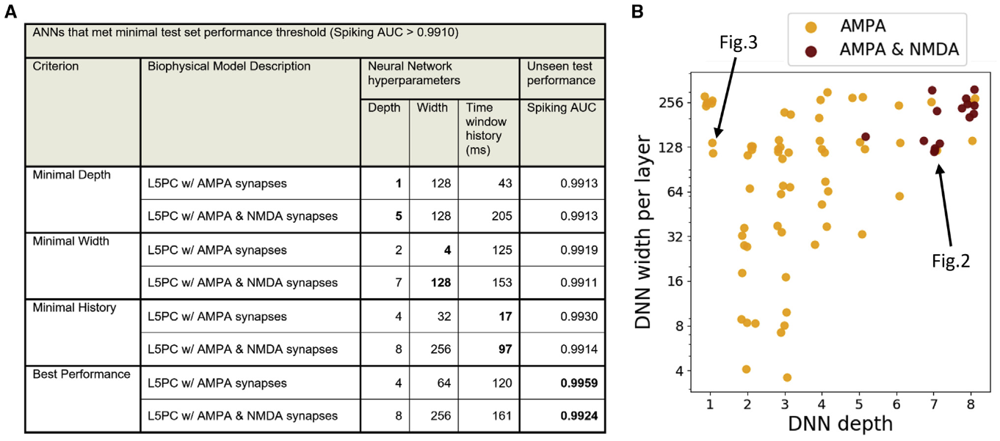
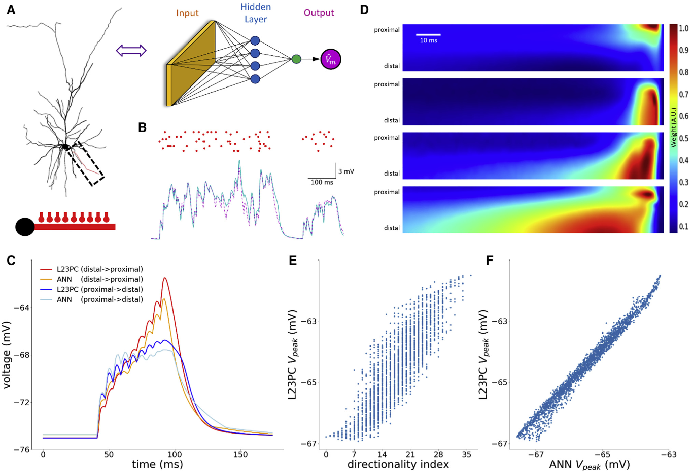

## 文献信息

- **标题 :** [Single cortical neurons as deep artificial neural networks](https://www.sciencedirect.com/science/article/pii/S0896627321005018)
- **期刊 :** Neuron
- **作者 :** David Beniaguev, Idan Segev, Michael London
- **DOI :** 10.1016/j.neuron.2021.07.002
- **类型：**  建模实验
- **来源：**  北大计算机学院讲座 | 类脑计算
  
## 目的

神经元具有非常多样化的突出发放模式，文章引入了一种系统的方式表征神经元输入输出（I/O）的映射复杂性。

研究神经元I/O特征的一种常见方式是通过组成一组偏微分方程进行模拟，也是目前解释神经元完全I/O转换的唯一方法，但分室模型和电缆模型由耦合非线性微分方程组成，高维系统转换困难。他们利用DNN完整模拟L5皮质锥神经元的I/O行为，获得了计算上高度有效的模型，忠实预测该神经元在毫秒时间分辨率上的发放。

## 方法 & 结果

#### 1

> `A :` 隐层由一个单元组成，模拟的积分发放神经元模型
> B :  多条输入时间序列被滑窗卷积得到输出，热图表示权重矩阵
> C ： 示例输入，红兴奋蓝抑制；中间曲线是I&F模型（青色）、DNN（洋红色）的响应；底部放大了虚线区域，轨迹具有很多相似之处
> D ：权重矩阵，前80行是兴奋性、后二十行是抑制性，时间靠近的权重更大。
> E ：权重大小值的时间截面
> F ：ROC曲线量化模型在峰值预测方面的表现，右侧是DNN结果和模型结果的互相关，0ms时锐利的峰，半宽10ms。
> G ：预测的阈下电压和I&F模型电压的散点图，均方根误差（RMSE）为1.73 mV，I＆F与相应的DNN之间的拟合良好

上述只是在简单模型上的检验，证明了一个非常简单的DNN可以以高度的时间精度学习I/O转换。重要的是，通过学习过程获得的产生的重量矩阵（过滤器）是可以解释的，因为它代表了I＆F模型的已知特征。之后将该范式应用在形态和电学复杂的详细生物物理隔室模型上，

#### 2

> A ：建模的L5PC,基底（紫）、oblique（倾斜）树突（黄） 、顶端树突（绿）
> B ： 一个七层的FCN，128通道，t=153ms提供了高拟合
> C ：使用AMPA\NMDA突触 和DNN对随机输入的L5PC模型的电压示例
> F ：当预测阈值按照D中红点设置时，基线和DNN预测之间的互相关
> G ：不同位置学习到的权重矩阵，包括时间截面,H和G相同（第一层单元权重不同）
> I ：对基底、倾斜树突弱敏感，对顶端树突非常敏感的示例

虽然该模型尺寸看起来很大，需要的计算资源相对于详细的生物物理模型的完整模拟大幅下降。

#### 3
NMDA突触是L5PC I/O 复杂性的主要贡献者，体现在
- 电压非线性依赖，对相邻突触及其树突产生的电压都有活性
- 缓慢动力学，数十毫秒尺度的积分

去除NMDA依赖电流将显著降低DNN的大小，意味着I/O转换复杂性降低。

> 只有一层隐层（128个单元），设法达到了与图2相似质量的拟合。与顶端树突的权重基本为0，说明可以忽略不计。

> A ：拟合不同深度、宽度和时间窗的DNN，总结的结果。
> B ： 散点图描绘符合最小性能标准的 DNN 深度和宽度

#### 4
为了加深 NMDA 突触对神经元计算复杂性贡献的理解，重点是图D，看了单个单元学习到的权重热图分布。

> 对接受NMDA突触的单个L23PC树突分支 I/O 的DNN建模。
> C ： 两个不同突触激活模式（传递方向不同）的实例和DNN预测输出
> D ： 学习后隐层中四个单元的权重热图表示，第一个仅概况了最近 proximal 树突激活；第二个总结了最近远端树突的输入；第三个则是一个方向选择性的单元，偏爱激活从远端到近端的模式；最后一个响应长时的远端树突激活。（文章所提供的单个树突非线性突触活动时空整合的直观解释）
> E-F： 垂直轴是在突触按特定顺序激活期间胞体的最大电压，E中的横轴是Branco（2010）提出的方向指数

## 优点/亮点

- 5-8层DNN（FSN）可以很好地模拟皮层神经元
- NMDA受体和树突形态的共同作用是导致模拟用DNN层深（即复杂度）增加的主要原因
- 树突分支可以概念化为一组时空模式检测器
- 提供了一个统一的方法来评估任何类型神经元的计算复杂性

## 缺点/不足

不太能想到

- 直观解释仅选取了四个单元，实际上是具有128个单元，应该会有很多没有这么明显模式的单元，它们之间的复杂组合仍然不好理解，给我的感觉像是用权重做的attention。
- 虽然能够大大简化计算复杂性，但是否能替代非常快速的经验公式作为大规模皮质神经元建模的神经单元还有待时间检验。

## 可能的结合点

- 思路，用DNN模拟，去解耦合，固定时间窗然后看这个时间窗学到的权重是一个挺好的方法（就是像attention）