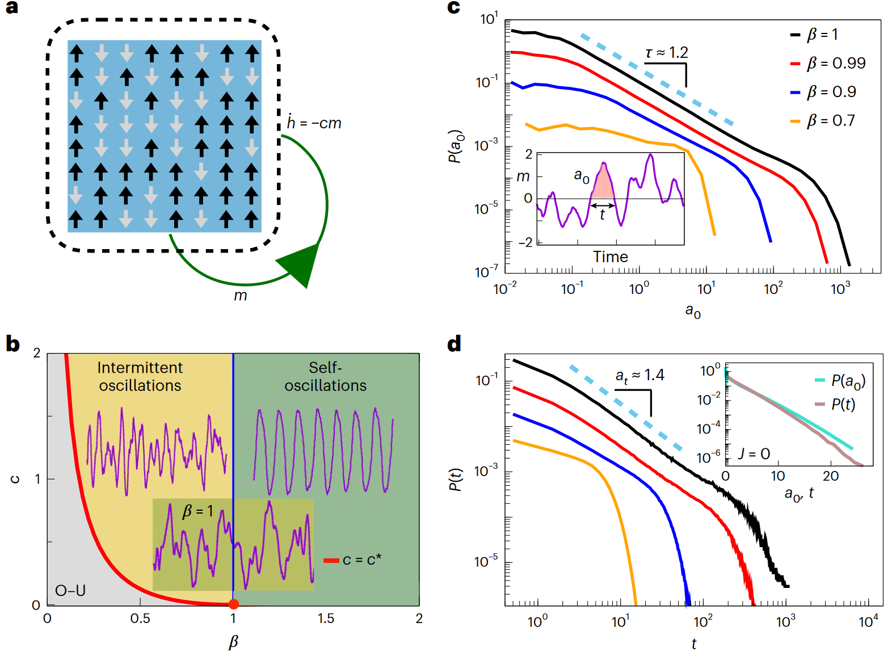
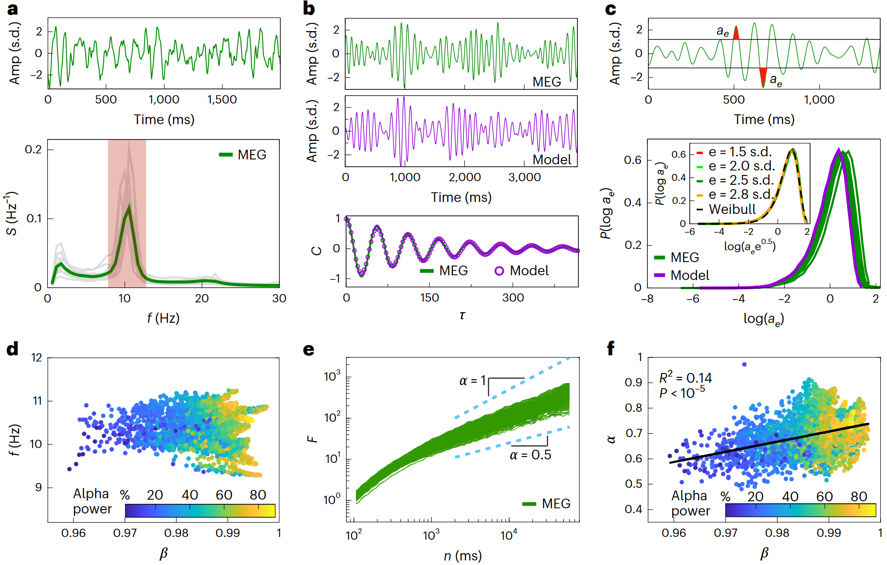
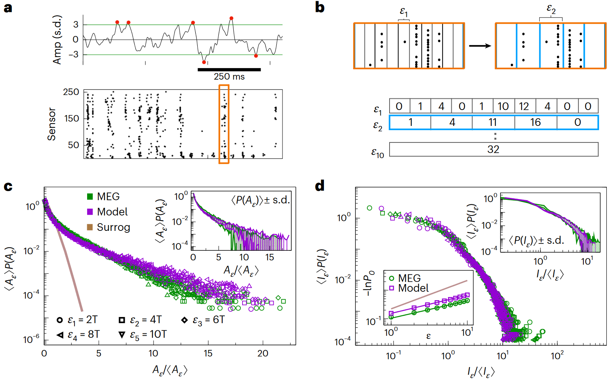
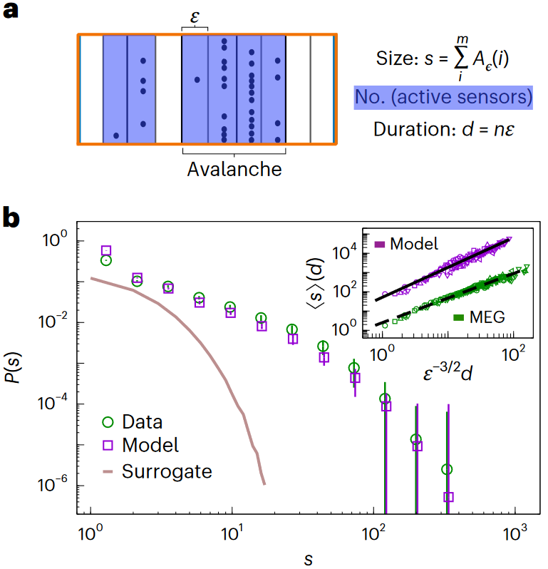
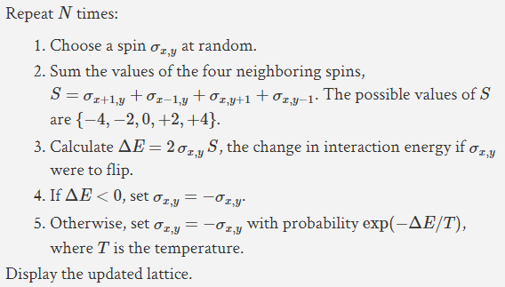

## 文献信息

- **标题 :** [Statistical modeling of adaptive neural networks explains co-existence of avalanches and oscillations in resting human brain](https://doi.org/10.1038/s43588-023-00410-9)
- **期刊 :** nature computational science
- **作者 :** Fabrizio Lombardi,Selver Pepić et.al
- **DOI :** 10.1038/s43588-023-00410-9
- **类型：**  神经动力学建模
- **来源：**  集智俱乐部 | 师兄推荐

有必要先贴上这个，[自适应伊辛模型，解释大脑中雪崩和振荡如何在临界点共存](https://swarma.org/?p=41773) ，因为已经有人做过阅读总结，我会缩减一些内容的篇幅，补充点其他的东西。

## 目的

现有模型分别解释了神经元的尺度特异性振荡（scale-specific oscillations）和无尺度雪崩（scale-free neuronal avalanches）的集体动力学，但通常是分开的不会同时解释。研究提出了一个反馈驱动的 Ising 类神经元网络（Adaptive Ising model）模型，同时解释两者。

## 方法


> `a :` 模型在下面具体解释
> `b :` 平均场自适应伊辛模型的相图，灰色表示 $c$ 小于 $c^*$ 的 Ornstein-Uhlenbeck 过程（O-U）；Andronov-Hopf 分叉分离了m(t) , $\beta > \beta_c$ （绿色阴影）的自持震荡 和 $\beta < \beta_c$ （黄色阴影）的间歇性振荡。
> `c ：` 反转时间 t 是以 m 两次到 0 的时间间隔，间隔内曲线的积分表示为 $a_0$ ，对于不同的 $\beta$，$\beta$ 接近 1 ，$a_0 \in [0.1,100]$ 时 $p(a_0)$ 近似为幂律分布。
> `d ：` 当 $\beta$ ≈ 1 时，$p(t)$ 大致呈幂律， $J_{ij} = 0$ 的解耦模型呈指数分布而不是幂律。
 
自调节是一个依赖群体活动水平的时变场 $h$，神经元自旋 $\pm 1$，数量 $N = 10000$，自旋对应单个神经元的二元性质（激活和静息）。

耦合 $J_{ij}$ 可以完全同质或非均匀、负值（抑制性）。这里考虑的基于平均场，神经元 $i$ 受到的局部场表示为 $h_i$ ，系统的哈密顿量可以表示为：
 
$$H = -\frac{J}{N}\sum_{i<j} s_is_j - \sum_i h_i s_i $$


根据 `Glauber Dynamics`$^{[1]}$ ，$s_i$ 随机地被激活，神经元状态遵循 marginal Boltzmann-Gibbs 分布。

$$P(s_i) \propto exp(\beta \tilde{h}_i s_i) \qquad \tilde{h}_i = \sum_j J_{ij}s_j + h_j$$

c 是控制反馈强度的常数：

$$\dot{h}_i = - c \frac{1}{\mathcal{N}_i} \sum^{|N_i|}_{j\in \mathcal{N}_i} s_j$$

在全连接、连续时间的限制下，可以用 Langevin 方程描述该模型，( $h$ 是均匀负反馈)：

$$\dot{m} = -m+tanh[\beta (Jm+h)] + b \xi$$

$$\dot{h} = -cm$$

从程序看比较直接：
```c++
     double pp = 1./(1.+1./exp(2.*beta*(m+H))); // 2.反馈具体作用在，会加在磁化强度上
     if(casual()<pp) news=1; // 3.影响单个Ising单元的正负概率
     ...
     H-= c*m*dt;  // 1.外加场是模型中的反馈
```

平均场体现在 $m = \left<s\right> = \frac{1}{N}\sum_i \left<s_i\right>$， $\left<s_i\right>$ 应该是表示的`系综平均`$^{[1]}$，$m$ 表示的是磁化强度（因为是Ising模型），所以去拟合MEG信号的应该是 $m$ 。

$\xi$ 是和单位无关的高斯噪声，所以随机项的振幅 $b = \sqrt{2/(\beta N)}$ , 上面的方程在通过反馈重新参数化自旋变量 $s_i$ 从 $(-1,1) \to (0,1)$ 后，可以在固定点 $(m^* = 0,h^*=0)$ 周围线性化，以计算动态特征值并构造相图。



> 人脑MEG静息态活动和亚临界 Adaptive Ising 模型的对应关系
> `a :` 上是单个MEG传感器示例，主要是Alpha频段（下的红色部分，10 Hz左右峰值），下里灰色线是单被试所有传感器的均值，绿线是所有的均值。
> `b :` 上图：α带通滤波的脑磁（MEG）信号（绿色）和含参模型的模拟活动（紫色）；（Amp代表振幅；s.d.代表标准偏差）下图：通过将自相关函数C（紫色点）的解析形式拟合到从脑磁（MEG）信号数据（绿色线）估计的自相关来推断模型参数。τ 代表时滞。（显示了拟合的质量）
> `c :` 因为模型适合在信号中重现二阶统计结构，接下来将注意力转向阈值上、通常表征爆发的高阶统计特征，对数 $a_e$ 大小的分布在被试间有小变化，文中说主要和信号振幅调制有关，分布的形状没有变化。
> `d :` 尽管分析的信号滤波在10Hz左右，$\alpha$ 波占比越大，拟合的 $\beta$ 值越接近临界点 1 。
> `e :` 分析了振幅涨落的标度行为，并提取了它们的标度指数 $\alpha$
> `f :` MEG 传感器上测量的 α 值与从模型中推断的 β 值正相关

在临界点下的黄色阴影区域，可以在线性近似下分析正在进行的网络活动 $m(t)$ 的自相关系数 $C(\tau)$:
>方法来自 23. Gardiner, C. Stochastic Methods Vol. 4 (Springer, 2009).

$$C(\tau)=e^{-\gamma \tau}(cos \omega\tau + \frac{\gamma}{\omega}sin \omega \tau)$$

-  $\gamma = (1-\beta)/2$ 是系统的弛豫时间 （即达到热动平衡所需的时间）
-  $\omega = \sqrt{\beta c -(1-\beta)^2/4}$ 是模型的特征角频率


> `a :` 过阈值事件记录
> `b :` $\varepsilon_n = nT$ 表示在n个T时间窗（采样间隔）内事件的总数
> `c :` 网络激发 $A_\varepsilon$ 被定义为一个 $\varepsilon$ 时间窗中所有传感器发生时间的数量
> `d :` $I_\varepsilon = n\varepsilon$ 定义为连续的 $A_\varepsilon = 0$ 范围内 $\varepsilon$ 时间窗的数量 
 

> `a :` 描述计算神经元雪崩事件的大小的方式，和网络激发的区别是雪崩是一个连续的时间窗序列（每个时间窗至少有一个事件）。
> `b :` 雪崩大小 s 的分布情况，P(s)：脑磁数据和模型（误差条为受试者或模型模拟的平均值，分别为 ±s.d.）；Surrogate：来自于有扰乱相位的数据的大小分布；插入小图：平均雪崩大小的分布；s，以其持续时间（d）的幂律缩放；𝜺：测量雪崩的时间箱

## 结果

- 自适应伊辛模型通过匹配它们的自相关系数和振幅波动的分布来重现单 MEG 传感器的动力学，当自适应伊辛模型调整接近，但稍低于其临界点(β ~ 1)时，重建 MEG 信号的效果最好。

- 模型能健壮的描述超阈值事件的统计数据，良好匹配仅在 β ≃ 0.99 时观察到，支撑材料中 0.98 就能看到较大偏移。

- 模拟的雪崩大小分布与数据相似。

- 极端事件的空间-时间组织强烈表明了网络状态接近于临界状态，意味着大脑活动中的振荡和雪崩的共存出现在非平衡临界点附近。

## 优点/创新点

- 最简单的一类模型，再现了神经元雪崩和振荡的共存，是现有理论模型没能捕捉到的行为，提供了一个分析上易于处理的替代方案。

- 模型可以进行解析分析，其参数可以从人类大脑活动记录中严格推断出来。

## 缺点/不足

- （我的缺点）读起来太费劲了，还有30多页的支撑材料，大致上是搞懂了，他公式的有很多是直接从统计物理中应用过来的，支撑材料里也没描述推到过程。

## 可能的结合点

- 文章研究基于的数据是单个MEG传感器，Ising 模型本身就是模拟铁磁性的，所以很合适，不知道能不能将核磁的单个体素视为一团这样的自适应Ising模型。

## 词条

#### [`[1] 系综平均`](https://blog.csdn.net/doublehhcc/article/details/85304357)

如果我们在一段足够长的时间内对系统进行某个量的观测，我们假设系统能够遍历相空间的每一个相点（尽管系统处在每个点处的概率一般不同），而观测到的物理量(Observable)，则是这些相点对应的微观态的测量值按照处在该点的概率所计算出的平均值。

也可以换个角度定义物理量：在某一个时刻，我们假想系统有无数多个“拷贝”，但是它们所处的微观态各不相同，如果去统计这一堆假想系统的微观态的分布概率，很自然地会假设它和前面提到的按照长时间演化所得到的分布概率相同。这样我们就换了一种描述形式，从时间平均转变成另一种平均，叫作系综平均，这些假想系统组成的集合就叫做系综。

虽然公式看着很复杂，在这个系统里计算程序很朴素
```c++
m+=double(s[i])/double(N); 
```

#### `[1] Glauber Dynamics`

如果编写一个计算机程序来模拟， 更新顺序和同步的问题是不能被忽略的。Glauber Dynamics方法属于MCMC算法，用在 Ising类模型上的算法如下：



文章的实现程序如下：
```C++
void single_update(int n){                  // update of the spin n according to the heat bath method
     int news;
     double pp = 1./(1.+1./exp(2.*beta*(m+H)));
     if(casual()<pp) news=1;
     else news =-1;
     if(news!=s[n]){
                          s[n]=-s[n];
                          m += double(2*s[n])/double(N);  
                    }     
     H-= c*m*dt;                           // I update also the external field according to the feedback

void update(){
       for(int i=0;i<=N-1;i++){                           // one sweep over N spins
                         int n =int(N*casual());
                         single_update(n);
                        } 
}
```
一个时间步对应于N个单次的蒙特卡洛更新

```c++
void init(){      // 棋盘格初始化
    for(int i=0;i<=N-1;i++){                    
               s[i]=1;
               if(i%2==0) s[i]=-1;
...
```

## 其他参考
- [x] [Ising 模型，Hopfield 网络和受限的玻尔兹曼机 (Ising, Hopfield and RBM)](https://leovan.me/cn/2018/01/ising-hopfield-and-rbm/)
- [x] [【知识仓库】哈密顿力学-哈密顿量 ](https://zhuanlan.zhihu.com/p/401569048) 😶‍🌫️
- [x] [玻尔兹曼分布](https://wiki.swarma.org/index.php/%E7%8E%BB%E5%B0%94%E5%85%B9%E6%9B%BC%E5%88%86%E5%B8%83)
- [ ] [Markov Chains and Mixing Times, second edition](extension://idghocbbahafpfhjnfhpbfbmpegphmmp/assets/pdf/web/viewer.html?file=https%3A%2F%2Fpages.uoregon.edu%2Fdlevin%2FMARKOV%2Fmarkovmixing.pdf)
- [x] [Glauber’s dynamics | bit-player](http://bit-player.org/2019/glaubers-dynamics)
- [x] [随机动力学（4）---Langevin 方程](https://zhuanlan.zhihu.com/p/447935420) 😶‍🌫️
- [ ] [Andronov-Hopf 分岔 | 尤里·A·库兹涅佐夫教授  (荷兰乌得勒支大学数学系)](extension://idghocbbahafpfhjnfhpbfbmpegphmmp/assets/pdf/web/viewer.html?file=http%3A%2F%2Fwww.mashqliu.com%2FUploads%2Ffile%2F20200812%2F20200812155252995299.pdf)
- [x] [数学背景知识补充——雅可比矩阵](https://zhuanlan.zhihu.com/p/81102093)
- [x] [系综](https://zh.wikipedia.org/wiki/%E7%B3%BB%E7%BB%BC)