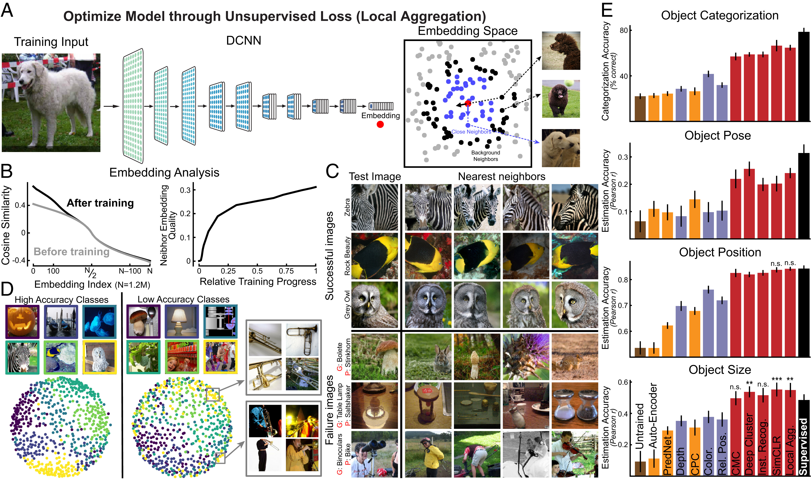
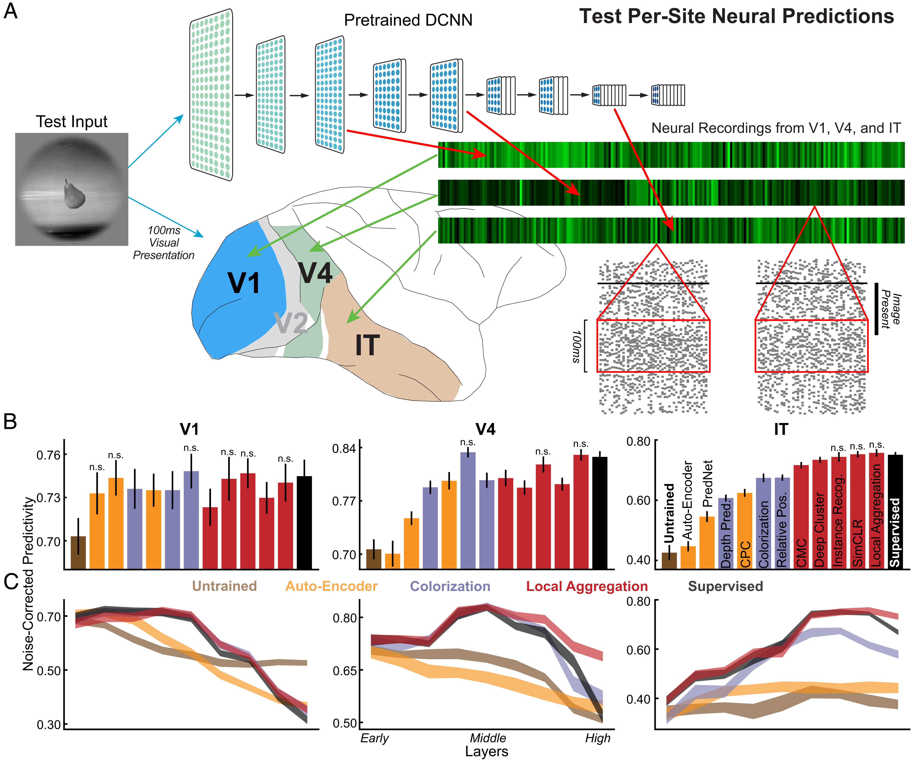
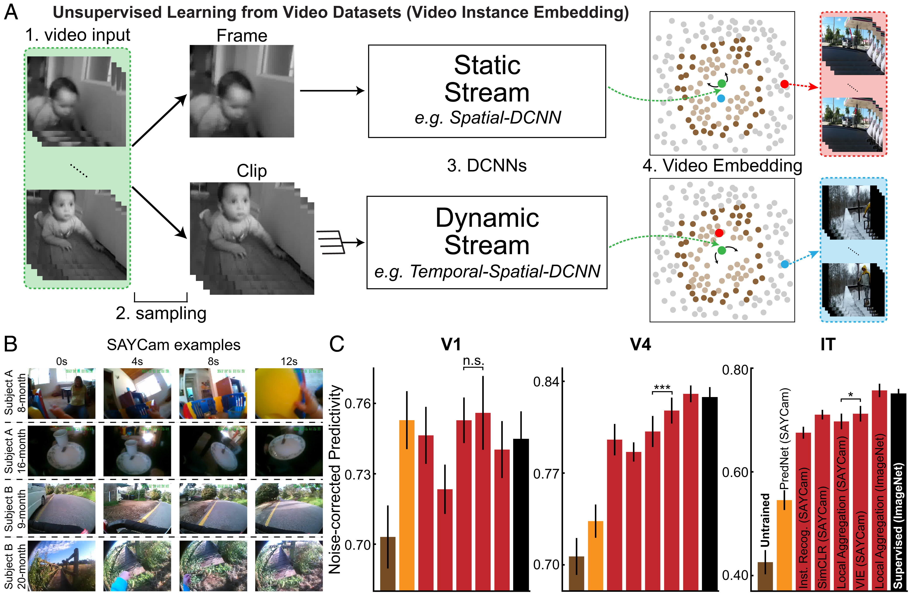
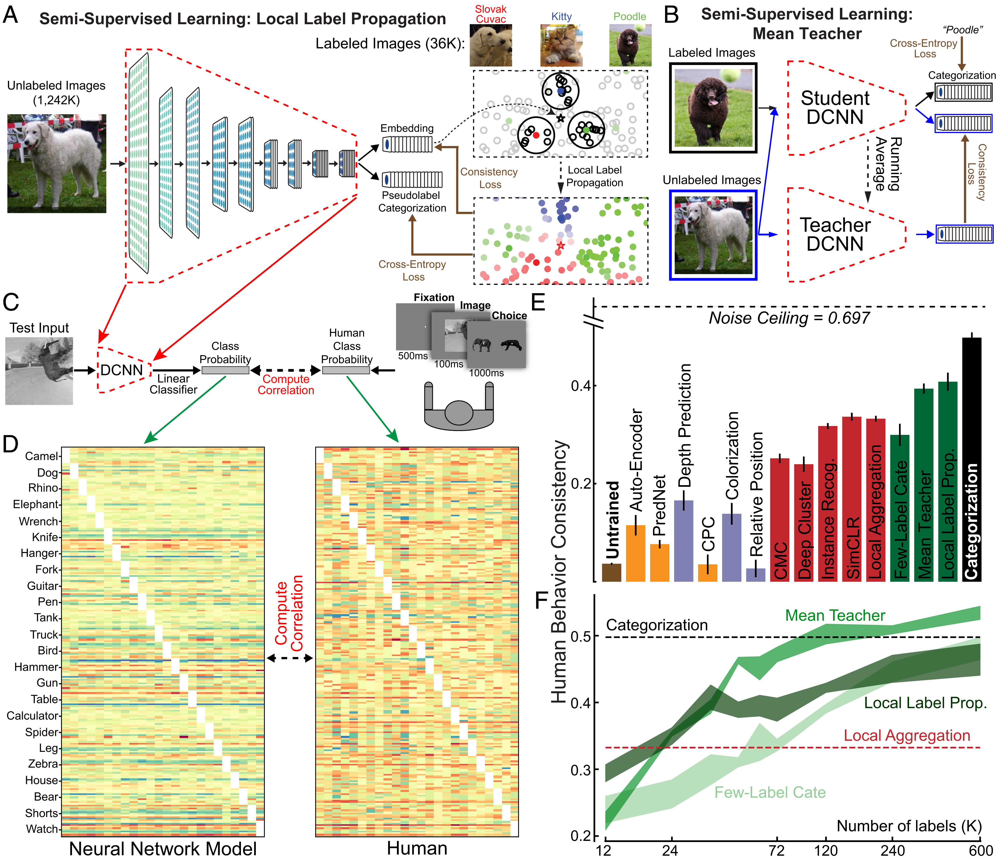

## 文献信息

- **标题 :** [Unsupervised neural network models of the ventral visual stream](https://www.pnas.org/doi/full/10.1073/pnas.2014196118)
- **期刊 :** PNAS
- **作者 :** Chengxu Zhuang et.al
- **DOI :** 10.1073/pnas.2014196118
- **类型：**  
- **来源：**  

## 目的

DNN 仍不能作为腹侧流发育的模型，部分原因是采用了监督训练方法，相比婴儿在发育过程中得到的信息，需要更多的标签。

无监督对比嵌入方法学习的神经网络模型在多个腹侧视觉皮层区域实现神经预测准确性，其等于或超过使用当今最佳监督方法衍生的模型，并且这些神经网络模型的隐藏层的映射在腹侧流上是神经解剖学一致的。

作者尝试基于无监督对比学习来预测腹侧视觉皮层区域的神经活动。

## 方法

### 无监督学习算法
通过最大化无关图像之间的嵌入距离，同时保持相关视图之间的相似性，对比目标实现了一种最大化互信息的形式。简单说是一种对比学习算法，拓扑上更关注局部。

为了评估这些无监督式学习算法，使用标准的 ResNet18 网络架构进行了训练，训练数据来自 ImageNet 。

传输性能的评估是通过在每个预先训练的无监督表示的任何给定层上添加一个完全连接的线性读出层，然后只训练该读出层的参数。SoftMax输出用于分类任务，而RAW回归输出则用于连续估计任务。

> 图1  基于深层对比嵌入的无监督神经网络的改进表示。
> - `A:` 一种高性能深度对比嵌入方法的示意图：LA 算法。通过 DCNN 将所有图像嵌入到较低维度的空间中，最小化到接近点(蓝点)的距离，并最大化到当前输入(红点)的远点(黑点)的距离。）
> - `B:` 训练前后嵌入分布的变化。左：对于每幅图像，计算和排序与其他图像的余弦相似性，然后对所有图像的相似性进行排序。右：随着训练的进行，平均邻居嵌入“质量”。邻居嵌入质量定义为10个最近邻居是同一 ImageNet 类标签比例。
> - `C:` 嵌入空间中最接近的四个图像。前三行显示在嵌入空间 (K = 100)中使用加权 K- 最近邻(KNN)分类器成功分类的图像，而底部三行显示未成功分类的例子。即使无监督嵌入中的统一距离与 ImageNet 类不一致，嵌入中的附近图像仍然以语义上有意义的方式相关联。
> - `D:` 使用多维标度(MDS)方法的局部聚合嵌入空间的可视化。高验证精度的类显示在左边，低精度的类显示在右边。
> - `E:` 无监督网络在目标分类、目标姿态估计、目标位置估计和目标大小估计四个评估任务中的性能。红色条是对比嵌入任务；蓝条是自监督任务；橙色条是预测编码方法和自编码器；棕色条是未经训练的模型，黑色条是在 ImageNet 分类标签上监督训练的模型。

>图2 无监督神经网络与视皮层数据相似性的量化。
> - `A:` 无监督训练后，收集网络在所有刺激上运行的神经反应，然后使用来自每个卷积层的网络单元激活来正则线性回归的预测 V1，V4和IT神经反应。预测响应和记录响应之间的 Pearson 相关性在保持的验证图像上计算，然后通过该神经元的噪声上限进行校正。
> - `B:` 预测性最好的神经网络层的预测能力。误差线代表神经元和模型初始化（材料和方法）的自举标准误差。未经训练和监督分类分别代表负、正对照。
> - `C:` 来自所有网络层的每个大脑区域的神经预测性，几个代表性无监督的网络，包括自编码器，着色和局部聚合。

> 图3 从现实世界的发展数据流中学习。
> - `A:` VIE 方法示意图。帧被抽样成不同长度和时间密度的序列。然后使用静态(单幅图像)或动态(多幅图像)途径将它们嵌入低维空间。
> - `B:` 来自 SAYCam 数据集的例子，由头戴式摄像机在6至36月之间的婴儿身上每周收集2小时。
> - `C:` 对于基于 SAYCam 和 ImageNet.n.s. 训练的模型，神经网络预测能力差异不显著

> 图4 行为一致性与半监督学习。
> - `A:` 在 LLP 方法中，DCNN 为每个示例生成嵌入和类别预测。利用未标记输入的嵌入推断其伪标记，考虑其标记邻居(着色点)的投票权重由其距离和局部密度决定。使用每个例子的置信度加权(颜色亮度)优化 DCNN，使其类别预测与伪标签匹配，而其嵌入被吸引到具有相同伪标签的嵌入并被其他嵌入排斥。
> - `B:` 为了测量行为一致性，我们从每个模型的倒数第二层对来自24个类的一组图像训练线性分类器。由此产生的图像分类混淆矩阵被与来自执行相同的强制选择任务（二选一）的人类的数据进行比较，其中每个试验从500毫秒的固定点开始，呈现100毫秒的图像。
> - `C-D:` 人类受试者和模型的混淆矩阵示例(用36,000个标签训练的 LLP 模型)。每个类别有10幅图像作为测试图像，用于计算混淆矩阵。
> - `E-F:` 行为一致性(E)和分类准确度百分比(F)

## 结果

在所有评估的目标功能中，对比度嵌入目标（图1E中的红色条）表现出的转移比其他无监督的方法要好得多，包括自我监督的目标（蓝色条），预测性编码方法（橙色条）和自动编码器，接近监督模型。

- 证明深度对比无监督嵌入方法可以准确预测灵长类动物腹侧视觉通路多个视觉皮层区域中图像诱发的神经反应，与监督模型的预测能力相当。 

- 当在来自儿童真实发育经验的高噪声和有限的数据集上训练时，深度对比嵌入学习的视觉表示在腹侧视觉流的不同区域上存在良好的预测神经活动的能力，并在下游视觉任务上显示出与使用手工清洁数据相匹配的性能。

## 优点/创新点

- 工作的创新点是：视觉系统通过自然的视觉经验在出生后发展，所以用在现实世界中生物更可信的计算(在真实的发育视频中运行的无监督或半监督的对比嵌入损失)替代一个有效但生物不可信的学习方式(在精选静止图像的数据集中进行严格监督的分类训练)。

## 缺点/不足

- 尽管前馈网络可能足以预测刺激诱发神经反应的时间平均值，但它们不足以描述真实神经元的动力学。

## 可能的结合点

- 可以使用文章中`评估传输性能`的方法。