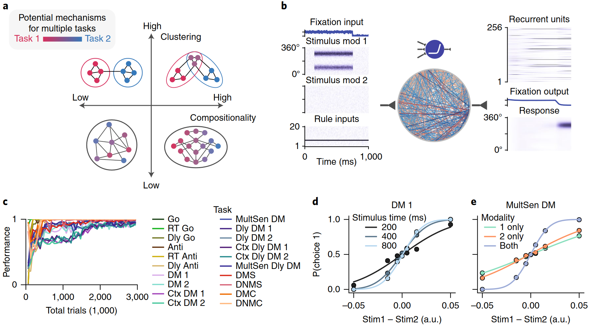
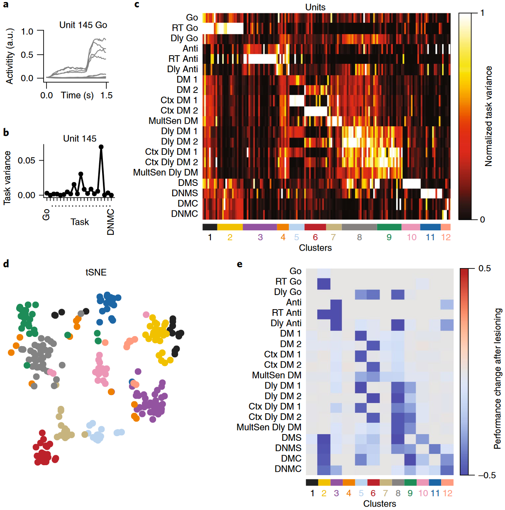
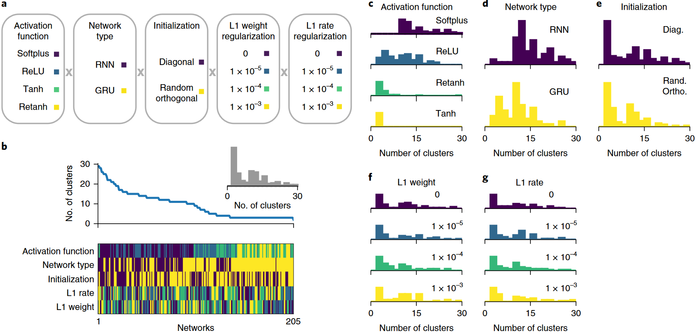
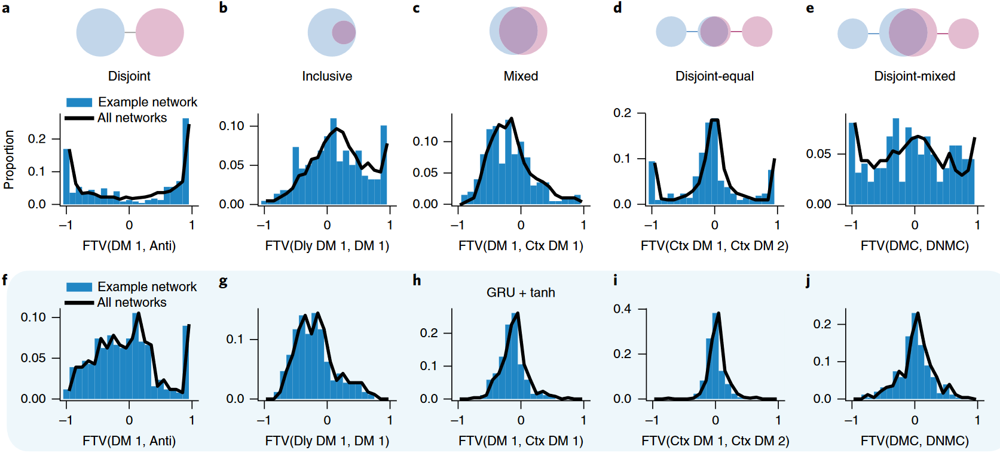
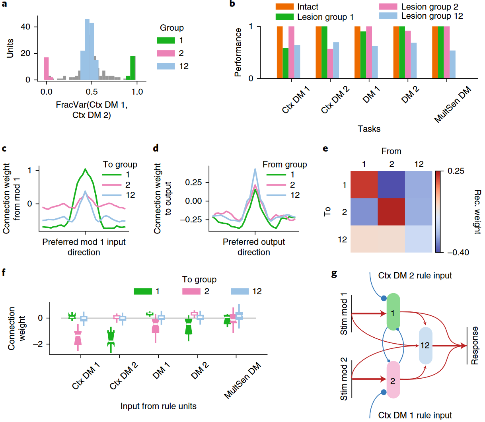
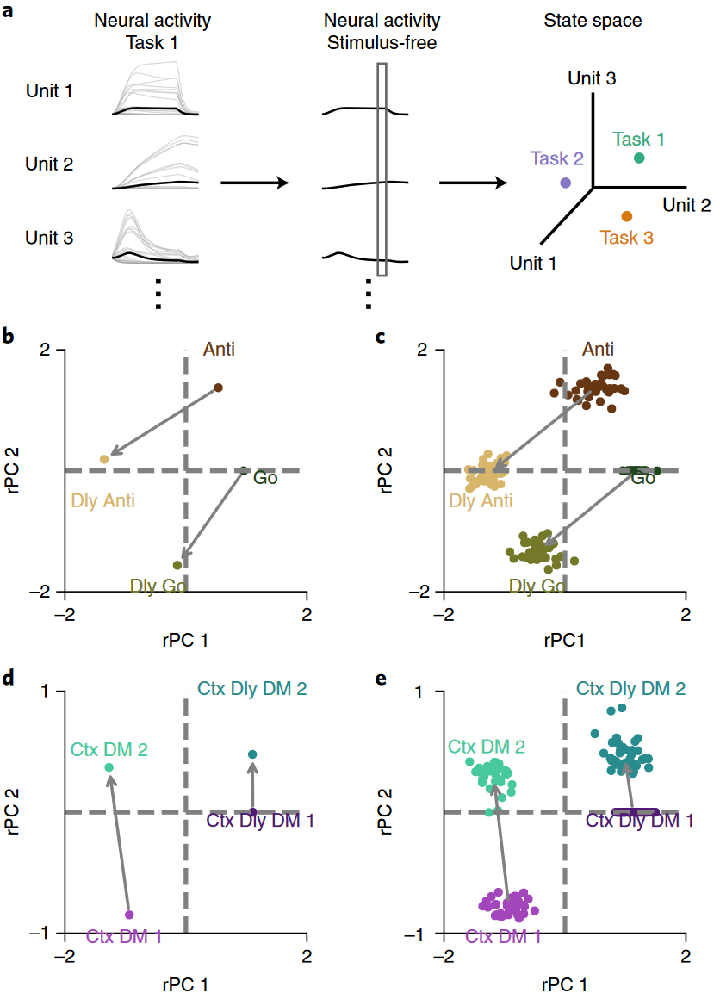
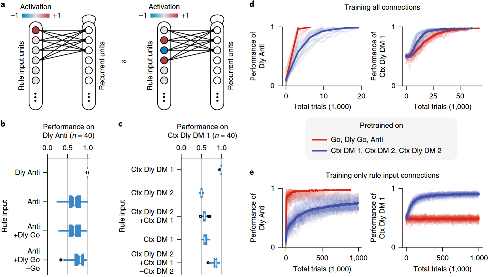
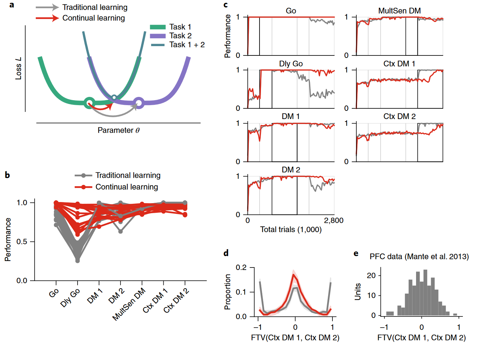
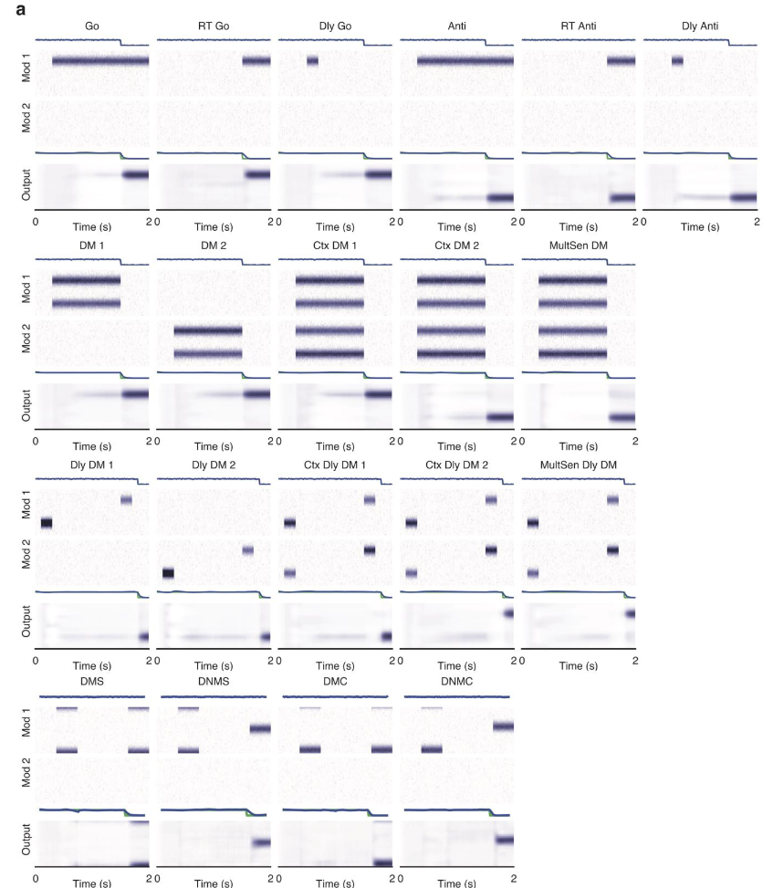

## 文献信息

- **标题 :** [Task representations in neural networks trained to perform many cognitive tasks](https://doi.org/10.1038/s41593-018-0310-2)
- **期刊 :** nature neuroscience
- **作者 :** Guangyu Robert Yang et.al
- **DOI :** 10.1038/s41593-018-0310-2
- **类型：**  认知任务 + RNN
- **来源：**  

## 目的

**训练单个循环神经网络来执行20个认知任务（这些任务依赖于工作记忆、决策、分类和抑制性控制等），想要探索大脑灵活执行多项任务能力的潜在机制。**

- 发现训练后的循环单元可以发展成功能上专门用于不同认知过程的集群，引入了一个简单的量化任务单个神经元表征间关系的措施，网络在连续学习技术下产生了类似于前额叶神经元记录的混合任务选择性，为研究多认知任务的神经表征提供了一个计算平台。

## 方法

选择的任务大多用于非人类动物的神经生理研究，对我们对认知神经机制的理解至关重要

> `a:` 同网络多任务组合方式的示意图
> `b:` 256个单元的RNN，输入两个模态的刺激模态和规律信号
> `c:` 学会了20个任务，表现曲线
> `d:` 感知DM依赖于信息的时间整合，因为当嘈杂的刺激呈现更长的时间时，网络性能会提高。
> `e:` 在多感觉集成任务中，结合了来自两种模式的信息以提高性能

> `a:` 示例中单个神经元的活动，不同线对应不同刺激条件。
> `b:` 该神经元在所有任务的活动差异
> `c:` 单元活动跨任务标准化到0-1，基于标准化后的任务方差 k-means 聚类划分簇，按簇排序如图。一个任务可以设计几个集群的单元。
> `d:` 这256个单元任务方差矢量的t-SNE可视化结果
> `e：` 消融实验，簇缺失对任务性能的影响

> `a:` 训练的 $4 \times 2\times 2\times 4\times 4$ 个网络的超参数
> `b:` 在这些超参数中，簇数量由激活函数决定，(上)网络按照集群数量排序，（下）网络对应的超参数
> `c：`具体细分的表示

## 结果

>  成对任务之间的多种神经关系。对于一对任务，用所有单元上的 FTV（fractional task variance ）分布来表征他们的神经关系。
> `a-e：`在 softplus 激活函数的网络，观察到五种典型的关系：不相交(disjoint)、包含(inclusive)、混合(mixed)、不相交-重叠(disjoint-equal)、不相交-混合(disjoint-mixed)
> `f-j：`Tanh激活函数、GRU结构的网络中，FTV分布基本上是混合或重叠的。

对于单元 $i$ ,任务A、任务B，其中 $TV_i(A)、TV_i(B)$ 是任务A\B的任务方差。$FTV_i(A,B)$ 接近正负 1 意味着单位 $i$ 在这俩任务中具有选择性。
$$FTV_i(A,B) = \frac{TV_i(A)-TV_i(B)}{TV_i(A)+TV_i(B)}$$

> 对 Context-dependent DM 任务的刨析
> `a:` DM1和DM2的FTV标注出三个明显的簇，1、2、12
> `b：`消融实验表明去除簇1、簇2分别不能进行CtxDM1、2任务，其他任务性能基本不变。损伤12破坏所有任务的性能。
> `c-d：`簇的连接权重f
> `e-f:` 簇1、2兴奋都会抑制对方
> `g: `根据上述分析构造簇之间的环路

> 任务在状态空间中的组合表示。
> `a:` 每个任务表示是刺激呈现结束后RNN的群体活动，黑色线是在不同刺激条件间平均后的结果
> `b:` 示例网络前两个主成分空间中 Go，Dly Go等任务的表示；`c:` 扩大到20个网络
> `d-e：`其他四个任务示例网络、40个网络的表示

> 通过规则输入的组合来执行任务，证明了任务的表示原则上是可以组合的（略）

> 认知任务的序贯训练，即持续学习。对新任务最优的网络参数可能对旧任务具有破坏性，灰色线展示传统学习方法，红色线展示连续学习技术的最终表现。

## 创新点/优点

- 发现不同任务在文章网络中的表现形式呈现出组合性，是认知灵活性的一个关键特征。
- 使用最近提出的连续学习技术，能够训练网络来连续学习许多任务。

## 缺点/不足

- 目前还不清楚标准的循环网络架构能否完成具有挑战性的复合任务。
- 使用的机器学习规则在生物学上没有得到验证。在整个试验过程中直接提供规则输入，因此网络不需要在内部将其持久化保存。

## 可能的结合点

- 我第一次读RNN结合动物行为学研究的文章，感觉他的这一套方法也在SNN上适用。

## 其他

**任务列表**：

- **Go** ： 单一刺激随机在模式1/2中显示，应该在刺激的方向做出反应，刺激出现在注视线索消失之前
  - Reaction-time go : 注视线索不会消失，刺激后应立刻响应
  - Delayed go ：刺激短暂出现后有一个延迟，直到注视提升消失
- Anti-response ： 与Go相同，反应方向相反
  - Reaction-time anti-response ： 
  - Delayed anti-response : 
- **DM**  ：每个实验同时显示两个刺激直到实验结束，两个刺激的范围不同
  - Decision making 1 : 两个刺激都在模式1中，应对刺激较强的方向做出反应
  - Decision making 2 : 两个刺激都在模式2中，应对刺激较强的方向做出反应
  - 每个刺激都出现在模式1和模式2中出现
    - Context-dependent decision making 1 ：忽略模式2的信息，并对模式1更强的刺激做出正确响应
    - Context-dependent decision making 2 ：与上述相反
    - Multi-sensory decision making : 对刺激组合强度最强的模式，做出正确的响应
- **Dly DM** ：与上述DM类似，两个刺激在时间上分开，有一定延迟，需要工作记忆（也是五个任务，略）
- **Matching** ：两个刺激连续出现，中间有延迟，每个刺激都可以出现在模态1/2，网络响应取决于是否匹配。
  - Delayed match-to-sample
  - Delayed non-match-to-sample 
  - Delayed match-to-category
  - Delayed non-match-to-category