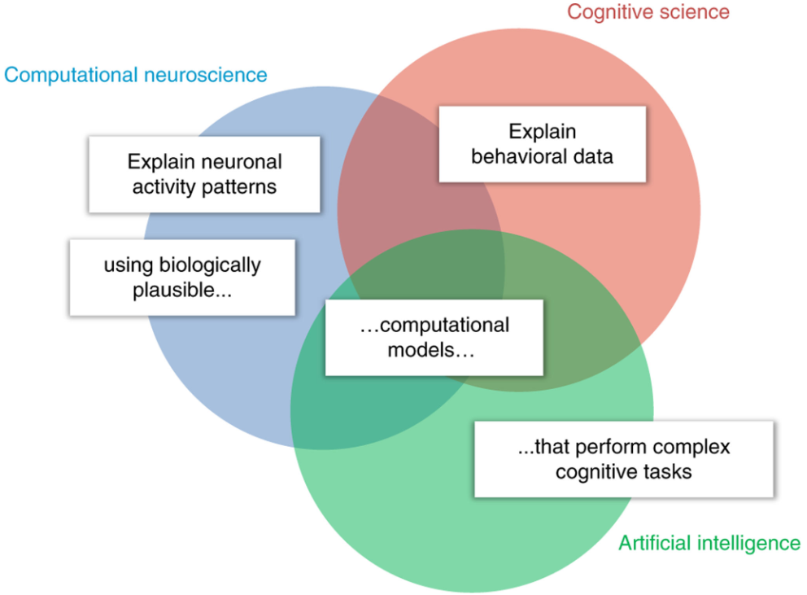

## 文献信息

- **标题 :** [Cognitive computational neuroscience](https://www.nature.com/articles/s41593-018-0210-5)
- **期刊 :** Nature Neuroscience
- **作者 :** Nikolaus Kriegeskorte, Pamela K. Douglas
- **DOI :** 10.1038/s41593-018-0210-5.
- **类型：** review
- **来源：** 偶然发现

## 主要内容

认知神经科学绘制了人类和非人类灵长类动物脑的全脑功能布局，但是尚未实现大脑信息处理的完整计算。面临的挑战是建立与大脑结构和功能一致的大脑信息处理的计算模型，并执行复杂的认知任务。

- 认知科学已从自上而下进行，将复杂的认知过程分解为其计算成分。一个成功的故事是贝叶斯认知模型，该模型将有关世界的先验知识与感觉证据结合在一起。

- 计算神经科学采取了自下而上的方法，证明了生物神经元之间的动态相互作用如何实现计算成分功能。其中包括用于感觉编码的组件，归一化，工作记忆，证据积累和决策机制和运动控制，还开始测试可以解释高级感觉和认知大脑表示的复杂计算模型。

- 人工智能已经显示了如何合并组件功能以创建智能行为。

本篇综述第一部分回顾了认知计算神经科学朝着符合认知科学标准（执行认知任务并解释行为的计算模型）和计算神经科学（神经生物学上可解释大脑活动的机械模型）的成功工作。第二部分描述相反方向的发展，从理论到实验，回顾了已经开始使用大脑和行为数据测试计算模型任务表现的新兴工作。

### From experiment toward theory

#### Models of connectivity and dynamics.

从测量的大脑活动到计算理解的一条路径是对大脑的连通性和动态进行建模。大脑区域的连通性描述了区域之间的相互作用，神经动力学可以在多个尺度上进行测量和建模，从局部相互作用的神经元集合到全脑活动。
大脑动力学的第一个近似是由测量的响应时间序列之间的相关矩阵提供的，该响应时间序列表征了位置之间的成对“功能连接”，通过阈值化相关矩阵，可以将区域集合转换成无向图，并使用图论方法进行研究。该领域的大多数工作都集中在表征大脑区域总体激活水平上的相互作用，分析基于激活区域的均值，测量了与所有激活区域相关性的波动，而不是区域之间交换的信息。

#### Decoding models.

理解大脑计算机制的另一条途径是揭示每个大脑区域中存在的信息。激活表明一个脑区参与到某一个任务中，解码可以帮助我们超越激活的概念。在最简单的情况下，解码揭示了两个刺激中哪一个引起了测量的反应模式。表示的内容可以是感觉刺激(在一组替代刺激中被识别) ，刺激属性(如光栅的方向) ，认知操作所需的抽象变量或动作，解码和其他类型的多变量模式分析有助于揭示区域表征的内容。解码器一般不是构成大脑计算模型的组件。它们揭示了结果，但没有揭示大脑计算的过程。

#### Representational models.

除了解码之外，我们想详尽地描述一个区域的表征，解释它对任意刺激的反应。表征模型试图对表征空间做出全面的预测，因此比解码模型对计算机制提供更强的约束，目前有三种类型的表示模型：解码模型、模式组件模型和表示相似性分析，都是基于对实验条件的多变量描述。

在编码模型中，每个体素跨刺激的活动概况被预测为模型特征的线性组合。在模式组件模型中，描述表征空间的活动概况的分布被建模为一个多变量正态分布。在表征相似性分析中，表征空间拥有的属性是刺激引起的活动模式的表征差异。

---

在缺乏执行任务的计算模型的情况下，它们解决不了纽厄尔（Newell）提出的观点，即提出一系列问题可能永远不会揭示认知背后的计算机制。这些方法无法构建通向理论的桥梁，因为它们不是在某些认知功能工作时精确指定的测试背后的信息如何处理的机制模型。

### From theory to experiment

计算模型可以在不同描述级别，在认知保真度与生物保真度之间进行权衡，仅旨在捕捉神经元组成和动力学模型往往无法成功解释认知功能；仅捕获认知功能的模型很难与大脑联系起来。

#### 神经网络模型

>>>>>--- 

可以通过数百万个输入模式以低廉的成本对其进行探测，以了解内部表征，这种方法有时称为“合成神经生理学”

> 也就是我现在在做的，略

#### 认知模型

认知层面的模型不必同时使用生物学上合理的组件解决实际问题，在神经网络仍有不足的高级认知领域有进展，可以提供有用的抽象。

简要讨论三类认知模型：

- production systems (生产系统)：

  使用规则和逻辑，象征性的对符号操作，捕捉认知而不是感知/运动控制，“产生”是根据“如果-那么”规则触发的认知行为。类似于我们在实现某些认知目标时的有意识思维流（符号主义）。生产系统的形式主义还提供了通用的计算架构，ACT-R5等生产系统最初是在行为数据指导下开发的。最近此类模型也开始测试其预测区域平均功能磁共振成像激活时间过程的能力。[链接](https://research.rug.nl/en/publications/a-step-by-step-tutorial-on-using-the-cognitive-architecture-act-r)

- 强化学习模型： 略
  
- 贝叶斯认知模型：
  
  贝叶斯推理简单地说就是根据概率规则将数据与先验信念相结合。

### Looking ahead

#### Bottom up and top down.

#### Integrating Marr’s levels.

- 计算理论
- 表示和算法
- 神经生物学实现

认知科学自上而下的将认知分解为各个组成部分，从计算理论 $\to$ 表示和算法。
计算神经科学自下而上进行，将神经元构建块组成表示和算法，神经生物学实现 $\to$ 表示和算法。
人工智能结合简单组件构建表示和算法，来实现复杂的智能功能。 

三个学科都集中在大脑和心智的算法和表示上，从而提供了互补的约束。可共享的组件包括认知任务、大脑和行为数据、计算模型以及通过将模型与生物系统进行比较来评估模型的测试。