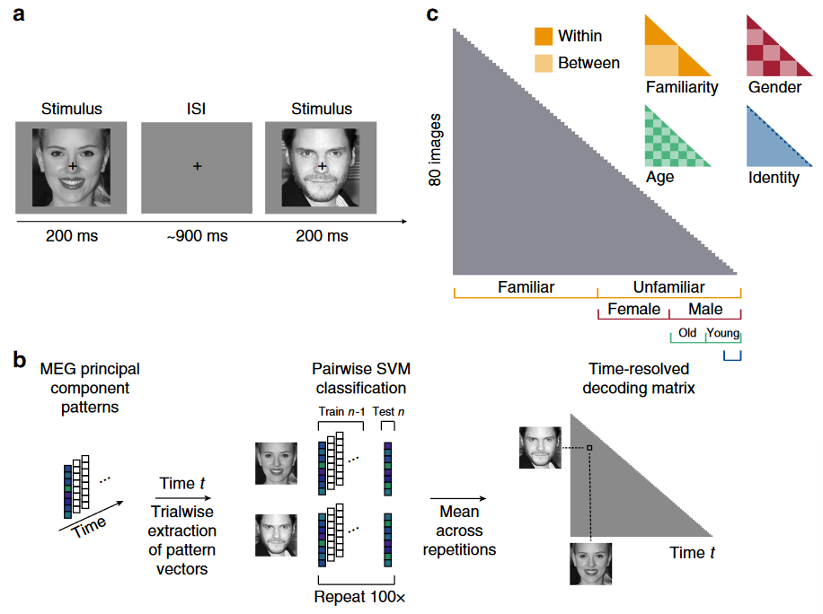
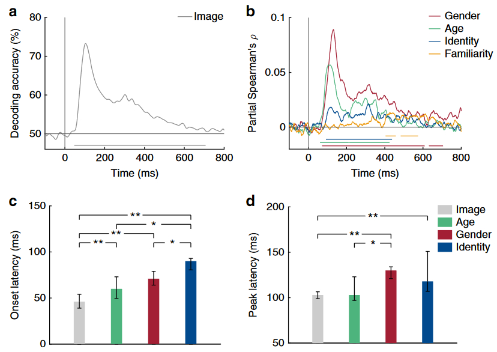
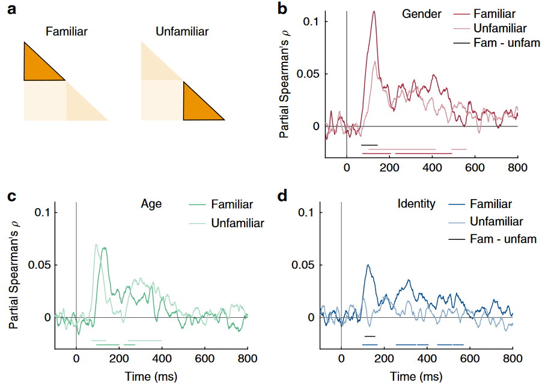
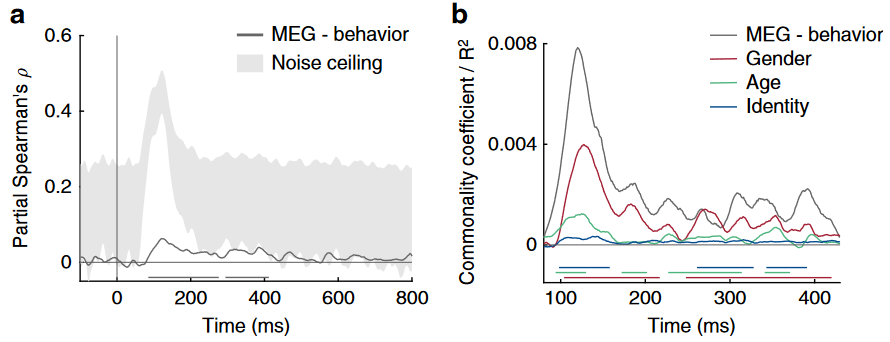

## 文献信息

- **标题 :** [How face perception unfolds over time](https://doi.org/10.1038/s41467-019-09239-1)
- **期刊 :** Nature communications
- **作者 :** Katharina Dobs et.al
- **DOI :** https://doi.org/10.1038/s41467-019-09239-1
- **类型：** 假设导向 | 实验/模型探索
- **来源：** 导师提供

## 目的

## 方法

> Fig 1 任务和多变量MEG分析
- `a: ` 被试看 80 张面孔图片(8熟悉、8不熟悉，每个身份5张)，1-back 任务，每图200ms，800-1000ms的刺激间隔。每个被试一共28个 block ，每个 block 中有100个trials，20个 1-back task 随机。
- `b: `  从所有MEG传感器中提取的数据在预处理阶段（降噪去头动见原文）从306个通道被压缩到70个主成分，即 pattern vector。通过将同一条件的 trials 随机分配到5个分割，在每个分割平均 trials 作为组处理。（在交叉验证中）随机选一组到测试集，其余进入训练集（？）。随后进行二值化的分类成对比较，训练SVM得到成对交叉验证（5-fold(身份五折，其他三个属性是8折)）分类准确率，重复100次，作为对每对刺激相似性的度量。这个分类训练在每个被试上分别进行，数据在每个时间点独立。
- `c: ` 平均后填入对应位置，构建了一个 80x80 的表示性差异矩阵（RDM），只显示下半部分 （80 × 79/2，对角线无定义）。随被试和时间点变化，后续称为 MEG RDM。图中右上侧的分组，将组间设置为1，组内为0，能构建4个不同的RDM。为计算每个RDM和MEG数据的相关性，在每一个时间点计算RDM与MEG RDM的斯皮尔曼相关系数，这一过程是剔除了所有其他RDM模型的（指除了该属性外其他属性相同，如在性别上训练一个分类器,选择男性和女性身份测试时,都老/年轻，熟悉/陌生。），因为身份包含性别比较，从而能将贡献解耦。按照性别、年龄和熟悉度，在16个身份中选择两个进行测试一共32种组合。

为了进一步排除低级特征对结果的贡献，提取 VGG-Face 第二层卷积层的特征图，使用 1-皮尔逊相关性衡量每一对不同刺激间底层图像特征的RDM。

行为RDM基于最后一次训练，要求被试将他认为相似的缩略图排在一起，计算排完缩略图在屏幕上的成对平方距离。

## 结果

> Fig 2 从MEG信号解码面孔图片和维度。
> `a: ` 图像解码的时间过程
> `b: ` 在时间轴上 MEG RDMs 和基于性别（红）、年龄（绿）、身份（蓝）和熟悉度（橙）的 RDM 模型之间的偏斯皮尔曼相关系数。（剔除了其他RDM和低水平特征的影响）图下线表示使用基于聚类的 sign permutation test （符号置换检验）显著的时间。
> `c、d: ` 能显著解码图像、年龄、性别、身份的起始和峰值潜伏期，基于 one-sample twosided bootstrap test。

- 年龄和性别信息首先从 MEG 表征中提取出来，比身份信息提前20毫秒左右。
- 性别和身份的神经表示在刺激发作后约125毫秒以相似的潜伏期达到峰值。
- 发现 MEG 表征在更晚的潜伏期(403-457,482-573 ms) 才能将熟悉和不熟悉的身份分开。_表明在提取身份信息开始很长时间之后，可以从 MEG 信号中读出一个较晚的通用熟悉特征。这种熟悉特征的基础尚不清楚，可能反映了与给定的熟悉个体相关的记忆的激活，对熟悉面孔的情绪反应，或一般的熟悉反应。_

行为证据表明，熟悉的面孔比不熟悉的面孔更容易被处理,

> Fig 3

尽管熟悉的面孔的峰值相关性要高得多，但熟悉面孔的身份信息的发作潜伏期并不比所有面孔的效果早。陌生面孔不在区别身份；与陌生相比，熟悉面孔性别、身份的峰值显著增强。
熟悉性增强出现在处理的早期，这表明视觉处理的早期阶段被熟悉的面部特征调优过（可能是通过局部循环过程）。

> Fig 4 MEG 与行为 RDM 比较
> `a: ` 行为和 MEG RDMs 时间过程的偏斯皮尔曼相关系数，剔除低级特征影响。灰色阴影表示根据被试之间的变异性估计的噪声上限。
> `b: ` 基于模型共性分析显示MEG和行为（灰）之间的共享方差部分。

行为可以预测 MEG 反应，并且共同方差主要反映性别信息，其次是年龄，然后是身份。

## 创新
- 首次揭示了熟悉度如何以及何时影响不同面部维度的表征。
## 不足
- 缺乏空间分辨率。
- 应该令一半被试熟悉一半身份，另一半被试熟悉另一半身份。

## 可借鉴

## 其他

- `1-back task` ：参与者会看到一系列的刺激（例如，字母、数字、图像等），每个刺激出现一次并持续一段时间，然后消失，接着下一个刺激出现。参与者的任务是判断当前出现的刺激是否与前一个刺激（即1-back）相同。需要参与者持续关注刺激，并在工作记忆中保持前一个刺激的信息，以便与当前刺激进行比较。这种任务可以有效地评估个体的工作记忆和注意力水平。此处的作用应该是让被试集中精力。
- `符号置换检验` ：一种非参数统计检验方法，用于检验两组数据是否来自同一分布，或者一个样本的中位数是否等于零或其他指定值。
  - 计算每个观测值与样本中位数的差，然后取这些差的符号（正或负）。
  - 计算所有正差和所有负差的数量。
  - 通过随机重新分配正负符号（即进行置换），生成一个随机分布。
  - 比较实际观察到的正负差的数量与随机分布，以确定观察到的差异是否可能是随机产生的。