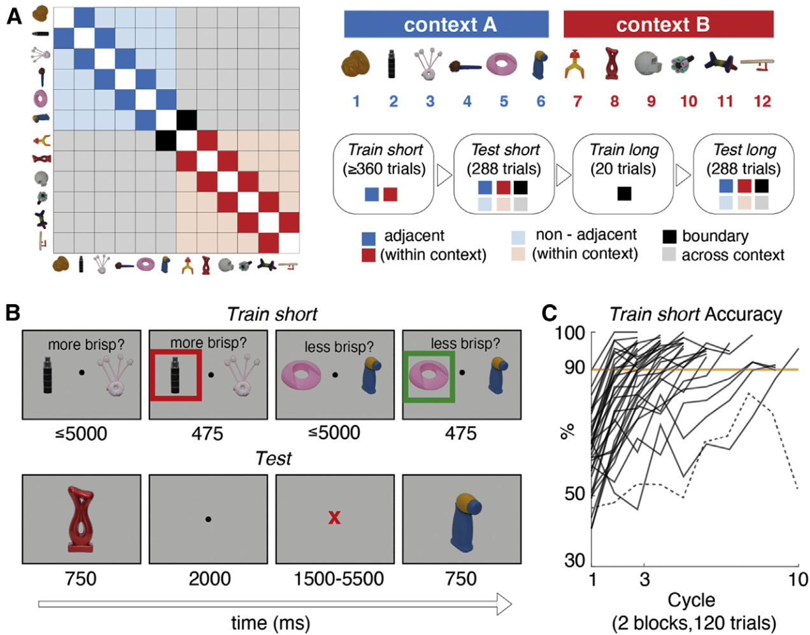
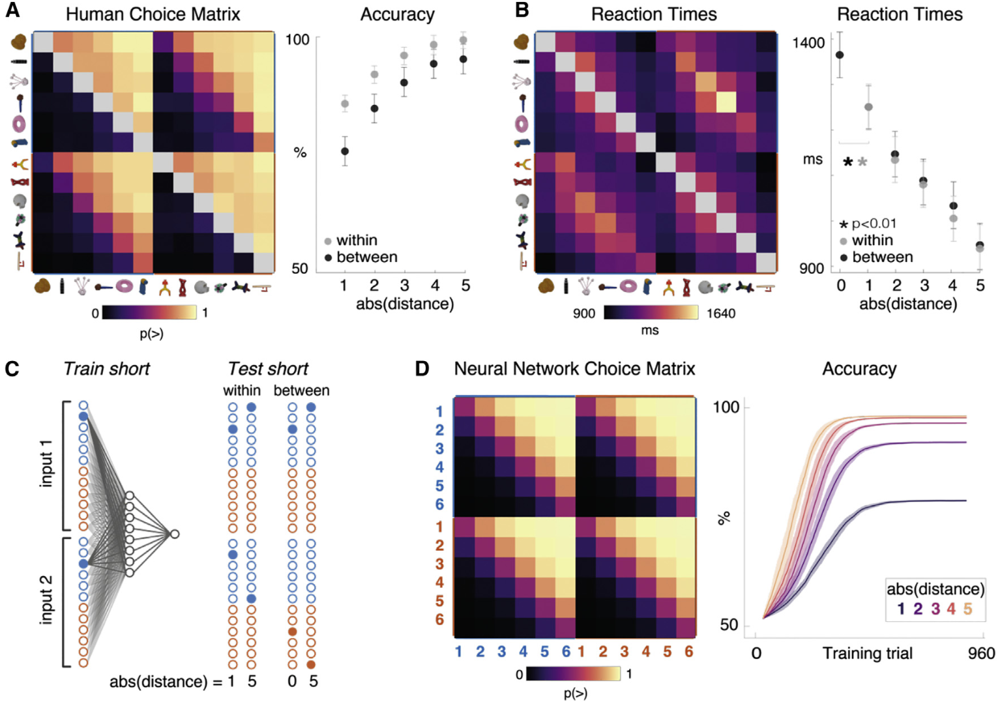
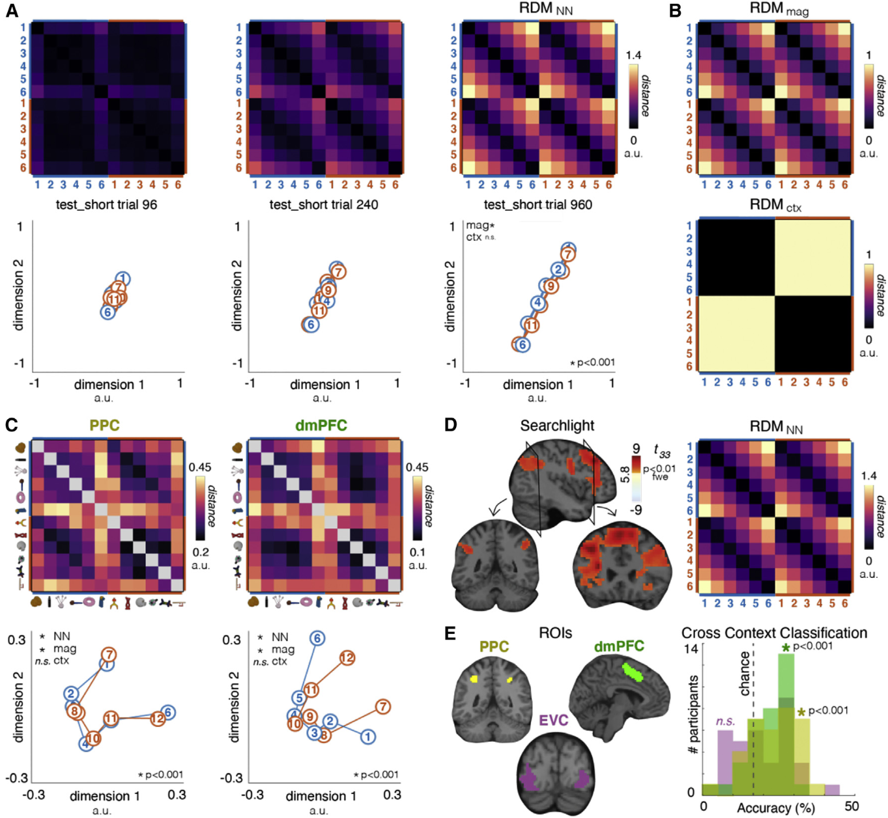
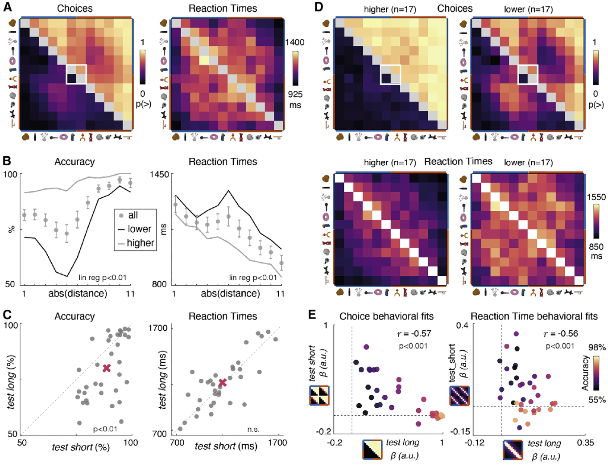
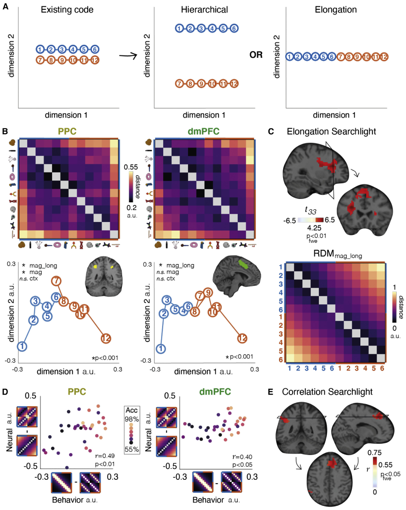
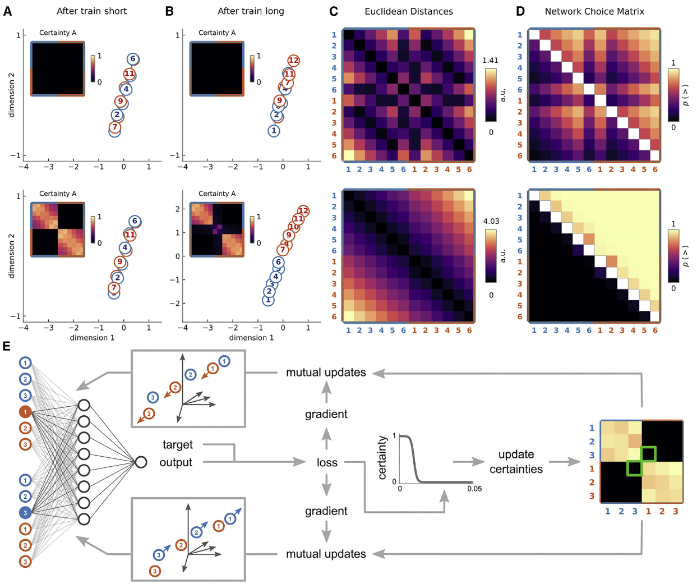

## 文献信息

- **标题 :** [Neural knowledge assembly in humans and neural networks](https://www.cell.com/neuron/pdf/S0896-6273(23)00118-6.pdf)
- **期刊 :** Neuron
- **作者 :** Christopher Summerfield et.al
- **DOI :** https://doi.org/10.1016/j.neuron.2023.02.014
- **类型：** 模型/人脑 比较
- **来源：** 计算与认知神经科学学会

## 目的

> 知识组装 （knowledge assembly） ：当单个或几个新样本可用时，知识结构可以快速重新配置，将这个在最少新信息基础上快速重新组装现有知识的过程叫做“知识组装”

尽管这些人工工具可以允许表达性的心智表征或强大的推理，它们往往学习缓慢，需要密集的监督，不是可以进行知识组装的模型

文章想研究如果有一条新信息，如何根据整体知识结构来重新配置神经表示。

## 方法

> A: 左：一组按等级排序的对象(在 x 轴和 y 轴上)。每个条目表示由其行和列定义的一对刺激。深蓝色和红色方块是在上下文对，会在短训练（Train short）中使用；较浅的蓝红方块(物体排序不相邻)和灰色(未经训练)不在短训练中；黑方块是边界训练显示的对；所有配对都会在短测试和长测试中进行测试。右：实验序列和图例示意图。（每个参与者观看一个独特的，随机取样的新对象集。）
> B: 示例屏幕下面的数字显示帧持续时间，以毫秒为单位。
> C：

### 网络相关

- 更新方法：SGD (随机梯度下降)
- 模型结构：简单两层网络

### 验证两种假设

## 结果

> A: 白框显示边界训练使用的两个项目，展示的人类选择矩阵和反应时矩阵。
> B：按物体距离平均的准确率和反应时间，lower 和 higher 的划分见 C 和 D
> C：参与者（灰点）在长测试（y）和短测试（x）中的准确度和反应时，对角线是恒等线，红叉表示均值。
> D: 推断一些参与者不能重构他们对这个虚构等级传递关系的知识，仍然保留这两个集合独立的信念，由中值分割成两部分。右图表现和短测试相似。
> E：左图，将理想化的选择矩阵和对应的人类选择矩阵拟合得到的回归系数，仍按照横长测试纵短测试进行绘制，虚线表示0，按照准确性着色。右图是反应时和理想化反应时的回归，基于回归系数间的皮尔逊相关系数着色。

存在明显的负相关，意味着在长测试中表现差的参与者继续表现出针对短测试进行优化的行为（同时由于这些参与者能在长测试中报告边界训练的对象关系，排除了不能从边界训练阶段学习的可能）。

> A: 关于现有神经编码如何在长测试中进行转换的假设示意图。中：在另一个正交维度分层；右：伸长假设，物体在一维流形上重新排列。
> B：长测试后PPC、dMPFC和对应的 MDS 二维投影。
> C：模型RDM对长测试中理想结果在神经数据中拟合，相关区域渲染到模板脑上。
> D：神经和行为的相关性，x 表示相关行为模型拟合 （长测试减去短测试反应时矩阵），y 表示神经拟合 （RDM_mag_long - RDM_mag_short）
> FWE 多重比较矫正阈值，显著的神经行为相关的体素。

一种是在伸长方案下生成模型 RDM，另一种是在分层方案下生成。当绘制降维的神经流形图形时，可以看到位于一条曲线上。研究者认为神经数据更适合 PPC 和 dmPFC 中的伸长模型。

> 人工神经网络中的知识组装
> A-D ：A、B显示短训练和长训练后隐层表示的二维MDS 和 伴随的确定性矩阵，上、下表示神经网络拟合长测试中 lower 和 high 组的人类表现。 短训练后两个上下文块的两条嵌入重叠，长训练后适应较低者线仅拉长，高表现者完全分离。C、D 表示拟合网络选择矩阵。人类的矩阵在4D
> 更新规则示意图。

根据 6D 上的矩阵，即使在 i6 < i7 进行长时间边界训练后，网络也会将其视为例外，因此无法将其推广到另一个块的其他项目。

作者的一个论点：
- 人类参与者存储并在心中重放之前从训练中学到的成对关联，但补充材料中发现结果与人类数据中看到的行为不一致。

将神经网络视为学习将输入嵌入到最大维度为d的流形上（相当于隐单元数量），训练过程中网络学习在具有低内在纬度的流形上表示的刺激，如3A中表示具有重叠嵌入的任一块的上下文相关序列。作者做出假设：网络保留关于嵌入空间中每个关系的确定性估计，

## 创新点
- 观察到背侧流结构中物体关系的神经编码的快速重组，包括 PPC 和 dmPFC。

## 不足

## 借鉴