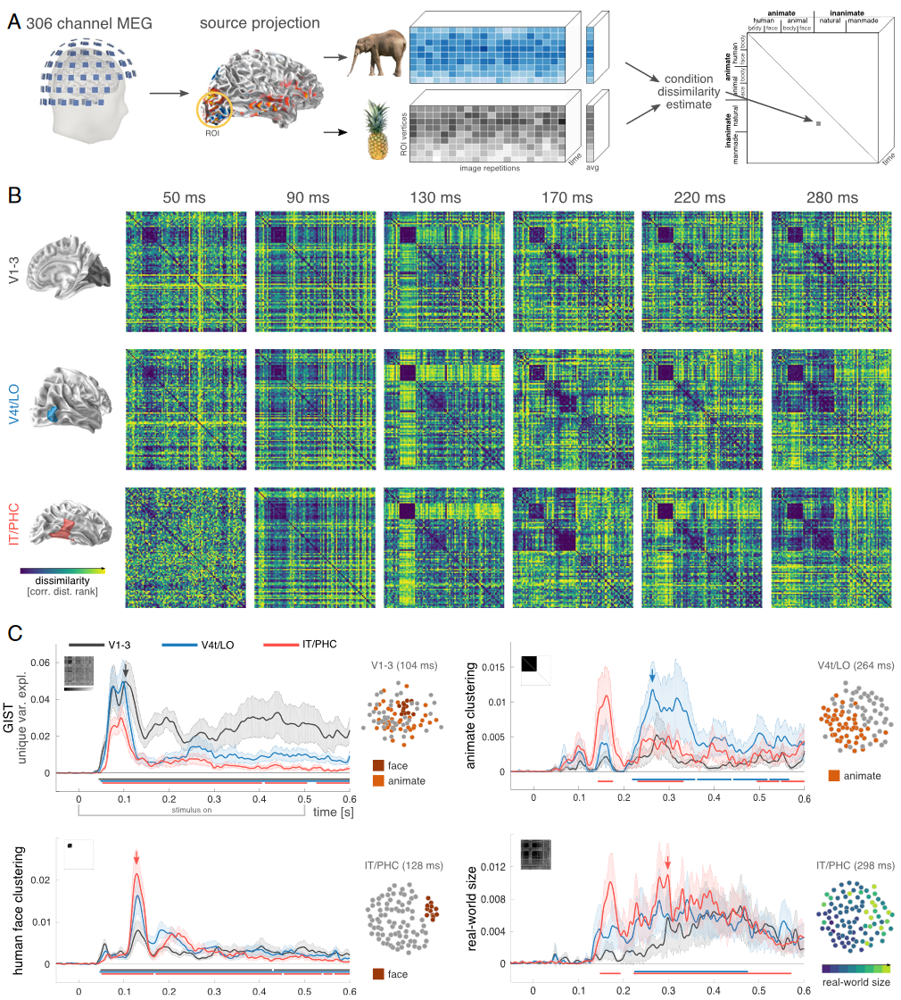
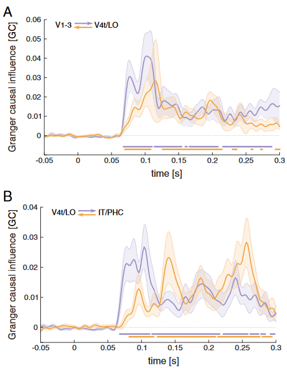
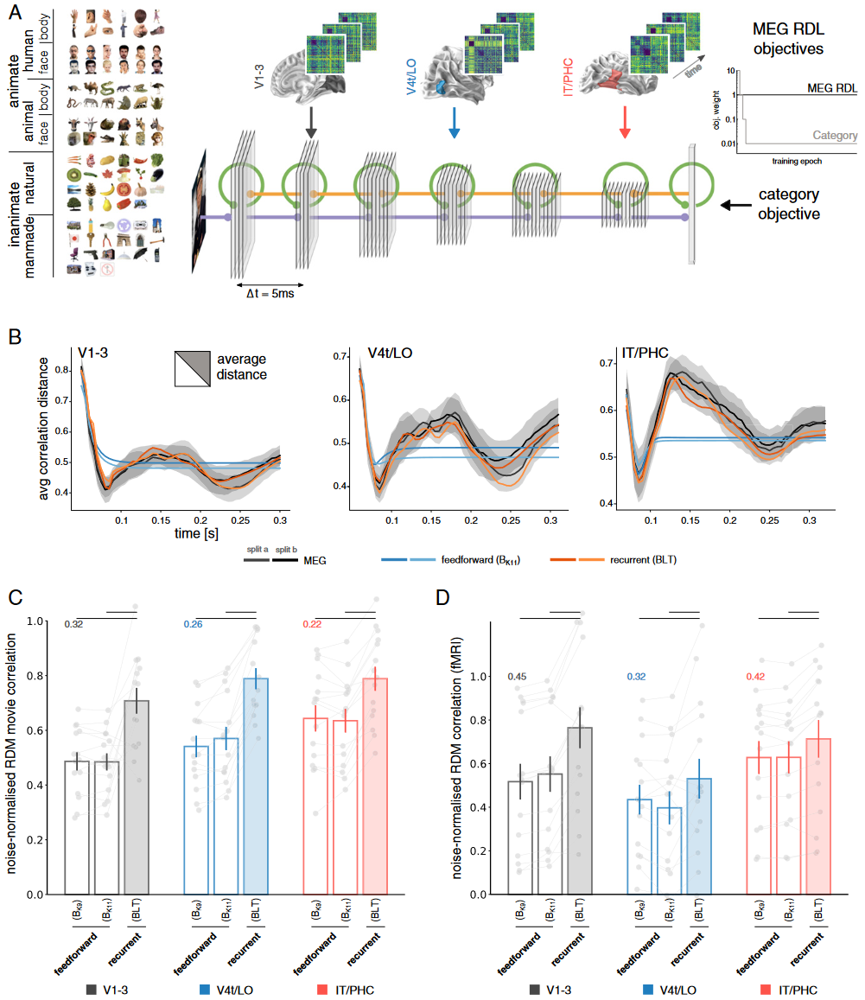
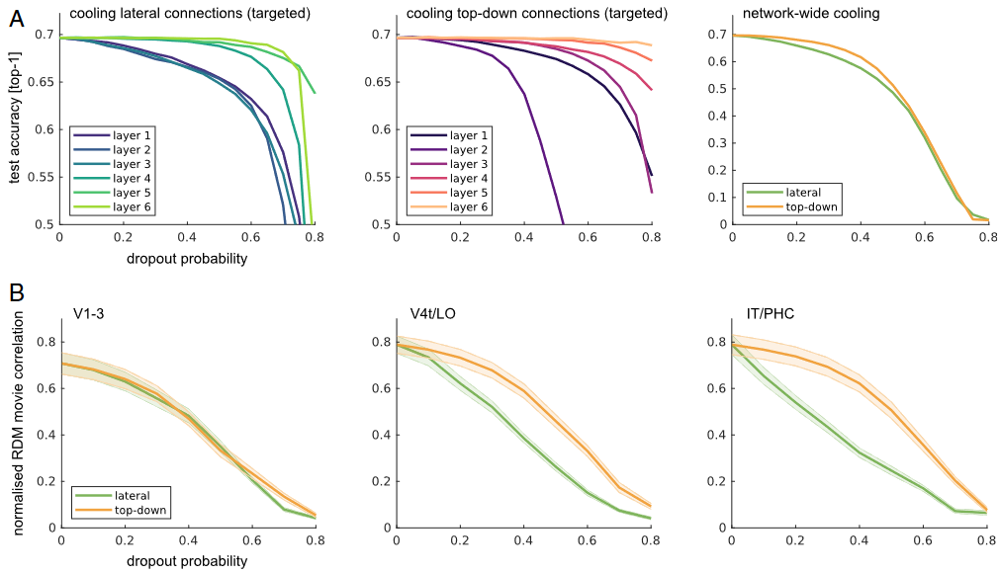

## 文献信息

- **标题 :** [Recurrence is required to capture the representational dynamics of the human visual system](www.pnas.org/cgi/doi/10.1073/pnas.1905544116)
- **期刊 :** PNAS
- **作者 :** Tim C. Kietzmann et.al
- **DOI :** 10.1073/pnas.1905544116
- **类型：** 假设导向 | 实验/模型探索
- **来源：** 后续工作追踪

## 目的

尽管人脑视觉系统具有丰富的横向和反馈连接，对象处理通常被视为和研究为前馈过程。
文章希望使用高时间分辨脑成像和深度学习来测量和建模人类腹侧流多个阶段的快速表征动态，来证明想要理解人类腹侧流的信息处理， **循环** 是必要的。

## 方法

关注腹侧流的三个阶段：
- （早期）`V1-V3` 。
- （中期）`V4t/LO` ，外侧枕叶皮层。
- （高级）`IT/PHC` ，颞下皮质/海马旁皮质。

模型时间步长设置为反应一个目标ROI到下一个目标ROI的 `10ms` 延迟，与跨腹侧流区域信息传输的下限估计一致（RDM 损失拟合是 5-ms 的时间步长）。

为了避免对92个实验刺激过拟合，收集了包含相同对象类别的独立 141,000 张图像的数据集 — RDL61，进行网络训练。并通过交叉验证来估计网络RDM 序列和MEG RDM序列之间的拟合度。

### MEG 数据采集、预处理和源重建

暂略

### MEG RDA

> - **RDM ：** 表征距离矩阵，等同于表征几何，它定义了底层激活空间中实验条件的空间关系。
可以使用计算和分类模型来预测（相对条件）经验距离。此外跨多个 ROI 的 RDM 时间序列还可用于测试格兰杰因果关系的影响，即在 ROI 之间表征组织的转移。

首先通过对重复进行平均来提取每个条件的单个多元源时间序列。然后通过使用相关距离（1 - 皮尔逊相关）估计所有条件组合之间的模式距离来计算 RDM。为每个时间点计算一个 RDM，生成一个随时间变化的 RDM 时序（ $ \mathbb{N}_{object} \times \mathbb{N}_{object} \times \mathbb{T} $ ），分别计算每个参与者、ROI、半球和会话的 RDM 时序，然后为每个参与者和ROI在半球和会话中的RDM时序进行平均，仅使用对称矩阵的上三角进行后续分析。

- **模型拟合和统计**

    使用分层一般线性模型（GLM，使用非负最小二乘法）对每个参与者的RDM时序和ROI进行建模，预测方差的分解是通过完整GLM总方差减去简化GLM计算的。

- **RSA 格兰杰因果分析**

    研究目标ROI当前的RDM是否可以由其他ROI过去RDM来解释，也是通过分层 GLM 方法实现。首先使用目标 ROI 本身的过去 RDM 来解释当前 RDM，然后测试从源 RDM 中添加其过去的 RDM 会在多大程度上增加所解释的方差。

    格兰杰因果影响定义： $$GC=\mathcal{ln}(U_{reduced}/U_{full})$$

    因为包含额外预测变量以及因此出现的自由参数本身可以导致解释的方差增加，所以采用刺激前窗口（开始前50ms）期间平均增加的解释方差作为统计比较的基线。对两对相邻ROI都做了双向的格兰杰因果分析，使用 $t -120$ ms 到 $t-20$ ms 100 ms 的时间窗口，对刺激前300 ms 内每个时间点进行了上述分析。（多重比较矫正、信号80hz低通滤波平滑进行可视化） 

- **噪声上限估计**

    计算了每个 ROI 和时间点的信号噪声的上限和下限。

### Model

使用表示距离学习（RDL）对网络进行训练，以预测刺激开始后 300ms 内腹侧流中随时间变化的动态表征。

6卷积，一个线性读出层，卷积层除第一个之外会经过一个最大池化，将高宽缩小一半，卷积步幅1x1且填充边缘。

与前馈 B 模型相比，BLT 中添加横向和自上而下的连接会导致参数数量增加。 B 中使用较大的内核大小，以大致匹配 BLT 中的参数数量，同时保持网络中相同数量的单元和层数。

循环采用一个时间步长，反馈2个时间步长，前向视为瞬时连接。

- **循环卷积层：**
  
  单个RCL中的激活由3D数组 $H_{t,n}$ 组成，索引 $t$ 用于表示时间步长，$n$ 为层数，$H_{t,0}$ 是网络输入图像。

  经典前馈网络的层：
  $$H_{t,n} = \left[W_{n}^{b} * H_{t-1,n-1} + b_n \right]_{+}$$

  $[\,\, ]_+$ 修正的线性函数。当 t < n 时，通过定义 $H_{t,n}= 0$ ，在前馈输入到达层之前使所有层处于非活动状态。
  
  循环权重(自连接权重) $W^l_n$ :
  $$H_{t,n} = \left[W_{n}^{b} * H_{t-1,n-1} + W^l_n * H_{t-1,n} +  b_n \right]_{+}$$

  反馈权重 $W^t_n$，BLT 层表示如下：

  $$H_{t,n} = \left[W_{n}^{b} * H_{t-1,n-1} + W^l_n * H_{t-1,n} + W^t_n * H_{t-1,n+1} + b_n \right]_{+}$$

  反馈时会使用最近邻上采样使得特征图大小匹配。

- **训练：**
  
  使用 RDL 和对象分类两个目标函数，RDL 旨在将多个选定层的网络表征动态与 3 个腹侧流区域的 RDM 时序匹配，使用 RDL 来训练网络的第 2、4 和 6 层，以分别匹配 V1-V3、V4t/LO 和 IT/PHC 的动态。

## 结果

> **FIG 1.** 表征动力学分析（RDA）揭示了特征选择性如何随着时间的推移沿着不同的腹侧流区域出现。 
> `A` 用于提取源空间 RDM 时序的 RDA pipeline。
> `B` V1-V3、V4t/LO 和 IT/PHC 区域在选定时间点、参与者间平均的 RDM，所有 ROI 都表现出独特的多阶段表征轨迹。
> `C` 为了定量了解随时间和空间变化的神经表征，使用线性建模将 RDM 分解为其组成部分。特征选择性时间演化的线性模型揭示了腹侧流 ROI 内部和之间的表征差异交错出现，水平条表示显着超过刺激前基线的时间点，参与者的 SE 显示为阴影区域。左上小图是对应的理想RDM，右侧小图使用 MDS降维可视化选定时间点的表征几何形状。

- **GIST**  ：捕获源自低级特征的表示，Gabor 小波。
- **animacy** ： 生物/非生物
- **real-world size** ： 真实世界中的大小
- **human faces** ： 人脸/非人脸
  
  

> **Fig 2**. RSA 格兰杰因果分析来估计腹侧流区域之间的信息流。
> `A` 早期和中期ROI之间格兰杰因果影响的前馈（紫）和反馈（橙）方向。水平条表示经过FDR矫正，因果相互作用超过基线的时间点。
> `B` 中级和高级ROI之间格兰杰因果影响的前馈（紫）和反馈（橙）方向。

- 格兰杰因果关系被发现从 V1-V3 到 V4t/LO 以及从 V4t/LO 到 IT/PHC 显着高于基线，在每种情况下在刺激开始后 70 毫秒左右出现。

- 格兰杰因果关系在反馈方向上逐​​渐出现，V4t/LO 到 V1-V3 的峰值刚好 110 ms，IT/PHC 到 V4t/LO 的峰值大约在 140 和 260 ms 左右。

ROI 表征丰富的动态，腹侧流区域之间的双向信息流，这些表明复发在沿腹侧视觉通路的计算中发挥着重要作用。

> **Fig 3**. 腹侧流表征动力学的DNN建模。
> `A` 3 个腹侧流区域的 RDM 时序都用作单独CNN层的学习目标，读出时类别目标权重会随时间衰减。
> `B` 模式平均距离随时间的变化。
> `C` 模型与大脑间逐帧 RDM 相关性，单个被试估计显示为灰点，数据通过用于训练的MEG RDM时序的预测性能进行标准化。对于所有的ROI，循环网络的性能显著优于前馈架构。
> `D` 针对相同参与者和ROI获取的fMRI RDM进行测试时，在MEG数据上训练的不同DNN进行了交叉验证，使用各自的噪声上下限对相关性进行噪声归一化。

> DNN 冷却研究（思想类似消融，实质是dropout）
> `A` 允许停用特定目标在不同网络层的输入连接，（左）横向（表现为同层局部循环）、（中）自上而下，横向和反馈对分类性能的影响因深度而异。（右）冷却应用在整个网络，两者具有类似的效果，横向的效果在图中看着强一些。
> `B` 针对整个网络中的特定连接类型揭示了横向和自上而下的网络连接对于模拟人类腹侧流动力学的重要性。靠后的层对于反馈的冷却越来越稳健。

对于对象分类，我们观察到较低层中的横向和自上而下的连接对性能有更大的影响，其中冷却到网络层建模 V1-V3 的自上而下的连接会产生强烈的影响（图 4A）。为了预测腹侧流动力学，我们再次发现两种连接类型都很重要，尽管更高级别的腹侧流预测的成功不太依赖于自上而下的网络连接。

总结，循环深度神经网络模型在捕获多区域皮层动力学的能力方面明显优于同等参数的前馈模型。对循环深层网络模型进行的有针对性的虚拟冷却实验进一步证实了其循环和反馈连接的重要性，需要循环模型来理解人类腹侧流的信息处理。

## 创新

- 对 RDM 动力学、区域之间的 Granger 因果关系和 DNN 模型的分析一致表明，人脑腹流动力学源于循环传递。
- 基于 MEG RDA 和循环 DNN 模型的结合为研究人脑信息处理以及将神经数据纳入机器学习管道的工程应用开辟了视野。

## 不足

- 就其研究目的而言，已经圆满实现，我没有发现不足之处。

## 可借鉴

- RCNN 模型的构建方案。
- 基于 RDM 时序矩阵进行表征相似性分析的思路。
- 通过 dropout 代替消融实验的。
- 可以在绘制的表征相似性时间演化曲线右侧搭配聚类图展示。
- 对于时序，可以做格兰杰因果分析。
