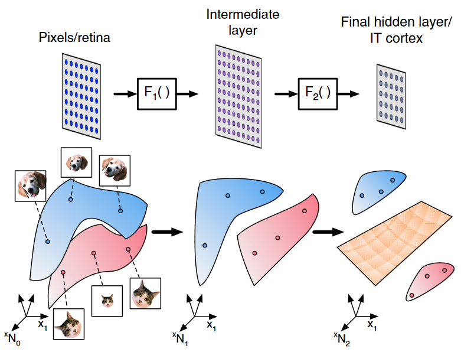
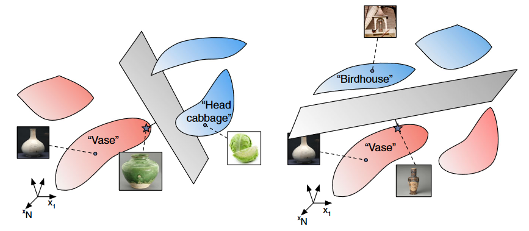
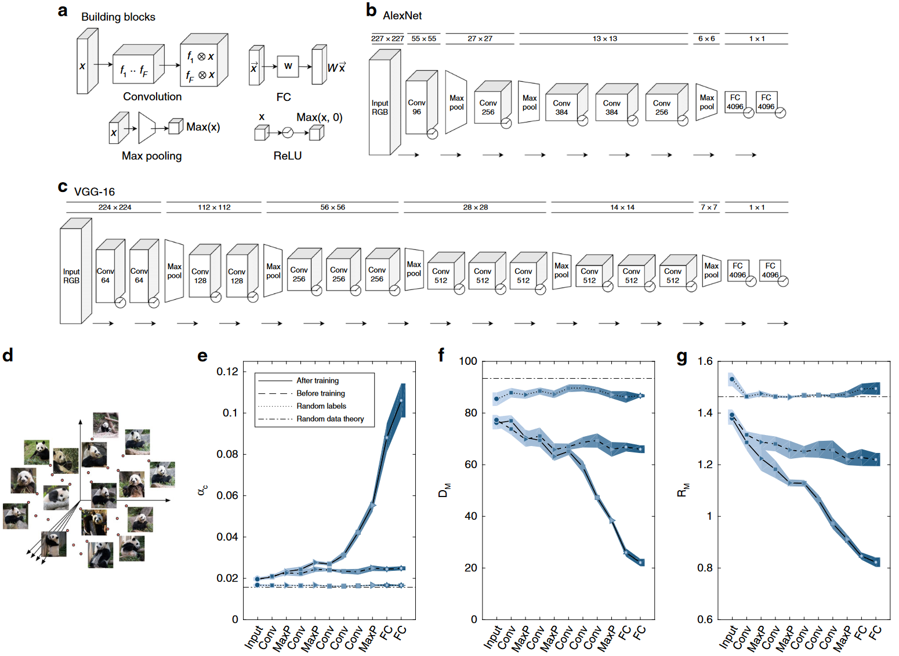
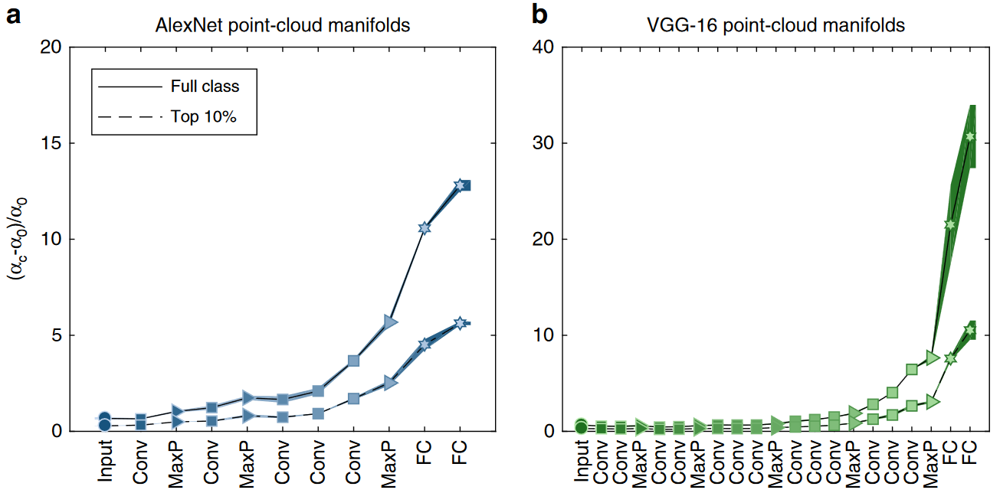
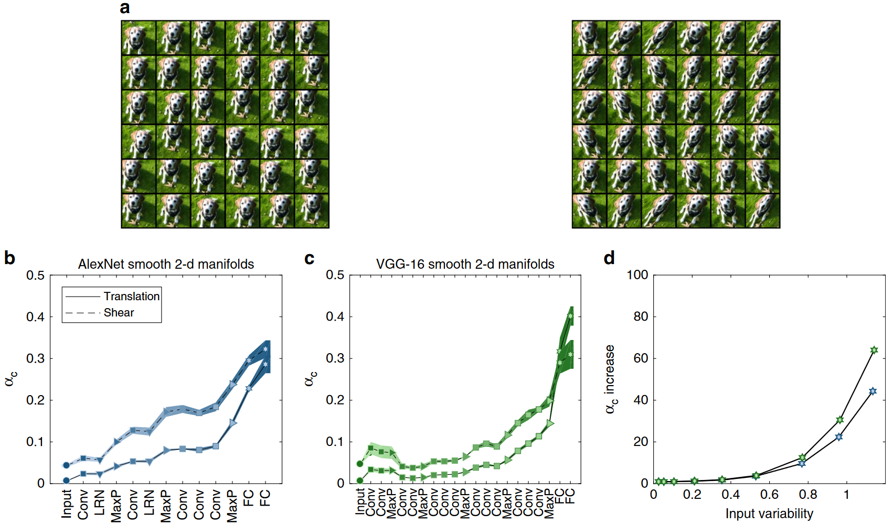
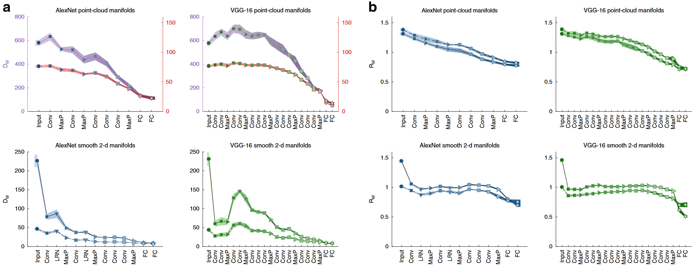
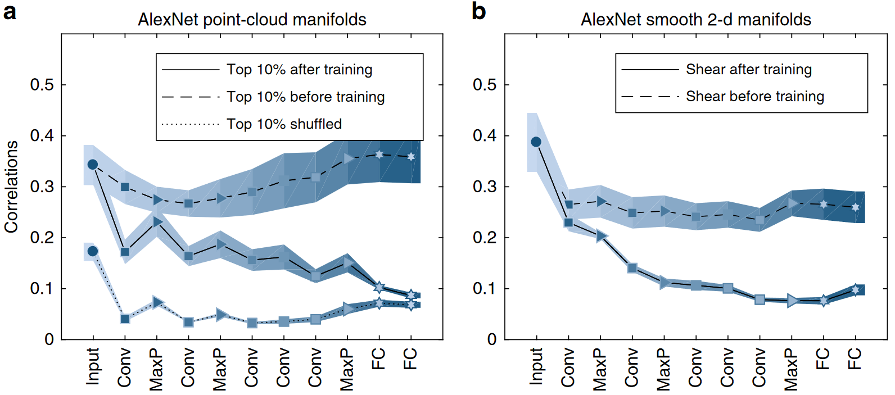
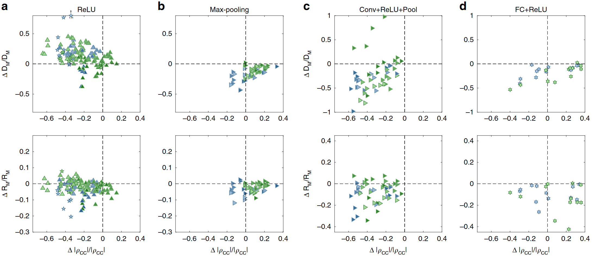
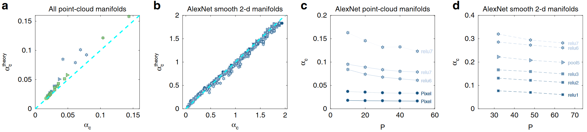
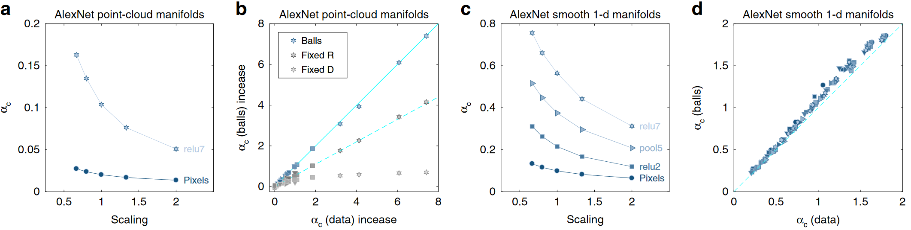

## 文献信息

- **标题 :** [Separability and geometry of object manifolds in deep neural networks](https://doi.org/10.1038/s41467-020-14578-5)
- **期刊 :** NATURE COMMUNICATIONS
- **作者 :** Uri Cohen et.al
- **DOI :** 10.1038/s41467-020-14578-5
- **类型：** 假设导向 | 实验/模型探索
- **来源：** [神经流形与表征几何理论|1.表征几何概述](https://zhuanlan.zhihu.com/p/598601630)

## 目的

展示了分类能力如何沿着具有不同架构的深度神经网络的层次结构而提高。文章证明了相关对象流形几何形状的变化是这种能力提高的基础，并通过精心设计流形半径、维度和流形间相关性的减少，阐明了层次结构中不同级别为实现这一目标所发挥的功能作用。

> FIG 1. 

- CCA(Canonical correlation analysis)
- RSA
- 曲率 / 维度捕获神经表征
- 其他表征的尝试主要集中在与对象不变性相关的单神经元属性

应用流形线性可分性理论来分析证明可分性取决于三个可测量量：流形维数和范围以及流形间的相关性。

## 方法

> FIG 2. 

流形由 $D+1$ 坐标描述，一个坐标定义流形中心位置，其他定义流形变化的轴。将定义其可变性子空间流形的点集指定为 $\mathcal{S}$ ,可以表示有限数量的数据点集合或平滑流形。 嵌入流形 $P$ 初始定义假设中心位置和轴方向是随机的（所有流形具有相同形状）, 对于每个流形

$ w = \sum^{P}_{\mu=1} \lambda_\mu y^{\mu} \tilde{x}^{\mu}$ 

, 其中 $M^{\mu}$ 的第 $\mu$ 个流形的凸包，$\tilde{x}^{\mu} \in conv(M^{\mu})$ 是  $M^{\mu}$ 的代表向量。这些矢量综合确定了分离平面，将流形中的代表点（代表矢量的点？）认为是流形锚点。

分类能力定义为 $\alpha_c = P_c / N$ , $P_c$ 是可以使用随机二进制标签线性分离的最大流形数，

在平均场理论中，容量是用自洽方程来描述的，该方程涉及嵌入在许多其他流形集合中的单个流形。

使用平均场理论测量分类能力、流形尺寸和半径。

......

阅读了18年发表在 PHYSICAL REVIEW X 的理论文章 Classification and Geometry of General Perceptual Manifolds，本篇实际上就是从程序上实现了该理论，数学公式内容太多，后面我也没看明白，略。

## 结果

- **学习增强了跨层的流形可分离性。**

    
    > FIG 3. 
    > ...
    > `e:`  分类能力的变化
    > `f:` 平均流形维度的变化
    > `g:` 平均流形半径的变化

    `图3 e-g` 对于经过充分训练的网络，流形分类能力沿着层次结构增加，同时流形维度和半径随之减小。从早期层的 80 以上到最后特征层的大约 20，流形半径从输入像素层的 1.4 以上均匀减小到特征层的 0.8。

    未经训练的网络在分类能力和流形几何方面几乎没有什么改进。

- **点云流形容量沿着层次结构增加。**

    
    > FIG 4. 
    > ImageNet 类点云流形的归一化分类能力

    为了回答流形分类能力如何取决于代表每个对象的图像的统计数据，考虑具有两个可变性水平的流形，低可变性流形由得分最高 10% 的图像，高可变性流形由每类所有（大约 1000 个）图像组成。两类流形在最后一层都容量增强,较深层的网络在最后层表现出更高的容量。

- **光滑流形容量沿着层次结构增加。**
    
    考虑当刺激具有多个平滑变化的潜在参数（例如平移或扭曲）时自然出现的流形。通过多个仿射变换对它们进行扭曲 `图5 a`, 产生一组平滑流形，每个流形与单个模板图像相关。
    
    > FIG 5.
    > `d` 容量增加指数 = 特征层相比于像素层的比率

- **网络层减少了对象流形的维度和半径。**
  
    
    > FIG 6.
    > `a:` AlexNet 和 VGG-16 的点云流形的平均流形维度（上，实线：全类流形，虚线：前 10% 流形）和相同深度网络的平滑二维流形（下，实线：平移流形，虚线：剪切流形）
    > `b:` 平均流形半径

    点云流形的高可变性需要从层到层逐步减少（无论是在半径还是维度方面），利用下游特征的复杂性增加，而局部仿射变换产生的可变性主要由第一个卷积层的局部处理来处理。

- **网络层减少了对象中心之间的相关性。**
    
    
    > FIG 7. 流形之间的相关性
    > AlexNet 各层流形间相关性的平均变化。
    > 平滑二维剪切流形的中心相关性

    不同流形中心之间的相关性可能会在表示空间中聚类创建流形簇，他们的理论预测这种流形聚类对随机二元分类的总体影响是有害的，因此这些相关性降低了分类能力。

    可以从图中看出，流形中心的去相关是网络训练的结果。

- **网络块对流形几何形状的影响**
    
    为了更好地理解 DCNN 所表现出的增强能力，作者研究了不同网络构建块的作用。
    
    > FIG 8. 通过网络构建块改变流形属性
    > 

    - ReLU非线性通常会降低中心相关性和流形半径，但会增加流形维数
    - 池化会减小流形的半径和维度，但通常会增加相关性
    - 全连接操作，减少了流形的半径和维度，但可能会增加相关性

- **理论与数值测量容量的比较.**
  
  
  > Fig 9. 理论预测
  > `a、b` 不同层数值测量容量（x轴）与理论预测（y轴）的比较
  > `c、d` 不同层流形在不同对象数量（x轴）下的数值测量容量（y轴）

  为了测试理论（基于平均场理论的算法）与具有实际数据的有限大小网络的容量之间的一致性，我们使用最近开发的流形线性分类的有效算法对网络每一层的容量进行了数值计算，具有良好的一致性。

- **扰动流形对容量的影响.**

    
    > Fig 10. 
    > `a:` 在层次结构中的不同层（前 10% 点云流形）遵循流形缩放（x 轴表示缩放因子，1 对应于无缩放）的分类能力。
    >

## 优缺

优：
- 第一次证明相关对象流形几何形状的变化是分类能力提高的基础
- 首先实现了理论文章中的算法，并将程序共享

缺：
- 流形计算需要至少 30个类，不能计算某一个具体类的流形参数。

## 启发

本想基于该方法去计算模型分类性别时两类流形的维度、半径变化，从模型内部表示的分布去考虑性别bias，但发现了该方法无法用于少量类的缺点。