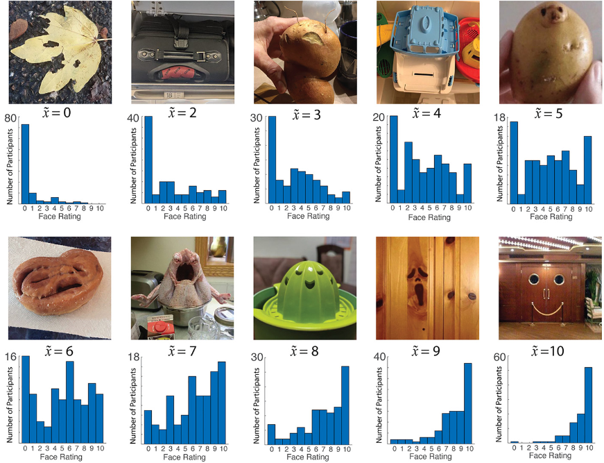
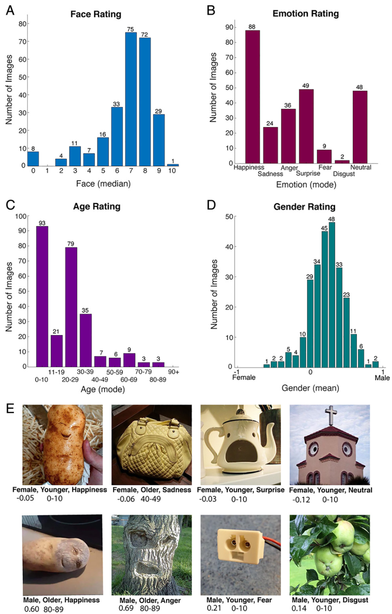
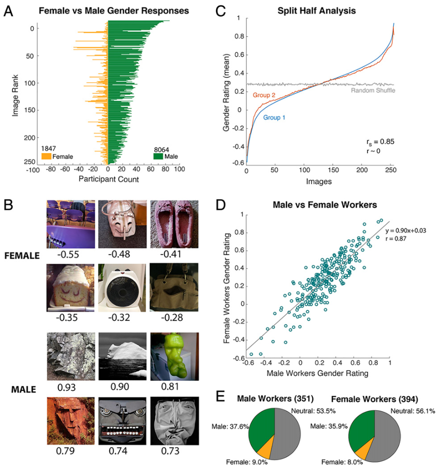
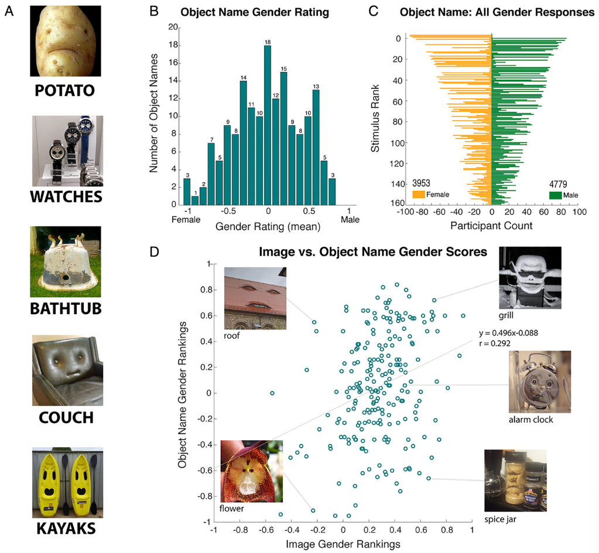
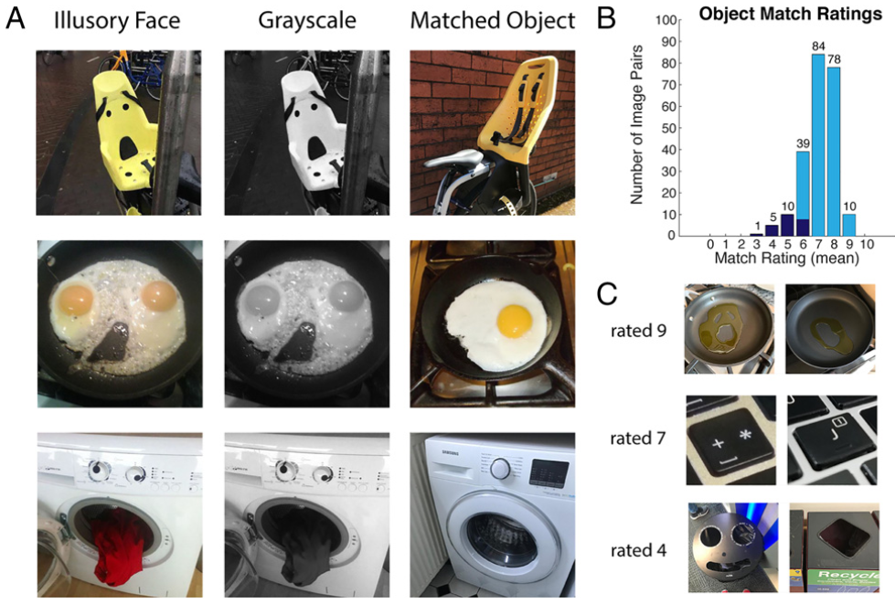
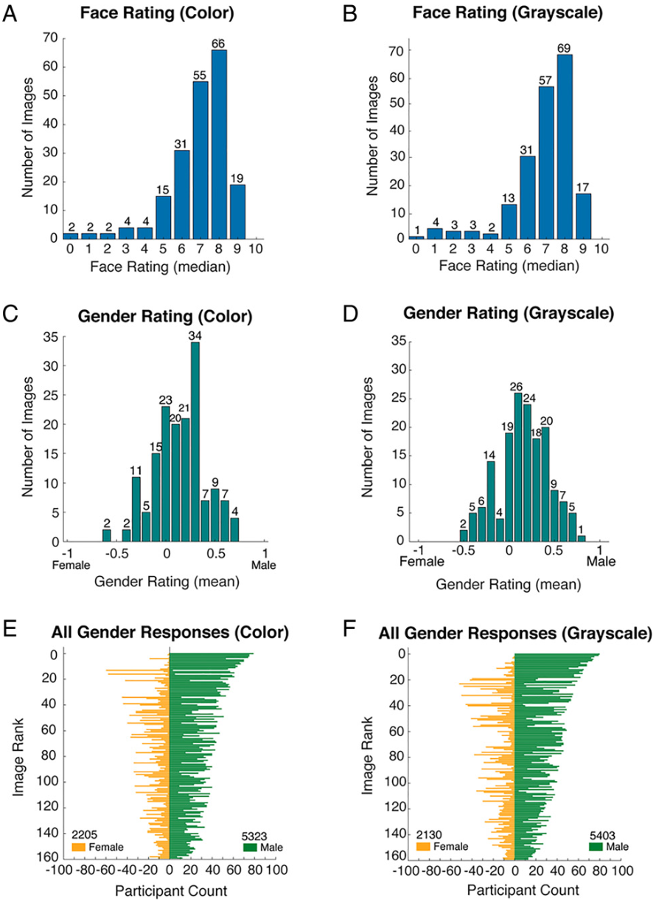
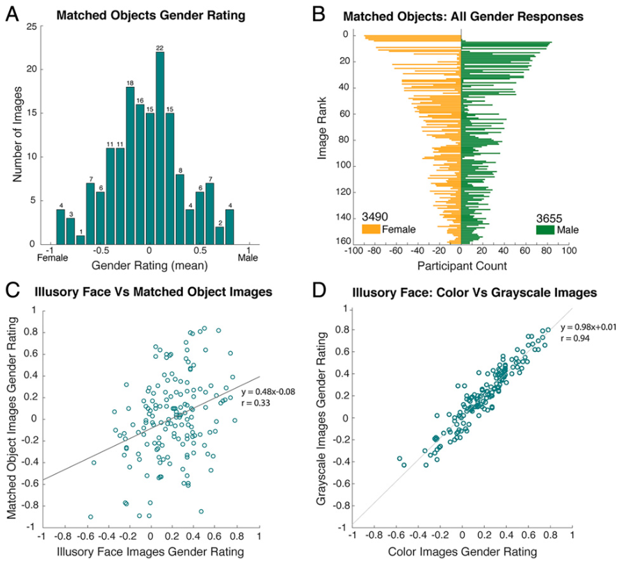
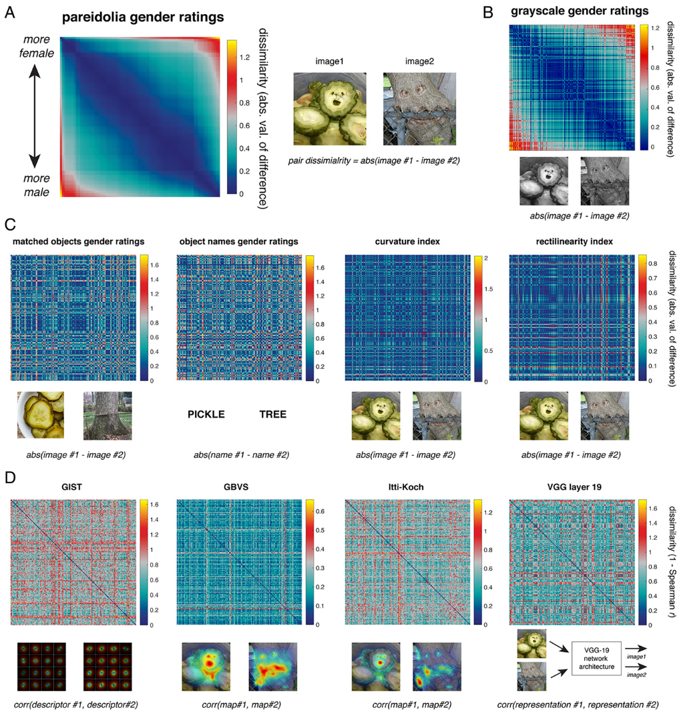

## 文献信息

- **标题 :** [Illusory faces are more likely to be perceived as male than female](https://doi.org/10.1073/pnas.2117413119)
- **期刊 :** PNAS
- **作者 :** Susan G. Wardle et.al
- **DOI :** 10.1073/pnas.2117413119
- **类型：** 实验
- **来源：** 课题承接

## 目的

面部空想性错觉是对无生命物体虚幻面部特征的自发感知，可以被认为是我们的面部检测系统的自然错误（非人类灵长类动物也会经历面部幻想性视错觉），人脸和幻觉面孔共享一些神经机制，目前尚不清楚空想视错在多大程度上参与了除了面孔检测之外的更高层次的社会感知。

假设：
- 由于没有先验的理由说明为什么空想脸应该被感知为具有特定的年龄、性别或表情，因此对这些属性的任何可靠感知都将提供有关底层系统的固有属性的信息。

研究的目的是从这个假设出发，尝试从实验中总结一些现象结论。

## 方法

线上招被试评分，略。

> Fig 1. 实验中使用的 256 张图像集中的10张代表图片的评分，每个图片有100个评分（总参与者800），下方是人脸评分中位数和评分分布。

## 结果

- **发现物体中空想脸具有明显的情感表达、年龄和性别。**
  
  
    > Fig 2.
    > A : 评级，从 0“看不到脸”到 10“容易看到脸”。
    > B ：情绪表达评级迫选的频率直方图。
    > C ：分档年龄评级
    > D ： 平均性别评级，只能评分为“男性”（编码为 1）、“女性”（-1）或“中性”（0）

  - 幸福（34％）、惊讶（19％）、愤怒（14％）、悲伤（9％）、恐惧（4％）和厌恶(1%)。只有 19% 的虚幻面孔被评为具有“中性”表情。
  -  75%的虚幻面孔模态评分在30岁以下。人脸具有自身年龄偏差，但该实验中没有证据表明和被试年龄相关。
  -  90% 的空想脸具有平均值 > 0，而只有 9% 的图像平均值 < 0。对于这组 256 张图像，80% 的参与者有男性偏见，只有 3% 的参与者表现出女性偏见。
  
  _这里的“无偏见”意味着参与者对他们的一组图像给出了相同数量的男性和女性评分_

- **发现了一个明显的偏见，认为空想脸是男性而不是女性，比例约为 `4:1` ，不能用相应的对象身份、对象标签、颜色来解释。**

    
    > Fig 3.
    > A : 所有参与者的所有男性和女性评分（排除中立）的分布。
    > B : 评分最高的六张女性和男性虚幻面孔图像。
    > C : Split Half Analysis, 用于评估测量工具（例如问卷调查或测试）的内部一致性。蓝线显示随机一半参与者在 1,000 次迭代（无替换）中的分数，红线显示剩余一半参与者的分数，按相同顺序排序。
    > D : 男性和女性参与者的性别评分高度相关。
    > E : （自认为）男女参与者评分分布类似。 

    被认为快乐的空想脸明显不太可能被认为是男性，而被认为描绘愤怒的空想脸或厌恶明显更有可能被视为男性。性别评分与悲伤、惊讶、恐惧或中性表达评分之间不存在相关性。
    因果关系的方向无法从相关性中推断出来，目前尚不清楚一张空想脸是否更可能因为是男性而显得愤怒，或者更可能因为它生气而显得男性。

    - **语义对象-性别关联无法解释男性偏见**，性别评分中只有 8.5% 的方差可以通过图像中对象名称的性别评分来解释。
        
        

    - **视觉对象-性别关联不能解释男性偏见**

        构建并验证了一组匹配的对象图像（图5A 第三列），这些图像是同一类型对象的照片，但没有感知到的面孔；灰度图的配对实验用来检查颜色的潜在作用。

        
        > Fig 5.
        > B : 相似性的平均评分，只使用了前200个匹配的空想脸（浅蓝色）。
        > C : 不同相似等级的示例图像。

        
        > Fig 6.  颜色不影响该现象。

        
        > Fig 7. 对于不包含虚幻面孔的对象图像，没有性别偏见

    - **计算模型揭示视觉特征并不能解释男性偏见**

        作者好奇其他视觉图像特征是否有助于性别感知。一是图像的曲率和直线，与典型的女性面孔相比，典型的男性面孔通常有更多的棱角。
        
        使用多元线性回归，直线性和曲率指数（基于一篇计算该指数的算法）预测了空想性视错觉图像性别评级方差的 9% ，作为补充，用了四个额外的经典/先进的计算视觉模型，输出的复杂表示不能简化为单个索引，所以进行RSA比较模式的RDM矩阵。

        - GBVS
        - Itti-Koch
        - GIST
        - VGG-19

         
        > Fig 8. 

        彩色（图 8A）和灰度（图 8B）空想视错觉图像的性别评级的表征相异矩阵（RDM）高度相似。目视检查（图 8 C 和 D）没有一个模型的表示能够充分捕捉跨刺激的性别模式。

- **由男性和女性面孔的平等贡献创建的人类面孔更可能被认为是女性而不是男性。** 

    _与早期研究的结果明显矛盾，可能是由于研究之间的范式和变形方法的差异所致。_

## 优/缺

优：
- 图像特征上，对很多因素做了排除，（有一定作用，但是解释不了大部分差异）
  - ❌ 图像的**颜色**  $\to$  _在模型上这个我之前的实验也可以排除颜色影响，在这种任务上颜色对模型基本没影响_
  - 2）与包含虚幻面孔的物体或图像内容的**视觉关联**
  - 3）图像的**曲率或直线度** $\to$ _多元线性回归，直线性和曲率指数（基于一篇计算该指数的算法）预测了空想性视错觉图像性别评级方差的 9%_
  - 4）通过**计算建模**捕获的图像的其他复杂视觉特征 $\to$  和性别评分的 RSA **RDM** 分析       
      - GBVS 、Itti-Koch 、GIST _三类提取视觉特征的模型_
      - VGG-19 逐层计算（只展示了最后一层）  $\to$ 文章及支持材料都没有提到这个VGG19架构是用什么预训练的，或者是否是无训练的❓ $\to$ 观察 [Matconvnet](https://www.vlfeat.org/matconvnet/pretrained/) 的预训练模型列表和该文章的引用文献，推测是 `vgg-verydeep-19` , 训练在 `ImageNet ILSVRC-2014`，任务是物体分类。

文章推测将虚幻面孔归类为男性的偏见比女性更常见 (_指被试 80% 的参与者有男性偏见，只有 3% 的参与者表现出女性偏见_) ，其根源在于认知而不是感知。
- 认知因素上，排除了以下解释：
  - 1）参与者的**自我认同性别** $\to$ _（自认为）男女参与者评分分布类似_
  - 2）对象类型或标签的**语义关联** : _Experiment 4，对匹配对象做性别评级 $\to$ 语义上和"Male","Female","Neutral"的关系, 只能解释 8.5% 的方差_ $\to$ **师兄的 CLIP 结果存在语义关联/视觉关联因素**
  - 3）任务设计
  - 4）一般将**模糊刺激**评价为男性的倾向 $\to$ _使用性别模糊的变形人脸来创造视觉不确定性_ $\to$ _由男性和女性面孔的平等贡献创建的人类面孔更可能被认为是女性而不是男性_
  - 5）⭕ 空想脸的**感知情绪** $\to$ _被认为快乐的空想脸明显不太可能被认为是男性，而被认为描绘愤怒的空想脸或厌恶明显更有可能被视为男性。性别评分与悲伤、惊讶、恐惧或中性表达评分之间不存在相关性。
  因果关系的方向无法从相关性中推断出来，目前尚不清楚一张空想脸是否更可能因为是男性而显得愤怒，或者更可能因为它生气而显得男性。_

不足：
研究提出了几个没有验证的偏见来源的猜测：
- 源于概念或语言起源，男性是社会交流中的默认性别。根据该猜测，空想脸引起“人”概念，“人”概念引发“男性”概念，除非另有信息。
- 脸的默认性别是男，除非有其他视觉细节。根据该猜测，空想脸仅提供感知面孔所需的少量视觉信息。

## 启发

> 其他研究中得知的信息
> - 按性别分类男性面孔的反应时间比女性面孔更快
> - 嵌入异性图像流中的女性面孔比男性面孔的神经反应更强
> - 威胁面孔在意识中出现得更快，这表明优先处理可能与男性特质相关
> - 在连续的闪光抑制范式中，唤起高水平权力/主导地位的面孔最快突破意识感知
> - 脑磁图证据表明，性别可能会在其他属性（例如身份）之前被处理
> - 年仅 3 至 4 个月大的婴儿表现出优先看女性面孔而不是男性面孔的偏见，除非他们的主要照顾者是男性，这种最初的观看行为偏见可能为发育中的大脑对男性和女性面孔的差异处理奠定基础。
> - 当存在视觉模糊性时，人们更容易将人脸视为男性而不是女性