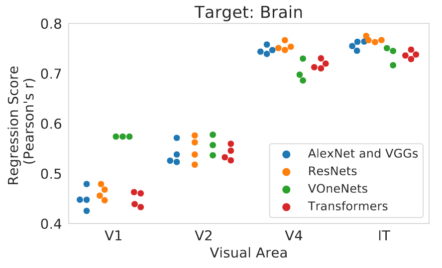
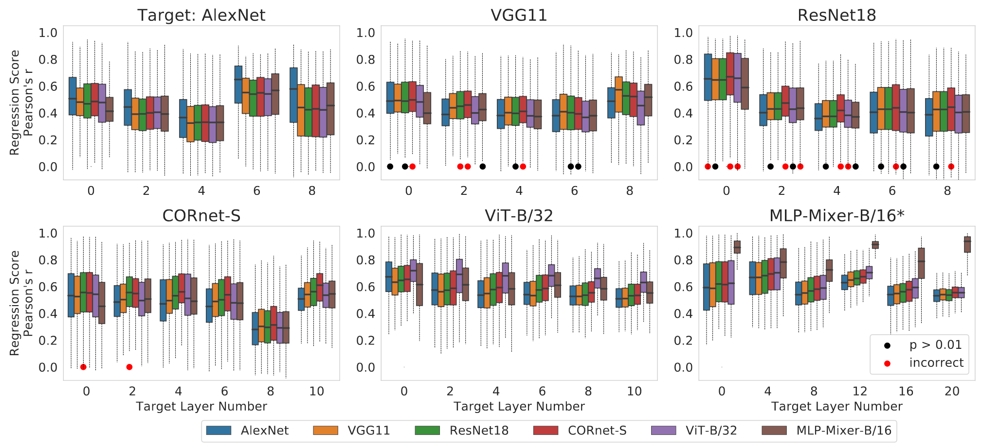
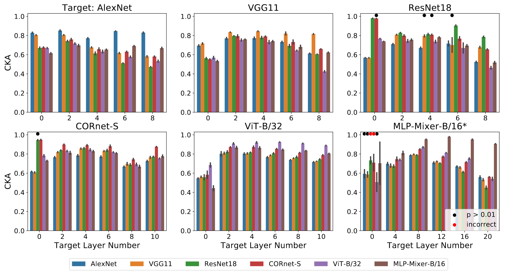
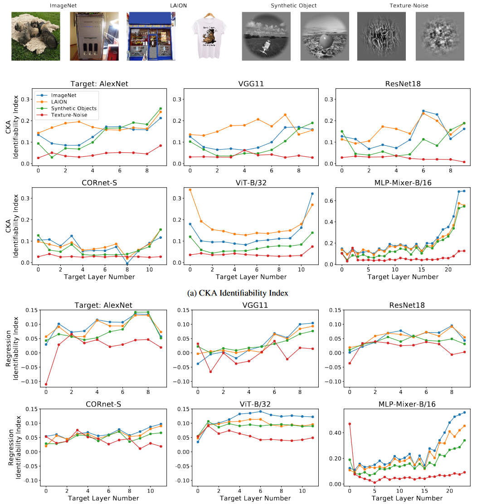
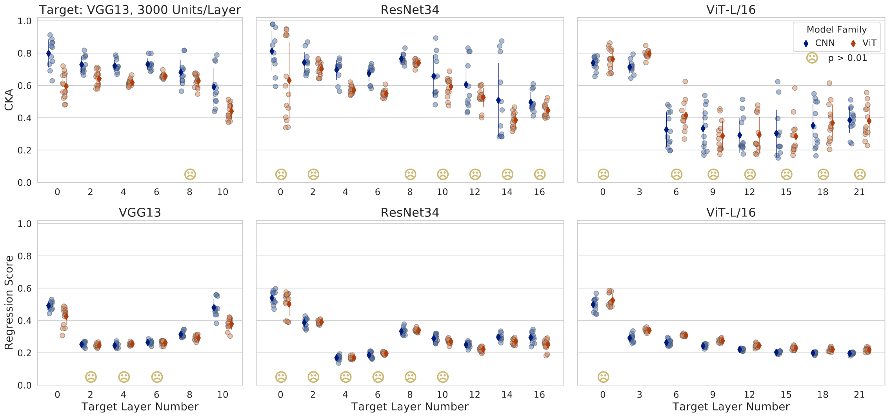

## 文献信息

- **标题 :** [System Identification of Neural Systems: If We Got It Right, Would We Know?]()
- **期刊 :** PNAS
- **作者 :** Yena Han | Tomaso Poggio | Brian Cheung
- **DOI :** 
- **类型：** 计算实验
- **来源：** Brain Score 引文，通过 Papers with code 网站发现

## 目的

ANN 被提议作为大脑的模型，会将网络和生物神经元记录进行比较，认为良好的再现神经反应能支持该模型的有效性，关键问题是这种系统识别方法能告诉我们多少关于大脑计算的信息，是否能验证一种模型架构优于另一种模型架构？

该文章意欲评估常用的比较技术（ 如线性编码模型和 CKA （中心内核对齐）），通过已知的基线模型替换大脑记录来识别模型，还展示了使用功能相似性分数识别高级别架构的局限性。

## 方法

> Fig 2. 猕猴视觉皮层大脑激活和深度神经网络的线性回归分数。

对于 V1，性能最好的三个模型属于 VOneNet 系列（Dapello et al.，2020），它们是被明确模仿 V1 设计的。但其他的脑区性能差异很小，分数范围的标准差 < 0.03 。

所以作者给了两个可能的解释：
- 不同神经网络架构是同样好/坏的视觉皮层模型
- 将模型与大脑对比的方法在识别精确的计算操作方面存在局限

验证假设的方法是用ANN的激活替换原始神经记录，检查具有最高预测性的源模型是不是替换用的模型，尝试用这种方法评估可以在多大程度上使用当前方法识别（区分）架构。

目标网络与源模型之一具有相同的架构，并在相同的数据集但使用不同的种子初始化，与 Brain-Score 的评估流程保持一致。

---

#### Encoding Model: Linear Regression 

线性回归分数是源模型的预测响应与真实目标响应的 Pearson 相关性系数。

为了在不牺牲预测性的情况下降低计算成本，文章在源模型的激活上应用稀疏随机投影，与主成分分析投影不同，稀疏随机投影是一种与数据集无关的降维投影方法。这样可以从处理流水线中去除任何与数据相关的线性回归，并将数据集相关性分离到感兴趣的变量中。

- [ridge regression：](https://zhuanlan.zhihu.com/p/108899923)是一种专用于共线性数据分析的有偏估计回归方法，实质上是一种改良的最小二乘估计法，通过放弃最小二乘法的无偏性，以损失部分信息、降低精度为代价获得回归系数更为符合实际、更可靠的回归方法，对病态数据的拟合要强于最小二乘法。 （相当于加了L2正则化）
- [嵌套交叉验证（Nested cross-validation）：](https://zhuanlan.zhihu.com/p/148862967) 嵌套交叉验证同时能用于调整超参数和泛化误差估计

#### Centered Kernel Alignment

$$ CKA(X,Y) = \frac{\parallel Y^T  X\parallel^2_F}{\parallel X^T X \parallel_F \parallel  Y^T Y\parallel_F} $$

#### Identifiability Index

$$Identifiability\quad Index = \frac{score(s=t) - \overline{score(s\neq t)}}{score(s=t) + \overline{score(s\neq t)}}$$

s = t 表示源模型和目标模型相同，类似神经元对特定任务的选择性（如FSI）

#### Modelss

- **CNN:**  AlexNet 、 VGG11 、ResNet18
- **RCNN：** CORnet-S
- **Transformer：** ViT-B/32
- **Mixer:**  MLP-Mixer-B/16

## 结果

测试了由 3200 个合成对象图像组成的数据集，源模型的排名通常基于中值分数，大多数中值得分最高的源网络是正确的网络，对于 VGG11、ResNet18 和 CORnet-S 中的多个层，最佳匹配层属于不正确架构的源模型。

> Fig 3. 目标网络层的线性回归分数，箱线图显示子采样3000个单位/目标层的分数分布。黑点表示正确的框架不优于其他（但不显著），红点表示该框架中值高于正确框架的中值。 （使用相同权重的初始化种子的模型 MLP-Mixer-B/16* 除外 | 为什么使用相同初始化？）

ResNet18 和 CORnet-S 之间的混淆尤其值得注意，会导致对目标网络中是否存在循环连接产生错误推断。**这一结果表明对未知神经系统底层架构的识别远非完美。**

> Fig 4.  针对不同源网络和目标网络的 CKA。条形图显示平均值，误差条指示对一组目标单位进行多次二次采样 (N=4) 的标准差。(与线性回归分数不同，CKA 为每个目标层生成一个聚合的单一分数)

真实源模型得分最高，一些不匹配的源网络会导致分数接近匹配网络。

为了检查使用不同刺激图像的效果，文章测试了合成对象图像（3200 张图像）以及纹理和噪声（135 张图像），ImageNet（3000 张）和网络爬虫图像 LAION（3000 张）。

> Fig 5. 上为每种刺激样本的图像
> A：使用CKA的可识别指数
> B：各类刺激图像和目标网络的线性回归

- 对于所有目标模型，更真实的刺激图像，即合成物体、 ImageNet 和 LAION，显示出比纹理和噪声图像更高的可识别性。
- 观察到可识别性随着层深度的增加而增加。
- 即使是对于目标模型的早期层，对应于视觉皮层的 V1和 V2，纹理和噪声图像也不能提供更高的可识别性。

> Fig 6. 将不同的架构变体（12 个 CNN 和 14 个 ViT）与两个 CNN 和一个 ViT 目标网络进行比较。
> 
这里重点关注识别卷积与transformer的注意力，对于 CKA 和回归，许多目标层都存在较高的类间方差，图中 ☹ 表示相应的层在模型类之间没有显示统计学上的显着差异。

## 优/缺

**优：** 各种信息对我帮助很大。
**缺：** 结果是当前的评价指标不能很好的识别模型框架，且文章没有为下一步我们能做什么给出有意义的见解。

## 启发/有用信息

**有用信息**

- [x] `Algonauts` 竞赛，MIT主办，一年一办，24年务必参与
- [x] [Chang et al. (2021)](https://www.sciencedirect.com/science/article/pii/S0960982221005273) 比较了许多不同模型在颞下 (IT) 皮层中再现面部图像神经反应的能力。研究得出的结论是，2D 可变形模型是最好的，尽管特定模型中所需的操作（例如对应和矢量化）在神经元和突触方面没有明显的生物学实现。
  
    _记录了 AM 对大量真实面部图像的响应，并比较了大量模型来解释神经反应，发现`主动外观模型 (Active Appearance Model | AAM) `比 `CORnet-Z` 以外的任何其他模型都更好地解释了响应。_

    - AAM : [解读Active Shape Model and Active Apperance Model](https://7color94.github.io/2017/02/ASM-AAM/) ASM 先验假设外形相似的物体，如人脸、人手都可以通过若干关键特征点的坐标依次串联形成的形状向量表示，归一化后做PCA。AAM 在 ASM 形状模型的基础上，又对全局表观纹理建模，将shape model和texture model混合而成Active Appearance Model。
- [x] ⭐ [Nonaka et al., 2021 | Brain hierarchy score: Which deep neural networks are hierarchically brain-like?]() 观察到在神经激活的相似性度量方面，纯前馈神经网络优于那些具有分支或跳跃连接的神经网络。 
    
    - 发现29个具有不同结构的 pre-train DNN 的 brain hierarchy (BH) score （不x是基于 BrainScore 的，详见文章中的方法）与图像识别性能呈负相关，因此表明最近开发的高性能 DNN 不一定与大脑相似。
    - 具有FC层的DNN逐渐开发出内部表示，从相似的视觉区域到类似于较高的视觉区域的DNN，而没有FC层的DNN缺乏与较高的视觉区域相似的图层。
    - 实验为FC层的广泛空间整合的重要性提供了支持，跳过连接和分支连接的存在倾向于通过平移和非单调旋转最高的ROI分布来降低层次同源性的程度。
    - 在来自不同受试者的fMRI数据集中，BH评分也高度一致。 `🔗 1`
    - [Geirhos et al., 2019](https://arxiv.org/pdf/1811.12231.pdf) (2287 引用) 发现 Imagenet 训练的 DNN 倾向于根据其纹理对对象图像进行分类，而人类倾向基于其形状进行分类；[Hermann and Kornblith, 2019](https://proceedings.neurips.cc/paper_files/paper/2020/file/db5f9f42a7157abe65bb145000b5871a-Paper.pdf) (216 引用) 随后的一项研究对Alexnet 和 Resnet-50 之间的这种纹理偏差进行了定量比较，Resnet-50 中的全局池化操作在很大程度上消除了形状信息并加强了纹理偏差。
  
    _同类型的后续文章有 Deep Spiking Neural Networks with High Representation Similarity Model Visual Pathways of Macaque and Mouse （2023）_

- [ ] [Kornblith et al. (2019) | Similarity of neural network representations revisited.](https://arxiv.org/pdf/1905.00414.pdf) 提出相似性度量的各种属性应该是不变的，例如正交变换和各向同性缩放，但对于可逆线性变换不是不变的。发现了中心核对齐（CKA），一种与表示相似性分析非常相似的方法。 _见方法_

    [Diedrichsen et al., 2020](https://arxiv.org/abs/2007.02789) 指出，在某些条件下线性 CKA 相当于 RSA 中的白化表示相异矩阵（RDM）。

- [ ] [Schrimpf et al., 2021; Berrios & Deza, 2022; Whittington et al., 2021]() 对 transformer 作为不同领域的大脑模型的兴趣日益浓厚

**启发**

- 如果在相同数据上训练的两个具有明显不同架构的人工模型在再现神经活动（目标模型）方面碰巧相似，那么就不可能得出是什么解释了相似性。这种模糊性是由于模型与排行榜分数的多对一映射造成的。
- `🔗 1` [Nishida等，2020](https://www.biorxiv.org/content/10.1101/2020.06.03.132928v1.full) 第一次为精神分裂症的语义混乱提供了证据，此类病人参与者的 fMRI 反应的 BH 评分可能会揭示与典型大脑的功能差异。

## 其他

- [ ] [8种交叉验证类型的深入解释和可视化介绍](https://zhuanlan.zhihu.com/p/257808534)