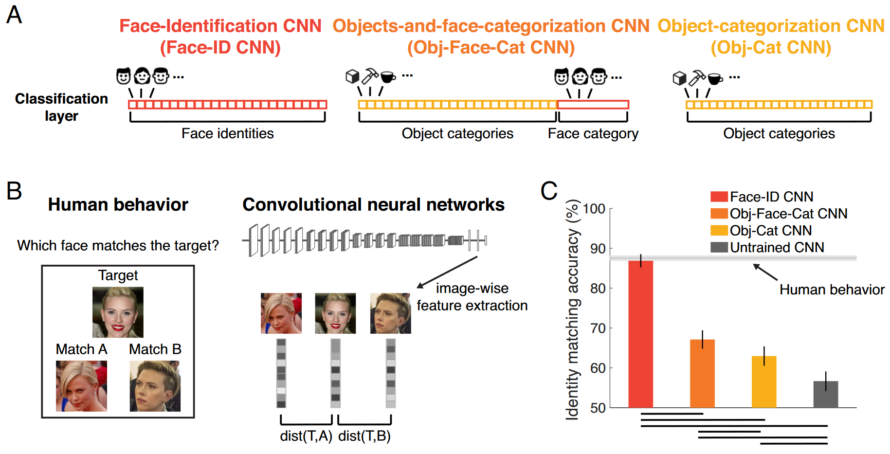
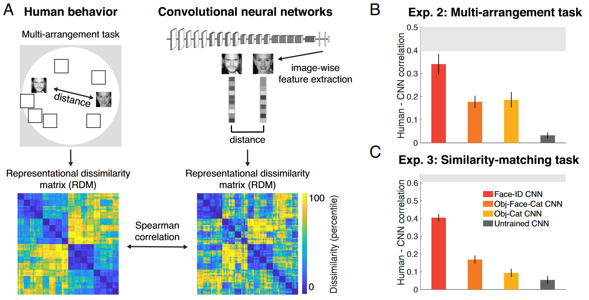
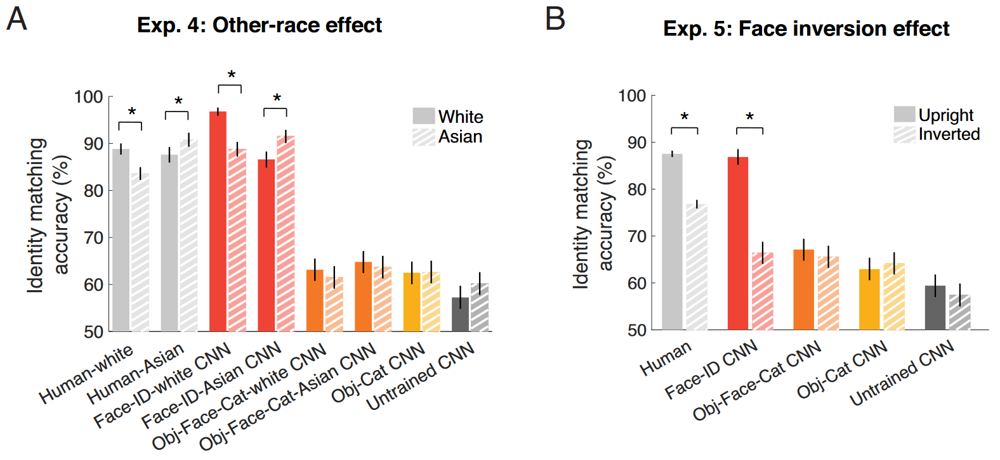
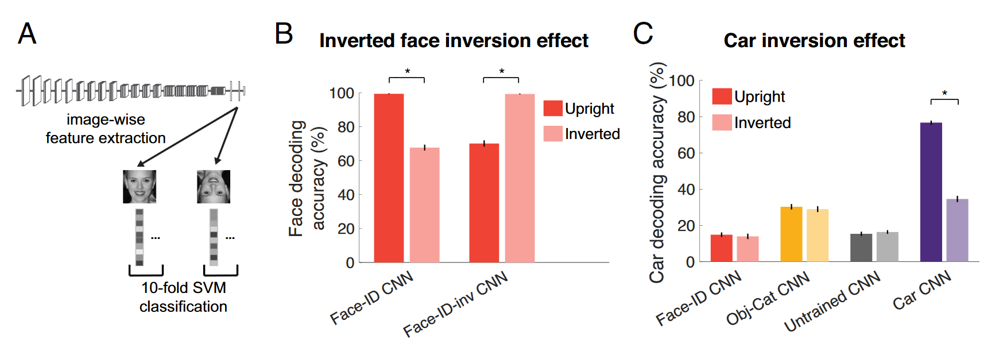

## 文献信息

- **标题 :** [Behavioral signatures of face perception emerge in deep neural networks optimized for face recognition](https://www.pnas.org/doi/epdf/10.1073/pnas.2220642120)
- **期刊 :** PNAS
- **作者 :** Katharina Dobs et.al
- **DOI :** 10.1073/pnas.2220642120
- **类型：** 计算实验
- **来源：** 老师提供，大牛的最近工作

## 目的

人脸识别表现出许多独特的行为特征（如倒置脸、异族效应）
这些现象和其他现象长期以来一直被视为人脸识别“特殊”的证据。但为什么人类的面部感知首先表现出这些特性呢？

文章使用 CNN 来测试以下假设：人脸感知的所有这些特征都是人脸识别任务优化的结果。如果特定的人类行为现象是给定任务优化的预期结果（无论是通过进化还是个人经验），那么应该在针对同一任务优化的深度神经网络中观察到类似的现象。

## 方法

在五个不同的实验中测试了行为任务，这些任务测量了现实世界人脸识别、人脸空间以及人脸感知的两个经典特征的表现：倒置脸、异族效应。将这些行为人脸感知特征直接与基于相同架构但针对不同任务进行优化的多个 CNN 进行比较。

- 针对细粒度人脸识别进行了优化
- 针对细粒度人脸识别进行了仅对象分类的训练（输出层中没有面部类别）
- 接受了对象分类和面部检测的训练（将所有面部分配给一个输出类别）
- 没有接受训练（随机权重的相同 CNN）

因为网络中没有具有任何内置的归纳偏差（除了由不同目标函数引入的偏差）来产生这些特定的行为特征，文章测试了经典的面部特征（面部反转效应）是否特定于面部本身，或者原则上它是否可以出现在针对这些类别的细粒度区分而优化的网络中的其他类别中。

## 结果

### 人脸识别性能是否特别体现了人脸识别的优化？

问题是我们在人脸识别方面的出色准确性是否源于通用对象分类能力，或者它是否反映了人脸识别的优化？

任务1：选择两张脸哪张和第三张属于同一身份。目标脸和非目标脸都是年龄在 20 岁到 35 岁之间的白人女性，通常在视点、光照和面部表情方面存在差异，要求参与者抽象这些差异以匹配身份，因此仅对年龄、性别或种族进行区分不足以高精度实现这项任务。

> Fig 1. 只有经过人脸识别训练的 CNN 才能达到人类水平的准确度。
> `B：`从倒数第二个全连接层提取到相同图像的激活模式，并计算每对图像激活的相关距离(1 – Pearson's r)
> `C：` 测试了四个CNN，均基于VGG16结构，红色Face-ID 训练区分身份；黄Obj-Cat 训练对象分类，排除动物；橙 Obj-Face-Cat，脸是同一类别；灰 UnTrain 模型。

**上述结果表明人类在人脸识别方面的高精度并不是针对通用对象分类进行优化的系统的结果，即使训练数据中有大量人脸。**

### CNN 是否以与人类类似的方式表示面孔？

使用表征相似性分析 (RSA) 进行比较。

> Fig 2. 经过面部训练但未经对象训练的 CNN 与人脸行为相匹配。
> `A: ` 参与者 (n = 14) 对 16 个面部身份（每个 5 个图像）执行多重排列任务，从而为每个参与者生成一个 RDM。
> 实验二要求参与者将每张图像放置在 2D 空间中，以捕获面部外观的相似性。实验三是将60 张不同的、不知名的年轻（20到30）男性身份的图像进行相似性匹配任务（如图1b）。
> `B-C：` Face-ID CNN 最匹配人类行为表征相似性（接近噪声上限 | 浅灰色条）。未经训练的 CNN、Obj-Cat CNN，或Obj-Face-Cat CNN都不能很好地匹配人类表征的相似性, 误差线代表参与者的平均值自举标准误差 (SEM)。

### CNN 是否显示人脸处理的经典特征？

为了测试 CNN 中异族效应，在仅包含亚洲身份的数据集上训练了一个用于人脸识别的Face-ID-Asian CNN，并在删除了所有亚洲身份的以白人为主的数据集上训练了另一个 Face-ID-white CNN，还有对应的对象分类和人脸检测网络 Obj-Face-Cat-Asian CNN/Obj-Face-Cat-white CNN。

> Fig 3. A：种族效应实验；B: 倒置脸效应实验（人类表现是使用SVM解码的）

结果揭示了人类表现出异种族效应的一个原因：这是训练区分特定种族面孔的自然结果。倒置效应同理。

### 倒置脸效应有多特别？

> Fig 4. 
> A： 两个网络 Face-ID CNN / Face-ID-inv CNN 分别对正置/倒置的同一数据集训练，100个身份，每个身份10张图像。
> B： 两个网络的效应相反，看起来非常对称。
> C： 将对象换成汽车，只有接受过汽车训练的 CNN 显示了汽车的倒置效应，倒置汽车的性能低于直立汽车。

**反转效应并不特定于面部本身，但原则上可以通过仅进行直立刺激的训练而自然地出现在其他刺激类别中。**

## 优缺

优

- 思路挺好，向我展示了如何应用人脑/AI之间的 GAP 去探索原因，很符合一篇综述中提到的认知计算神经这个用ANN研究的方向是”合成神经生理学“的表述。

缺

- 文章的唯一亮点和立足点只在 `Fig 4` 上，精读下来和只看图四接近，其他内容读起来没什么收获。

## 启发

#### 其他信息

- 接受鸟类细粒度分类训练的 CNN 中，存在反转效应
- 提出了一个观点，CNN 使我们能够超越仅仅将人脸处理的行为特征记录，而转向更有趣的事业——询问这些特征中的哪些可以解释为人脸计算优化的结果。