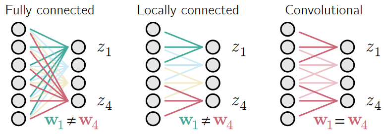
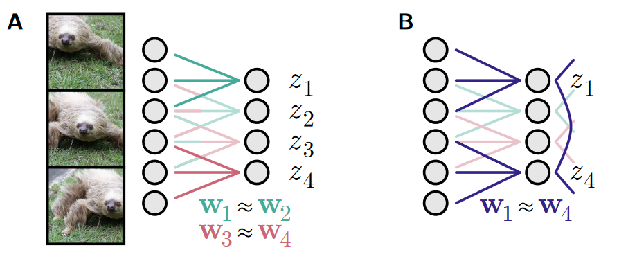
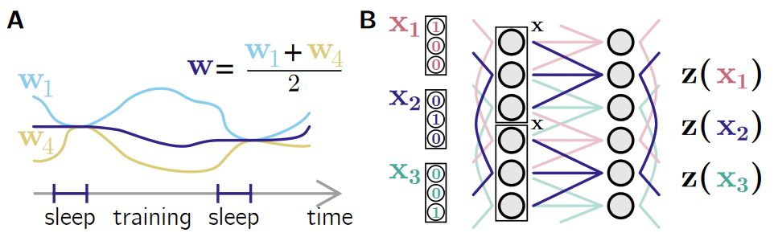
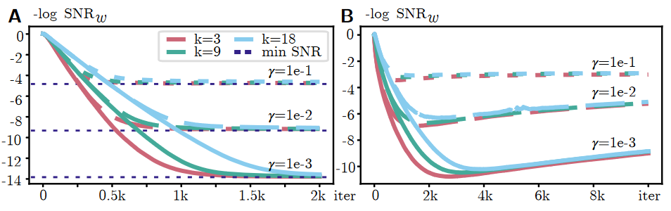
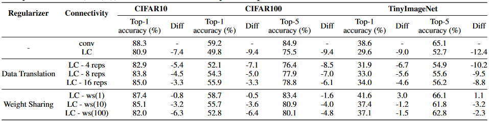
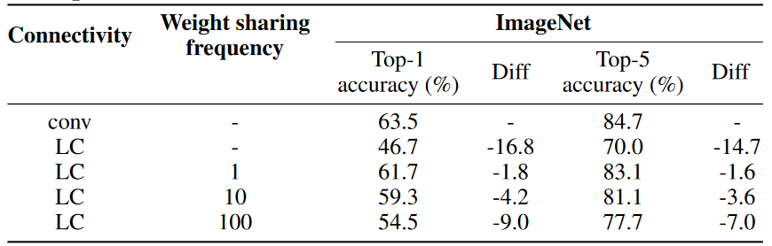
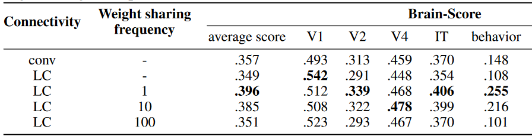

## 文献信息

- **标题 :** [Towards Biologically Plausible Convolutional Networks]()
- **期刊 :** NeurIPS
- **作者 :** Roman Pogodin et.al | UCL
- **DOI :** 
- **类型：** 模型改造，类脑，forward-forward 算法
- **来源：** 

## 目的

视觉皮层中简单/复杂细胞启发了深度神经网络的卷积层和池化层，卷积网络的表示与视觉流中的表示类似。

> 层架构之间的比较：全连接（左）、局部连接（中）和卷积（右）

卷积网络共享权重，而局部更新权重的生物网络做不到这一点，为了生物学合理性的局部连接网络的性能更差，本文每层的横向连接实现了一个类似睡眠的阶段实现动态权重共享，子群可以通过反赫布学习均衡权重，性能和卷积网络几乎一致，能更好的拟合腹侧流数据。

## 方法

> 局部连接实现权重共享的两个策略
> `A : ` 通过数据增强，同时呈现数据的转换，缺点是更多数据更长耗时； 
> `B ：` 动态权重共享，一些神经元通过横向连接和学习来均衡权重，需要额外的训练步骤。

如果在没有任何权重共享的局部连接网络中训练，训练过程不同神经元的权重会发散（下图A），本文的策略是引入一个偶尔的睡眠阶段将权重放到均值来补偿该差异。

> `A :`  动态权重共享会中断主训练循环，并通过内部动态均衡权重。之后权重再次发散，直到下一个权重共享阶段。
> `B :` 局部连接的网络，其中输入和输出神经元都具有横向连接。

$w_i$ 为包含神经元 $i$ 传入权重的向量，

$$z_i = w_i^T x = \sum^k_{j=1} w_{ij}x_{j}$$

$$\Delta w_i \propto -\left(z_i - \frac{1}{N} \sum^N_{j=1} z_j\right)x - \gamma(w_i - w_i^{init})$$ `🔗1`

$w_i^{init}$ 是睡眠阶段开始时的权重，此 Hebbian 更新有效的在 $(z_i - z_j)^2$ 的和上实现SGD，第二项正则化项保持权重接近 $w_i^{init}$ 。

$C \equiv \frac{1}{M} \sum_m X_m X^T_m$ 是 M 个不同输入向量的协方差，那么上述方程动态会逐渐收敛到下面的值。

$$w^*_i = (C+\gamma I)^{-1} \left(C \frac{1}{N} \sum_{j=1}^N w_j^{init} + \gamma w_{i}^{init}\right)$$

> 具有 100 个神经元的层中的权重共享目标信噪比的负对数(平均权重平方除以权重方差)，A 由 `🔗1` 方程给出的权重更新；B 由`🔗2`方程给出的权重更新。 

所以为了在合理时间范围内运行网络，会在睡眠阶段直接设置权重为均值（但不是所有，k维输入每k个神经元一个间隔，二维中会平均$k^2$个模块的权重）。

在多层网络里睡眠是逐层实现的，但因为方程 `🔗1` 收敛，更深的层不必等待较早的层完成。第一层（V1）是假设从如 LGN 接受带重复模式的输入，不需要权重共享。

#### 更新规则实现

根据  `🔗1` ，定义一个线性神经元 $r_i$ 被上游输入激活，被横向抑制影响，

$$r_i = z_i -\frac{1}{N} \sum^N_{j=1} z_j \equiv w_i^{T} x - \frac{1}{N}\sum^N_{j=1}w_j^T x$$

在神经动力学环路中可以使用兴奋性神经元/抑制性神经元描述其动力学如下（b 是保证发放率非负的共享偏置）：

$$\tau \dot{r_i} = -r_i + w_i^T -\alpha r_{inh}+b$$
$$\tau \dot{r_{inh}} = - r_{inh} + \frac{1}{N} \sum_j r_j -b$$

`🔗2`

方程具有唯一的稳定点，对于强抑制 （$\alpha >> 1$）可以被反赫布项 $-(r_i -b)x $ 实现，如果 $w_i^T x$ 均值为0，b是一段时间的平均发放率。

$$ r_i^* = b + w_i^T x - \frac{1}{N} \sum_j w_i^T x + \frac{1}{1+\alpha} \frac{1}{N} \sum_j w_j^T x $$

在一个由 100 个神经元组成的网络中进行模拟训练，该网络每 150 毫秒接收一个新的 x。对于 k 和 的范围，它在几分钟内收敛到接近卷积的解。有限的抑制会导致最终信噪比更差，但权重方差仍然很小，在收敛之前停止训练会带来更好的结果（图 4B 中大约 2k 次迭代）。

## 结果

实验分为两部分：
- CIFAR10、CIFAR100 和 TinyImageNet 的小规模实验，用于说明数据增强和动态权重共享对本地连接网络性能的影响。
    
    > LC (locally connected) ，ws表示动态权重共享（1代表每个epoch都进行权重共享），reqs表示平移重复

- ImageNet 的大规模实验，测试动态权重共享。
    

在 Brain-Score 上测试类脑分数，高动态权重共享频率的LC具有更高的平均分数。

## 优/缺

优：

- 设计了一个生物学上更合理的卷积算法
- 动态权重共享方案独立于唤醒阶段训练算法，可以与以后任何生物学上更合理的更新规则一起应用

缺：

- 需要更长的训练时间，性能比 conv 略有下降，即使是每个epoch都共享权重也在 ImageNet 上能掉1.8个点

## 启发

让网络睡眠再进行调整是一个挺有意思的想法