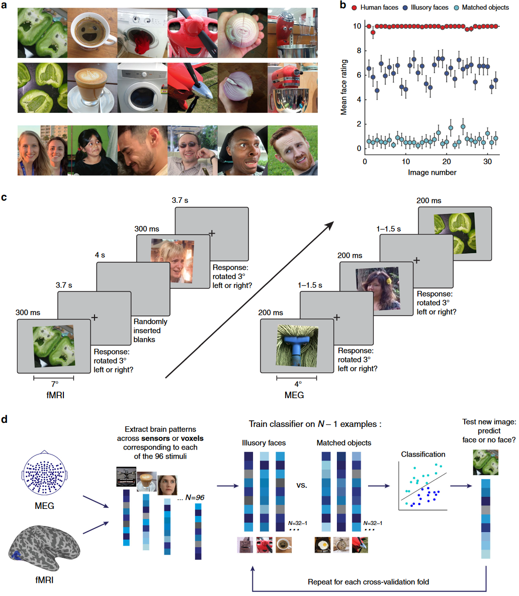
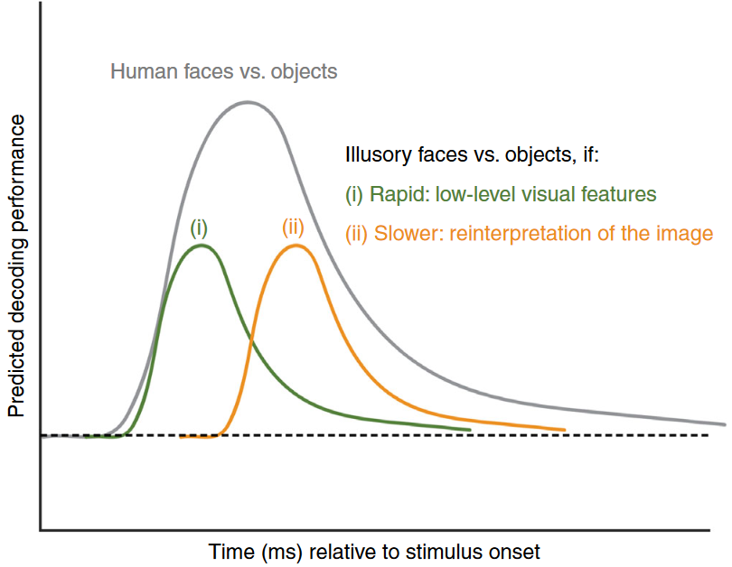
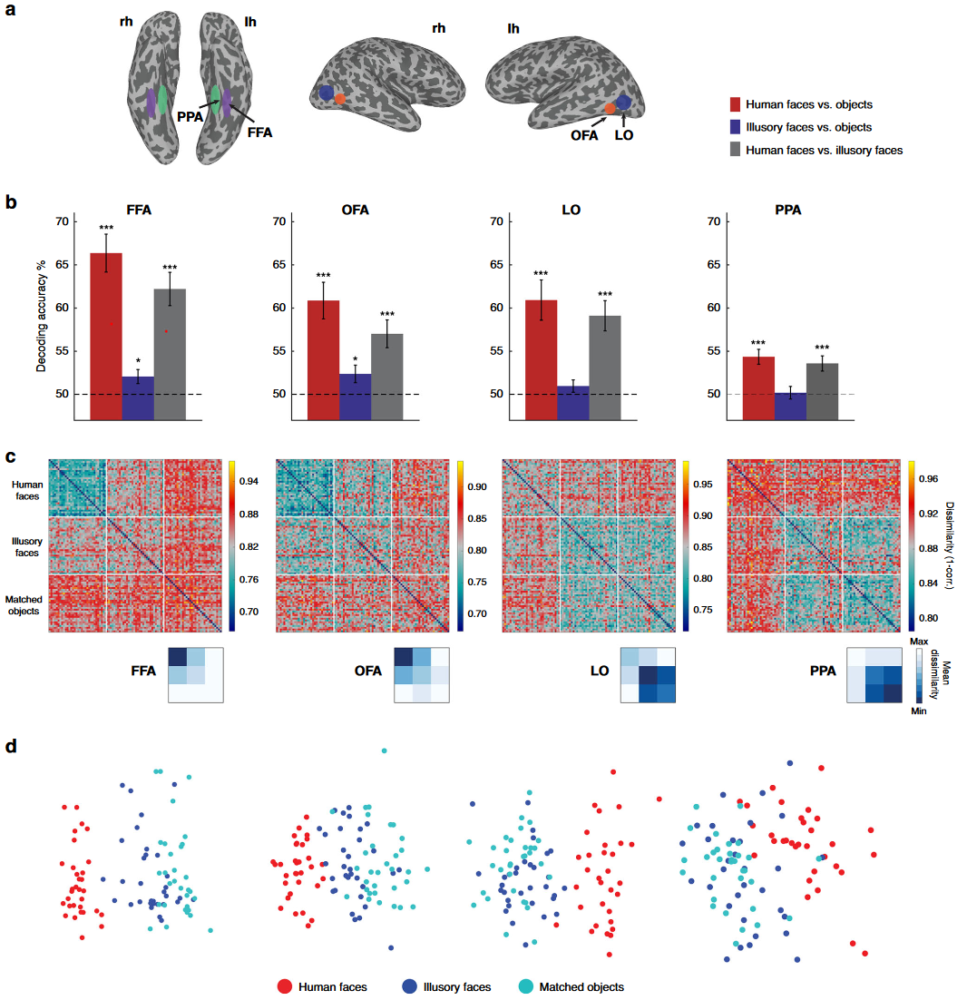
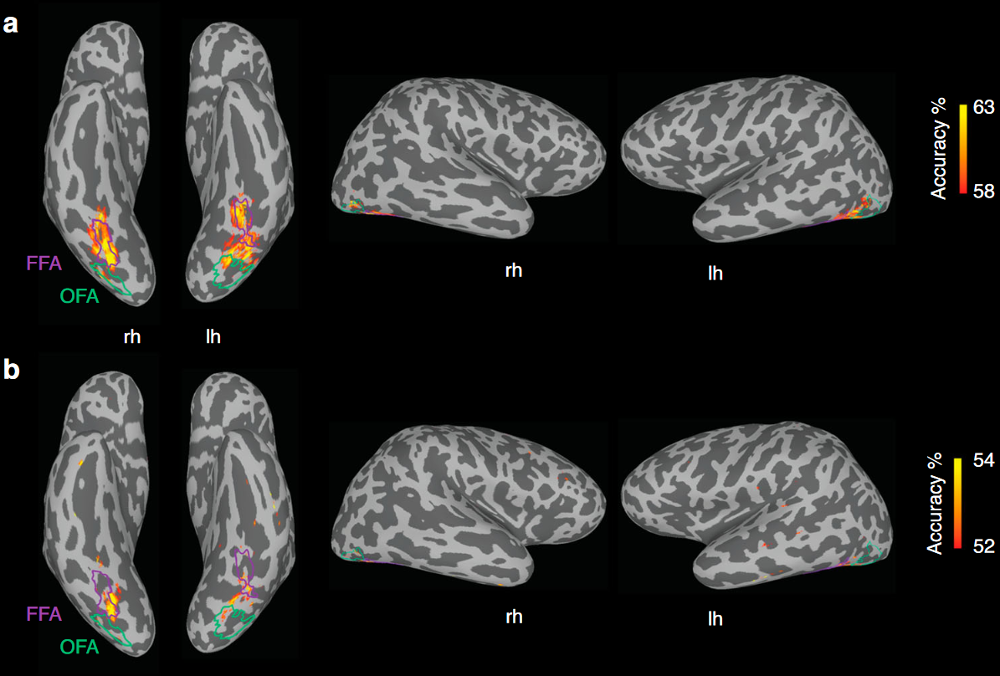
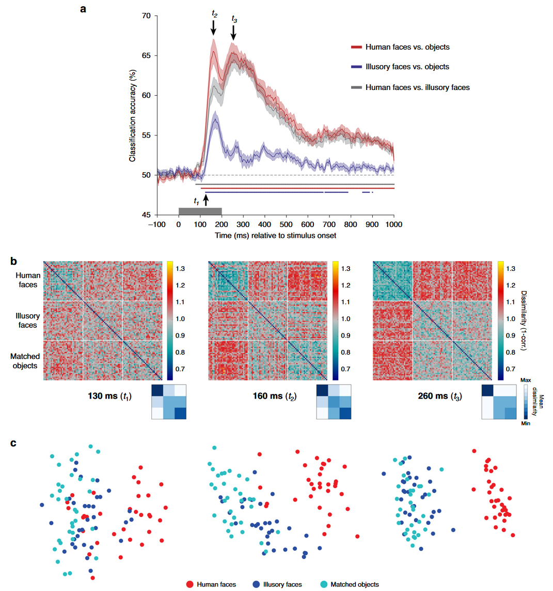
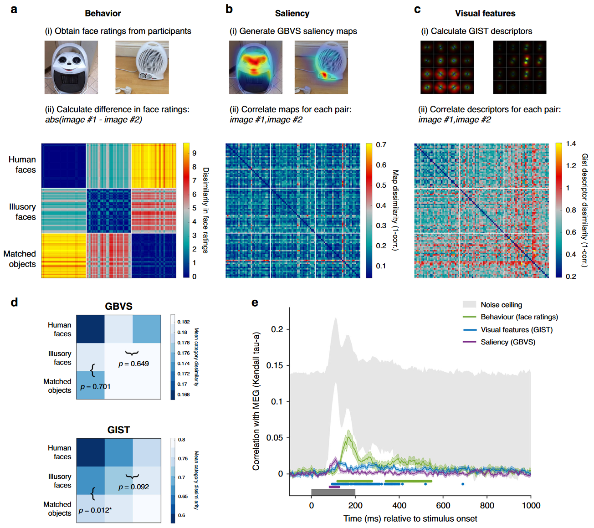
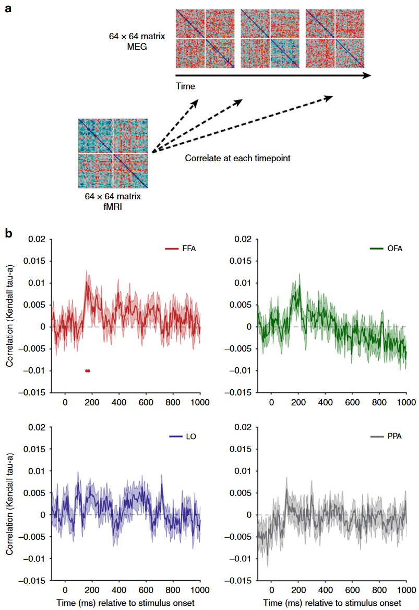

## 文献信息

- **标题 :** [Rapid and dynamic processing of face pareidolia in the human brain](https://doi.org/10.1038/s41467-020-18325-8)
- **期刊 :** NATURE COMMUNICATIONS
- **作者 :** Susan G. Wardle et.al
- **DOI :** 10.1038/s41467-020-18325-8
- **类型：** MEG实验，数据分析
- **来源：** 偶然发现

## 目的

目前不清楚空想视错觉是否源于基于视觉特征的快速过程，还是源于较慢的认知重新解释，识别空想视错觉处理的时间动态对于理解这些面孔检测错误的起源至关重要，

可能：
- 视觉特征的某些排列会快速激活基本的面部检测机制，导致对面部的错误感知 $\to$ 面部检测机制广泛调整并高灵敏，但增加了误报
- 空想脸的面部感知可能源于对视觉属性较慢作为面部特征进行认知重新解释

## 方法

每张空想错视图像都有匹配的物体图像，在语义和视觉上相似。

第一目标是确定高级视觉皮层哪些类别选择区域对无生命空想脸敏感，选择了FFA/OFA/LO (对象选择性枕叶) /PPA (场景选择海马旁区)，见图2a，训练了一个单独的二进制LDA分类器，使用交叉解码分析测试哪些大脑区域具有能区分三类实验刺激的活动。

>Fig 1. 实验设计和分析
> A: 数据分析
> B：96 种刺激的行为评分来自20名网络被试，“评估你在这张图像中看到一张脸的难易程度”
> C:  fMRI (n = 16) 和 MEG (n = 22) 神经影像实验的事件相关序列（由于 fMRI BOLD 信号的时间滞后较长，实验的 fMRI 版本比 MEG 版本使用了更长的呈现时间和更长的刺激间隔），任务是使用按键判断每个图像是否稍微向左或向右倾斜。
> D： 留一交叉解码方法。

> Fig 4. 对两种假设进行MEG交叉解码的预测结果，如果虚幻的面孔激活基于低级视觉特征的快速神经通路，预计峰值解码的时间与人脸的峰值解码时间相似（绿线）；如果虚幻的面部感知需要基于重新解释图像的较慢的认知过程，则峰值解码应该相对于刺激开始较晚发生（橙线）；与解码真实面孔与对象相比，预计从匹配对象交叉解码虚幻面孔的性能会降低，因为空想脸与对应对象共享更多视觉和语义特征。

## 结果

> Fig 2. 功能磁共振成像结果显示面部选择性皮层对空想脸敏感。
> B：根据给定感兴趣区域中体素的 BOLD 激活模式对受试者正在观看的刺激类别进行分类，使用单样本 t 检验（单尾）针对机会解码性能 (50%) 评估统计显着性。
> C：四个ROI所有刺激的RDM（$96\times 96$）

空想脸可以通过全脑活动快速解码

> Fig 3. fMRI 交叉解码结果，上为人脸-物体，下为空想脸-物体。

> Fig 5. MEG结果随时间推移，空想脸的表征发生了快速转变。
> A： 到刺激发作的130ms（t1），三组比较都可以显著解码，都在 160ms （t2）有一个峰值，除了空想脸-物体之外，在260ms （t3）有第二个峰值。
> B：表示所有刺激在三个感兴趣时间点的RDM（1-spearman）
> C： 使用多维缩放（MDS）降维方法对RDM进行可视化，绘制前两个维度并对类别着色。

文章对此给出的解释是：
- 最初空想脸和对应物体表示不同，但只有在100ms后分组
- 类级别交叉解码的快速出现，表明空想脸被快速处理，表现的比对应物体更像真实面孔
- 迅速检测到错误，使它们在四分之一秒内与对应对象更相似

**想要通过比较两种视觉特征计算模型能在多大程度上解释大脑对空想脸的反应**

> Fig 6. 将MEG表示与视觉显著性、视觉特征和行为模型联系起来，基于GBVS的显著性map、基于GIST的视觉特征和基于被试行为的评分，构建了三个矩阵。
> `D：` 平均类内的每个示例，建立 $3\times 3$ 矩阵
> `E：` 行为、显著性、视觉特征模型与随时间变化的MEG表示差异矩阵的相关性，阴影部分表示SEM，显着性模型与刺激开始后 85-125 毫秒的 MEG 数据显着相关。视觉特征模型和 MEG 数据之间的主要显着相关性发生在 95-400 ms，而行为模型在两个时间窗口（120-275 和 340-545 ms）中相关。

> fMRI-MEG 融合，四个ROI里每个的fMRI RDM 和MEG时变 RDM 的相关性，没有真实人脸的部分。

与匹配的对象相比，虚幻的面孔最初表现得更类似于真实的面孔，但在大约 250 毫秒内，表现形式发生变化，并且它们变得与普通对象等效。

- 面部选择区对无生命空想脸敏感，但其他枕颞类别选择区域不会 $\to$ 空间受限反应

- 空想脸短暂且快速演变的动态反应，最初的100ms内空想脸表现比对应的非面孔对象更类似人脸。

##  优/缺

**优：** 强调了在理解人类认知方面时间动态的重要性

**缺：** 没发现结合fMRI有什么作用

## 启发

- 快速皮下通路会涉及到面部检测，杏仁核可能在检测空想脸中起了作用。