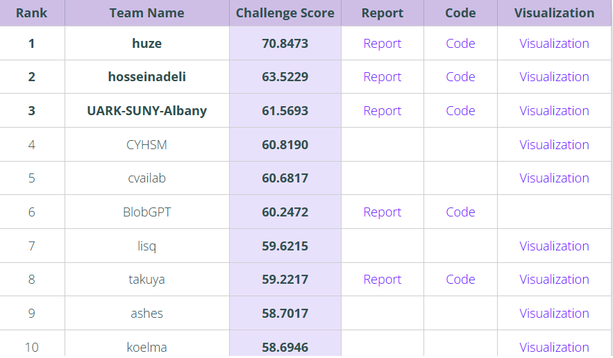
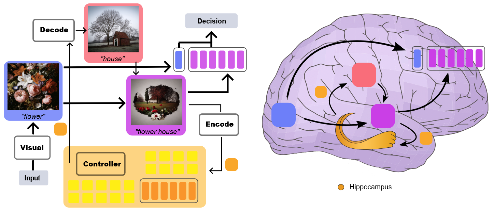
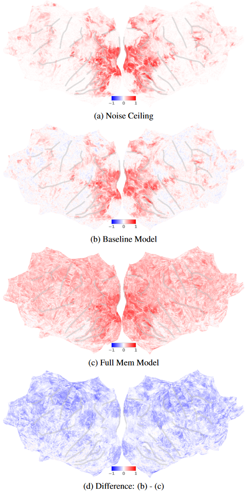
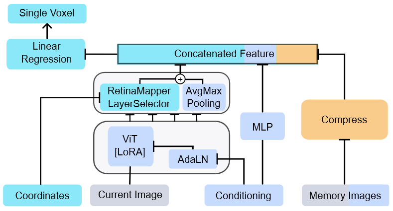
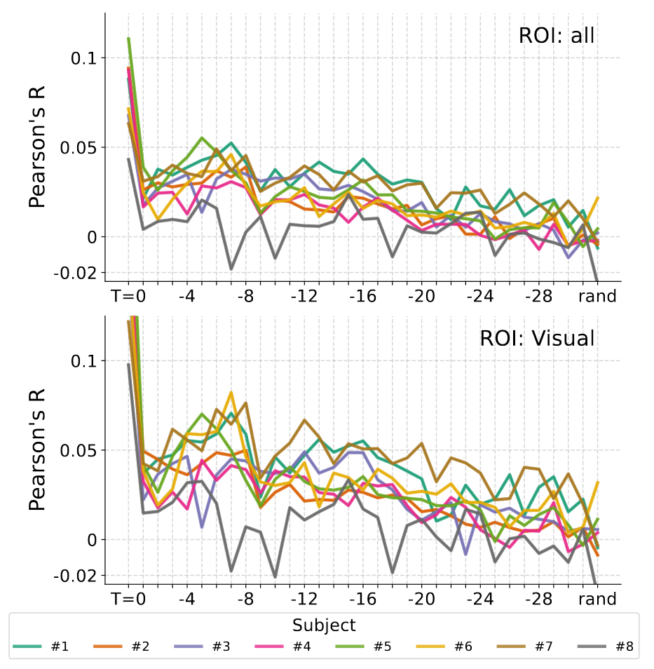
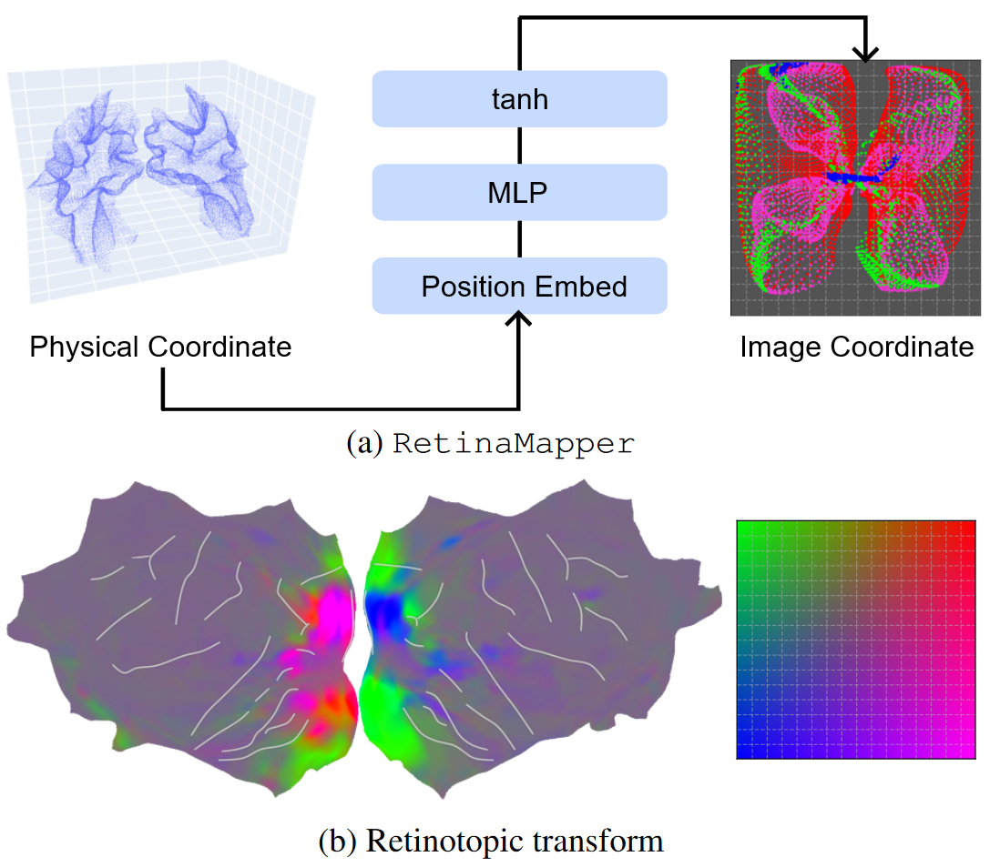
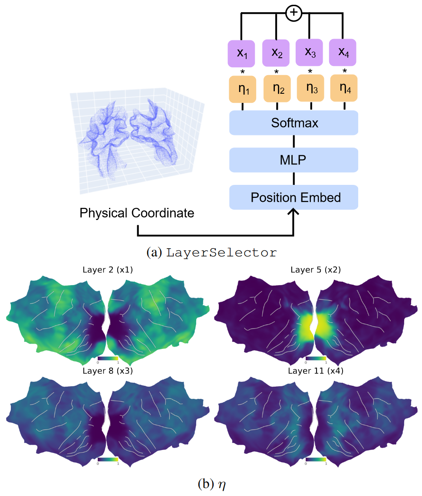
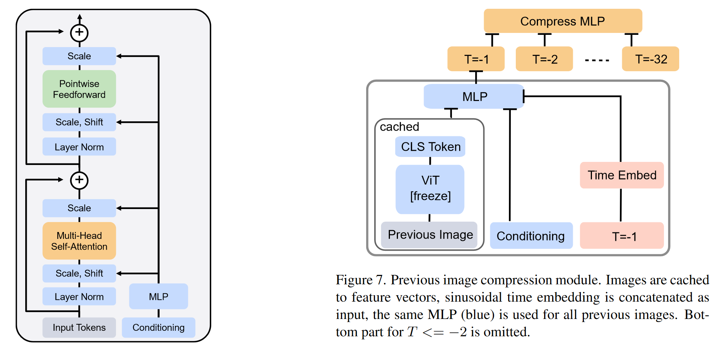

## 文献信息

- **标题 :** [Memory Encoding Model](https://huzeyann.github.io/mem)
- **期刊 :** 目前挂在 arxiv
- **作者 :** Huzheng Yang et.al
- **DOI :** 
- **类型：** 类脑建模，竞赛
- **来源：** Algonauts 2023 最佳模型

## 竞赛相关

[The Algonauts Project 2023](http://algonauts.csail.mit.edu/) $\parallel$ [slice](https://penno365-my.sharepoint.com/:p:/g/personal/huze_upenn_edu/EcuvlCSxjSBDk719Q_Dxc7ABNUebclx8wIUKAg2VGKwNXQ?rtime=SNvGyia_20g) $\parallel$ [Download the data for Algonauts 2023](https://docs.google.com/forms/d/e/1FAIpQLSehZkqZOUNk18uTjRTuLj7UYmRGz-OkdsU25AyO3Wm6iAb0VA/viewform)

该模型 Rank 1 ，**Score 70.85**，**OrganizerBaseline	40.4222** , 表现上遥遥领先。

### 目的

Algonauts 2023 挑战的重点是预测人类参与者感知复杂的自然视觉场景时大脑的反应。通过与自然场景数据集(NSD)团队的合作，是目前最大的可用脑数据集。

目的就是将模型预测大脑活动的结果与真实结果比较，**评估得分是在所有可用的顶点计算的，而不是在任何单个ROI上计算出来的**，选出最佳的模型。

例如本文结果：

具体的比较方法如下图所示

- 将预测的fMRI数据与相应的真实数据相关联（皮尔逊相关系数），跨图像的，在每个体素上独立计算
- 每个体素上的相关系数平方
- 用噪声上限归一化结果
- 度量由所有受试者和半球中所有顶点的平均噪声标准化编码精度决定

$$ \text{metric} = Mean \left( \frac{R^2_1}{NC_1}, \dots , \frac{R^2_v}{NC_v} \right) \times 100$$ 

### 数据

#### Train Data

- **Images** : 具有八个主题的 `.png` 图像集，数量分布为 $\left[ 9841, 9841, 9082, 8779, 9841, 9082, 9841, 8779\right]$ , 如主题1的第一张图像命名为 `Train-0001_NSD-00013.png` ，第二个索引表示对应于 73000 个 NSD 图像的 ID，可以用它映射回原始 Hdf5 文件再得到 COCO 数据集里的原始图像文件（实验中用的是裁剪版本，该比赛提供了从COCO原数据裁剪图像的[代码](https://github.com/styvesg/nsd_gnet8x/blob/main/data_preparation.ipynb)）
- **fMRI** : 对应图像，有相应的fMRI反应文件 `lh_training_fmri.npy` ，`rh_training_fmri.npy`，**数据是在每个NSD扫描会话中 z-scored 后在图像重复间平均，总体上是一个二维矩阵，行数是图像数量，列是NSD实验期间对该图像有可靠响应的顶点**。左和右半球文件分别有 `18978` 和 `20544` 个顶点（除受试者 6 、8 由于缺少数据只有 ( 18978, 20220 ) / ( 18981, 20530 )）

#### Test Data

- **Images** ：8个主题中的每个主题，每个主题都有$\left[159、159、293、395、159、293、159、395 \right]$ 不同的图像，命名规则如上。
- **fMRI** : 无，这是要预测的

#### Region-of-Interest (ROI) Indices

提供了用于选择ROI的 index，可以自行决定使用。

- 早期视网膜视觉区 （PRF-VisualOIS）：V1v, V1d, V2v, V2d, V3v, V3d, hV4.
- 身体选择性区域 ： EBA, FBA-1, FBA-2, mTL-bodies.
- 面孔选择区域 ：OFA, FFA-1, FFA-2, mTL-faces, aTL-faces.
- 位置选择区 ：OPA, PPA, RSC.
- 词语选择区 ：OWFA, VWFA-1, VWFA-2, mfs-words, mTL-words.
- Anatomical（解剖） streams：early, midventral, midlateral, midparietal, ventral, lateral, parietal.

## 思路 

最近的工作基于“大脑反应纯粹由当前呈现的图像引起”这样的假设，准确的预测了早期视觉皮层，但复杂且非视觉的大脑皮层很大程度上是无法预测的。

大脑可以在不看图像的情况下思考图像，也可以区分新见到的图像和看过的图像，这些属性是ViT不具备的。该文章的思路符合预测编码理论的假设，

好像大脑在无意识情况下不断的以可预测的周期重现看过的图像，

> Fig 1. 视觉记忆任务期间假设的记忆重放过程
>

> Fig 2. 本文发现如果使用与记忆相关的信息，整个皮层（包括非视觉部分）变得能被很好的预测。该图为皮层映射预测分数（单次试验 Pearson 的 r），展示的是 subject#1 的 beta2。
> A：重复实验测得的噪声上限。
> B：基线模型输入是当前图像帧，不涉及记忆。
> C：完整记忆模型输入是之前的32帧，加上条件向量。
 

## 方法

> Fig 3. 内存编码模型概述。每个体素有 RetinaMapper 和 LayerSelector 特征选择的唯一物理坐标，具有特定于该体素的线性回归权重。

作者认为该模型主要依靠两项创新：

- 模型输入结合了当前图像、行为反应和记忆图像。 RetinaMapper 和 LayerSelector 模块专门复制视网膜拓扑。
- 随机 ROI 嵌入方案得益于大脑体素的隐式交互和分层组织。

周期性延迟响应 ：通过构建输入看过的图像的预测模型来检查数据，观察到视觉/非视觉大脑中反应与之前第6-7个图像相关，与刚刚过去的1-2个图像无关。文章表示在八个被试中都能观察到 6-7 帧的周期性相关上升，与工作记忆的周期性匹配。海马尾部的预测响应与该周期一致，而海马头部不是。

引出了文章的假设：记忆从海马体加载并定期再生，也许是为了通过计算来扩大工作记忆。

### 模型

#### 模型主干

使用预训练的图像主干模型 DiNOv2-ViT-B , 使用LoRA技术优化ViT中的注意力层和MLP（LoRA训练始终比冻结的ViT权重分数高，完全解冻比冻结分数低）

动机是空间上接近的体素具有相似的功能作用，RetinaMapper 和 LayerSelector 旨在强制输入特征h对每个受空间坐标约束的体素是唯一的。

**RetinaMapper :** 将体素的空间坐标转换为图像空间的二维坐标 $u_i \in \mathcal{R}^2$

$$u = tanh (MLP(PE(p)))$$

PE 表示正弦位置编码，tanh 确保 u 不会越界，对所有层是相同的。

> RetinaMapper 将体素的 3D 物理坐标转换为 2D 潜像特征图空间。特征向量在2D特征图上通过线性插值进行采样。
> a: 仅包括视觉脑的体素，点由 LayerSelector 的 argmax 层着色
> b：视网膜转换是在没有视网膜拓扑监督下端到端训练的
 
**LayerSelector ：** 将体素的空间坐标转换成 ViT 主干的权重 $\eta_i \in \mathcal{R}^4$，类似一个遮罩
$$\eta = softmax(MLP(PE(p)))$$

熵正则化 $L_{ent} = \sum_{j=1}^4 \eta^j \, log \, \eta^j$ 用于防止在早期训练阶段收敛到局部最小值

> LayerSelector 权重以及特征向量和来自各个backbone层，

AdaLN 模块