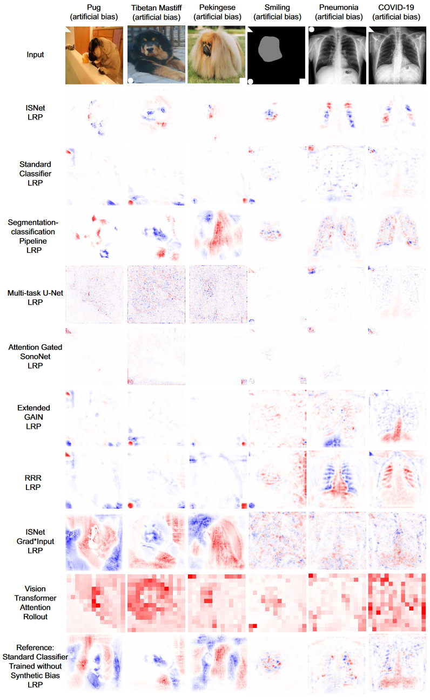
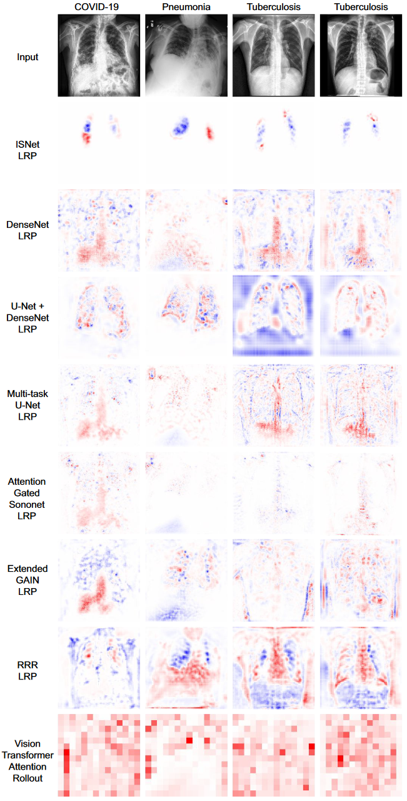

## 文献信息

- **标题 :** [Improving deep neural network generalization and robustness to background bias via layer-wise relevance propagation optimization](https://doi.org/10.1038/s41467-023-44371-z)
- **期刊 :** Nature Communications
- **时间 :**  2023
- **作者 :** PedroR.A.S.Bassi et.al.
- **DOI :** 10.1038/s41467-023-44371-z
- **类型：** 
- **来源：** 

## 目的

**提出了一个称为ISNet的方法，在（分布外）测试数据库上的泛化性能显着超过了所有已实现的基准模型。主要贡献是减少背景偏差，可以可靠地忽略图像的背景，阻碍背景偏差引起的捷径学习，提高了分布外 (o.o.d.) 泛化能力。**

> 背景偏差：图像背景中的特征可能与图像的类别虚假相关，可以影响分类器的决策，导致捷径学习。

Layer-wise Relevance Propagation （LRP）逐层相关性传播可以解释DNN的决策，LRP热图的优化可以最大限度地减少背景偏差对DNN的影响。不增加运行时计算成本，该方法轻便且快速，几乎适用于任何分类架构。

## 背景

背景偏差对分类器的影响会降低其分析图像相关特征的能力，并降低其决策的可信度。有偏差的模型将在训练数据集以及包含相同背景偏差的评估数据库（i.i.d.）上表现良好，但因为捷径学习难以对分布外 (o.o.d.) 数据库进行概括并保持准确。

逐层相关性传播是一种解释技术，LRP 热图是通过明确输入图像的每个部分如何影响 DNN 输出来解释模型行为的图形。可以为输入图像创建热图，解释给定类别的分类器分数，正热图值和负热图值（称为相关性）分别表示增加或减少分类器对类别的置信度的图像区域。 _我毕设时使用的SHAP就是其中一种方法。_

## 方法

该研究建议在训练期间生成可微分的 LRP 热图，并使用损失函数对其进行优化。该函数称为热图损失，采用真实语义分割掩模来识别与输入图像背景相对应的热图区域，并最小化这些区域中的 LRP 相关性大小，将热图损失的最小化与分类损失一起称为背景相关性最小化（BRM）。 _即一种基于解释和分割的空间注意力机制_

使用 BRM 训练的 DNN 可以隐式区分输入图像的前景和背景特征（即隐式分割图形），并仅根据前景做出决策。作者将使用 BRM 训练的分类器命名为隐式分割神经网络 (ISNet)。

过去的工作定性和定量地证明，LRP 解释提供了比注意力机制和相应的注意力热图更高分辨率的热图和更多可解释的信息。 LRP 植根于深度泰勒分解框架,通过近似在每个 DNN 神经元上执行的一系列局部泰勒展开来解释分类器的决策。

LRP 传播规则的选择会影响热图的可解释性、噪声和传播的稳定性，最基本的规则称为LRP-0。

ISNet 直接优化 LRP 以改善分类器的行为。在训练期间，背景相关性最小化 (BRM) 会惩罚训练图像的 LRP 热图中不需要的相关性，从而限制分类器学习不依赖于背景特征的决策规则。

## 结果

## 优点/创新

- 能减少背景偏差，可以可靠地忽略图像的背景，阻碍背景偏差引起的捷径学习，提高了分布外 (o.o.d.) 泛化能力

## 不足

仅是将热图损失与分类损失线性组合，创新型有限

## 启发

暂无，一开始想的是否能靠这种方法减少捷径学习，但注意到它要求数据集中训练集能做分割任务。