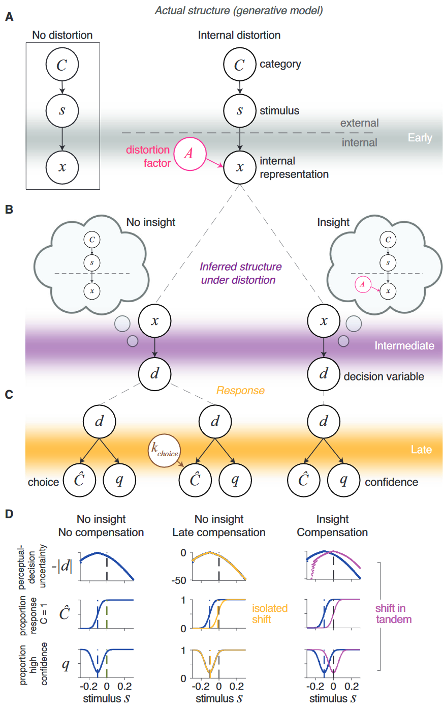
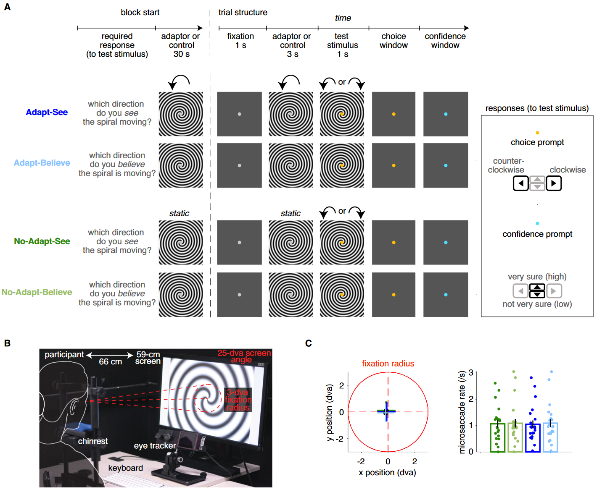
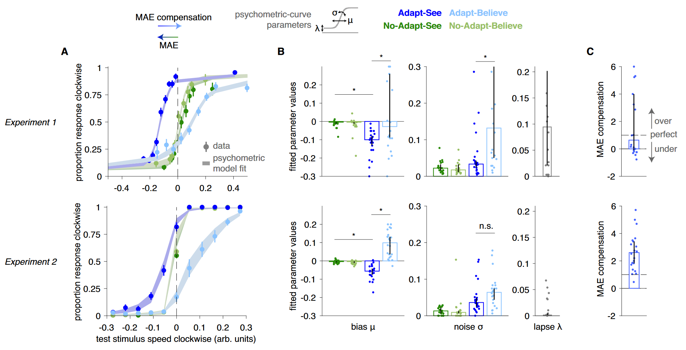
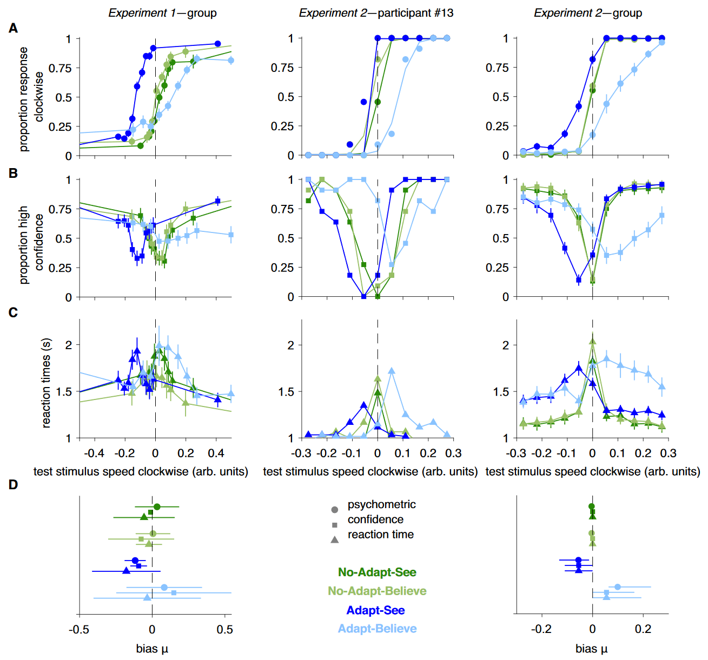
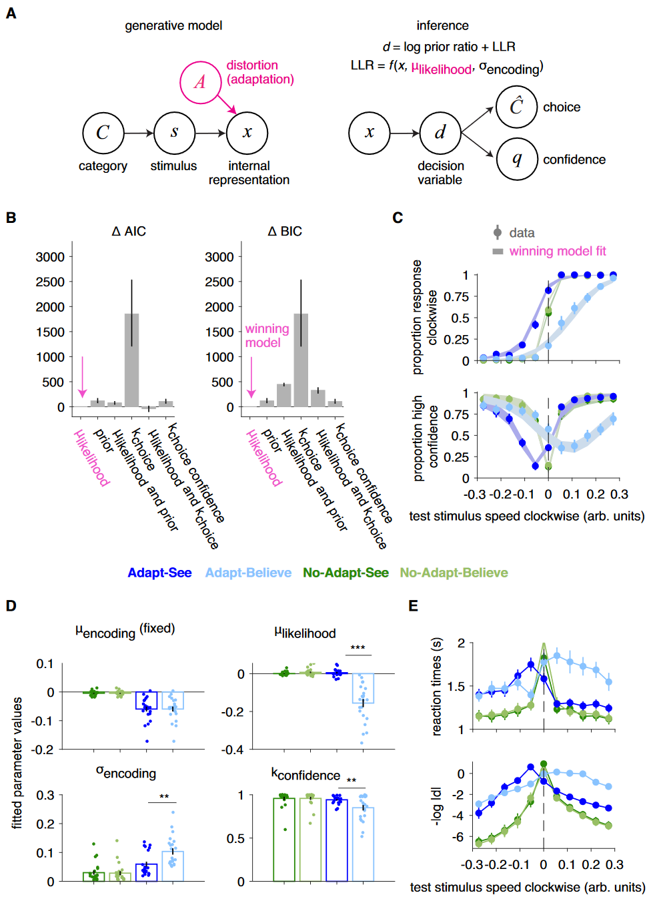
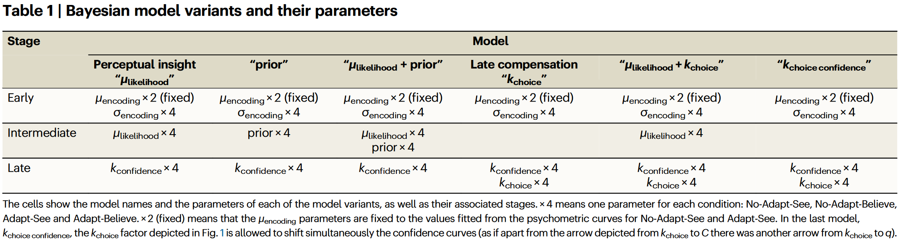
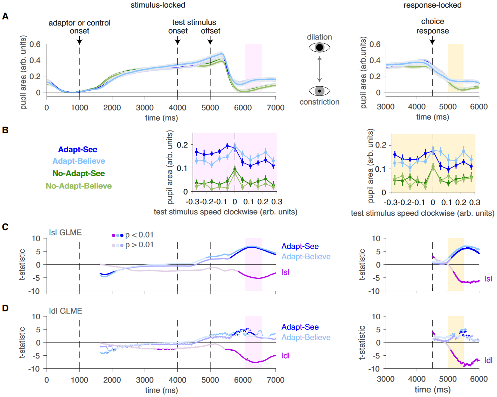

## 文献信息

- **标题 :** [Introspective inference counteracts perceptual distortion](https://doi.org/10.1038/s41467-023-42813-2)
- **期刊 :** Nature Communications
- **时间 :**  2023
- **作者 :** Andra Mihali et.al.
- **DOI :** 10.1038/s41467-023-42813-2
- **类型：** 
- **来源：** 

## 目的

**人们可以通过结合有关内部扭曲的内省知识做出富有洞察力的推论来质疑他们所看到的内容的真实性，以抵消这些扭曲。** $\to$ 这种能力背后的认知机制尚未得到充分理解

文章提出了一种基于贝叶斯理论的感知洞察的正式模型，并提出了一种感知洞察范式，可以最大限度地减少记忆混淆并增强对先前设计的实验控制，以定量描述人们体验运动后效错觉时的洞察力。

## 背景

> **洞察力受损：** 测试主观的内部感官体验是否反映了外部世界的实际状态，精神分裂症等精神障碍的典型特征是无法质疑扭曲知觉的现实，洞察力受损会导致错误的信念，并可能导致不稳定的行为

> **现实测试：** 广泛使用两种主要方法，语义关联和句子完成范畴下的源（自我/他人）记忆任务、感知决策范畴的图像任务。

文章重点关注一种称为“感知洞察”的现实测试形式，**将有关内部知觉扭曲的内省知识纳入其中，以有效推断外部世界的实际状态的即时过程。**

探测感知洞察首先需要实验诱导足够强的感知扭曲，然后探测关于不同客观刺激真实状态的信念。

> **感知扭曲:** 客观刺激特征与其主观感知体验或估计之间的差异

> **运动后效 (motion after-effect MAE)：** 长时间看复杂运动刺激引起的强烈错觉感知

人在判断运动刺激的实际方向时，可以将错误相关的知识纳入决策来补充错觉（通常是过度补充），置信度、反应时间和瞳孔扩张数据都显示出与贝叶斯洞察模型中的推理调整一致的特征。

健康参与者在报告实际运动方向的信念时（相对于报告感知运动）可以补偿MAE错觉，而这种补偿最好通过贝叶斯模型来解释，模型通过中间推理阶段的调整来捕获洞察力。

## 方法

### Formal model of perceptual insight

> **感知决策的标准模型：** 具体见 [Decision theory, reinforcement learning, and the brain](https://link.springer.com/article/10.3758/CABN.8.4.429)

> **图1 :** 感知洞察的感知决策框架，从上到下可以看做 A/B/C 三个阶段
> 其中 $C$ 是外部刺激 s 所属的类别，s 被编码成内部感觉表征 x 。
> 有洞察力（右）和无洞察力（中/左）的选择和信心模式是不同的，没有洞察力的后期补偿（中）会导致选择曲线孤立变化。
- `A：` 
- B： 中间阶段进行推测生成决策变量
- C：响应-选择-计算置信度，在后期智能体以一定的置信度 q 做出选择 $\hat{C}$ 。
  - 贝叶斯观察者首先推断中间阶段 $C$ 的后验概率，决策变量 d 与阈值 $k_{choice}$ 比较得到后期后验概率最高的类别，将所选响应的后验概率 $p(C = \hat{C}|x)$ 与阈值 $k_{confidence}$ 进一步比较生成响应置信。

如果内部表示还受到失真因子A的影响，不再仅仅是外部刺激的函数，有洞察力的agent可以结合A对x影响的知识适当改变决策变量d，补偿因素A并使用无偏响应规则做出C的准确决策。

需要将有洞察力的最优agent（图一右）和在因素A下表现相似但缺乏洞察力的agent（图一左）区分开，观察到响应偏差并不能保证有洞察力的策略

### 感知决策实验范式

22名被试，整体范式采取二×二设计

> **图二：** 
> **A：** 描述了四种任务条件，区别见图，
>> - block 以对应提示开始
>> - 30s的恒速逆时针旋转/静止
>> - 测试正式开始，先空1s，
>> - 3s的恒速逆时针旋转/静止
>> - 空白黄点提示，1s的测试刺激（分别针对测试刺激中的顺时针或逆时针运动选左右）
>> - 空白蓝点提示，然后按上下反馈对自己回答的置信度
>
> **B:** 展示装置
> **C：** 左图表示平均注释位置没有统计差异，右图表示不同条件下微眼跳率没有统计差异（微眼跳率可以反映注视稳定性的差异）

这里MAE就是第一个移动螺旋对观察者判断第二个螺旋方向引起的偏差，
将 MAE 补偿测量为适应-相信（Adapt-Believe）条件下适应-看到偏差（即 MAE 错觉）的相对校正。

## 结果

### 观察者补偿扭曲的感知

> 图三
> A： 横坐标表示测试刺激顺时针旋转速度，负表示和适应刺激一样为逆时针，纵坐标表示被试认为测试刺激是顺时针转的比例。不同条件下的曲线可以被共享同一个过失参数 $\lambda$ 的高斯累积密度函数拟合。

- MAE表现为 Adapt-See 中的心理测量曲线相对于对照 No-Adapt-See 条件向左移动，表明感知顺时针运动存在偏差。
- 相对于 Adapt-See，Adapt-Believe 的心理测量曲线显示出向右修正偏移，表明 MAE 的补偿。

实验 2 使用眼动追踪来强制注视并在包含注视的 8 秒时间窗口内防止眨眼，不仅复现了现象且产生更高质量的数据。
- 实验 2 中来自 Adapt-See 和 Adapt-Believe 的噪声参数 σ 之间没有统计学上的显着差异（与实验 1 不同）
- 实验 2 参与者倾向于表现出系统性过度补偿，Adapt-Believe 中的心理测量曲线经常向右移动超出控制条件

通过 MAE 强度估计**经验性地证实**：参与者知道这种错觉，并期望 MAE 在大小上与 Adapt-See 期间观察到的 MAE 效果大致一致

### MAE 补偿与中间推理过程一致

只有中间阶段调整才会引起感知决策不确定性的同步变化，后期补偿应导致心理测量曲线在这些条件之间发生孤立的变化（图 1C）。

> MAE 和 MAE 补偿的心理测量曲线与置信度和 RT 曲线同步变化

心理测量曲线中与 MAE 相关的变化伴随着置信度和 RT 曲线的相应变化，与之前的工作一致。

### 贝叶斯建模支持感知洞察

> A: 感知洞察模型中生成模型和推理的简化示意图，通过 $\mu$ 似然项估计因子A造成的失真。
> B：比较感知洞察模型/$\mu$ 似然模型的表示能力
> C：winner 模型对应的拟合值
> D：事后双边 t 检验，发现 Adapt-See 与 AdaptBelieve 在 μ_likelihood 方面存在显着差异 
> E: RT 曲线反映了获胜模型的感知决策不确定性 - ∣d∣

> 贝叶斯模型及其变体参数

- 可以通过在知觉推理的中间阶段结合有关这种内部扭曲的知识来补偿起源于早期感觉阶段的不可避免的知觉扭曲，即使他们倾向于过度补偿
- 支持了观察到的 MAE 补偿反映了真正的感知洞察力，而不是替代性的或表现为后期响应阶段调整的附加过程。
- RT 可以通过决策不确定性来简单地解释，决策不确定性反映了感知洞察模型中后验信念的不确定性。

### 瞳孔测量进一步验证感知洞察模型

> A: 归一化后瞳孔面积的时间序列，左图刺激锁定数据中粉色窗口显示决策窗口，在右图响应锁定窗口中显示为黄色
> B: 瞳孔扩张峰值作为刺激强度的函数，显示出适应-看到和适应-相信之间微妙但明显的变化
> C: 移动窗口 GLME 统计方法

确认了适应-看到和适应-相信之间这个内部变量的瞳孔测量特征的预测变化，进一步支持感知洞察模型的有效性。

### 漂移扩散建模支持感知洞察的中间推理级解释

不了解该建模方法，没继续看它的进一步论证

## 创新

- 通过模型拟合和创新的实验范式间的组合，成功证明了一个很难被定量验证的假设，其中内省推理、感知扭曲等概念都是难以把捉的抽象概念。

- 巧妙的通过实验设计定义了运动后效

## 不足

由于我对这篇文章涉及到的内容并不熟悉，难以点出不足

## 启发

这项研究也可以简单理解为证明 “矫正感知到的知觉扭曲是在后期进行的还是在中间推理过程就进行的”，可能对我做反馈相关的工作有思路上的帮助