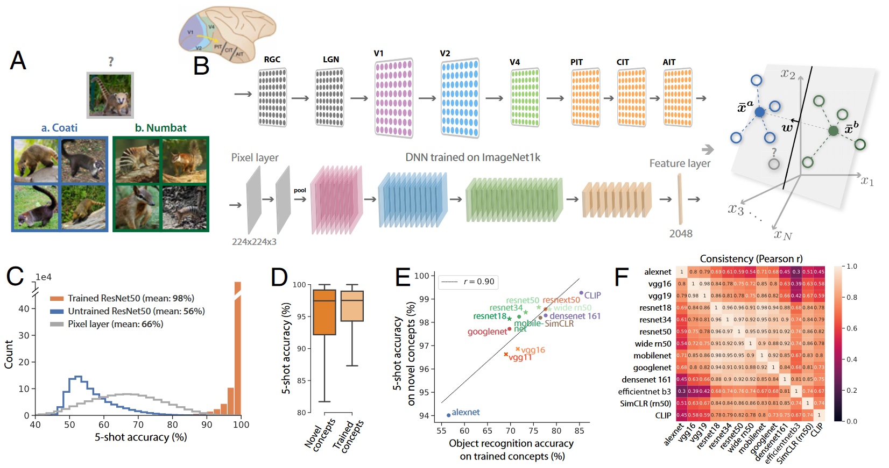
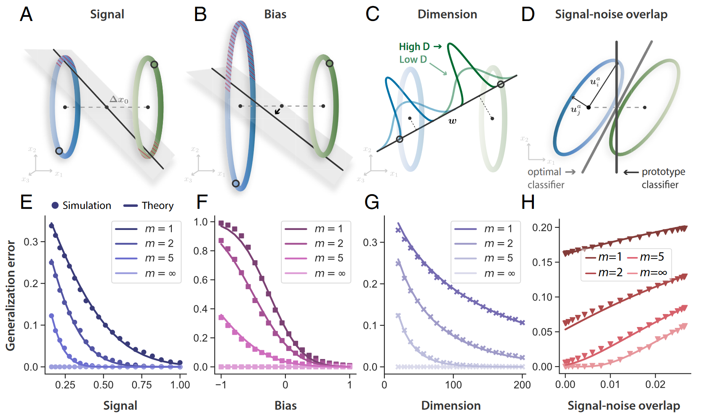
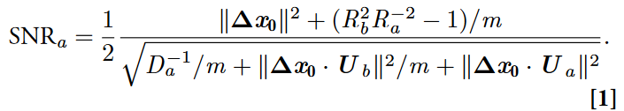
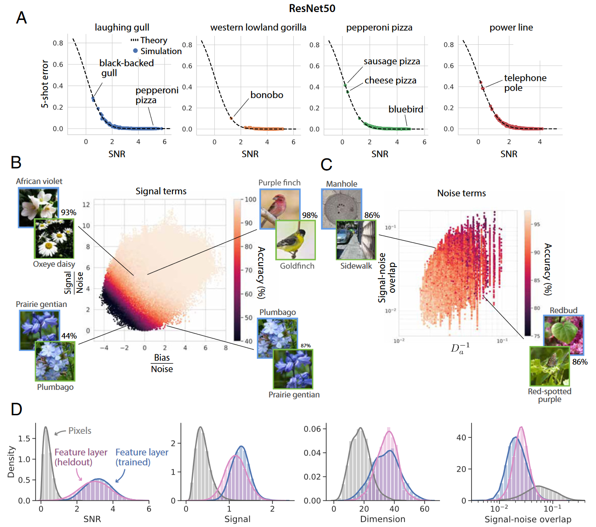
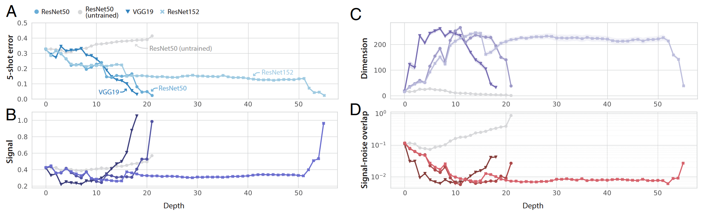
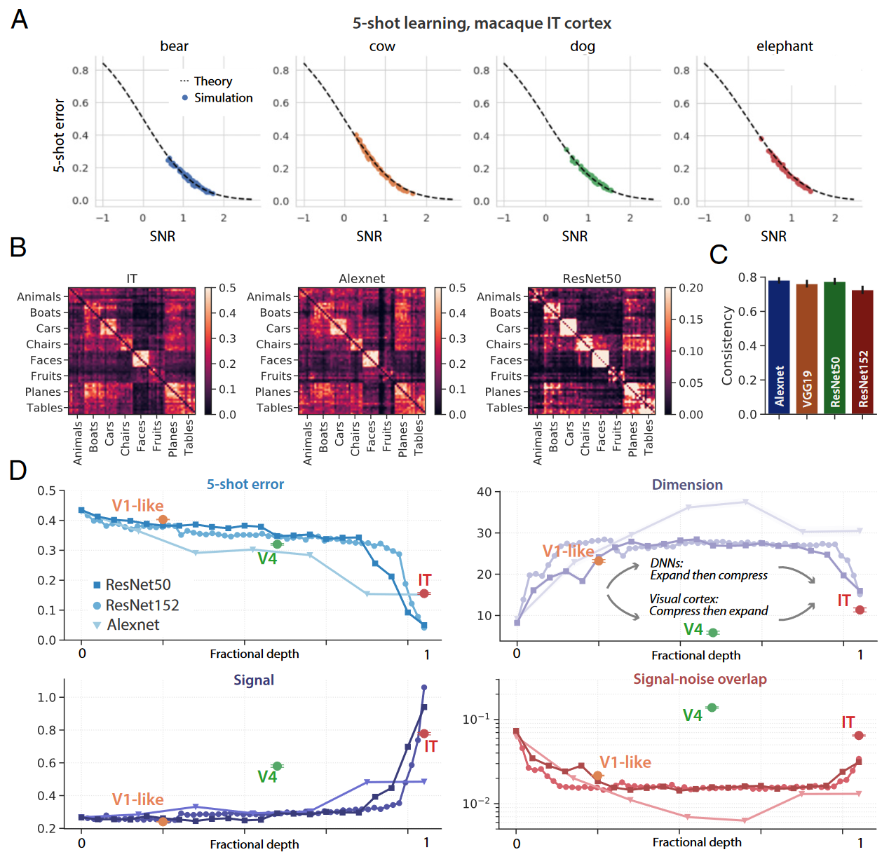
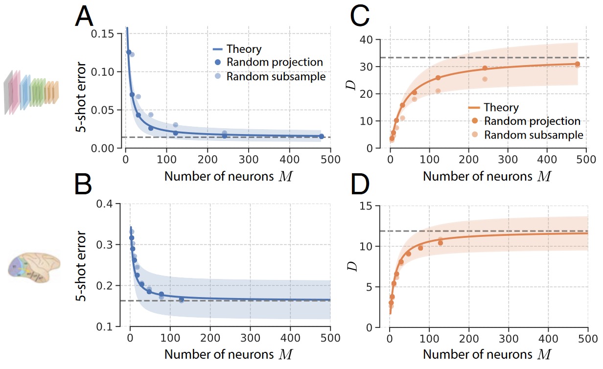
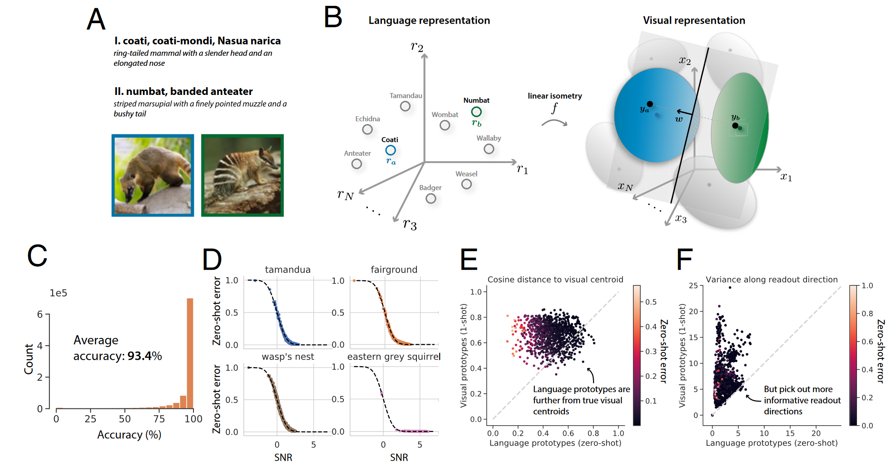
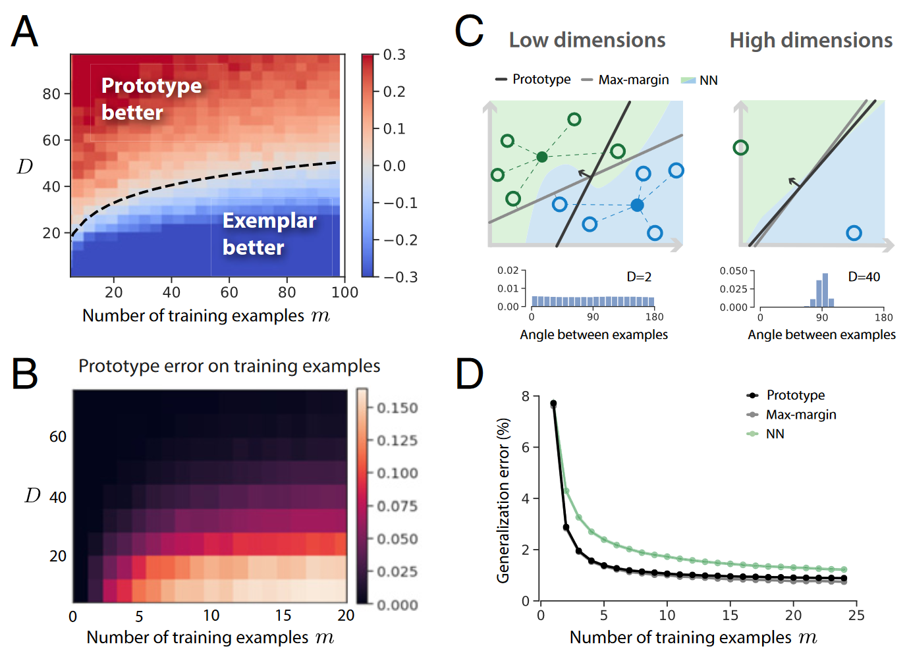

## 文献信息

- **标题 :** [Neural representational geometry underlies few-shot concept learning](https://doi.org/10.1073/pnas.2200800119)
- **期刊 :** PNAS
- **时间 :**  2022
- **作者 :** Ben Sorscher et.al.
- **DOI :** 10.1073/pnas.2200800119
- **类型：** 理论 + 假设检验
- **来源：** 

## 目的

目的是从流形在神经表征上的应用层面入手，提出数学理论，尝试解释视觉概念的小样本学习能力。

## 背景

> 原型学习（Prototype Learning）: 通过将训练示例引发的活动模式平均化为概念原型来进行学习

文章根据图1的结果提出了几个基本的理论问题
- 为什么经过图像分类任务训练的 DNN 在小样本学习中也表现得如此出色？
- 派生的神经表示的哪些属性可以提高小样本学习性能？ 
- 为什么有些概念比其他概念更容易学习？
- 为什么成对分类误差不对称？

## 方法

为了研究神经表示的几何形状如何影响小样本学习的性能，对于新概念的学习，从ImageNet21k数据集中选择了1000个在训练期间没被模型见过的视觉概念

通过学习对这些训练图像在 DNN 特征层中的类 IT 神经元中引发的活动模式进行分类，来检查学习区分每一对新概念的能力

> 图1.概念学习框架和模型性能
> b: 将概念学习建模为学习线性读出对这些活动模式分类，这些活动模型可被视为高维空间中的点。在原型学习情况下，活动模式被平均为原型。
> c：对于训练过的模型新概念（橙）泛化准确率非常高（5次学习平均测试准确率是98.6%、one-shot 测试准确率为92%），使用随机初始化DNN（蓝）和在输入图像像素空间中学习线性分类器（灰）的测试精度差
> d：新概念（深橙）的测试准确性仅略低于训练期间见过的熟悉概念
> E：用于训练DNN的对象识别任务性能和其泛化到新概念能力的相关

- 发现不同的模型在哪些新概念容易/难学方面是一致的，并表现出相似的表征几何

- 训练模型进行概念分类学习到的神经表示足以促进新概念的高精度小样本学习

- 几次学习错误模式揭示了许多概念对的明显不对称性，这种不对称不仅是原型学习的一个特征，也是原型学习的一个特征。

#### 原型学习的几何理论

> 图2.少样本学习的几何。每个概念的流形可以近似为一个高维椭球体，原型分类器的泛化误差（红色斜线阴影）由这流形的四个几何属性控制（见方程1），`m` 表示训练样本量。

> 均方半径 $R^2 \equiv \frac{1}{N} \sum_{i=1}^N R_i^2$ , 其中 $R_i$ 是沿一组正交基 $u_i , i=1,\dots,N$ 方向的半径

- `A：`  Signal 指流形之间的成对距离 $||\Delta x_0||^2 \equiv ||x_0^a - x_0^b||^2 / R_a^2 $ , 在给定很少的训练示例（空心圆）的情况下，分离得更好的流形更容易被线性分类器区分
- `B：` Bias $R_b^2R_a^{-2} - 1$，当一个流形的半径相对于另一个流形增长时，决策超平面会向半径较大的流形移动。因此较大流形上的泛化误差增加，而较小流形上的误差减小。
- `C：` Dimension ，高维流形在线性读出层方向上的投影更集中，因此高维流形更容易用线性方法区分。 
    $D_a$ 称为参与比（participation ratio），量化了流形显著变化的维度，通常远小于神经元数量。
$$ D_a \equiv (R_a^2)^2 / \sum_{i=1}^N (R_i^a)^4 $$

    先前的研究表明，低维流形具有物体识别所需要的特性，允许更多熟悉的物体被完全分类，但图一结果显示对于小样本学习高维流形是首选的，

- `D:` Signal-noise overlap , 噪声方向 $u_i$ 和信号方向 $\Delta x_0$ 显著重叠的流形对具有较高的泛化误差。即使在无限训练样本的限制下，只能访问流形质心的原型分类器（深灰色）也无法克服信号噪声重叠。相反最佳线性分类器（浅灰色）可以利用流形质心周围的变异性知识来克服信号噪声重叠。
  
    $||\Delta x_0 · U_a||^2$ 和 $||\Delta x_0 · U_b||^2$ 量化信号方向和流形变化轴向 $U_a \equiv [u_1^aR_1^a,\dots,u_N^aR_N^a] / \sqrt{R_a^2}$ 之间的重叠，随着维数 Da 的增加信号噪声重叠减少。

- A–D 中每个几何量相关的泛化误差行为（m = 1, 2, 5, ∞）。理论预测显示为黑线，合成椭球流形上的​​小样本学习实验显示为点。
  - `F：` 当偏差较大且为负时，泛化误差可能大于机会 (0.5)
  - `G：` 当流形变异性分布在更多维度上时，泛化误差会减少
  - `H：` 在存在信号噪声重叠的情况下，即使对于任意大的 m，泛化误差也保持非零。

训练样本数量的影响：随着训练样本数量 m 的增加，原型更加接近真实流形质心，但在大量示例 m 的限制下，即使流形是线性可分的，泛化误差也不会消失。

## 结果
 

> A: 将理论预测与图 1 中进行的小样本学习实验进行比较, 着色点表示一个新颖概念相对与所有999个的概念对（四个图展示了四个如 “black-backed gull” or “pepperoni pizza” 的概念），每个点代表一对概念的平均泛化误差（因为是一对图片进行的任务）。 
> B: Signal terms - 将每对新概念的泛化准确度刨析为信号和偏差的贡献差异，通过噪声归一化后绘制每一对视觉概念，用准确性着色。
> C：Noise terms - 
> D： 将类视网膜像素层（灰）| 特征层（粉）| 用于训练的1000个概念的特征层（蓝）中所有新概念对的信噪比、信号、维度和信号噪声重叠的直方图，表明trained的概念和heldout的概念的几何结构在很大程度上相似。

#### 沿着视觉层次

> 少样本学习沿着经过训练的 DNN 的层进行改进，符号表示三种不同的训练模型和未训练的ResNet50，线条和标记表示 100 × 99 对对象的平均值；周围的阴影区域表示 95% CI（通常小于符号大小）
> A：小样本泛化误差沿着每个经过训练的 DNN 层大致单调下降。
> B：信号在经过训练的网络的早期层中大致恒定，而在 DNN 的后期层中急剧增加。
> C：维度在网络的早期层中急剧增长，并在网络的后期层中再次缩小。
> D：信号噪声重叠从像素层到特征层逐渐减少，首先在网络的早期层中急剧减少，然后在网络的后面层中略有增加。

- 发现几乎所有概念在从像素层映射到特征层时都变得更好分离（即更高的信号）、更高的维度和更正交（即更低的信号噪声重叠）
- 训练和新概念之间的几何形状大致相似，表明对1,000个概念的训练为 DNN 提供了相当通用的特征提取器。
- 发现 DNN 中概念流形的几何结构编码了丰富的语义结构，包括分层组织，这反映了 ImageNet 数据集中视觉概念的分层组织

#### 灵长类神经表征 | 概念学习

通过猕猴V4和IT的神经记录获得概念流形的几何形状，提出的几何理论能够使用行为动物 V4 和 IT 皮层中真实神经元的激活模式正确预测少样本学习模拟的泛化误差。
原型学习在所有 64 × 63 对视觉概念中平均五次准确率是 84% ；在同一组视觉概念上，略优于 AlexNet DNN (80%)，比 ResNet50 (93%) 差，与之前关于灵长类动物识别性能的实验一致。

> A: 对 IT 中记录的 168 个神经元的神经群体反应进行五次原型学习（5-shot指一个类只给看5张次图片学习）实验，每张图显示一个视觉概念相对于所有其他（63）视觉概念的平均泛化误差，和理论预测（虚线）非常符合
> B：IT 中 5-shot 的错误模式揭示了清晰的块对角线结构，类似于 AlexNet 和 ResNet50 。
> C：DNN 中的错误模式与 IT 中的错误模式的一致性衡量（皮尔逊）
> D：计算 IT、V4 和 V1 神经元群体中概念流形的几何属性，每个图都显示了一个几何量沿着视觉层次的演变。包含经过训练的 ResNet50（方块）、ResNet152（浅色圆）和 Alexnet（淡色倒三角）。
> **将 V1、V4 和 IT 与 BrainScore 指标下最相似的 ResNet 层对齐**
> - 在 DNN 中，维数在早期层急剧扩展，在后面层收缩，而在灵长类视觉通路中，维度从 V1 到 V4收缩，然后从 V4 到 IT扩展；
> - DNN 中信号噪声重叠在早期层中受到抑制，然后在后期层中增长，而在灵长类视觉通路中，信号噪声重叠从 V1 到 V4 增长，从 V4 到 IT 受到抑制。
> 

为了多方面验证上图D发现的不匹配现象，附录中使用非线性方法重复这些分析来估计内在维度，发现了一致的结果。

#### 概念学习需要多少个神经元？

利用随机投影理论估计对少量 M 个神经元进行子采样的效果来回答这个问题

> 采样神经元数量对概念学习和流形几何的影响，蓝色曲线代表随机投影理论的预测值，虚线表示预测的渐进值，阴影表示所有概念对的方差。黄色曲线是将纵坐标从 5-shot error 更改为 流形维度。

下游神经元仅接收来自约 200 个神经元的输入，其表现与接收所有可用神经元的输入基本相似，并且具有估计维数接近其渐近值。

#### 没有视觉示例的概念学习

讨论零样本学习

视觉概念流形几何中编码的丰富语义结构表明，人类还拥有仅使用语言描述来学习新视觉概念的能力可能是一种简单的神经机制，从非视觉语言表示中学习视觉概念原型。
在实验中发现能通过简单地将新颖的视觉概念的名称传递到词向量嵌入模型并应用线性等距来构建新颖的视觉概念的原型，使用这些语言衍生的原型对成对的新颖视觉概念中的视觉刺激进行分类，达到 93.4% 的测试准确率，这一性能略好于一次性学习的性能（92.0％）。

> A: 仅在语言描述的情况下学习新颖视觉概念的任务示意图
> B：从词向量嵌入模型（左，灰色圆圈）中收集用于训练 DNN 的 1,000 个视觉概念的名称的语言表示（例如“食蚁兽”或“獾”），以及来自经过训练的 DNN 的相应视觉概念流形（右图，灰色椭球体）。学习线性等距映射来将每种语言表示尽可能接近地映射到其相应的视觉流形质心。
> C: 泛化准确性很高
> E：通过余弦相似度测量，one-shot 学习的视觉原型比语言衍生的原型更接近真实概念流形质心。
> F：当投影到从语言原型派生的读出方向时，真实概念流形的变化小于投影到 one-shot视觉原型派生的读出方向 （表示语言派生的流形结构更接近真实概念流形）

<!-- #### 比较自然任务的认知学习模型

 -->

## 创新点/优点

- 开发了一个理论框架，通过简单的、生物学上合理的概念学习神经模型，解释了人类对新颖的高维自然主义概念小样本学习的高准确性。
- 理论提供了群体响应易于测量的几何特性，并成功将特性与简单原型学习模型的小样本学习性能联系起来。理论的定量预测与实验结果非常一致。
- 发现DNN和灵长类神经表示的维数、信号噪声重叠在层次结构中变化趋势非常不同。
- 将理论扩展到跨领域学习，证明使用语言和视觉领域之间的简单映射，可以从没有视觉示例概念的语言描述中获得相对高的零样本学习能力
- 通过分析证明并通过数值证实，只需 200 个类似 IT 的神经元就可以实现较高的小样本学习性能

## 不足/缺点

- 开源的代码没怎么做整理，全是ipynb非常混乱。
- 相对于2021年的流形统计力学实现，该文章基于少样本学习的情况加了额外简化，将流形形状简化为高斯流形。

## 结合

当前能找到的较新较好的流形方法应用文章，同时文章提出的理论框架对我潜在的流形分析也很有价值