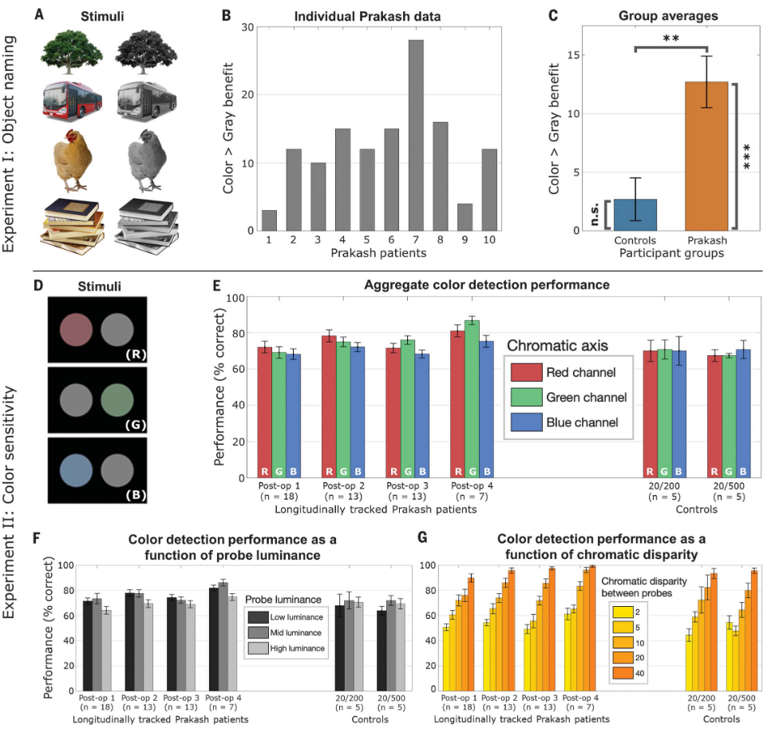
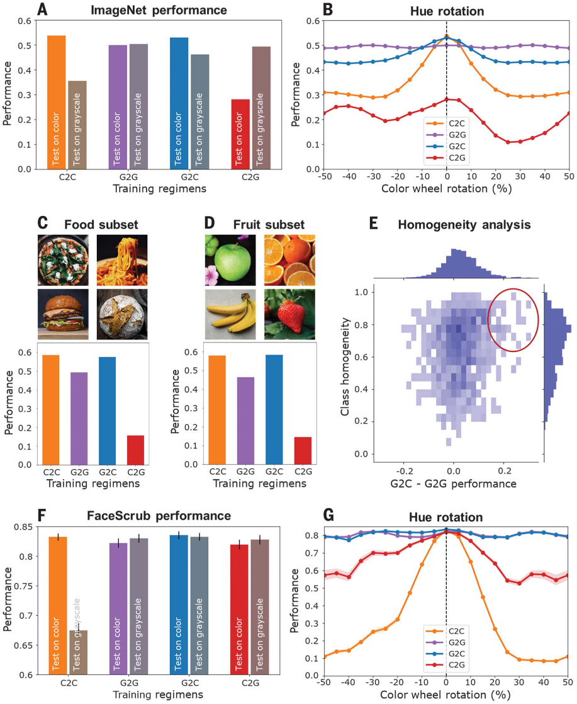
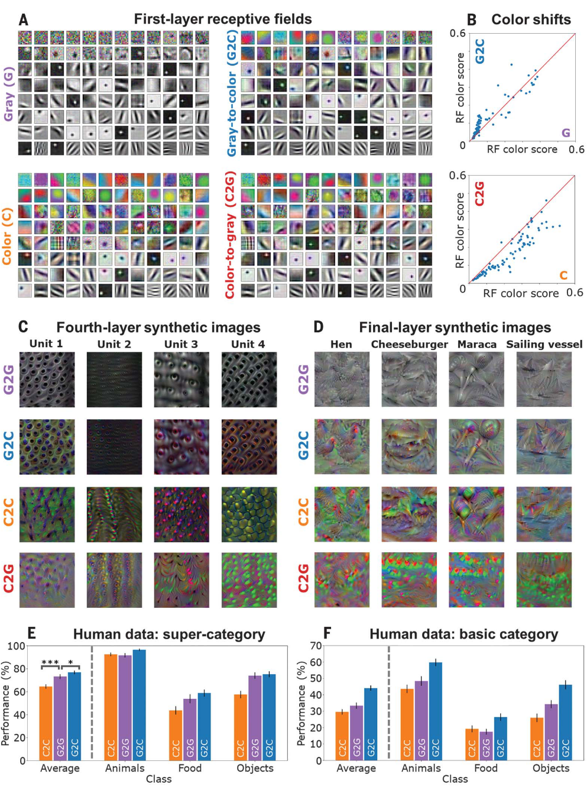

## 文献信息

- **标题 :** [Impact of early visual experience on later usage of color cues](https://www.science.org/doi/full/10.1126/science.adk9587)
- **期刊 :** Science
- **时间 :**  2024
- **作者 :** Vogelsang et al.
- **DOI :** https://www.science.org/doi/full/10.1126/science.adk9587
- **类型：** 计算模型 + 假设检验
- **来源：** 之前找到放进zotero的

## 目的

根据对 10 名后来重见光明的先天性失明儿童的观察，在视力恢复手术后的几个月或几年里，颜色线索的去除会显着降低他们的识别能力，而年龄匹配的视力正常的儿童则没有表现出这种下降。 目的是揭示这一现象背后的原因。

> **根据观察提出假设：** 新生儿视网膜中的视锥细胞的转导能力有限，这种不成熟会损害新生儿的色觉，减少婴儿经历输入的色彩量。但Prakash孩子视觉体验立即沉浸在丰富色彩的图像中，可能导致对色彩线索的强依赖（认为是不自然的强依赖）。
假设认为**早期颜色降解的输入体验可能被证明是有益的，颜色去除的鲁棒性是从贫色视觉到丰富色觉的正常发育过程的结果**。 

**并通过DCNN计算模拟得到了支持这一假设的证据。**

## 方法

研究在患有可治疗先天性失明的个体中测试，这些个体接受了作为 Prakash 项目一部分的手术 （引文 P. Sinha, Sci. Am. 309, 48–55 (2013).）。第一个实验中测试了 10 名年龄在 8 至 26 岁之间的早盲 Prakash 个体，所有患者在出生 6 个月内均发现双侧密集白内障。测试是在白内障摘除和人工晶状体植入后数月/数年进行的，并拥有10名视力正常（实验中戴着blur goggles）的儿童对照（匹配了年龄和社会经济地位）

参与者被要求说出常见的生物或非生物物体的名称。
- 一次显示一张单色图像,要求参与者说出所呈现物体的名称。
- 第二次以全彩形式呈现

**颜色敏感度测试：** RGB色盘二选一，选择有轻微色调的

**DCNN：** 在Imagenet、FaceScrub数据库上训练了AlexNet的不同实例，在整个训练过程中控制颜色信息的可用性。
- 模拟退化颜色到色彩丰富体验的发展过渡。gray-to-color(G2C),对灰度图像进行初始训练（在训练的前半部分），随后对彩色图像进行后续训练（在后半部分）
- 在视觉开始时即获得全彩图像体验。color-to-color(C2C)训练集由全彩图像组成
- 额外方案，G2G，训练集由灰度图组成
- 额外方案，C2G，顺序与G2C相反，想要揭示经验在时间顺序上的作用

## 结果

> 恢复视觉个体实验结果
> `A：` 颜色命名实验的刺激样本
> `B：` Prakash 儿童的命名结果，**颜色 > 灰度**
> `C：` Prakash 和对照组 “颜色 > 灰度” 的统计结果
> `D：` 颜色敏感性实验的示例刺激
> `E：` 描绘了 Prakash 患者在四个不同时间点的情况（术后 1，术后 2 天左右；术后 2，术后 7 天左右；术后 3 ，术后约 30 天；术后 4，术后约 6 个月）以及佩戴 20/200 和 20/500 模糊护目镜的对照组。
> `F & G: `  颜色敏感度测试的结果

- Prakash 组在彩色和灰度图像上的表现存在显着差异，对照组没有显着差异
- Prakash 手术后立即表现出成熟的色彩敏感性，在术后仅 2 天进行的第一次术后治疗中，Prakash 儿童对于红色、绿色和蓝色每种颜色的准确度都与正常视力对照者相当

消除这一过程的初始阶段（就像Prakash儿童）会导致图像表示对颜色线索的过度依赖，当颜色信息被删除时，性能随之下降。

> `A：` 四种不同方案在 ImageNet 数据库上训练的网络的颜色和灰度分类性能。 
> `B：` 逐渐改变原始图像的色调内容来旋转色轮时，在 ImageNet 数据库上测试的不同网络的分类性能。 
> `C-D：` 在 ImageNet 数据库上训练的网络的颜色分类性能，根据描述食物 (C) 和水果 (D) 项目的类子集进行评估。
> `E：` G2C 模型相对于 G2G 模型的特定类别性能增益与给定类别的不同图像的平均色调同质性之间的关系
> `F-G：` 在 FaceScrub 数据库上训练的四个网络的 10 倍交叉验证分类性能，误差线描述标准误差。旋转色轮 
 
- 认为G2C在两者上都产生了稳定的性能，C2C在灰图上表现差，而C2G排除了灰/彩数据增强的影响
- G2C 和 G2G 模型对于颜色和亮度值的反转也更加稳健
- `C-E` 想阐述颜色线索在特定类别有益，也可能揭示了什么导致了在水果或食品分类中观察到的颜色优势

> 不同网络实例的表征分析
> `A：` 描述在 ImageNet 数据库上训练的 G、C、G2C 和 C2G 网络的 96 个单独感受野，按其色彩度排序
> `B：` 从训练的第一阶段过渡到第二阶段时各个滤波器的色彩对比，分别描绘了 G 到 G2C 以及 C 到 C2G 的过渡。
> `C-D：` 四种典型训练方案的第四个卷积层 (C) 和最终全连接层 (D) 的示例合成图像（引发最大单元激活）
> `E-F：` n = 39 名在线参与者将来自 G2G、G2C 和 C2C 模型的合成图像分类为三个超级类别之一（“动物”、“食物”或“物体”）的表现（正确百分比）

- G2C 模型的合成图像似乎与 G2G 模型的合成图像表现出结构相似性，这种相当适度的色彩信息添加可能有助于分类
- 对于 C2C 模型，合成图像似乎包含较弱的结构特征，导致分类时更加依赖特定的颜色线索。 C2G 模型的合成图像表现出更模糊的结构和色彩线索，与普遍较低的分类性能相对应

**G2C 模型似乎受益于在灰度图像训练的初始部分获得了稳定的、基于亮度的结构表示，然后在彩色输入训练的第二部分中补充了额外的、微妙的色彩线索。**

## 创新点

- 验证了 G2C 模型的一些好处即使在较短的灰度初始训练期间也仍然存在，对计算模型有一定指导作用（但不大）。
- 通过重见光明的先天性失明儿童这一特殊群体，以巧妙的角度切入了早期发育视觉经验的影响上，并通过计算模型完整的验证了假设。

## 不足

- 图画的太丑了，第一眼都没想到是science，以为在看低分文章

## 借鉴

- 做的类似，但比之前白内障样的文章发的好的太多，足以支撑去回答“神经网络发育可以和人类比较吗”这个问题，拿出来作为例证很有分量。
- 使我注意到 机构：[Simons Center for the Social Brain](https://scsb.mit.edu/)（MIT）、大牛：[Pawan Sinha](https://scholar.google.com/citations?view_op=list_works&hl=en&hl=en&user=lQKHQV0AAAAJ&pagesize=80&sortby=pubdate)、一篇相关综述文章（感知发育）：[Butterfly effects in perceptual development: A review of the ‘adaptive initial degradation’ hypothesis](https://www.sciencedirect.com/science/article/pii/S0273229724000017)
