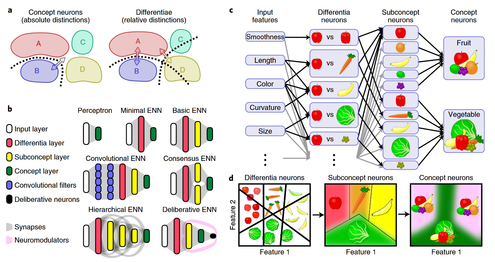
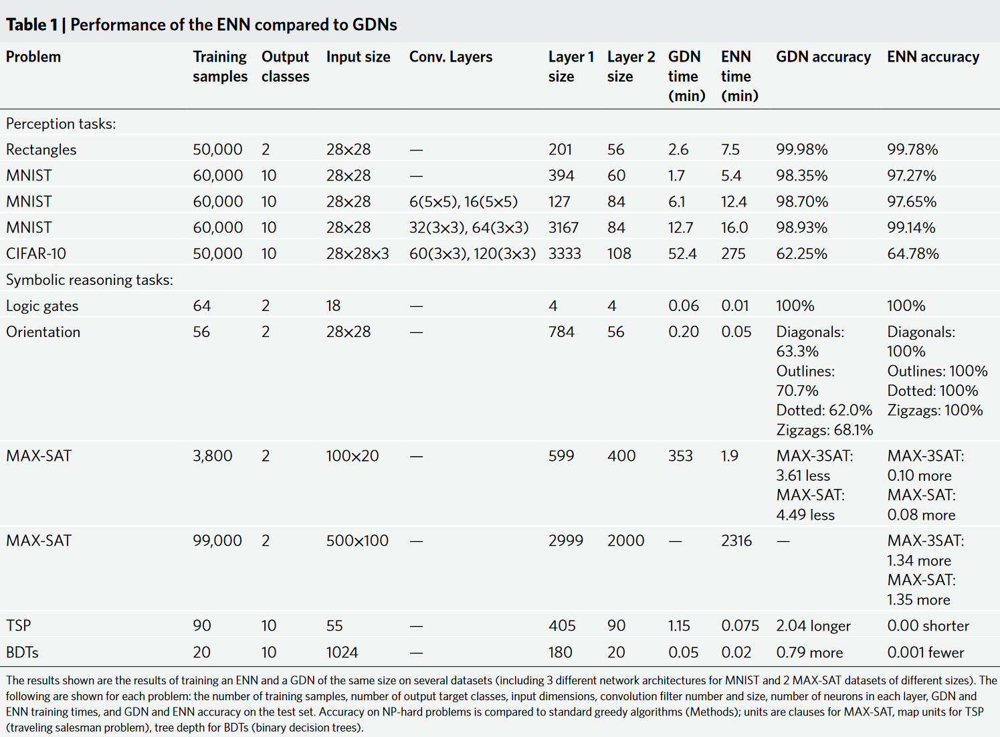
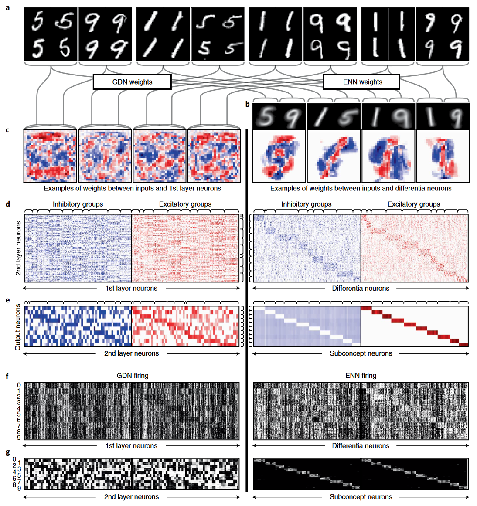
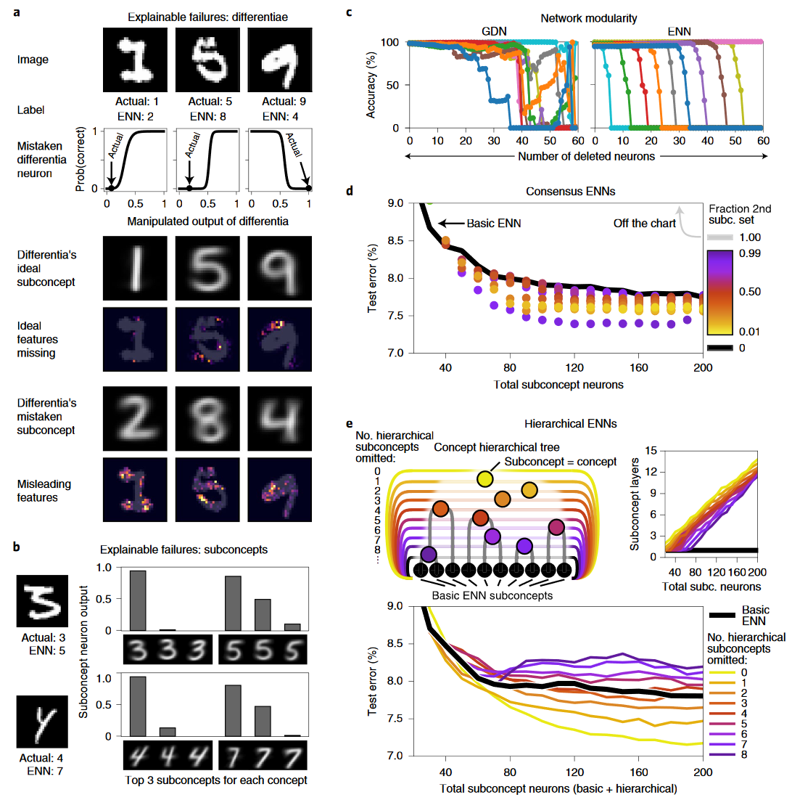
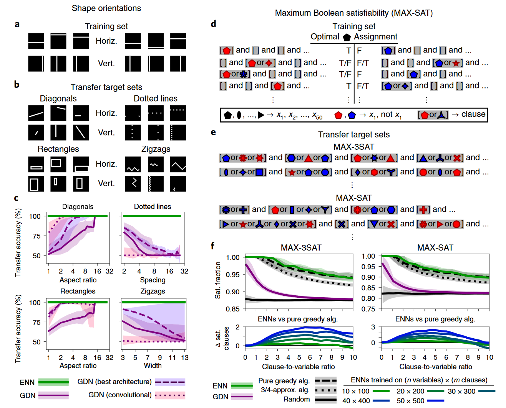

## 文献信息

- **标题 :** [Explainable neural networks that simulate reasoning](https://doi.org/10.1038/s43588-021-00132-w)
- **期刊 :** Nature Computational Science
- **时间 :**  2021
- **作者 :** Paul J. Blazek and Milo M. Lin
- **DOI :** 10.1038/s43588-021-00132-w
- **类型：** 
- **来源：** 自己找到的

## 目的

DNN的成功表面，认知可能是从分布式神经活动的难以解读的模式中产生的。（想要克服黑箱问题）

**文章展示了神经环路如何通过简单的神经生物学原理直接编码认知过程，在非基于梯度的机器学习算法上实现了该模型，称其为 essence neural network （ENNs，本质神经网络）。** ENN中神经信息处理本质上是可解释的，还可以模型更高的认知功能（如深思熟虑、符号推理、分布外泛化）。在标准人工智能基准上表现良好，并且在涉及推理和分布外泛化的任务上超越了现有的深度神经网络。

## 方法

给定神经元会特异性针对某些刺激激活，因此其活动代表两组输入之间的区别，**该工作重点关注神经差异，认为神经差异对于认知来说是最低限度的**。

在本文的模型中，神经元分了两种类型，见`图1a`
- 绝对（absolute）：概念神经元对特定子集和相似刺激、所有其他可能刺激的区分是绝对的。
- 相关（relative）：概念神经元的区分是相对的，会判断其他刺激是更像A还是更像B。

而一个概念通常无法用单个神经元绝对区分，需要多个上游神经元的输出来区分，需要概念神经元能接受来自相关概念神经元的输入，组成整合概念的层次结构。

文章概括了两个连接原则：
- 神经元在概念间进行相对或绝对区分
- 网络分层整合相关区别

作者认为这使得他们的模型与现有的联结主义模型区分开来，并且与认知心理学、哲学的理论一致。**差异和概念神经元由相对于输入做出的决策边界定义，识别特定子概念的能力与原型和范例理论（prototype and exemplar theories）以及局部模型（localist models）一致。** 另外作者认为包含他们提出原则的系统会实施一种推理形式。

### 算法

开发了一种机器学习算法，可以针对任意分类问题训练ENN，首先从每个概念（目标标签）中获得训练样本，划分为子概念。
- 差异神经元通过计算每对子概念之间的线性支持向量机生成。
- 子概念神经元使用SVM将差异神经元的输出作为输入，将每个子概念与其他子概念分开。不太重要的差异被剪枝。
- 最后使用SVM生成概念神经元，使用子概念神经元输出将每个概念与所有其他概念分开。（对比学习？）

### 网络架构

结构的可解释性允许灵活的设计更复杂的架构，提出了一个基本方法。从子图像中学习特征，然后局部连接的子概念神经元充当卷积滤波器，在卷积层末尾对基本ENN训练产生输出。

ENN 可以被设计为明确地整合多个独立的观点，以形成更强有力的共识。共识 ENN 的一个简单示例具有多个相互独立学习的重叠子概念集。

> 图1，ENN 原则
> `b ：`设计ENN架构的多种方法
> `c：` 显示架构如何直接集成推理过程
> `d：` 学习到的概念空间结构

## 结果

### Directly encoding cognitive operations in neural networks.

训练的ENN与相同大小的梯度下降优化的GDN做了比较，在类似感知任务（MNIST、CIFAR-10）和符号任务（MAX-SAT），想说该架构实用且方便。

### The explainable structure and function of ENNs.

接下来是作者想要证明ENN在功能/结构方面本质可解释，分析的是MNIST数据集上训练的ENN。

> 图2，ENN 神经结构和放电的可解释性
> `b：`  显示了学习到的子概念的平均值（用线将子概念和对应的示例图像相连）
> `c: ` 显示输入图像到第一层神经元的突触权重，ENN中是区分子概念对的神经元，为了进行比较，GDN 显示的是最大限度分离相同子概念对的神经元。
> `d\e：` 第一、二层/二、三层神经元突触权重矩阵，分成了兴奋性和抑制性神经元对
> `f\g: ` 每个类别测试图像上神经元的放电率（白色最大放电）

- 单个 ENN 神经元放电对网络输出的影响比 GDN 神经元大得多（补充图 4）
- 按组对每个连接矩阵进行排序展示了 ENN 的模块化，相比之下，GDN 连接在输出层之前都是非结构化的，甚至其模块化程度也比 ENN 低得多（补充图 4a）

> 图3，
> `a: ` 由ENN错误标记的图像示例，可以用差分神经元理想子概念分析出误导ENN犯错误的特征。
> `b: ` 一些错误标记的图像在正确的子概念神经元上具有最佳放电，但是会被放电低数量多的不正确子概念覆盖。
> `c: ` 对10类数字分类准确率单独着色，按照顺序删除子概念神经元。
> `d: `  Consensus ENN (见图1b)，
> `e: ` 分层ENN可以使用完整的概念分层树或者省略给定数量的父节点，产生不同数量的子概念层和不同的测试误差。

- 固有的模块化允许大幅缩减网络，同时保留选定的概念。

### 符号任务

测试了ENN是否能通过使用仅为0或1的神经元来模拟离散符号推理，符号推理对于从指导性示例中学习规则并将其应用于不同但相关的问题尤其重要。这被称为单域泛化，其中在单一样本分布上训练的模型无需额外训练即可泛化到看不见的目标分布。_标准深度学习不能实现_

> 图4，将算法从简单问题转换到复杂问题
> `a-c：` 训练数据是完全水平/垂直条纹的图像，迁移数据集有四种类型，ENN能完全概括变化数据集，但GDN不能。 
> `d-f: ` MAX-SAT训练集中做布尔判断公式的示例，迁移数据集中有很多子句，MAX-3SAT每个子句用三个字母，第二个trans-dataset子句长度可变。对于最大尺寸10x100的公式，使用ENN、GDN、随机分配、纯粹贪婪算法、3/4最大近似贪婪算法在迁移数据集上的得分。

## 优点/创新点

- ENN中神经信息处理本质上是可解释的，在标准人工智能基准上表现良好，并且在涉及推理和分布外泛化的任务上超越了现有的深度神经网络。

## 缺点/不足

- 测试任务太简单，并不清楚ENN在复杂的实际任务中表现如何。

## 可借鉴

- 思路类似 ： 对比学习 + SVM + 决策树

或许可以用其来讨论面孔属性问题，但未能确定ENN能做到面孔识别这种相对复杂的任务。