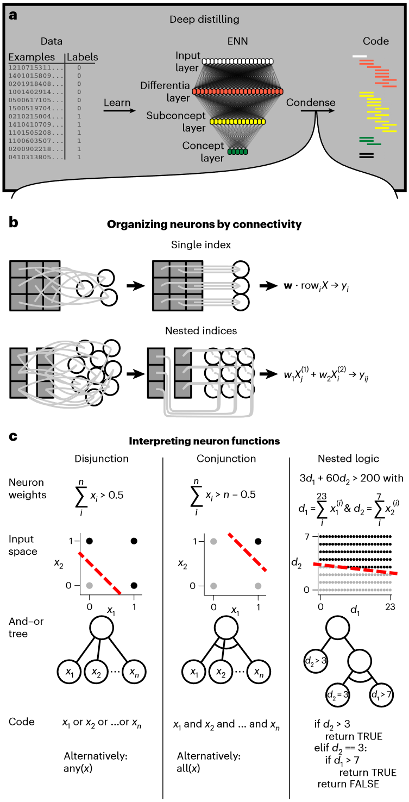
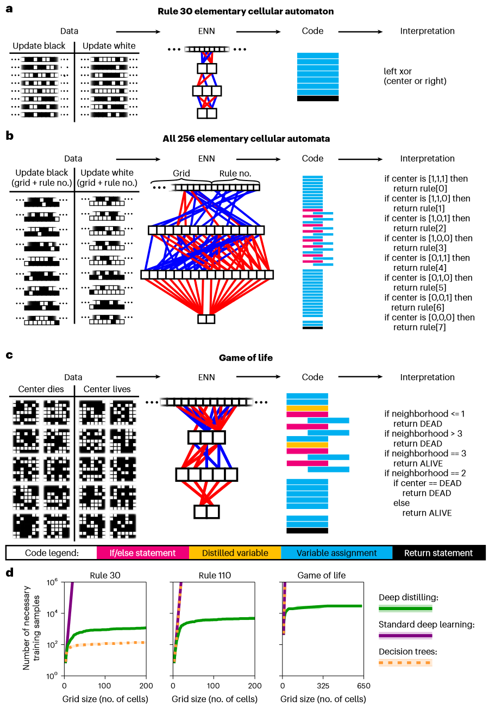
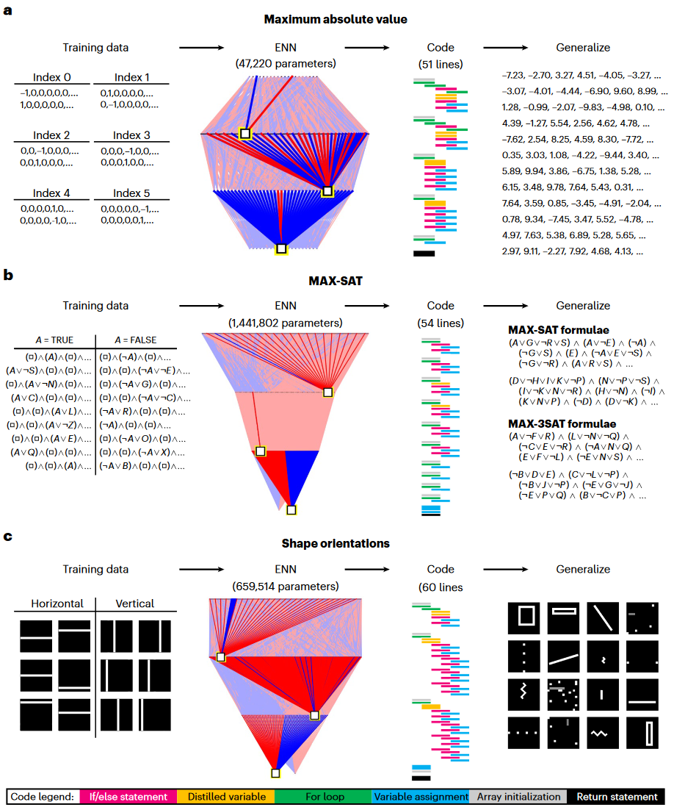
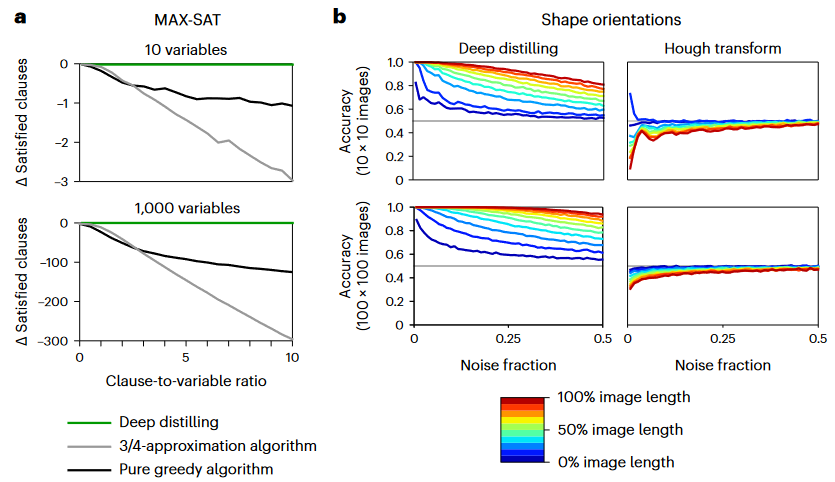

## 文献信息

- **标题 :** [Automated discovery of algorithms from data](https://doi.org/10.1038/s43588-024-00593-9)
- **期刊 :** Nature Computational Science
- **时间 :**  2024
- **作者 :** Paul J. Blazek et al
- **DOI :** 10.1038/s43588-024-00593-9
- **类型：** 
- **来源：** 从 Explainable neural networks that simulate reasoning 找到的，该作者的后续文章

## 目的

目标：自动发现新的科学和工程原理，人工智能必须从实验数据中提取明确的规则。

## 方法&背景

作为数据驱动算法发现的替代方案，基于语言的模型最近被用来通过翻译或满足给定提示和命令，或通过迭代提示和评估程序来编写计算机代码。作者认为很多实际问题并不是算法结构或语言描述预定义的，而是被实验数据，不清楚数据是否能由任何基本规则充分解释。

**归纳编程**的目标是仅根据输入和输出数据点的示例进行训练，以学习捕获输入-输出关系的可解释算法，可以通过发现隐藏在高维数据中的通用模式来潜在的产生新的原理或见解。

**深度蒸馏**，一种机器学习方法，一种通用的归纳编程方法，不执行在可能函数空间中的搜索，而是使用符号本质神经网络从数据中学习，然后将网络参数无损地压缩为用计算机代码编写的简洁算法。经过提炼的代码可以包含循环和嵌套逻辑，在算术、视觉和优化任务上，蒸馏后的代码能够进行 o.o.d.泛化，以解决比训练数据大几个数量级、更复杂的情况。

作者对ENN（Paul J. Blazek之前发在该期刊的文章）进行深度蒸馏，将其转换为数学上等效但能被人为理解的算法。深度蒸馏有两个过程（`1a`）：
- 通过将输入映射到输出来训练ENN从数据中学习规则
- 将ENN压缩为简洁、人类可理解的代码

> 图1

第一步将神经元组织成功能组（`1b`），每个神经元对不同输入应用相同的权重集，这允许对神经元进行索引和迭代。第二步将每个组的权重集合解释为一个函数，神经元权重定义了一个超平面用于区分离散输入 $x_i$ 或蒸馏变量 $d_i$ 的样本，或&并&嵌套逻辑的表示展示如图(`1c`)。

> **ENN condenser** (蒸馏器) ：分为两个模块
>  - 组织神经元组
>  - 解释

`（代码看了一点）`

## 结果

### Distilling cellular automata rules

为了检测能否从数据中发现潜在规则，首先将其应用于元胞自动机（CA）—— 由处于离散状态的细胞组成的网格，遵循一组规则随着时间推移变化。CA 长期一来一直被用作物理、生物和计算机中涌现行为的模型系统。

> 图2，深度蒸馏元胞自动机的规则
> `d：` 对于规则30、110和生命游戏，图表显示训练模型所需的随机样本数量

> 图3，深度蒸馏学习以代码形式编写的可泛化算法，此处显示了生成代码的示意图，ENN中白框显示的是一个随机神经元，兴奋性/抑制性连接以亮红色/蓝色显示。
> `a: ` 任务是查找数组中的最大绝对值，
> `b: ` 对MAX-SAT问题实施贪心算法
> `c: ` 确定图像中形状的方向，

> 图4，蒸馏算法可以胜过人类设计的算法
> 对于MAX-SAT问题，y轴是与深度蒸馏生成的代码相比，人工设计的算法满足的子句少了多少。
> 在形状定向问题上，具有不同长度（颜色表示）和不同比例的椒盐噪声（x轴）在测试图像上比较了蒸馏算法和霍夫变换的准确率。

## 优点

- 能够从数据发现潜在规则

## 不足

- 仍不清楚是否能应用到复杂任务

## 可借鉴的地方

可能在某些课题，在解释模型采用的某些决策规则时，可以使用该文章的方法尝试一下。