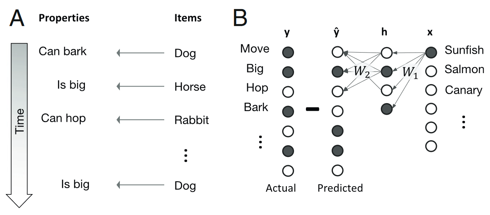
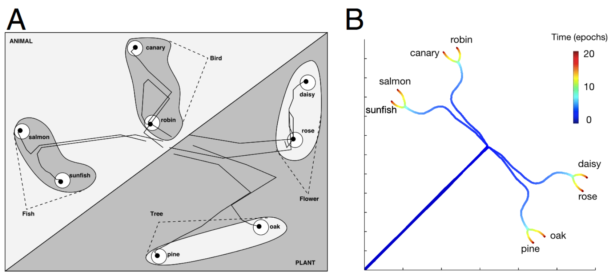
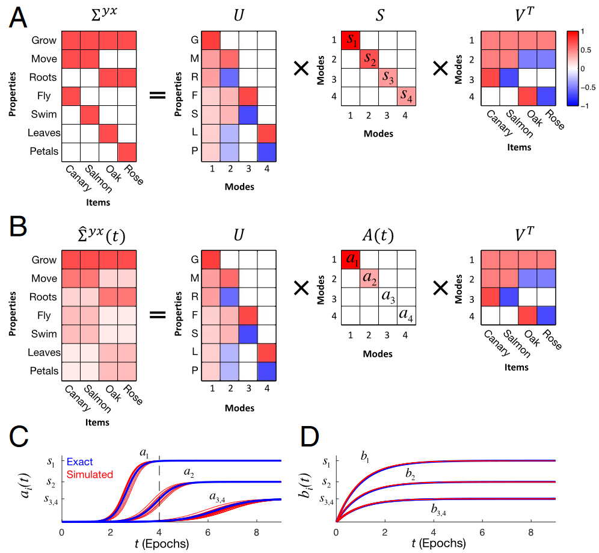

## 文献信息

- **标题 :** [A mathematical theory of semantic development in deep neural networks](www.pnas.org/cgi/doi/10.1073/pnas.1820226116)
- **期刊 :** PNAS
- **时间 :**  2019
- **作者 :** Andrew M. Saxe et al
- **DOI :** 10.1073/pnas.1820226116
- **类型：** 
- **来源：** Saxe的文章，从他之后的综述往前找的

## 目的

研究这个基本的概念问题：控制神经网络获取、组织和表达能力的理论原则是什么？通过整合许多个人经验来部署抽象知识？
通过数学分析深度线性网络中学习的非线性动力学来解决该问题，找到了这种学习动态的精确解决方案，为语义识别中不同现象的普遍存在提供了概念性解释。

> `A: ` 参考文献（2004年的一本书 _Semantic Cognition: A Parallel Distributed Processing Approach_）中研究的深度非线性神经网络在整个发展时间内的内部表示时间演化的二维MDS可视化
> `B: ` 内部表示MDS分析得出的可视化的学习轨迹

## 结果

### 知识获取

当不考虑batch的情况下，仅依赖于单个样本的经验，基本问题是：**增量更新的积累如何以及何时可以在发展时间中提取出抽象结构？**

文章证明，只要学习是渐进的，并且学习率较小，提取这种抽象结构是可能的。学习是由邻域的统计结构驱动的，将训练分为一系列学习时期，在每个时期所有的P个示例以随机顺序遵循学习规则，对所有示例进行平均并采用连续时间限制，给出每个学习时期权重的平均变化。这些

