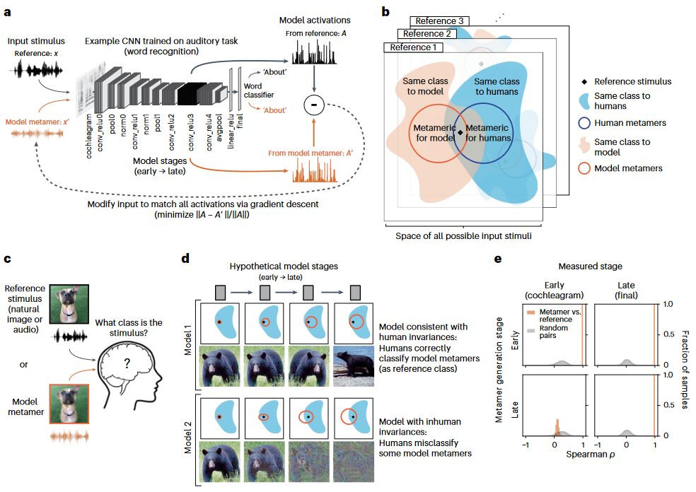
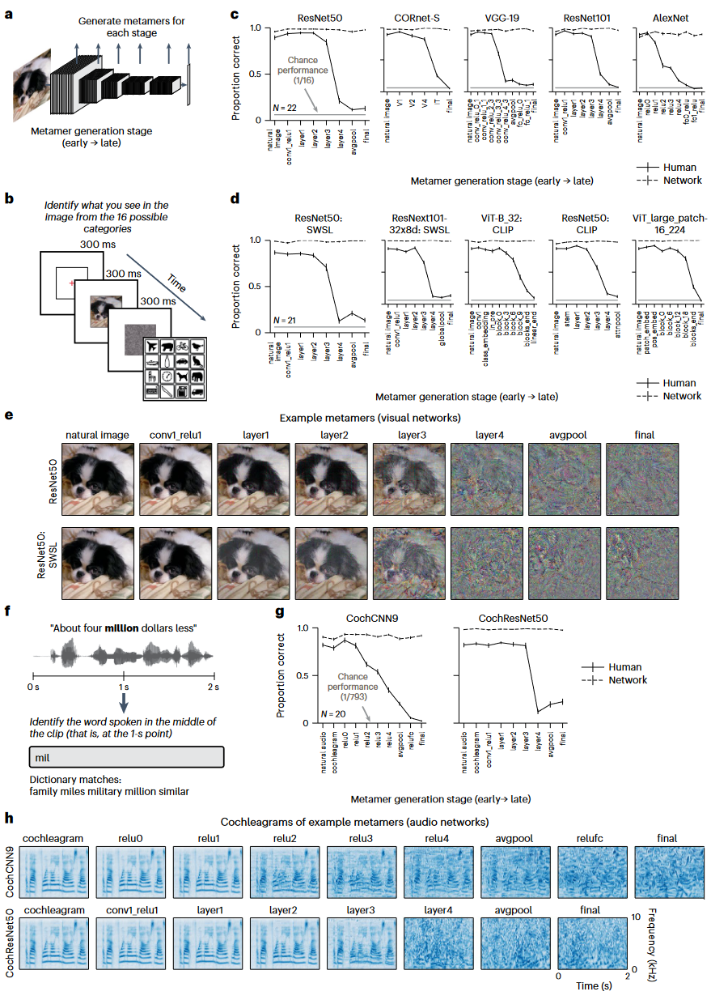
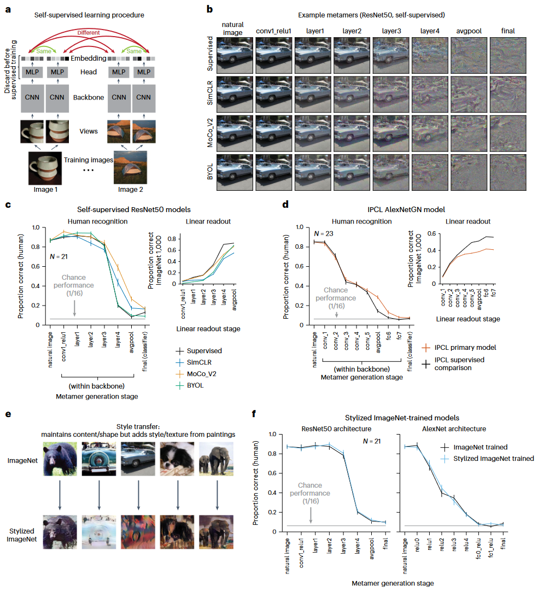
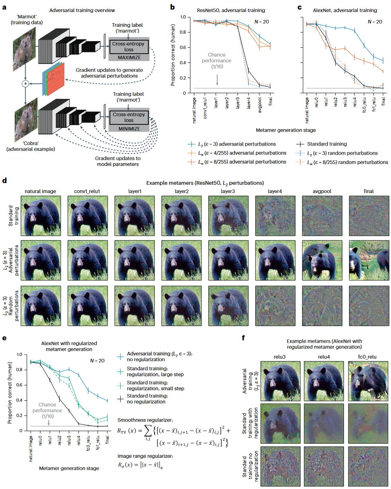

## 文献信息

- **标题 :** [Model metamers reveal divergent invariances between biological and artificial neural networks](https://doi.org/10.1038/s41593-023-01442-0)
- **期刊 :** nature neuroscience
- **时间 :**  2023
- **作者 :** Jenelle Feather et al
- **DOI :** 10.1038/s41593-023-01442-0
- **类型：** 模型实验（主）+ 行为实验
- **来源：** 看nature其他文章时被其网页相似推荐推荐的

## 目的

试图回答几个问题：
- 人类感觉系统是否共享常用神经网络模型的学习不变性。
- 询问模型中何时出现与人类感知的差异
- 询问在没有监督学习的情况下，获得的模型中是否也会存在模型/人类不变性的差异
- 探讨旨在提高鲁棒性的模型修改是否会使得模型同色异体更容易被人类识别
- 询问同色异构体识别是否可以识别使用其他模型评估方法（例如大脑预测或对抗脆弱性）并不明显的模型差异。
- 同色异谱是否跨模型共享

> `e :` 匹配保真度的示例分布

> 图2.
> b. 人类实验示意图
> `c :` 人类对视觉模型同色异谱的识别，人类表现在模型后期下降
> `d :` 在较大数据集上训练的模型同色异体，人识别
> `e :` 弱半监督训练（SWSL）和标准训练的ResNet50，示例的同色异谱
> `f :` 评估听觉模型的示例任务，对 2 秒声音片段中点出现的单词进行分类
> `g :`  人类对听觉模型同色异谱的识别
> `h :` CochCNN9 和 CochResNet50 架构的示例听觉模型同色异谱的 Cochleagram 可视化。颜色强度表示频道中的瞬时声音幅度。

同色异构体生成依赖于迭代优化，作者认为需要满足两个条件：
- 在匹配阶段，自然参考刺激与其模型同色异体激活之间的匹配测量必须远高于偶然预期，同色异构体必须通过三个不同匹配度量中的每一个的标准（Pearson 和 Spearman 相关性以及以分贝 (dB) 表示的信噪比 (SNR)。
- 对于执行分类任务的模型，同色异构体必须导致模型与参考刺激产生相同的分类决策。（在实践中在后面训练一个现象分类器）

> 图3.
> a: 自监督学习概述,每个输入都通过可学习的卷积神经网络和MLP生成嵌入向量，模型训练时可将同一图像的多个视图映射到嵌入空间的附近。三个自监督模型（SimCLR、MoCo_V2 和 BYOL）使用 ResNet50 主干网。另一个自监督模型 (IPCL) 将 AlexNet 架构修改为使用组标准化。
> b：同色异谱示例，所有模型后期的同色异谱大多无法识别。
> c-d: 人类从监督模型和自监督模型（N=21）中识别同色异谱，以及模型每个阶段在ImageNet 1K 任务上训练的线性读出层的分类性能。
> e：使用 Stylized ImageNet 增强的自然图像和风格化图像的示例。之前的研究表明，在 Stylized ImageNet 上训练模型可以减少模型对分类纹理线索的依赖。
> f：通过在 Stylized ImageNet 上进行训练来消除模型的纹理偏差并不会产生比标准模型更容易识别的模型同色异体。

> 图4.
> 对抗性训练提高了人类对模型同色异体的识别能力
> a: 通过查找输入的加性扰动，将分类标签移离训练标签类别，在每个训练步骤中导出对抗性示例，并将派生的对抗性示例作为训练示例提供回去，更新模型参数。所得的模型对于对抗性扰动更稳健，对输入随机扰动的模型作为对照。
> b-c: 对抗性训练导致模型深层产生更多可识别的同色异构体
> d： 带对抗性训练情况下的同色异谱示例
> e： 与对抗性训练模型（N = 20）相比，经过正则化和未经正则化的标准训练模型的模型同色异体的可识别性。优化中包含两个正则化项：用于促进平滑度的全变分正则化项和保持在图像范围内的约束。正则化的同色异谱仍然不如来自对抗性训练模型的可识别性
> f： 同色异谱示例