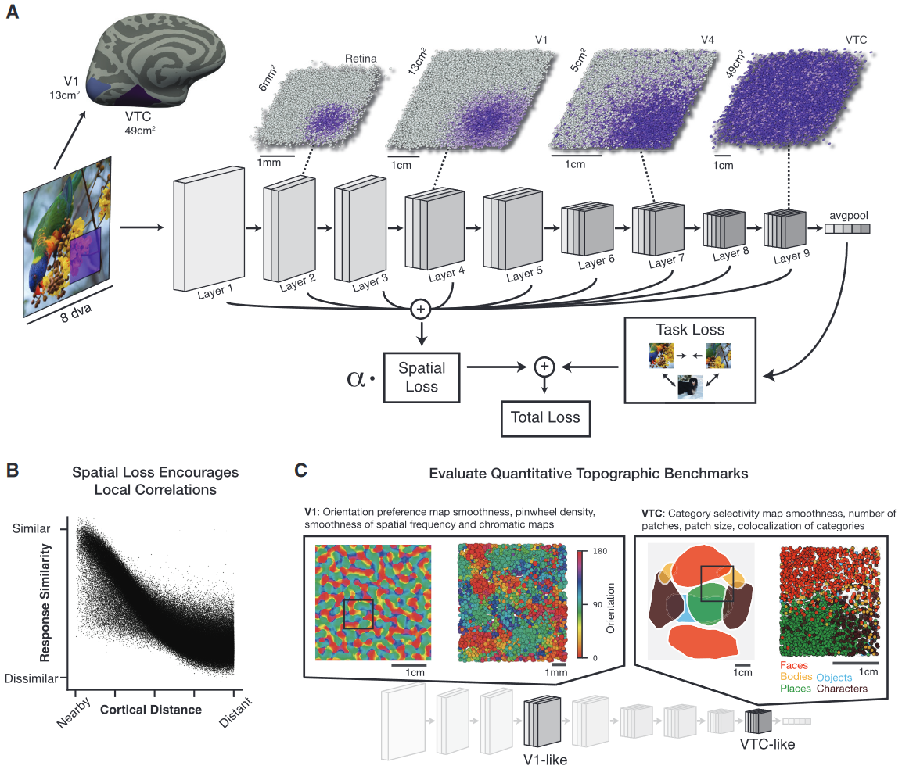
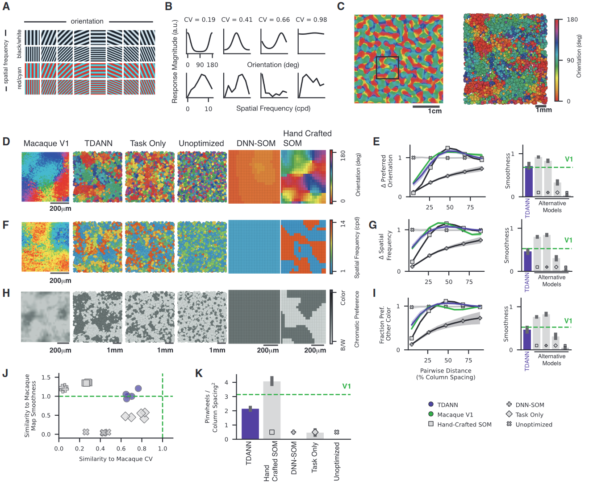
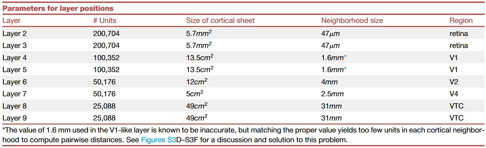
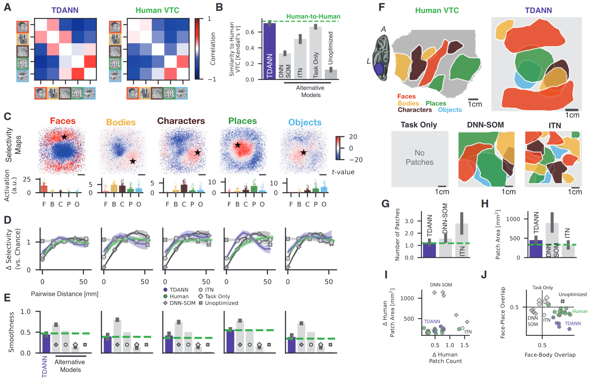
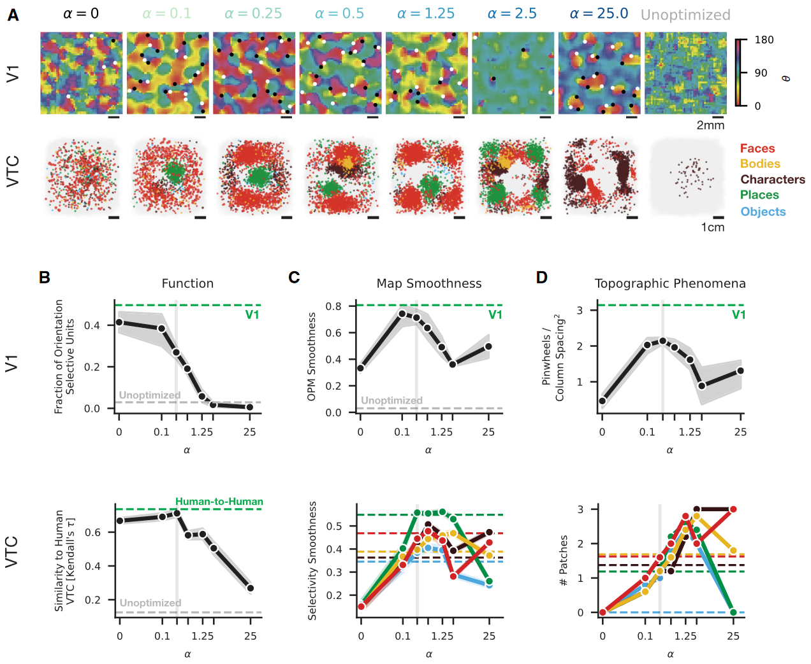
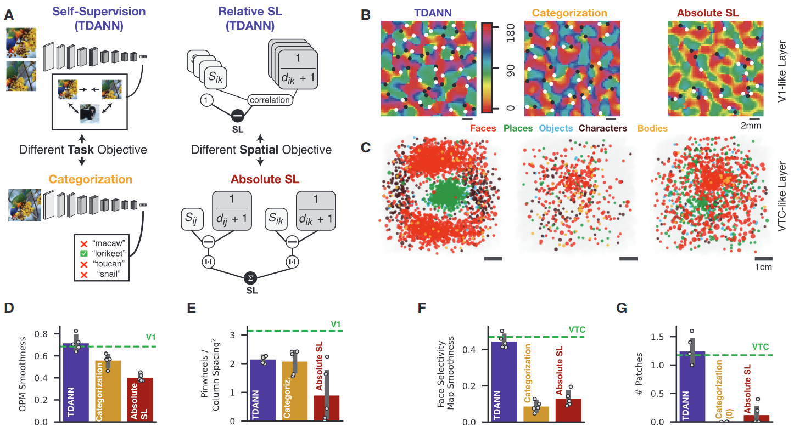
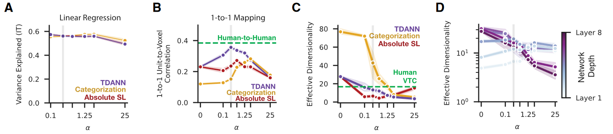
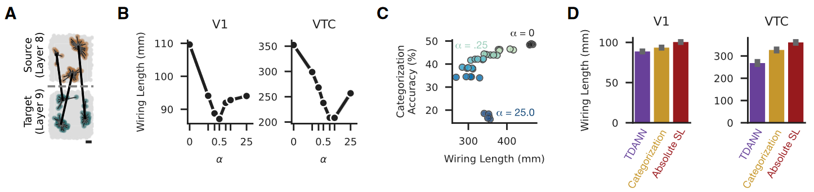
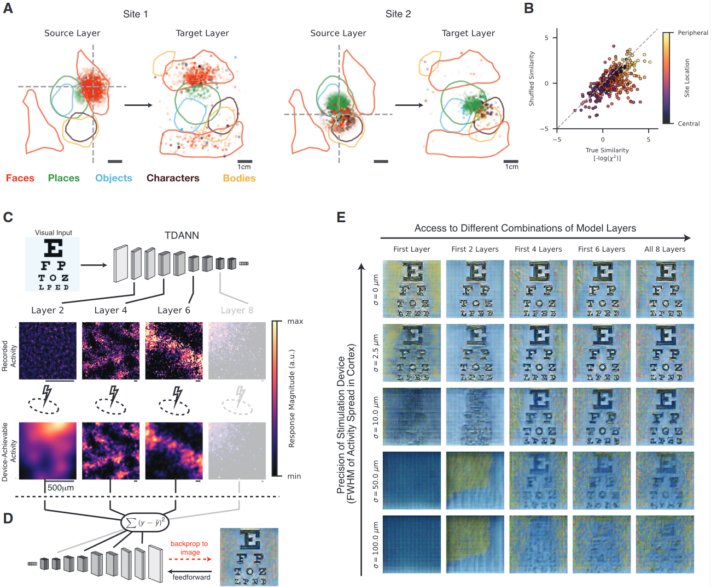

## 文献信息

- **标题 :** [A unifying framework for functional organization in early and higher ventral visual cortex](https://doi.org/10.1016/j.neuron.2024.04.018)
- **期刊 :** neuron
- **时间 :**  2024
- **作者 :** Daniel L.K. Yamins et al
- **DOI :** 10.1016/j.neuron.2024.04.018
- **类型：** 
- **来源：** 之前看过这个的预印本，正式发出去的期刊很好，重新看看

## 目的

人们对皮质功能组织出现的原理知之甚少 $\to$ 开发了TDANN模型来预测灵长类动物视觉皮层功能区域的组织 $\to$ 为理解灵长类动物腹侧视觉系统的功能组织提供统一的原则

## 方法

### 模型设计

TDANN模型平衡了两个学习目标，损失函数如下：

$$TDANN Loss = L_{task} + \sum_{k \in layers} \alpha_k SL_k$$

- 学习任务通用的感觉表征。
- 生物物理效率的一个关键组成部分是最小化神经元接线长度，理论上这会导致在许多皮质区域观察到的平滑的地形组织，根据与皮质表面积成比例的指标最大化反应的空间平滑度。见原文Loss functions部分

> 图一
> A: TDANN的示意图，改自ResNet18，损失函数由两个部分组成：任务损失和空间平滑的损失(SL)。
> B：SL会鼓励层内相邻的单元建立强烈的响应相关性，图每一个点表示一对单元的响应相似性（y）和在皮质上距离（x）
> C: TDANN 根据测量地形特征对应性的定量基准进行评估。左：类似 V1 的 TDANN 层中的方向偏好图（详见图2）。右图：类 VTC 层中的类别选择性图（详见图3）。

为了确定这种学习到的相关结构是否对应于脑地形图，作者构建了一系列定量基准，将模型预测与腹侧通路两个阶段的神经数据进行比较：V1和VTC。将第四卷积层和第九卷积层分别指定为“类 V1”层和“类 VTC”层，并且在评估功能组织基准时将分析限制在这两个层次。

- **Task Only**：不做空间平滑约束的TDANN
- **Unoptimized**： 没有进行优化
- **DNN-SOM**：制作方法和Hand Crafted一致，输入源自针对 ImageNet 对象分类进行预训练的 AlexNet 模型第一层的输出，用了50,000张自然图像的响应，通过主成分分析降低它们的维数，并在这些示例上训练SOM
- **Hand Crafted**：手工制作的自组织映射 (SOM) ，实现使用 MiniSom 库，细节不懂但是也是需要训练的（10,000 training samples）
- **ITN** ：交互式地形网络，之前看过的一篇PNAS，做的细分方向和本篇相同

### 定量基准

（只放入部分）

- **V1**

  - **counting pinwheels** ： 见 [Coverage, continuity, and visual cortical architecture](https://neuralsystemsandcircuits.biomedcentral.com/articles/10.1186/2042-1001-1-17) （太复杂了），按我初步的理解，方向选择性map颜色变化的中心是一个“风车”，在周围的相邻八个像素，将变化方向相加，高缠绕数是顺时针，低缠绕数是逆时针。

  - **映射平滑度**分数 ： 给定map中最近单元对之间的tuning相似度，与最不相似对的相似度共同定义。给定一个两两tuning相似度值的向量 x，按皮质距离递增的顺序排序：

    $$S(x) = \frac{max(x)-x_0}{x_0}$$

- **有效维度** ： 对模型池化后的特征图做有效维度的计算，人的部分是NSD核磁估计的，但做的部分得细看最后提到的两个引文

## 结果

- 对象分类性能表示，SL损失的添加不会强烈的干扰表示学习，准确率中位数从48.5% 下降到 43.9%

### TDANN 能预测V1的功能组织

灵长类动物V1中神经元被组织成首选的刺激方向、空间频率和颜色的map。 但因为人类V1无法获得足够分辨率数据去可视化map，作者用了尺度不变的指标将TDANN和猕猴V1进行比较。

- TDANN V1-like层中的模型单元是否与猕猴 V1中的神经元具有相似的优先取向和取向调谐强度
- 测量作为皮层距离函数的成对调谐相似性来测量皮层图谱结构
- 在方向偏好图 **(OPM)** 中测量 pinwheel-like 不连续的密度

> 图2
> `A：` 用于评估方向、空间频率和颜色调谐的光栅刺激示例
> `B：` V1-like 层中表征单元的方向（上）、空间频率（下）的调谐曲线
> `C：`TDANN 类 V1 层中的平滑方向偏好图 (OPM)

**注： 模型中方向偏好图里的比例尺是怎么换算的？**
在初始化模型时每层的皮质片大小就对应了腹侧视觉通路中区域之间的映射，由于作者将模型第 4 层映射到人类 V1，因此该层中皮质片的表面积设置为 $13cm^2$。另外SL需要确定计算所采用的皮质邻域范围是多大，设置邻域宽度以匹配猕猴不同皮质区域测量到的横向连接的空间范围 (Yoshioka et al.) _(为与人类腹侧视觉通路规模相匹配，对来自猕猴的结果扩大估计)_。

> `D:` 猕猴V1的OPM, 其余的模型在模型设计中提到。
> `E:` （左）成对单元首选方向的差异，和皮质上距离的函数，通过随机采样的机会水平进行标准化。（右）OPM 的映射平滑度。其中绿色线均为猕猴数据结果，紫色为TDANN结果，灰色表示其他候选模型。
> `F:` 空间频率偏好，显示了 TDANN V1 类层和猕猴 V1 在`D`中的相同区域
> `G:` 类似 `E:`
> `H:` V1-like 层色彩刺激的偏好，暗点：对色差的响应比消色差光栅更强。
> `I:` 色彩偏好不同的单位分数作为皮质距离的函数，
> `J:` 与猕猴 OPM 平滑度的相似性，和与猕猴 V1 中方向调整强度分布的相似性。重复的标记表示不同的初始模型种子。绿色虚线表示完美对应。
> `K:` pinwheels 密度

### TDANN 再现了高级视觉皮层功能组织的许多特征

因为测量模型和高级视觉皮层（即灵长类 IT 皮层和人类 VTC）之间 map 相似性的基准尚未开发，因此作者引入了五个比较响应和地形的定量基准。

- RSA 表征相似性分析
- 类别选择性map的平滑度
- 类别选择性斑块的数量
- 斑块的面积
- 不同类别的选择性单元之间的空间重叠

> 图3
> `A：` TDANN 和人类 VTC 的表征相似性矩阵 (RSM)，针对五个对象类别的选择性进行计算
> `B: ` TDANN、人类 VTC 和替代模型之间的功能相似性，以 RSM 的相似性来衡量
> `C：` 选择性（t值）map，在VTC-like层绘制每个类别，
> `D：` 每个单元对的选择性差异与在皮质上距离的函数
> `E：` 每个类别和模型的选择性图的平滑度
> `F：` 人类腹侧颞叶皮层示例半球的类别选择性斑块（有随机种子在这里控制）
> `G-H：` 和人类数据相比，类别选择性斑块的平均数量。类别选择性斑块的表面积
> `I-J: `  显示每个被试和模型示例

### 在相同的空间约束强度下出现功能组织的多重特征

> 图4
> `A：` 在不同级别的空间权重 $\alpha$ 下训练的 TDANN 的 V1 类（顶部）和 VTC 类层（底部）中的地形图。图中的点就是 pinwheel ，黑色表示顺时针，白色逆时针
> `B-D: ` 权重 $\alpha$ 与各种选择性的函数（用于确定最优空间损失权重 $\alpha$）

### 功能组织的两个因素：自监督学习和可扩展的空间约束

为了了解腹侧流功能组织的约束，构建了具有TDANN的变体，评估不同因素如何影响模型的功能组织。

> 图5
> `A：`  左侧两个在任务目标上不同，右侧的模型空间损失用的不同的形式。
> `B: ` 三个模型V1的OPM
> `C: ` 三个模型 VTC-like 层的类别选择性组织
> `D-G: ` 定量指标间的比较

### 空间约束使学习到的表征更加类似于大脑，从而降低了内在维度

> 图6
> `A：` 空间损失权重对性能的影响，方差通过模型单元和猕猴 IT 神经元之间的线性回归映射进行解释。
> `B：` 模型单元和体素之间一对一映射下模型单元和 VTC 体素之间的平均相关性。

注：这里在相同一对一映射下 human-to-human correlation 究竟是怎么算的？

> `C：` 每个模型的类 VTC 层中总体响应估计的有效维度。 这里自监督任务的有效维度比分类任务低很多，在0.1 $\alpha$ 下和人类VTC结果一致，是非常有趣的，可能意味着我之前用监督学习做的表征计算不如用无监督学习的结果更类脑。
> `D：` TDANN 中跨所有层和层级的有效维度

### TDANN 间接最小化区域间（前馈）布线长度

> 图7
> `A：` 相邻层之间的布线长度计算示例。棕色点：任意选择的自然图像的源层中前 5% 最活跃的单元。绿点：目标层中前 5% 最活跃的单位。黑点：连接活动单元群所需的虚拟光纤的终止点
> `B：` 第 4 层和第 5 层（类似 V1；左）以及第 8 层和第 9 层（类似 VTC，右）之间的布线长度，和空间损失权重做函数
> `C：` 对象分类的准确性与布线长度的关系
> `D：` 使用不同任务和空间目标训练的模型的连线长度

## 亮点

- 单一模型同时预测了早期和高级视觉皮层的功能和空间组织
- 皮层功能组织需要自监督学习和可扩展的空间约束 
- 与空间不受约束的模型相比，空间精确的模型具有更多类似大脑的反应 
- 局部空间约束导致区域间较低接线长度

> 独特优势在于，它可用于预测多个皮质区域同时空间局部刺激的效果
> `A：` TDANN 面部斑块中的刺激单元驱动后续层中面部斑块中的局部活动。
> `C-E：` 重建，原文说的不多，需要读引文才能搞懂怎么做的

## 不足

- 分类任务的准确度是否太低？（当然这个问题不重要）
文中提到所有模型均接受了 ILSVRC-2012（ImageNet 1k）训练集的 200 个 epoch 的训练。`48.5%` 的准确率远不如我之前按照Imagenet提供的默认训练程序训练 resnet18 得到的 `69.672%`，考虑到文中是做的自监督学习/模型也是缩减版的resnet18，低一些是正常的，但其中`学习率初始化为 0.6，然后根据余弦衰减`，感觉不是很妥（没有依据）。

## 借鉴

- 非常漂亮的工作，可以更深入的精读，包括各种没怎么了解的细分领域的引文

- 两篇有效维度计算的引文

89. Elmoznino, E., and Bonner, M.F. (2024). High-performing neural network models of visual cortex benefit from high latent dimensionality. PLoS Comput. Biol. 20, e1011792. https://doi.org/10.1371/journal.pcbi. 1011792. 
90.  Del Giudice, M. (2021). Effective Dimensionality: A Tutorial. Multivariate Behav. Res. 56, 527–542. https://doi.org/10.1080/00273171.2020. 1743631.

