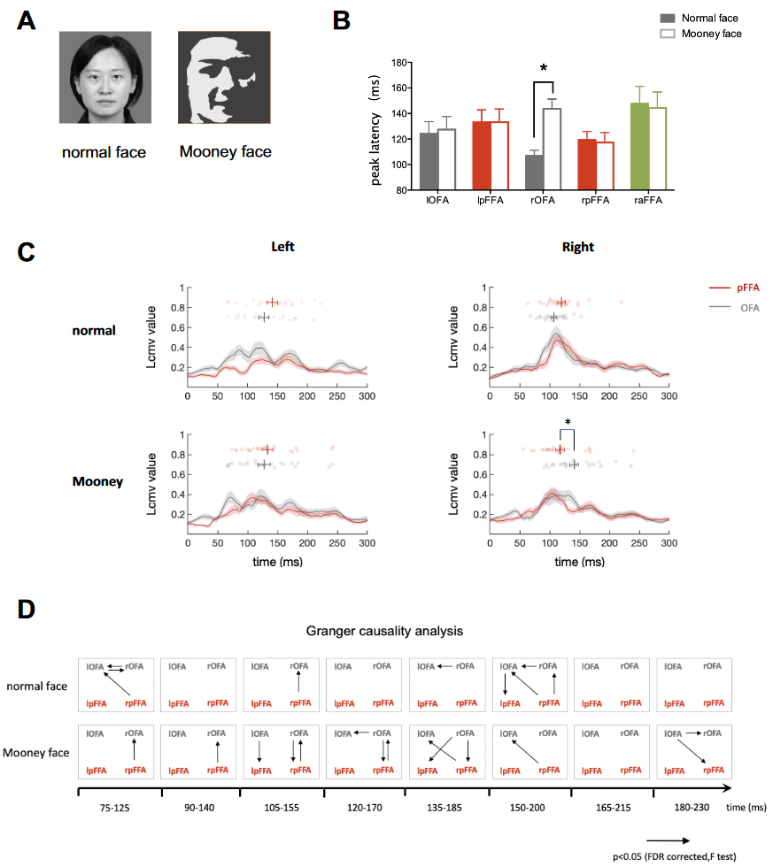
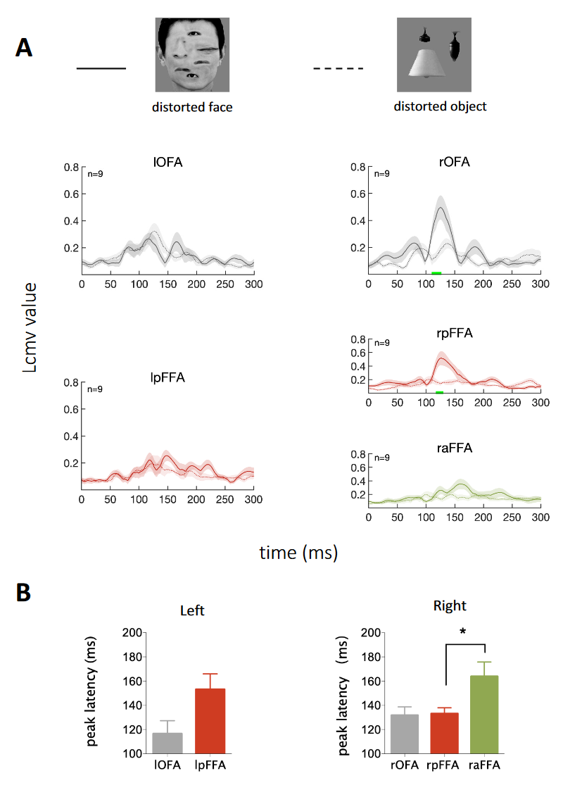
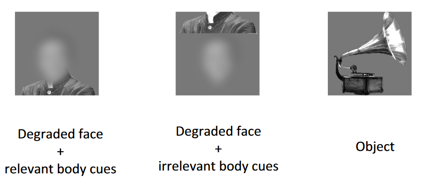

## 文献信息

- **标题 :** [The bottom-up and top-down processing of faces in the human occipitotemporal cortex](https://doi.org/10.7554/eLife.48764)
- **期刊 :** elife
- **时间 :**  2020
- **作者 :** Fan et al. | Sheng He
- **DOI :** https://doi.org/10.7554/eLife.48764
- **类型：** 
- **来源：** 中期时老师/明慧师姐分享

## 目的

面部选择性皮层区域如何参与的动态仍不清楚
利用人类功能性磁共振成像和脑磁图揭示了核心面部选择性区域的激活时间

正常面部的处理从后枕骨区域开始，然后进行到前部区域。

即使内部面部特征排列不当，也可以观察到这种自下而上的处理顺序。

仅由情境线索引起的面部特异性反应同时出现在右腹侧面部选择性区域，这表明平行的情境促进。

强调了自上而下操作的重要性，特别是在面对不完整或模糊的输入时。

## 背景

Hierarchical models 假设面孔特定过程在OFA中根据局部面部特征启动，然后将信息转发到更高级别的区域，如FFA进行整体处理。

- OFA 受损的患者仍然可以在面部表现出 FFA 激活 (Rossion et al., 2003; Steeves et al., 2006)。
- 在感知具有最小局部面部特征的面部时，FFA 仍然可以在没有来自 OFA 的面部选择性输入的情况下显示面部优先激活 (Rossion et al., 2011) 。

non-hierarchical model 假设人脸检测在 FFA 中启动，然后在 OFA 中进行精细分析(Rossion et al., 2011; Gentile et al., 2017)。

为了协调这些模型，需要具有更详细的时间信息

## 结果

- **正常面孔：** 右OFA 和右后FFA被激活的时间接近，120ms左右峰值，右前FFA在大约150ms峰值，背侧通路中右侧pSTS较弱且时间上变化更大的响应（130-180ms）。
- **Mooney faces ：** 根据预测编码理论 (Rao and Ballard, 1999; Murray et al., 2004; Mumford, 1992)，FFA 基于 Mooney 面孔的贫乏信息和先验知识创建的面孔预测与 OFA 的输入表示不匹配，rOFA 的激活晚于 rpFFA，并且在处理 Mooney 面部时，rpFFA 对 rOFA 施加了广泛的方向影响，表明皮层分析以 rpFFA 到 rOFA 投影为主。只有熟悉的物体（例如面孔）才能通过 2 色调表示轻松地解释为体积，认为先验知识应该在从 Mooney 图像恢复 3D 形状中发挥重要作用(Braje et al., 1998; Gerardin et al., 2010)。

- **Distorted face：** 与正常面部相似的时间模式。

- **Degraded face：** 面部特定反应仅由上下文线索驱动而内部面部特征完全缺失时, rOFA、rpFFA 和 raFFA 激活得有点晚，而且几乎同时激活，对应于并行促进核心面部处理网络处理的上下文调制。

面部轮廓中清晰但排列混乱的内部特征的类脸刺激引起的面部反应的速度稍慢但仍然顺序进行，进一步支持面部特征足以触发自下而上的面部处理序列。某些刺激操作，例如面部倒置（Bentin 等，1996）、对比度反转、门尼变换或面部特征去除，产生类似（甚至增加的幅度）但延迟的 N170 反应（Rossion 和 Jacques，2011），有人认为，只要将贫乏的刺激视为面部，下颞叶皮层区域就会被激活（McKeeff 和 Tong，2007；Gru ̈tzner 等，2010）。